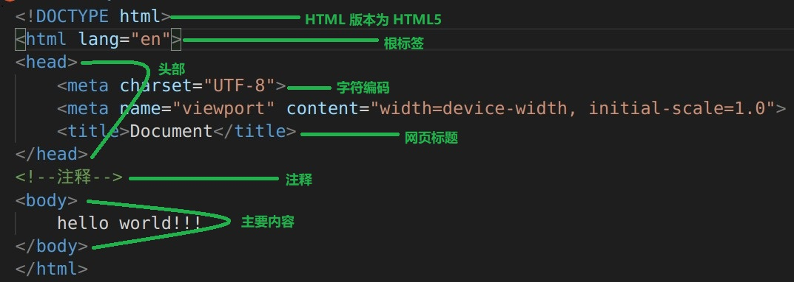
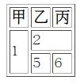
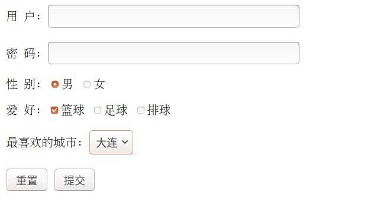
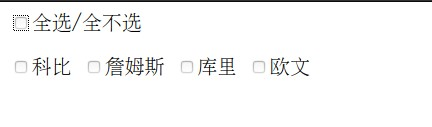
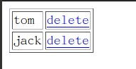

# 前端知识点

## 总体介绍

### 页面组成

1. 结构（HTML）
   - HTML 是页面的内容载体。内容是可以浏览的信息，包括文字、图片和视频
2. 表现（CSS）
   - CSS 是样式的表现。比如字体、颜色变化，所有用来改变内容外观的东西称之为表现
3. 行为（JavaScript、JQuery）
   - JavaScript 是用来实现页面特效效果。具有交互功能的一般用 JavaScript 来实现

## HTML 

### HTML（Hyper Text Markup Language） 介绍

1. 以 HTML 名称为为切入点

   - HTML 全名为 __超文本标记语言__
   - HTML 不是一种编程语言，而是一种 __标记语言__
   - __超文本__ ：为图片、链接或者是音频和程序等非文字元素

2. HTML 结构介绍

   - 如图

     

### HTML 基本语法

1. __标签介绍__

   - 标签分类
     1. 开始结束标签 `<div> </div>` ；自结束标签 `<br/>`
     2. 块级标签 `div\p\ol\ul\dl\table` ，自动换行；行内标签，`img\span\select\input`，不换行

   - 标签不区分大小写

   - 浏览器解析标签（chrome 浏览器）

     1. `Sources` 是网页源码（程序员编写的）
     2. `Elements` 是浏览器解析 `Sources` 后的代码（浏览器有容错机制，允许源码部分错误）

   - 标签属性

     1. 双引号加持 `""`

   - 常用标签

     1. 如表

        | 标签    | 作用                                                    |
        | ------- | ------------------------------------------------------- |
        | `h1-h6` | 标题标签（`<h1></h1>`字体大小及粗细逐渐变小），自动换行 |
        | `div`   | 容器（`<div></div>`布局作用），自动换行                 |
        | `p`     | 段落标签（`<p></p>`），自动换行                         |
        | `br`    | 换行（`<br/>`），自结束标签                             |

2. 注释

   - 表现形式 `<!--注释-->`

3. 转义字符

   - 空格
     1. 普通空格 `&nbsp;`
     2. 中文空格 `&emsp;`
   - 大于号、小于号
     1. 大于号 `&gt;`
     2. 小于号 `&lt;`
   - 版权号
     1. `&copy;`

4. 列表（块级标签）

   - 无序列表（unorder list）

     1. 实例

        ```html
        <ul tyep="disc/circle/square">
            <li></li>
        </ul>
        ```

   - 有序列表（order list）

     1. 实例（`type` 属性为排序样式）

        ```html
        <ol type="A/a/1/i">
            <li></li>
        </ol>
        ```

5. 插入图片（行内标签）

   - 语法 ``
   - 参数说明
     1. `src` ：图片路径
     2. `alt` ：图片路径出错，提示信息
     3. `title` ：鼠标悬停提示信息

6. 超链接（行内标签）

   - 语法 `<a href="" target="">contents</a>`
   - 参数说明
     1. `href` ：链接地址
     2. `target` ：以何种方式打开链接
        - `_self` 在当前页面打开页面
        -  `_blank` 在新页面打开页面

7. 表格（块级标签）

   - 语法

     1. 代码

        ```html
        <table border="1" width="" height="" align="">
            <tr>
                <th>甲</th>
                <th>乙</th>
            </tr>
            <tr>
                <td>A</td>
                <td>B</td>
            </tr>
        </table>
        ```

     2. `tr` 表示行；`th` 表示表头列（内容加粗居中）；`td` 表示列

   - 参数说明

     - `border` ：表示边框为 1像素（`1px`）
  - `width/height` ：宽高
    
- __`align` ：表格在屏幕上居中。如果 `<tr align="center"></tr>` 表示文字居中__
  
   - 跨行、跨列
   
     1. 样式如图
     
        
     
     2. 代码（`rowspan` 跨行，`colspan` 跨列）
     
        ```html
        <table border="1">
            <tr>
                <th>甲</th>
                <th>乙</th>
                <th>丙</th>
            </tr>
            <tr>
                <td rowspan="2">1</td>
                <td colspan="2">2</td>
            </tr>
            <tr>
                <td>5</td>
                <td>6</td>
            </tr>
        ```

### 表单

1. 表单介绍

   - 功能
     1. 表单在网页中主要负责数据采集功能。
   - 组成（表单有三个基本组成部分）
     1. 表单标签：包含了数据提交到服务器的方法。 
     2. 表单域：包含了文本框、密码框、隐藏域、多行文本框、复选框、单选框、下拉选择框和文件上传框等。 
     3. 表单按钮：包括提交按钮、复位按钮和一般按钮；用于将数据传送到服务器或者取消输入
     4. [百度百科](https://baike.baidu.com/item/%E8%A1%A8%E5%8D%95)

2. 语法

   - 实例

     1. 代码

        ```html
        <form action="" method="get">
            
        </form> 
        ```

   - 参数

     1. `action` ：数据提交地址
     2. `method` ：提交方式
        - `get` 快速
          1. 提交实例 `Demo.html?username=ss&pwd=123&gender=man&hobby=basketball&city=dalian`
          2. 参数是明文传输
        - `post` 安全
          1. 提交实例 `Demo.html`
          2. 参数无法显示，安全

3. 实例

   - 以 `form` 为表单

     1. 如图

        
     
   - 实例代码
   
     1. 如下
   
        ```html
        <body>
            <form action="" method="get">
                用 户: <input type="text" name="username"><br><br>
                密 码: <input type="password" name="pwd" id=""><br><br>
        
                性 别: <input type="radio" name="gender" id="" value="man" checked="checked">男
                <input type="radio" name="gender" id="" value="woman">女<br><br>
        
                爱 好: <input type="checkbox" name="hobby" id="" value="basketball" checked="checked">篮球
                <input type="checkbox" name="hobby" id="" value="football">足球
                <input type="checkbox" name="hobby" id="" value="volleyball">排球
                <br><br>
        
                最喜欢的城市: <select name="city" id="">
                    <option value="dalian">大连</option>
                    <option value="jinzhou">锦州</option>
                    <option value="dandong">丹东</option>
                    <option value="shenyang">沈阳</option>
                </select>
                <br><br>
        
                <input type="reset" value="重置">
                <input type="submit" value="提交">
            </form>
        </body>
        ```
   
   - 表单域标签
   
     1. 文本框 `<input type="text">`
   
        - `value` 为默认值
   
     2. 密码框 `<input type="password">`
   
        - `value` 为默认值
   
     3. 单选框 `<input type="radio">`
   
     4. 复选框 `<input type="checkbox">`
   
     5. __文件框 `<input type="file">` __
   
     6. __隐藏框 `<input type="hiddden">`__
   
     7. 下拉列表
   
        ```html
        <select name="">
            <option value=""></option>
        </select>
        ```
   
   - 表单按钮
   
     1. 重置 ` <input type="reset" value="重置">`
     2. 提交 `<input type="submit" value="提交">`

## CSS 

### CSS 介绍

1. CSS 全称为 __层叠样式表（Cascading Style Sheets）__ ，主要用于定义 HTML 内容在浏览器的显示样式，如文字大小、颜色、字体等

2. CSS 样式由 __选择符（选择器）__ 和 __声明__ 组成，而声明又由 __属性__ 和 __值__ 组成

   - 表现形式 
     1. 选择符对应 HTML
        - __标签选择器__ ：`p {}`  ，p 标签
          1. 标签选择器，作用范围较大（一般不推荐使用）
        - __类选择器__ ：`.className {}` ，类名
          1. 类在 HTML 中，一个标签可以具有多个类，一个类名可以在多个标签中重复使用，固使用类选择器作用 __可选择性__
        - __ID 选择器__ ：`#IDName {}` ，ID
          1. ID 在 HTML 元素中唯一，固使用 ID 选择器作用 __唯一性__
     2. 声明对应大括号 `{}`
     3. 属性和值对应 HTML 的属性和值

3. 书写位置

   - 在 HTML 文件中，`<head></head>` 标签中

     1. 如下（使用 __标签选择__ 器设置 `<p></p>` 文字为红色）

        ```html
        <head>
            <title>Document</title>
            <Style type="text/css">
                p {
                    color: red;
                }
            </Style>
        </head>
        ```
   

### CSS 基础语法

1. 注释
   - 多行注释 `/* 注释 */`
   - 单行注释 `//`
2. 颜色书写（6 种，介绍常用 3 种）
   - 英文表示 `red` ，单一
   - 十六进制 `#ff0000` (红色) `#0000ff` (蓝色)
   - rgb `rgb(255, 0, 0)` （红色）
   - __注意__ ：十六进制、和 rgb 颜色表示，以 __红绿蓝__ 为基础颜色
3. CSS 嵌入方式
   - 行内嵌入
     1. 使用 `Style` 属性
   - 内部嵌入
     1. 使用 `Style` 标签
   - 外部嵌入
     1. 使用 `xxx.css` 文件
     2. 内部使用 `<link rel="stylesheet" href="xxx.css">`
        - `href` ：链接路径
        - `rel` ：链接与该文件关系描述
   - 优先级
     1. 行内 > 内部 > 外部

## JavaScript 

### 介绍

1. JavaScript 是一门脚本语言，主要运行在浏览器中。浏览器中负责运行 JavaScript 脚本代码的程序叫 JavaScript 引擎

2. hello world

   - 代码

     ```html
     <head>
         <meta charset="UTF-8">
         <meta name="viewport" content="width=device-width, initial-scale=1.0">
         <title>Document</title>
         <script type="text/javascript">
             // main
             window.onload = function() {
                 // 获取 id 为 button 的元素节点
                 var but = document.getElementById("button");
                 // 为 but 绑定点击相应函数
                 but.onclick = function() {
                     // 弹出警告框，显示 helo world
                     alert("hello world");
                 }
             }
         </script>
     </head>
     <body>
         <button id="button">hello</button>
     </body>
     ```

### 基础语法介绍

1. 变量

   - JavaScript 为弱类型语言，没有编译过程，__数据类型运行时确定__

   - 语法

     1. `var i = 0;` 或者 `var str = "hello world"`  

   - 动态赋值（可以随意改变变量的数据类型）

     1. 演示

        ```javascript
        var i = 0;
        i = "hello";
        i = true;
        ```

   - __特点__

     1. 只声明变量 `var i;` ，使用时提示 `undefined` 错误
     2. 没有声明 `i = 0;` ，直接使用，允许这样操作（建议声明之后再使用）
     
   - 循环

     1. for 循环

        ```javascript
        for (var i = 0; i < 3; i++) {
            
        }
        ```

2. 函数

   - 使用 `function` 关键字声明函数。因为其对数据类型没有要求和没有类的概念，所以相对于 Java 的方法来说，JavaScript 的函数 __没有修饰符和返回值__

   - 在 JavaScript 中，函数作为一种数据类型存在，而且是引用数据类型，函数名就是指向其内存空间地址的引用

   - 在 JavaScript 中，函数也是对象

     1. 有 `name` 属性，即函数名
     2. 也可以使用点 `.` 给函数定义属性并赋值 `fun.age =18;` 函数 fun 有一个属性 age 值为 18

   - 定义函数

     1. 演示

        ```javascript
        // 定义函数
        function fun() {
            alert("hello world");
        }
        // 使用
        fun();
        ```

   - 函数定义方法（2 种）

     1. 有名函数 `function fun(i, j) {}`
        - 可以传递参数
     2. 匿名函数 `function() {}`
        - 无法传递参数

   - 函数调用

     1. 有名函数定义和调用

        - 演示

          ```javascript
          function add(i, j) {
              return i + j;
          }
          alert(add(1, 3));
          ```

     2. 匿名函数定义和调用

        - 演示

          ```javascript
          var fun = function(i, j) {
              alert("hello world");
          }
          fun(1, 2)
          ```

        - 匿名函数一般直接赋值给变量或者是事件，如 `window.onload`

     3. __有名函数调用注意事项__

        - 以上面 add 函数为例
          1. 如实参为 number 时，`+` 表示加法
          2. 如实参为 String 时，`+` 表示拼接

        - 形参数量大于实参数量
          1. 实参为 number 类型时 `add(1)`，返回 `NaN` （not a number）
          2. 实参为 String 时 `add("s")`，返回 `sundefined`
        - 形参数量小于实参数量
          1. 自动忽略多余参数，都为 number 类型为加法；有 String 类型为拼接字符串

3. 对象

   - 在 Js 中定义对象
     1. `var object = new Object();` 定义对象
     2. `var jsonObj = {key1: value1, key2: value2};` 定义 json 格式对象，使用方便（常用），当然使用 `jsonObj.key1;` 获取值。

### 事件驱动

1. 事件介绍

   - 以函数为例，函数为 __事件源__ ，执行为 __触发事件__。__实际可以理解为函数为事件源，控制组件为监听器。__

     1. 函数为事件源
     2. 声明函数、绑定到指定控制上都不会执行
     3. 触发事件，执行

   - 实例

     1. 代码

        ```javascript
        // 入口 
        window.onload = function() {
             // 定义函数（事件源）
             function show() {
                 alert("hello world");
             }
             // 获取 id 为 button 的元素节点（监听器）
             var but = document.getElementById("button");
             // 事件源于监听器关联
             but.onclick = but;
         }
        ```

   - `window.onload` 作用

     1. 在没有 `window.onload` 加持下，代码的执行顺序是从上到下执行的，在 button 都没有存在时，是无法获取的，所以使用 __`window.onload` 保证执行 javascrip 时页面的 button 已存在__
     2. 如果没有 `window.onload` 时，将 javascrip 脚本写在页面后面一样可以获取到 button（代码执行顺序从上到下）
     3. __`window.onload = function() {}` 等当前文档完全加载完成后再执行__
        - `window` 是浏览器中对象
        - `window.onload` 是监听器（监听网页是否加载完全）
        - `function() {}` 是事件源
        - 当网页加载完全后，再执行函数
     4. __无论是什么嵌入方式，`window.onload` 只能执行一次__

2. 嵌入方式

   - 行内嵌入

     1. 使用属性 `onclick` 
        - `<button onclick="alert('hello');">hello</button>`
     2. 不建议使用，结构与行为相耦合

   - 内部嵌入

     1. 使用 `script` 标签

        - 代码

          ```javascript
          <script type="text/javascript">
              window.onload = function() {
              
          }
          </script>
          ```

   - 外部嵌入

     1. 使用标签
        - `<script type="text/javascript" src=""></script>`
     2. `src` 为链接地址
        - 使用 `script` 标签的 `src` 属性后
        - 标签中Javascript 脚本不会在执行

### DOM 操作

1. 介绍
   - 文档对象模型 `DOM` （Document Object Model）
     1. DOM 定义了 __访问__ 和 __处理__ HTML 文档的标准方式，是 W3C 国际组织制定的统一标准。在很多计算机语言都有不同的实现。
     2. 将文档封装成一个标准模型，通过标准模型操作（增删改查）文档
   - 元素封装成对象后，获取元素的属性以及其他内容
     1. 获取闭合标签的内容 。如 `<p>contents</p>` 获取 `contents`
        - `.innerText` 或者 `.innerHTML`
     
     2. `<p><p>contents</p></p>`
        - `.innerText` 只会取出文本，`content`
        - `.innerHTML` 会取出标签的中间全部内容，`<p>contents</p>`
     3. 获取自结束标签的 `value` 值
        - `.value`
   
2. HTML DOM 标准
   - 根据 W3C 的 HTML DOM 标准，HTML 文档中的所有内容都是节点
     1. 整个文档是一个 __文档节点__
        - `Document`
     2. 每个 HTML 元素是 __元素节点__
        - `Element`
     3. HTML 元素内容的文本是 __文本节点__
        - `Text`
     4. 每个 HTML 属性是 __属性节点__
        - `Attribute`
     5. 注释是 __注释节点__
   
3. DOM 查询
   - 在整个文档中查询 __（不需要获取元素对象，直接在整个文档中查找）__
     1. 根据 ID 值查询，返回一个具体节点
        
        - `document.getElementById("id值")`
        
     2. 根据标签名查询，返回节点数组
        
        - `document.getElementsByTagName("标签名")`
        
     3. 根据 name 属性值查询，返回节点数组
        
        - `document.getElementsByName("name值")`
        
     4. 演示
     
        - 获取标签名为 p 的元素对象
     
          ```javascript
          var pArray = document.getElementsByTagName("p"); // 返回数组
          ```
     
   - 在具体元素节点范围内查找子节点 __（首先需要获取一个元素对象）__ ，子节点是该节点的下一级节点（不包括孙子节点）。__空格、回车也算是子节点__
     
     1. 何为子节点（与浏览器版本有关）
     
        - 实例一（ul 节点有 3 个子节点）
     
          ```html
          <ul>
              <li>A</li>
          </ul>
          ```
     
        - 实例二（ul 节点有 1 个子节点）
     
          ```html
          <ul><li>A</li></ul>
          ```
     
        - __空格和回车也算字节点__
     
     2. 查找全部子节点，返回节点数组
     
        - `element.childNodes`
     
     3. 查找第一个子节点，返回节点对象
     
        - `element.firstChild`
     
     4. 查找最后一个节点，返回节点对象
     
        - `element.lastChild`
     
     5. __查找指定标签的子节点，返回节点数组__
     
        - `element.getElementsByTagName("标签名")`
        - 这个方法在 `document` 中也存在，但是其他两个方法只有 `document` 中存在
     
     6. 查找指定元素的父节点
     
        - `element.parentNode`
     
     7. 实例
     
        - 获取 id 为 1 的元素的最后一个子节点
     
          ```javascript
          var ele = document.getElementById("1"); // 获取 id = 1 的元素对象
          var lastele = ele.lastChild; // 再获取最后一个子节点
          ```
     
   - 查找指定元素的兄弟节点 __（首先需要获取一个元素对象）__
   
     1. 查找前一个兄弟节点
        - `node.previousSibling`
     2. 查找后一个兄弟节点
        - `node.nextSibling`
   
4. 实例

   - 非空验证

     1. 除 `alert();` 提示框，还有 `confirm();` 提示框

        - `alert();`  只有确认按钮
        - `confirm();` 有确认和取消按钮，并有返回值 `true/false`

     2. 提交按钮 `<input type="submit" value="">` ，监听器 `button.onclick` 

        - 监听器的默认行为是提交数据
        - 中断默认行为是 `return false;` 即可

     3. 代码

        - html

          ```html
          <form action="Demo1.html" method="get">
              <input type="text" name="username" id="un"> <br><br>
              <input type="submit" value="登陆" id="subm">
          </form>
          ```

        - script

          ```javascript
          window.onload = function() {
              var submit = document.getElementById("subm");
              submit.onclick = function() {
                  var namevalue = document.getElementById("un").value;
                  if (namevalue == null || "" == namevalue) { // 判断 value 是否为空
                      alert("用户名不能为空"); // 提示框
                      return false; // 中断 onclick 默认行为
                  }
              }
          }
          ```

## JQuery

### JQuery 介绍

__说明：[菜鸟教程参考地址](https://www.runoob.com/jquery/jquery-tutorial.html)__

1. JQuery 是一个兼容多浏览器的、轻量级的 JavaScript 库，并且是目前最流行的。

2. JQuery 顾名思义是 JavaScript 和查询（Query），宗旨是 __write less,Do more__

3. 下载（Ubuntu 18.0.4系统）

   - 压缩版 ` wget https://code.jquery.com/jquery-3.5.1.min.js`
   - 未压缩版 ` wget https://code.jquery.com/jquery-3.5.1.js`

4. JQuery 的使用

   - JQuery 库实际上就是 js 文件，只需要在网页中直接引用这个文件即可
     1. 引用 `<script src="jquery-3.5.1.js"></script>`
   - 注意
     1. 在开发中使用未压缩版本
     2. 在上线项目中使用压缩后的版本

5. 验证 JQuery 是否导入成功，__打印 `$` 对象__

   - 代码

     ```html
     <script src="../libs/jquery-3.5.1.js"></script>
     <script type="text/javascript">
     	alert($);
     </script>
     ```

   - `$` 对象

     ```javascript
     function( selector, context ) {
     		// The jQuery object is actually just the init constructor 'enhanced'
     		// Need init if jQuery is called (just allow error to be thrown if not included)
     		return new jQuery.fn.init( selector, context );
     }
     ```
   
6. 获取 CSS

   - 代码（将背景颜色设置为红色）

     ```javascript
     $div.css(background-color: red);
     ```

### 简单实例

1. 点击按钮，提示 hello

   - 代码

     1. html

        ```html
        <body>
            <button id="button">sayhello</button>
        </body>
        ```

     2. js

        ```html
        <script src="../libs/jquery-3.5.1.js"></script>
        <script type="text/javascript">
            $(function () {
                $("#button").click(function () {
                    alert("hello");
                });
            });
        </script>
        ```

2. 对比

   - 对比一

     1. 不使用 JQuery
        - `window.onload = function() {};`
     2. 使用
        - `$(function() {});`
  3. __两者这件相互替代，但两者有区别__
        - `window.onload() = function() {}` ：当文档全部加载完成（包括图像等一些资源）。只可书写一次，多次书写，将会覆盖
     - `$(function() {})` ：当文档绘制完成，标签加载完成即可（像图片等一些资源，无需加载完成即可执行）。可以书写多次。
          1. 标准写法 `$(document).ready(function() {});`
     - 综上：两者执行有先后顺序

   - 对比二
   
     1. 不使用 JQuery
        - 获取元素对象 `var button = document.getElementById("button");`
        - 监听 `button.onclick = function() {};`
     2. 使用
        - `$("#button").click(function() {});`
     3. 一行搞定两行

### `$();` 的作用

1. `$` 代表什么

   - `$` 代表 JQuery 
   - 验证
     1. `$();`
     2. `JQuery()`
     3. 两者相互等价

2. 核心函数 `$();` 4 个作用

   - 传入参数为函数时 `$(函数);`

     1. 作用：在文档加载完成后，执行此函数

   - 传入参数为选择器字符串时 `$(字符串)`;

     1. 作用：根据字符串查找节点对象

   - 传入参数为 HTML 字符串（HTML 标签）时 `$(字符串)`;

     1. 作用：根据字符串创建元素节点对象

     2. 创建元素节点（将 `<li></li>` 节点添加到 `<ul></ul>` 节点中）

        ```javascript
        $(function() {
            var $li = $("<li>add</li>"); // 创建节点
            $("ul").append($li); // 获取 ul 节点，将 li 节点添加进去
        });
        ```

   - 传入参数为 DOM 对象时 `$(对象)`;

     1. 作用：将 DOM 对象包装成 JQuery 对象

     2. DOM 与 JQuery 对对象描述的不同（以 `<li></li>` 标签为例）

        - DOM 描述 `[object HTMLLIElement]`
        - JQuery 描述 `[object object]`

     3. 将标签 DOM 的 li 对象转换成 JQuery 对象

        ```javascript
        $(function() {
            var li = document.getElementById("li"); // 获取 li 的 DOM 对象
            var $li = $(li); // 转换为 JQuery 对象
        });
        ```

3. DOM 与 JQuery  __标签对象__ 相互转换问题

   - 相互转换

     1. DOM 转换 JQuery

        ```javascript
        var $div = $(div);
        ```

     2. JQuery 转换 DOM

        ```javascript
        var div = $div[0];
        var div = $div.get(0); // 或者
        ```

     3. 实际可以将 JQuery 的标签对象看成 JavaScript 的数组或者列表来操作，并获取 DOM 对象

   - DOM 属性与 JQuery 函数之间的对应

     1. `text()` 对应 `innertext`
     2. `html()` 对应 `innerhtml`
     3. `val()` 对应 `value`

   - 获取标签 div 的文本内容

     1. 标签 `<div id="div">contents</div>`

     2. JQuery 获取

        ```javascript
        $(function() {
            var $div = $("#div");
            alert($div.text());
        });
        ```

     3. JavaScript 获取

        ```javascript
        window.onload = function() {
            var div = document.getElemnetById("div");
            alert(div.innertext);
        }
        ```

   - JavaScript 与 JQuery 之间的属性后者函数不能混用

### 迭代介绍

#### DOM 与 JQuery 转换

1. 上面已有介绍

#### 迭代实现

1. [参考地址](https://www.runoob.com/manual/jquery/) ，参考介绍了两种迭代方式

   - 数组迭代
   - json 对象迭代

2. JQuery 对应 HTML 标签对象数组迭代

   - JQuery 与 DOM 相互转换时说明，可以将 JQuery 看成 DOM 的数组

   - 如，`%divArray = $(div)` 是 JQuery 对象，获取所有 div 元素，进行迭代

     1. 代码 `$.echo(object, [callback])` 其中 `$` 表示 JQuery 对象

        ```javascript
        $divArray.echo(function() {
           alert(this.value); // this 表示触发当前函数的对象，JQuery 迭代时，就转换为 DOM 对象
        });
        ```

### 选择器

#### 介绍

1. JQuery 的选择器作用
   - 通过核心函数 `$();` ，传入 HTML 的标签名称、标签 ID、标签的类获取 JQuery 对应 HTML 标签对象
2. [菜鸟教程参考地址](https://www.runoob.com/manual/jquery/)

#### 基本选择器

1. id 选择器 
   - `$("#div");`
2. 类选择器 
   - `$(".div");`
3. 标签选择器 
   - `$("div");`
4. 全选 
   - `$("*");`
5. 获取 div 标签、span 标签和 class 为 myClass 的 p 标签 
   - `$("div, span, p.myClass");` 

#### 层次选择器

1. 给定的祖先元素匹配所有后代元素（子元素，孙子元素都可以匹配）

   - 匹配 form 表单中的所有 input 标签
   - `$("form input");`

2. 给定的父元素下匹配所有子元素（没有孙子元素）

   - `$("form input");`
   - __相对于 1 来说，2 的范围较小__

3. 匹配所欲 pre 元素后的 next 标签

   - 匹配 label 标签第一个元素（元素必须是 input 标签）

   - `$("label + input");`

4. 匹配 prev 元素后面的所有 siblings 元素

   - `$("form ~ input");` 
   - 注意：是 form 元素后的 input 标签，在 form 元素中的 input 标签排除在外

#### 过滤选择器

1. [菜鸟教程参考地址](https://www.runoob.com/manual/jquery/)
2. 包含给定属性的元素或者给定属性值
   - 选取具有 id 属性的 div `$("div[id]");`
   - 选取 id 属性为 1 的div `$("div[id='1']");`
3. 选取每个 class 为 one 的 div 父元素的第一个子元素
   - `$("div.one > :first-child");`
     1. `div.one` class 为 one 的 div
     2. `div.one >` class 为 one 的 div 父元素
     3. `:first-child` 父元素的第一个子元素（父元素不止一个，在多个父元素中选取每一个父元素的第一个子元素）
     4. __`:first` 只会选取一个元素（多个父元素的第一个父元素的第一个子元素）__

#### 表单的选择器

1. 一般 input 标签都会在 form 表单中定义
2. 匹配所有 input, textarea, select 和 button 元素（无论是 form 中，还是 body 中的都会匹配）
   - `$(":text");`

#### 表单对象属性选择器（实例）

1. 获取复选框选中的个数

   - `$(":checkbok:checked").length;`
   - `(":checkbok");` 选择复选框
   - `$(:checkbok:checked);` 复选框选中的

2. 反选按钮

   - 作用：__将复选框中选中和没有选中的反转__

   - 按钮 `<button id="button"></button>`

   - 代码（推荐使用 DOM 风格）

     ```javascript
     $("#button").click(function() { // 获取 button 监听
         var $cb = $(":checkbox"); // 获取复选框 JQuery 对象
         $cb.echo(function() {
             // this.checked = !this.checked; // 取反赋值
             if ("ckecked" == $(this).attr("checked")) { // 取值，判断 checked 的值
                 $(this).attr("checked", false);
             } else {
     		   $(this).attr("checked", true);
             }
         });
     });
     ```

   - checked 属性值

     1. DOM 取值 `this.checked` ：true | false
     2. JQuery 取值 `$(this).attr("checked")` ：checked | undefined

3. 全选框实例

   - 如图

     1. 全选框样式

        

   - 作用

     1. 当全选框设置为 checked 时，4 个复选框也设置 checked；反之，4 个复选框设置为不选择
     2. 当 4 个复选框都设置为 checked 时，全选框也设置为 checked，4 个只要有一个没有选择，则全选框不选

   - 代码

     1. html 样式

        ```html
        <input type="checkbox" name="" id="">全选/全不选 <br><br>
        <input type="checkbox" name="" id="">科比
        <input type="checkbox" name="" id="">詹姆斯
        <input type="checkbox" name="" id="">库里
        <input type="checkbox" name="" id="">欧文
        ```

     2. Javascript 脚本
   
        ```javascript
        $(function () {
            $("#checkedAllBox").click(function () { // 获取全选框监听事件
                // var ck = this.checked;
                // $("input[name='item']").attr("checked", ck);
                var $items = $("input[name='item']") // 转换为 DOM 对象可以多次进行赋值
                $items.each(function () {
                    this.checked = $("#checkedAllBox")[0].checked;
                });
            });
        
            $("input[name='item']").click(function () { // 获取 4 个复选框监听事件
                if ($("input[name='item']").length == $("input[name='item']:checked").length) {
                    // $("#checkedAllBox").attr("checked", true);
                    $("#checkedAllBox")[0].checked = true; // 转换为 DOM 对象可以多次进行赋值
                } else {
                    // $("#checkedAllBox").attr("checked", false);
                    $("#checkedAllBox")[0].checked = false;
                }
            });
        });
        ```
     
   - self 感觉：
   
     1. JQuery 设置属性值，感觉好像有优先级一样。
     2. 当第一次打开网页，checked 没有属性值，JQuery 可以对其赋值，但当从页面选中时，使用 JQuery 设置属性值，就失效，只能将 JQuery 对象转换为 DOM 对象在对其进行赋值操作。
     3. 以上注释代码为证。
   
4. Jquery 对象的 `val()` 函数作用

   - `val()` 函数的作用需要说明一点，对于 select option （`multiple="multiple"` 属性表示可以多选）、复选框 checkBox 标签和单选框来说 `val([value值1, value值2])` 表示选中
   - [菜鸟教程参考地址](https://www.runoob.com/manual/jquery/)

### DOM 操作

#### 介绍

1. 作用
   - 使用 JQuery 选择器在大范围内寻找元素标签，此时返回 JQuery 对象，如果再次寻找特定标签时，就不能使用选择器，而是使用 JQuery 对象的方法获取特定标签。

#### DOM 查询

1. [菜鸟教程参考地址](https://www.runoob.com/manual/jquery/) ，驻点 __筛选__
   - 其中 `filter()` 过滤功能比较强大，注意。
2. 查询实例
   - 获取 body 中第三个 div 标签
     1. 获取 JQuery 的 div 标签
        - `var $div = $("div");`
     2. 再次基础上获取第三个 div
        - `$div.eq(2).css("background-color", "red");`
   - 在 Body 中查询所有 Class 为 one 的 div 的子元素
     1. `$(body).children("div.one").css("background-color", "red");`
     2. `children()` 查找子元素
     3. `find()` 查找后代

#### DOM 增删改

1. [菜鸟教程参考地址](https://www.runoob.com/manual/jquery/) ，驻点 __文档处理__

   - 问题：当某一元素绑定事件后，后添加的相同元素默认没有绑定该事件
   - 解决问题：使用 `on("click", function() {})` 1.7 以后推荐使用（`live()` 不推荐），确保后添加的元素也绑定该事件

2. 实例

   - 在 table 中点击 a （delete）标签删除 tr（行）

     1. 如图

        

     2. 代码

        - html 样式

          ```html
          <body>
              <table border="1">
                  <tr>
                      <td>tom</td>
                      <td><a href="a">delete</a></td>
                  </tr>
                  <tr>
                      <td>jack</td>
                      <td><a href="b">delete</a></td>
                  </tr>
              </table>
          </body>
          ```

        - javasvript 代码

          ```javascript
          $(function () {
              $("a").click(function () { // 获取 链接 a 标签的监听事件
                  $(this).parents("tr").remove(); // 获取祖先 tr 标签并删除
                  // $(this).parent().parent().remove(); // 效果相同 
                  return false; // 终止 a 标签的默认行为
              });
          });
          ```

### 事件

#### 事件冒泡

1. 介绍

   - 当内部标签绑定事件时，默认外部事件也会绑定相同事件
   - 取消默认行为，即 `return false;` 

2. 实例

   - html 代码

     ```html
     <body>
         <div id="content">
             div
                 <span>内部span</span>
             div
         </div>
     </body>
     ```

   - javascript 代码

     ```javascript
     $(function () {
         $("#content").click(function () {
             alert("div");
         });
     
         $("span").click(function () {
             alert("span");
             return false；// 终止默认行为
         });
     });
     ```

3. 如果没有 `return false;`

   - 点击 span 标签后，会弹出 `span` 和 `div`

#### change 事件

1. 介绍
   - 触发条件
     1. 当元素失去焦点时触发，且文本改变时触发（两者都满足时触发）
   - [菜鸟教程参考地址](https://www.runoob.com/manual/jquery/) 驻点 __事件__
2. 作用
   - 一般用于数据校验的
   - 填写用户名时，校验是否已被注册
     1. 但失去焦点，且文本改变时触发

### 正表达式

1. [正则表达式速查表](https://www.runoob.com/manual/jquery/)

   - 正则表达式 `/匹配规则/` 如下
     1. 用户名匹配规则 `/^[a-z0-9_-]{3,16}$/`

2. 实例

   - 验证用户名字符串

     1. 代码

        ```javascript
        var uname = $("#username").val(); // 获取 input:text 的 value 值
        var regUName = ^[a-z0-9_-]{3,16}$; // 定义正则表达式
        if (regUName.test(uname)) { // 判断是否符合规则
            
        }
        ```

### Java-XML 解析

#### XML 简单了解

1. XML 介绍

   - XML -- 可扩展标记语言（eXtensible Markup Language）
   - XML 的使命，就是以统一的格式，组织有关数据，为不同的平台下的应用程序服务
   - XML 用于数据传输和存储，HTML 用于显示数据
   - __XML 没有预定义标签，均为自定义标签__ ，与 HTML 恰恰相反
   - 当前（20/6/30）使用 json 的较多

2. XML 用途

   - 配置文件
     1. JavaWeb 中的 web.xml
     2. C3P0 中的 c3p-config.xml
   - 数据交换格式
     1. Ajax
     2. WebService
   - 数据存储
     1. 保存关系型数据

3. XML 基本语法

   - XML 实例

     1. 代码

        ```xml
        <?xml version="1.0" encoding="UTF-8"?> <!--XML 声明-->
        
        <students>                             <!--根标签-->
            <student id="1">                   <!--文档内容-->
                <name>曹操</name>
                <gender>男</gender>
            </student>
            <student id="2">
                <name>孙权</name>
                <gender>男</gender>
            </student>                         <!--文档内容-->
        </students>
        ```

   - 语法规则

     1. XML 声明要么不写，要写就必须书写在第一行，并且前面没有任何其他字符
     2. 只能有一个跟标签
     3. 标签不能交叉嵌套
     4. 严格区分大小写
     5. 属性必须有值，且必须加引号
     6. 标签不能以数字开头
     7. 注释不能嵌套

#### dom4j 解析 XML

1. Java 解析 XML 介绍

   - XML 解析是指通过解析器读取 XML 文档，解释语法，并将文档转换成对象 __（解析非常重要）__
   - Java 平台同时提供了 DOM（Document Object Model） 和 SAX（Simple API for XML ）

2. 解析体系

   - SAX 标准（包 `org.xml.sax`）
     1. 原理：基于事件的回调机制。一边读入文件，一边调用函数返回取出内容，__仅支持查询__
     2. PULL：对 SAX 解析进一步包装，更加好用
   - DOM 标准（包 `org.w3c.dom`）
     1. 原理：一次性读入全文文档，形成树形结构，__支持增删改查__
     2. jDom：对 DOM 解析进一步包装
     3. dmoj4：对 jDOM 进一步包装
   - DOM 与 SAX 对比
     1. DOM 效率较低（内存占用大），但可以修改 XML 文档
     2. SAX 效率较高（内存占用低），仅仅读取 XML 文档

3. domj4

   - 是开源 XML 解析包 `domj4-1.6.1.jar` [下载地址](https://dom4j.github.io/)

   - 实例

     1. 代码

        ```java
        SAXReader reader = new SAXReader(); // 创建解析器
        Document document = reader.read(new File("./Java-XML/src/XML/hello.xml"));
        Element rootElement = document.getRootElement(); // 获取根元素
        List<Element> elements = rootElement.elements(); // 获取根元素的子元素（以上面为例 size=2）
        
        for (Element element : elements) {
            String id = element.attributeValue("id"); // 获取属性值
            String name = element.elementText("name"); // 获取子元素的文本值
            String gender = element.elementText("gender");
        
            System.out.println("name=" + name + "," + "gender=" + gender + "," + "id=" + id);
        }
        ```

#### Xpath 查询 XML 节点

1. Xpath 介绍

   - 作用：在 XML 文档中查找信息的语言
   - 优点：__通过元素和属性进行查找，简化了 Dom4j 查找节点的过程__

2. 使用

   - 导入 jaxen-1.1-beta-6.jar 包，[下载地址](https://repo.maven.apache.org/maven2/jaxen/jaxen/1.1-beta-6/jaxen-1.1-beta-6.jar) ，包的作用好像是 Xpath 引擎（不太指导）。
     1. 不导入此包，编译不会报错（方法提示也有），但是运行时提示 `Caused by: java.lang.ClassNotFoundException: org.jaxen.JaxenException` 错误！！！
     2. 导入此包，解决上述问题
   - 两个重要方法
     1. 获取根目录 students 的子元素 id 为 1 的 student `document.selectSingleNode("students/student[@id='1']");` 
     2. 获取根目录 students 的子元素 student `document.selectNodes("students/student")`
     3. __两个方法返回 Node 类型（继承 Element），一般使用 Element 类型接受，方便获取属性值，元素文本内容__
     4. 注意：`/` 表示子元素；`//` 表示后代

3. 实例

   - 以上面的 XML 文件为例

   - 代码

     1. 部分代码

        ```java
        SAXReader reader = new SAXReader(); // 创建解析器
        Document document = reader.read(new File("./Java-XML/src/XML/hello.xml"));
        
        // 使用 Xpath 快速查找 XML 节点
        Element element = (Element) document.selectSingleNode("students/student[@id='2']");
        
        String id = element.attributeValue("id");
        String name = element.elementText("name");
        String gender = element.elementText("gender");
        System.out.println("name=" + name + "," + "gender=" + gender + "," + "id=" + id);
        
        ```

        