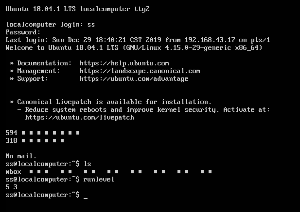
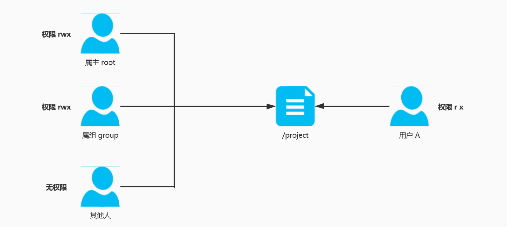

# Linux 基础知识

__说明：以下提及到的文件包含目录及文本（mkdir \ touch），没有特殊标记及说明的情况下默认__

## Linux 文件扩展名

### Linux 不靠扩展名区分文件类型

__说明：以下是扩展名类型只是使用习惯，方便使用者识别__

1. 表现

| 压缩包      | 二进制软件包 | 网页文件 | 脚本文件 | 配置文件 |
| ----------- | ------------ | -------- | -------- | -------- |
| `*.gz`      | `.rmp`       | `.html`  | `.sh`    | `*.conf` |
| `*.bz2`     |              | `.php`   |          |          |
| `*.tar.bz2` |              |          |          |          |

## Linux 个目录的作用

### 以表格的形式说明主要目录作用

1. 主要介绍以下目录

   - `/bin` `/sbin` `/usr/bin/` `/boot` `/dev/` `/etc/` `/home/` `/lib/` `lost + found` `/media/` `/mnt/` `/misc` `/opt/` `/proc/` `/sys/` `/root/` `/srv/` `/temp/`   `/usr/` `/var/` 

   - 表格

     | 目录           | 目录作用                                                     |
     | -------------- | ------------------------------------------------------------ |
     | /bin/          | 存放系统命令的目录，普通用户和超级用户都可以操作。不过放在 /bin 下的命令在在单用户模式下也可以执行 |
     | /sbin/         | 保存和系统环境设置相关的命令，只有超级用户可以使用这些命令进行系统环境设置，但有些命令可以允许普通用户查看 |
     | /usr/bin/      | 存放系统命令的目录，普通用户和超级用户都可以操作。这些命令和系统启动无关，在单用户模式下不能执行 |
     | /usr/sbin/     | 存放根文件系统不必要的系统管理命令，例如多少服务程序。只用超级用户可以使用。<br> 其实可以注意到 Linux 的系统，所有在 sbin 目录中保存大命令只有超级用户可以使用，bin 目录保存的命令所有用户都可以使用 |
     | /boot/         | 系统启动目录，保存系统启动相关的文件，如内核文件和启动引导程序（grup）文件等 |
     | /dev/          | 设备文件保存位置，在 Linux 所有内容以文件的形式保存，包括硬件。那么这个目录就是保存所有硬件设备文件的 |
     | /etc/          | 配置文件保存位置，系统内所有默认安装方式（rpm 二进制安装）的服务的配置文件全部保存到这个目录当中，如用户账户和密码、服务的启动脚本和常用服务的配置文件 |
     | /home/         | 普通用户的家目录，建立每个用户时，每个用户要有一个默认登录位置，这个位置就是用户的家目录。所有普通用户的家目录，就是在 /home 下建立一个和用户名相同的目录，如用户名 ss 的家目录就是 /home/ss/ |
     | /lib/          | 系统调用的函数库保存位置                                     |
     | /lost + found/ | 当系统崩溃或意外关机，而产生一些文件碎片存放在这里。当系统启动的过程中 fsck 工具会检查这里，并修复已经损坏的文件系统。这个目录只在每个分区中出现。 |
     | /media/        | 挂在目录，系统建议是用来挂在媒体设备的，例如软盘和光盘       |
     | /mnt/          | 挂载目录，早期 Linux 只有这一个挂在目录，并没有细分，现在这个目录系统建议挂在额外设备，如 U 盘，移动硬盘和其他操作系统的分区 |
     | /misc/         | 挂在目录，系统建议用来挂在 NFS 服务的公共目录。只要是已建立好的空目录就可以作为挂在点，系统准备了 3 个挂载点 `/medaia /mnt /misc` ，根据自己的喜好选择挂在点，也可以在 `/mnt` 建立目录挂在 |
     | /opt/          | 第三方软件安装位置，这个目录就是放置和安装其他软件的位置，手动安装的源码包软件都可以安装到这个目录中。__不过我们更习惯于把软件放置到  `/usr/local`  目录中，也就说 `/usr/local` 目录也可以用来安装软件__ |
     | /proc/         | 虚拟文件系统，该目录的数据并不保存在硬盘当中，而是保存在内存当中。主要保存系统的内核、进程、外部设备和网络状态。如 `/proc/cpuinfo` 是保存 cpu 的信息；`/proc/devices` 是保存设备驱动的列表；`/proc/filesystem` 是保存文件列表的；`/proc/net` 是保存网络协议信息 |
     | /sys/          | 虚拟文件系统，和 `/proc` 相似，都是保存在内存当中，主要保存内核相关的信息 |
     | /root/         | 超级用户的家目录，普通用户的家目录 `/home/`ss 下，超级用户的家目录直接在 `/` （超级用户只有一个） |
     | /srv/          | 服务数据目录，一些系统启动之后，可以在这个目录保存所需要的数据 |
     | /tmp/          | 临时目录，系统存放临时文件的目录，该目录所有用户都可以访问和写入。__建议该目录不要保存重要数据，因为每次开机都要把该目录清空__ |
     | /usr/          | 系统软件资源目录（注意 `usr` 不是 `user` 的缩写，而是 `Unix Software Resource ` 的缩写），所以不是用来保存用户的数据，而是存放系统软件资源的目录，系统中安装的软件大部分保存在这里 |
     | /var/          | 动态数据保存位置，主要保存缓存、日志、软件运行所产生的文件   |


## Linux 常用命令

### 大纲

1. 文件处理命令
2. 权限管理命令
3. 文件搜索命令
4. 帮助命令
5. 用户管理命令
6. 压缩解压命令
7. 网络命令
8. 关机重启命令

### 命令格式

1. 命令格式

   - `命令 [-选项] [参数]` 选项：选择功能，参数：命令操作的对象

   - 例

     `ls -la /etx`

2. 参考

   - 个别命令使用不遵循此格式
   - 当有多个选项时，可以写在一起
   - 简化选项与完整选项 `-a` 等于 `-all`

## Linux 链接

### 软链接

1. 软链接介绍

   - 软链接类似于 windows 的快捷方式，只是源文件的一个指向，文件和目录都可以使用软链接，方便管理

   - 使用 `ls -l` 查看当前目录下的有所（包括目录和文件） long 信息，权限显示 `lrwxrwxrwx` 的则表示是软链接，且显示了源文件的指向

     ```shell
     ss@localcomputer:~/桌面$ ls -l
     总用量 4
     lrwxrwxrwx 1 ss ss   11 12月 10 22:17 a -> ./tmp/a.txt # 软连接，且指向源文件
     drwxr-xr-x 3 ss ss 4096 12月  9 22:31 tmp
     ```

   - `lrwxrwxrwx` 为 10 个子符，第 1 个字符 `l` 表示文件类型（文件、目录、软链接），第 2-4 的字符表示所有者权限，第 5-7 的字符表示所属组的权限，最后 3 个字符表示其他用户的权限，__然而软链接的操作权限最后是要源文件的操作权限决定的，和软链接显示的权限无管__

     | 字符位置 | 作用                                                    | 所属 | 权限(r\w\x)        |
     | -------- | ------------------------------------------------------- | ---- | ------------------ |
     | 1        | 表示文件类型(`-`表示文件、`d` 表示目录、`l` 表示软链接) | \    | \                  |
     | 2-4      | 表示 user（所属者） 的操作权限                          | u    | 可读、可写、可执行 |
     | 5-7      | 表示所属组（group）的操作权限                           | g    | 可读、可写、可执行 |
     | 8-10     | 表示其他用户（other）的操作权限                         | o    | 可读、可写、可执行 |

2. 使用

   - 命令 `ln -s 源文件 目标文件` （目录、文件都可以产生软链接），一般使用 `.soft` 表示软链接

     ```shell
     # 显示当前目录内容
     ss@localcomputer:~/桌面$ ls
     tmp
     # 设置软链接
     ss@localcomputer:~/桌面$ ln -s ./tmp/a.txt ./a.soft
     # 使用 -l 选项显示
     ss@localcomputer:~/桌面$ ls -l
     总用量 4
     lrwxrwxrwx 1 ss ss   11 12月 11 12:55 a.soft -> ./tmp/a.txt
     drwxr-xr-x 3 ss ss 4096 12月  9 22:31 tmp
     ```

   - 软链接目标文件几乎不占内存

### 硬链接

1. 硬链接介绍

   - 硬链接类似于 `cp -p` 复制文件或目录，且保留源文件属性（即文件类型、权限、最后修改时间），__但是有所不同硬链接是和源文件同步更新的__
   - __硬链接只能在文件中使用，目录不能使用硬链接，且只能在相同分区中使用__

2. 使用

   - 命令 `ln 源文件 目标文件` 只适用于文件

     ```shell
     # 使用 ls -l 显示长信息
     ss@localcomputer:~/桌面$ ls -l
     总用量 4
     lrwxrwxrwx 1 ss ss   11 12月 11 12:55 a.soft -> ./tmp/a.txt
     drwxr-xr-x 3 ss ss 4096 12月  9 22:31 tmp
     # 设置硬链接
     ss@localcomputer:~/桌面$ ln ./tmp/a.txt ./a.unsoft
     # 显示
     ss@localcomputer:~/桌面$ ls -l
     总用量 8
     lrwxrwxrwx 1 ss ss   11 12月 11 12:55 a.soft -> ./tmp/a.txt
     -rw-r--r-- 2 ss ss  146 12月  9 22:31 a.unsoft # 硬链接目标文件
     drwxr-xr-x 3 ss ss 4096 12月  9 22:31 tmp
     ss@localcomputer:~/桌面$ ls -l ./tmp/a.txt 
     -rw-r--r-- 2 ss ss 146 12月  9 22:31 ./tmp/a.txt # 源文件
     ```

   - 硬链接源文件和目标文件大小什么相同

3. 查看硬链接

   说明：硬链接和复制几乎相同，那怎么可以确定一个文件是硬链接呢？

   - 使用 `ls -i` 查看文件的 `inode` 节点，`inode` 节点相同的是硬链接（硬链接只适用于文件）

     ```shell
     ss@localcomputer:~/桌面$ ls -i ./a.soft ./a.unsoft ./tmp/a.txt 
     430 ./a.soft  461 ./a.unsoft  461 ./tmp/a.txt
     ```

   - 硬链接的 `inode` 相同，软链接不同

## Linux 权限问题

__说明：Linux 会有很多权限问题__

### 文件权限

1. 文件权限说明

   - r w x 解释（数字和二进制有关）

     | 代表字符 | 代表数字 | 权限     | 对文件的含义     | 对目录的含义               |
     | -------- | -------- | -------- | ---------------- | -------------------------- |
     | r        | 4        | 读权限   | 可以查看文件内容 | 可以列出目录中的内容       |
     | w        | 2        | 写权限   | 可以修改文件内容 | 可以在目录中创建、删除文件 |
     | x        | 1        | 执行权限 | 可以执行文件     | 可以进入目录               |
     
   - __注意：删除文件是需要对目录有 w 的权限的，对文件修改是要对文件有 w 权限__

   - 对目录的权限一般 r x 是同时出现的，如对文件有 rwx 权限，但对目录没有 rwx 权限，则查看不了，进入不了

2. 文件权限修改 __（只能超级管理员或所属者可以修改文件权限）__

   - 命令 `chmod [{ugoa} {+-=}] [文件或目录]` 

     1. u 所有者；g 所属组；o 其他人；a 表示所有人，使用 `+-=` 表示对文件的权限修改

     2. 演示

        ```shell
        ss@localcomputer:~/桌面/tmp$ ls -l
        总用量 8
        -rw-r--r-- 2 ss ss  146 12月  9 22:31 a.txt
        drwxr-xr-x 2 ss ss 4096 12月  9 22:01 test
        ss@localcomputer:~/桌面/tmp$ chmod o=rw a.txt # 修改权限
        ss@localcomputer:~/桌面/tmp$ ls -l
        总用量 8
        -rw-r--rw- 2 ss ss  146 12月  9 22:31 a.txt
        drwxr-xr-x 2 ss ss 4096 12月  9 22:01 test
        ```

   - 命令 `chmod [421] [文件或目录]` 

     1. 使用数字表示操作权限，如 `-rw-r--r--` 则表示 `644`

     2. 演示

        ```shell
        ss@localcomputer:~/桌面/tmp$ ls -l
        总用量 8
        -rw-r--rw- 2 ss ss  146 12月  9 22:31 a.txt
        drwxr-xr-x 2 ss ss 4096 12月  9 22:01 test
        ss@localcomputer:~/桌面/tmp$ chmod 777 a.txt  # 修改权限
        ss@localcomputer:~/桌面/tmp$ ls -l
        总用量 8
        -rwxrwxrwx 2 ss ss  146 12月  9 22:31 a.txt
        drwxr-xr-x 2 ss ss 4096 12月  9 22:01 test
        ```

     3. 选项 `-R` 表示递归修改权限，改变了目录及目录下的文件权限

### 文件所有者更改

1. 介绍文件的所有者

   - 文件所有者即使创建文件的用户 `代号 o`

   - 文件的操作权限 __超级管理员、所有者__ 可以修改

   - 文件所有者只能由 __超级管理员__ 修改

   - 使用管理员创建一个用户 `useradd 用户名`  设置密码（也可以不设置）  `passwd 用户名`

     ```shell
     root@localcomputer:/home/ss/桌面/tmp# useradd s # 创建用户 s
     root@localcomputer:/home/ss/桌面/tmp# passwd s # 为 s 设置密码
     输入新的 UNIX 密码： 
     重新输入新的 UNIX 密码： 
     passwd：已成功更新密码
     
     ```

2. 命令 `chown [用户] [文件及目录]`

   __说明：此 Linux 系统存在超级管理员 root、普通用户 ss、s 两个__

   - 只有 root 可以修改，文件所有者也没有权限修改

   - 演示；使用 ss 创建文件（文件所有者是 ss），使用 ss 用户修改文件所有者，将其修改为 s

     ```shell
     ss@localcomputer:~/桌面/tmp$ ls -l
     总用量 0
     -rw-r--r-- 1 ss ss 0 12月 13 22:01 a.txt
     ss@localcomputer:~/桌面/tmp$ chown s a.txt 
     chown: 正在更改'a.txt' 的所有者: 不允许的操作 # 不允许修改
     ```

     __不允许修改__

   - 演示；使用 root 修改文件所有者，将其修改为 s（__组也一起修改 `chown 用户:组 文件`__）

     ```shell
     root@localcomputer:/home/ss/桌面/tmp# chown s a.txt  # 修改成功
     root@localcomputer:/home/ss/桌面/tmp# ls -l
     总用量 0
     -rw-r--r-- 1 s ss 0 12月 13 22:01 a.txt
     ```
     

__修改文件所有者，只能 root 修改__

3. 注意事项

   - 修改的用户，必须系统已经存在

### 文件所属组更改

1. 介绍

   - 使用管理员创建一个所属组 `groupadd 组名`

2. 命令 `chgrp [用户组] [文件或目录]`

   - 修改文件所属组为 g

     ```shell
     ss@localcomputer:~/桌面/tmp$ ls -l
     总用量 0
     -rw-r--r-- 1 s ss 0 12月 13 22:01 a.txt              # 使用管理员修改
     root@localcomputer:/home/ss/桌面/tmp# chgrp g a.txt  # 更改所属组
     root@localcomputer:/home/ss/桌面/tmp# ls -l          # 显示已经更改
     总用量 0
     -rw-r--r-- 1 s g 0 12月 13 22:01 a.txt
     ```


### 创建文件的默认权限管理

1. 介绍

   - 有关新建文件及目录的默认权限问题

2. 文件新建的默认权限

   - `-rw-rw-r-- 1 ss ss 0 12月 14 21:36 a` 
   - user 具有读写权限
   - group 具有读写权限
   - other 具有读权限

3. 目录新建的默认权限

   - `drwxrwxr-x 2 ss ss 4096 12月 14 21:38 b`
   - user 具有浏览、创建删除、进入目录权限
   - group 具有浏览、创建删除、进入目录权限
   - other 具有浏览、进入目录权限

4. 使用 `umask -S`  查看创建文件的默认权限

   - 演示

     ```shell
     ss@localcomputer:~/桌面/tmp$ umask -S
     u=rwx,g=rwx,o=rx
     ```

     user = rwx    g = rwx    o = rx

   - `umask -S` 显示创建文件默认权限

     1. 和文件默认权限对比，少了 x 这个权限
        - 在 Linux 中的定义，缺省创建的文件是不具有可执行的权限（任何用户都没有这个 x 权限）
        - 病毒、攻击程序都是可执行文件，如果是不可执行的，减少风险
     2. 和目录的创建默认权限相同
        - 在目录中 x 权限是进入目录的权限
   
5. 使用 `umask` 查看的 `0022` 含义

   - 演示（使用超级管理员），但有时根据 __用户的不同，显示的数字也会不一样，但是转换原理一样__

     ```shell
     root@localcomputer:/home/ss/桌面/tmp# umask -S
     u=rwx,g=rx,o=rx
     root@localcomputer:/home/ss/桌面/tmp# umask
     0022
     ```

   - 比对（超级管理员权限，普通用户 `0002` 比对原理一样）

     ```tex
     	0 0 2 2
     0:特殊权限
     
     777: rwx rwx rwx
     022: --- -w- -w-  (异或)
     ----------------------------
     	 rwx r-x r-x  (目录权限)
     	 rw- r-- r--  (文件权限)
     ```

     文件比目录少 `x` 权限，因为这是 `Linux` 的保护措施

6. 修改创建文件权限

   - 使用 `umask [002]` 修改默认创建文件权限

     ```shell
     ss@localcomputer:~/桌面/tmp$ umask	# 显示默认创建文件的权限
     0002
     ss@localcomputer:~/桌面/tmp$ touch a
     ss@localcomputer:~/桌面/tmp$ umask 077	# 修该默认权限
     ss@localcomputer:~/桌面/tmp$ umask
     0077
     ss@localcomputer:~/桌面/tmp$ touch b
     ss@localcomputer:~/桌面/tmp$ ls -l
     总用量 0
     -rw-rw-r-- 1 ss ss 0 12月 17 20:18 a		# 文件创建权限不一致
     -rw------- 1 ss ss 0 12月 17 20:19 b
     ```

   - 使用 `777` 于权限代码 __异或__ 得默认权限

   - 不推荐使用

   - 文件创建得权限默认没有 `x` ，由也会在创建时，抹掉；目录 `x` 权限是进入目录操作

## Linux 文件搜索命令

### find 使用

1. find 命令原理及使用格式

   - 遍历整个分区及硬盘

   - `find 路径 [-选项] 文件名`

2. 特殊字符

   - `*name*` 包含 name 得文件都搜索
   - `name??` 以 name 开头得以 2 个位置字符结尾得文件

3. 选项

   - 表格

     | 选项         | 作用              | 注意                                                         | 演示                                             |
     | ------------ | ----------------- | ------------------------------------------------------------ | ------------------------------------------------ |
     | -name        | 以文件名搜索      | `*` 表示任意多字符，`?` 表示一个位置字符                     |                                                  |
     | -iname       | 以文件名搜索      | 不区分大小写                                                 |                                                  |
     | -size        | 以文件大小搜索    | Linux 最小存储单元为数据块（512字节=0.5k），搜索大小需用数据块表示，+ 表示大于 - 表示小于 =表示正好等于 | 搜索根目录小大于 1MB 得文件 `find / -size +2048` |
     | -user/-group | 以所有者查找文件  | 不是以文件名，而是以所有者为参数，查找所有者得文件           | 查找根目录下所有者为 ss 的文件 `find / -user ss` |
     | -amin        | 访问时间          | 在 5 分钟之内访问的文件及目录 `-5` ，a 为 access 缩写        |                                                  |
     | -cmin        | 文件属性          | 在一定数间内修改文件属性的，c 为 change 缩写                 |                                                  |
     | -mmin        | 文件内容          | 在一定时间内修改文件内容，m 为 modify 缩写                   |                                                  |
     | -inum        | 以 inode 节点查找 | `ls -i` 查找 i 节点，以文件 inode 节点删除文件，__还可以查找硬链接__ |                                                  |

4. 两个条件在查找中的使用

   - `-a` 表示两个条件同时满足

   - `-o` 表示满足其中一个即可

   - `-type` 表示查找类型

     1. `d` 查找目录
     2. `f` 查找文件
     3. `-l` 软链接

   - 演示

     ```shell
     find / -name a* -a -type f	# 查找根目录下，以 a 开头的文件，-a 表示 and 
     ```

5. 对查找到的结果执行操作

   - 实例 `find / -name inittab -exec ls -l {} \;`

   - 在根目录下，查找 inittab 文件，并显示其详细信息

   - `-exec` 或者 `-ok 命令 {} \` 格式，`-0k` 询问一次，`-exec` 不询问

   - {} 表示结果不止一个，\ 表示转义，即替换查找结果，；表示结束

   - 实例

     ```shell
     ss@localcomputer:~/桌面/tmp$ find ./ -name a* -ok ls -l {} \;
     < ls ... ./a > ? y
     -rw-rw-r-- 1 ss ss 0 12月 17 20:18 ./a
     
     # 查找 a 文件，并删除
     ss@localcomputer:~/桌面/tmp$ find ./ -name a -type f -ok rm {} \;
     < rm ... ./a > ? y
     ```

6. 以 inode 查找文件，并删除（文件名有空格，使用 ""，但还是删除不掉，使用以下方法）

   - 演示

     ```shell
     ss@localcomputer:~/桌面$ ls -i
     456 tmp
     ss@localcomputer:~/桌面$ find ./ -inum 456 -ok rm -r {} \;	# 删除 inode 为 456 的文件
     < rm ... ./tmp > ? y
     find: ‘./tmp’: 没有那个文件或目录
     ```


### locate 使用

1. 使用原理及格式

   - 不会像 `find` 遍历整个目录、分区或硬盘，`locate` 会建立文件资料库，并定期跟新文件资料库（快表），且在建立的文件资料库中查找（速度快哦）

   - `locate 文件名称`
   - __包含文件名的都会被查找出来，但是查找区分大小写（添加选项 `-i`）__

2. 演示

   - 查找已建立好的文件（隔天建立的）

     ```shell
     ss@localcomputer:~/桌面/tmp$ ls
     a  abcdefg.txt
     ss@localcomputer:~/桌面/tmp$ locate abcdefg.txt 	# 秒搜
     /home/ss/桌面/tmp/abcdefg.txt
     ss@localcomputer:~/桌面/tmp$ 
     ```

   - 查找 locate 建立的文件资料库 `locate locate`

     ```shell
     ss@localcomputer:~/桌面/tmp$ locate locate
     ...
     ...
     /var/lib/mlocate/mlocate.db 			# 很多文件，只取一个
     ...
     ```

3. 问题及解决办法

   - 新建文件，`locate` 并没有刷新资料库，所以 `locate` 找不到文件（`locate` 基于文件资料库的查找）

   - 使用 `updatedb` （使用超级管理员权限）,更新资料库，再次使用 `locate` 就可以查找到新建的文件了

     ```shell
     ss@localcomputer:~/桌面/tmp$ touch abcde			# 创建一个文件
     ss@localcomputer:~/桌面/tmp$ ls
     a  abcde  abcdefg.txt
     ss@localcomputer:~/桌面/tmp$ locate abcde			# locate 搜索不到
     /home/ss/桌面/tmp/abcdefg.txt
     ss@localcomputer:~/桌面/tmp$ updatedb				# 普通用户无权限使用 updatedb
     updatedb: 无法为 `/var/lib/mlocate/mlocate.db' 打开临时文件
     ss@localcomputer:~/桌面/tmp$ sudo su				# 切换超级管理员
     [sudo] ss 的密码： 
     root@localcomputer:/home/ss/桌面/tmp# updatedb	 # 更新资料库
     root@localcomputer:/home/ss/桌面/tmp# su ss
     ss@localcomputer:~/桌面/tmp$ locate abcde			# 可以查找到
     /home/ss/桌面/tmp/abcde
     /home/ss/桌面/tmp/abcdefg.txt
     ss@localcomputer:~/桌面/tmp$ 
     ```

   - ~~如果新建文件在更目录下的临时文件目录下（`/tmp/`），`locate` 是无法找到的（`updatedb` 也不好用）~~

### which  \ whereis 用法

1. 介绍

   - 两个命令都是用于搜索 __命令__ 的，但是两者搜索结果有所不同
   - `which` 结果是命令所在路径
   - `whereis` 结果是命令所在路径及帮助文档（命令帮助信息、配置文件帮助信息）所在路径

2. 演示

   - which 演示

     ```shell
     ss@localcomputer:/$ which cp
     /bin/cp
     ss@localcomputer:/$ which rm
     /bin/rm
     ```

   - whereis 演示

     ```shell
     ss@localcomputer:/$ whereis cp
     cp: /bin/cp /usr/share/man/man1/cp.1.gz
     ss@localcomputer:/$ whereis rm
     rm: /bin/rm /usr/share/man/man1/rm.1.gz
     ```

3. 别名（Alias）

   - 命令存在别名，实际上我们运行的命令是使用的别名

   - 如删除命令 `rm` 别名 `rm -i` 就是询问是否删除

     ```shell
     ss@localcomputer:~/桌面/tmp$ rm -i abcde
     rm：是否删除普通空文件 'abcde'？ y			# 删除前询问
     ss@localcomputer:~/桌面/tmp$ 
     
     ```

   - Linux 命令本身名由询问，执行命令时，会先去查找别名

   - 使用 `which` 查找命令就可以显示别名（Ubunt 没有，不知道为什么）

### grep

1. 功能描述及用法

   - 在文件中所寻字符串匹配的行并输出
   - `grep -iv [指定字符串][文件]`
   - `-i` 不区分大小写
   - `-v` 排除指定字符串

2. 演示

   - `-i` 演示

     ```shell
     ss@localcomputer:~/桌面/tmp$ grep -i jack a
     jack
     JACK
     ```

   - `-v` 屏蔽指定字符串行，一般用于剔除注释 ，以 `#`  开头的行

     `grep -v ^# 文件名称` 以 `#` 开头的行

## Linux 帮助命令

__说明：帮助信息分为很多中，1  表示命令帮助；5 表示配置文件的帮助__

### man 使用

__说明：下载中文 man `sudo apt install manpages-zh`__

1. 功能描述及使用语法

   - __获取帮助信息，查看配置文件信息__
   - `man [命令或配置信息]`
   - `/字符串` 搜索字符串，使用 `n` 查看下一个

2. 注意

   - 查看配置文件信息，不要使用绝对路径（/etc/services）
   - 查看配置文件信息，直接使用配置文件名（services）就可以
   - 配置文件
     1. 查看配置文件的介绍
     2. 配置文件的格式
     3. `man services` 网络服务配置信息
     4. `man 5 passwd`  查看 __密码文件__

3. 使用 `man` 查看命令、配置帮助信息

   - 显示内容全面

   - 但过于全面

   - `whatis 命令`

     ```shell
     ss@localcomputer:~$ whatis ls
     ls (1)               - 列目录内容
     ```

   - `apropos 配置文件名`

     ```shell
     ss@localcomputer:~$ apropos inittab
     inittab (5)          - 与 sysv 兼容的 init 进程使用的初始化文件...
     ```

   - 简单，很明了

### info 用法

### help 用法

__说明：查看内置命令，`man` 查看不了内置命令__

1. 用法

   - `help 内置命令`

2. 获取主要选项信息

   - `命令 --help`

3. 确定内置命令，`cd` 内置命令

   - `which 命令`

     ```shell
     ss@localcomputer:~$ which cd
     ss@localcomputer:~$ 
     
     ```

   - `whereis 命令`

     ```shell
     ss@localcomputer:~$ whereis cd
     cd:
     ss@localcomputer:~$ 
     ```


## Linux 用户管理

### useradd \ passwd 简单使用

1. 命令使用（超级管理员使用）
   - 创建用户 `useradd 用户名` 
     1. 只是增加了用户的基本信息，如：家目录，没有验证密码
   - 设置用户登录验证密码 `passwd 用户名` 
2. 注意事项
   - 普通用户可以更改自身密码 `passwd`，但是必须符合密码设置规范
   - 超级管理员，可以更改所有用户密码，不用遵循密码设置规范

### who  \ w 使用

1. who 功能描述及用法

   - 查看登录用户信息

   - 格式 `who` 

   - 登录显示格式（4 个显示项目）

     1. 表格

        | 用户名 | 登录终端                                                     | 登录时间         | 登录的主机 IP 地址 |
        | ------ | ------------------------------------------------------------ | ---------------- | ------------------ |
        | ss     | :0（表示本地登录）                                           | 2019-12-22 20:01 | (:0) 表示本地登录  |
        |        | tty 表示本地登录、pts 表示远程登录，使用不同的终端号表示不同的终端 |                  | 没有写则是本地登录 |

2. w 功能使用

   - 和 `who` 功能相同，但比 `w` 显示信息更为全面

   - 格式 `w`

   - 登录显示格式

     1. 表格（1）

        | 系统时间 | 连续运行时间                                 | 用户数 | 负载均衡指数                                                 |
        | -------- | -------------------------------------------- | ------ | ------------------------------------------------------------ |
        | 21:36:15 | up  1:35                                     | 1 user | load average: 0.00, 0.01, 0.00                               |
        |          | 衡量一个系统是否稳定（运行了多长时间不关机） |        | 3 个数值是 描述近期 1、5、15 分钟内系统负载情况（CPU、内存情况），可以判断系统负载情况 |

     2. 表格（2）

        | IDLE（累计系统空闲时间） | JCPU（）                                    | PCPU                          | WHAT           |
        | ------------------------ | ------------------------------------------- | ----------------------------- | -------------- |
        |                          | 累计占用 CPU 的是时间（从登录开始计算累计） | 当前执行的命令占用 CPU 的时间 | 当前执行的命令 |

   - 演示

     - `who` 演示

       ```shell
       root@localcomputer:/home/ss# who
       ss       :0           2019-12-22 20:01 (:0)
       # 用户   # ttp/0本地登录 # 登录时间      # 登录主机 IP (:0) 本地登录
       ```

     - `w` 演示

       ```shell
       root@localcomputer:/home/ss# w
        21:55:55 up  1:54,  1 user,  load average: 0.01, 0.00, 0.00
       USER     TTY      来自           LOGIN@   IDLE   JCPU   PCPU WHAT
       ss       :0       :0               20:01   ?xdm?  41.98s  0.02s /usr/lib/gdm3/gdm
       ```

## Linux 压缩解压命令

__说明：压缩便于备份、传输和病毒一般很难感染压缩文件，.zip 在 Linux 和 Windows 都可以直接使用__

### 压缩格式  .gz

__说明：在 LInux 中非常常见的一种压缩格式__

#### gzip \ gunzip(gzip -d) 使用

1. 压缩 `gzip` 命令的使用

   - 语法 `gzip 文件名`
   - __只能压缩文件，压缩比很理性，也不保存源文件__

2. 解压 `gunzip` 命令使用

   - 语法 `gunzip 压缩文件名`
   - 另一种 `gzip -d 压缩文件名`

3. 演示

   - 压缩

     ```shell
     ss@localcomputer:~/桌面/tmp$ ls -l
     总用量 4
     -rw-r--r-- 1 ss ss 163 12月 23 21:51 a
     ss@localcomputer:~/桌面/tmp$ gzip a		# 压缩文件
     ss@localcomputer:~/桌面/tmp$ ls -l
     总用量 4
     -rw-r--r-- 1 ss ss 154 12月 23 21:51 a.gz
     ```

   - 解压

     ```shell
     
     ss@localcomputer:~/桌面/tmp$ ls -l
     总用量 4
     -rw-r--r-- 1 ss ss 154 12月 23 21:51 a.gz
     ss@localcomputer:~/桌面/tmp$ gunzip a.gz 		# 解压文件
     ss@localcomputer:~/桌面/tmp$ ls -l
     总用量 4
     -rw-r--r-- 1 ss ss 163 12月 23 21:51 a
     
     ```

#### tar 使用（打包\压缩）

1. 介绍

   - `gzip` 命令不可以压缩目录，且不保留源文件
   - `tar` 可以压缩目录
     1. 先将目录打包（打包和目录不同），目录打包后的文件格式`.tar`
     2. 在进行压缩
     3. 保留源文件

2. 压缩 `tar` 命令使用

   - 功能描述
     1. 打包目录
     2. 压缩后文件格式 `.tar.gz`

   - 选项表示

     1. `-c` ：打包
     2. `-v` ：显示详细信息
     3. `-f` ：指定文件名
     4. `-z` ：打包同时压缩

   - 语法

     1. 打包 `tar [-zcf] [压缩后文件名] [目录]` __（注意选项顺序）__
     2. 查看包里文件信息 `tar -tf [文件.tar.gz\.bz2]`

   - 演示

     1. 打包、压缩，分成两部完成

        ```shell
        ss@localcomputer:~/桌面$ tar -cvf tmp.tar tmp 	# 打包
        tmp/										  # 显示详细信息
        tmp/c/
        tmp/a
        tmp/b/
        ss@localcomputer:~/桌面$ ls -l
        总用量 16
        drwxr-xr-x 4 ss ss  4096 12月 23 22:07 tmp
        -rw-rw-r-- 1 ss ss 10240 12月 23 22:15 tmp.tar	# 打包文件
        
        ss@localcomputer:~/桌面$ gzip tmp.tar 			# 压缩
        ss@localcomputer:~/桌面$ ls -l
        总用量 8
        drwxr-xr-x 4 ss ss 4096 12月 23 22:07 tmp
        -rw-rw-r-- 1 ss ss  317 12月 23 22:15 tmp.tar.gz	  # 文件格式
        ```

     2. 打包压缩，一步完成

        ```shell
        ss@localcomputer:~/桌面$ tar -zcvf tmp.tar.gz tmp/	# 打包并进行压缩
        tmp/
        tmp/c/
        tmp/a
        tmp/b/
        ss@localcomputer:~/桌面$ ls -l
        总用量 8
        drwxr-xr-x 4 ss ss 4096 12月 23 22:07 tmp
        -rw-rw-r-- 1 ss ss  309 12月 23 22:21 tmp.tar.gz
        ```
        
     3. 查看包内信息
     
        ```shell
        ss@localcomputer:~/桌面$ tar -tf tmp.tar.gz	# 查看包内信息
        tmp/
        tmp/a.bz2
        tmp/c/
        tmp/a
        tmp/b/
        ```

3. 解压 `tar` 命令使用

   - 选项表示

     1. `-v` ：解包
     2. `-v` ：显示详细信息
     3. `-f` ：指定解压文件
     4. `-z` ：解压缩文件

   - 语法

     `tar -zxvf 解压文件.tar.gz`

   - 解压缩包

     1. 一步，完成

        ```shell
        ss@localcomputer:~/桌面$ ls
        tmp.tar.gz
        ss@localcomputer:~/桌面$ tar -zxvf tmp.tar.gz 	# 解压缩
        tmp/
        tmp/c/
        tmp/a
        tmp/b/
        ss@localcomputer:~/桌面$ ls -l
        总用量 8
        drwxr-xr-x 4 ss ss 4096 12月 23 22:07 tmp
        -rw-rw-r-- 1 ss ss  309 12月 23 22:21 tmp.tar.gz
        ```

### 压缩格式 .zip

__说明：.zip linux 和 Windows 都支持，所以两个系统之间相互传文件可以使用__

#### zip \ unzip 使用

1. 介绍

   - 保留源文件
   - 可以解压缩文件，及目录使用 `-r` 选项
   - 压缩格式为 `.zip`

2. 功能及命令

   - 解压缩文件及目录

   - 压缩命令 `zip [-r] [压缩后文件] [文件及目录]` 

     `-r` 压缩目录

   - 解压缩命令 `unzip 文件`

3. 用法

   - 压缩文件

     ```shell
     ss@localcomputer:~/桌面/tmp$ ls -l
     总用量 12
     -rw-r--r-- 1 ss ss  163 12月 23 21:51 a
     ss@localcomputer:~/桌面/tmp$ zip a.zip a		# 压缩文件
       adding: a (deflated 18%)					# 显示压缩比
     ss@localcomputer:~/桌面/tmp$ ls -l
     总用量 16
     -rw-r--r-- 1 ss ss  163 12月 23 21:51 a
     -rw-r--r-- 1 ss ss  286 12月 24 22:09 a.zip	 # 文件格式 .zip
     ```

   - 压缩目录

     ```shell
     ss@localcomputer:~/桌面$ zip tmp.zip tmp
       adding: tmp/ (stored 0%)
     ss@localcomputer:~/桌面$ ls -l
     总用量 12
     drwxr-xr-x 4 ss ss 4096 12月 24 22:09 tmp
     -rw-rw-r-- 1 ss ss  309 12月 23 22:21 tmp.tar.gz
     -rw-r--r-- 1 ss ss  158 12月 24 22:12 tmp.zip
     ```

   - 解压缩

     ```shell
     ss@localcomputer:~/桌面$ unzip tmp.zip 
     Archive:  tmp.zip
        creating: tmp/
     ```

### 压缩格式 .bzip2

#### bzip \ bunzip使用

1. 介绍

   - 是 bzip 的升级模式
   - 可以保留源文件 `-k`
   - 压缩比惊人，比较大的文件推荐使用 bzip2
   - 压缩格式 `.bz2`
   - __只能压缩文件__
   - 可是和 `tar` 命令一起使用，先将目录打包，在进行压缩

2. 功能及命令

   - 解压缩文件

   - 压缩命令 `bzip2 [-k] [文件]` ，解压缩 `bunzip2 [-k] [压缩文件]`

     `-k` 表示压缩时，产生压缩文件保留源文件；解压时，保留压缩文件

   - 压缩目录 `tar -jcvf [压缩后文件名] [目录]` ，解压缩目录 `tar -jcvf 压缩文件.bz2`

3. 演示

   - 压缩保留源文件

     ```shell
     ss@localcomputer:~/桌面/tmp$ ls
     a  b  c
     ss@localcomputer:~/桌面/tmp$ bzip2 -k a
     ss@localcomputer:~/桌面/tmp$ ls
     a  a.bz2  b  c
     ```

   - 解压缩保留压缩文件

     ```shell
     ss@localcomputer:~/桌面/tmp$ ls
     a.bz2  b  c
     ss@localcomputer:~/桌面/tmp$ bunzip2 -k a.bz2 
     ss@localcomputer:~/桌面/tmp$ ls
     a  a.bz2  b  c
     ```

   - 和 `tar` 一起使用解压缩目录

     ```shell
     ss@localcomputer:~/桌面$ tar -jcvf tmp.tar.bz2 tmp/	# 压缩目录
     tmp/
     tmp/a.bz2
     tmp/c/
     tmp/a
     tmp/b/
     ss@localcomputer:~/桌面$ tar -jxvf tmp.tar.bz2 		# 解压目录
     tmp/
     tmp/a.bz2
     tmp/c/
     tmp/a
     tmp/b/
     ```
     

## Linux 网络命令

#### write 使用

1. 功能介绍及命令

   - 发送消息给登录的用户

   - 注意

     1. 超级管理员不允许远程登录

     2. Linux 本机登录的用户，不接受 `write` 发送的消息（禁用 mesg），但是可以发送消息

        ```shell
        $ write ss
        write: ss has messages disabled
        ```

   - 命令 `write user`

     - `Enter` 发送    `ctrl + D`  结束

2. 演示

   - Linux 本机用户向远程登录用户发送消息

     ```shell
     # 发送消息
     root@localcomputer:/home/ss# write ss	# 命令格式
     hello
     world
     root@localcomputer:/home/ss# 		    # ctrl + D 结束
     
     # 接受消息
     ss@localcomputer:~$
     Message from ss@localcomputer on pts/0 at 21:44 ...    # 消息来源 pts 本地用户
     hello											   # pts/0 标识
     world
     EOF
     
     ss@localcomputer:~$
     ```

#### wall 使用

1. 功能及命令

   - `wall` 是 `write all` 的缩写。发送广播信息
   - 命令 `wall 消息`
   - 注意
     1. 同样 Linux 本机登录的收不到消息，但是可以广播
     2. __使用广播时，包括自己也会受到广播的消息__

2. 演示

   - 发送（Linux 本机发送）

     ```shell
     root@localcomputer:/home/ss# wall hello world    # 发送广播
     root@localcomputer:/home/ss# 
     ```

   - 接受

     ```shell
     # 接受一
     来自 ss@localcomputer (pts/0) (Fri Dec 27 21:57:38 2019) 的广播消息：
     
     hello world
     # 接受二
     来自 ss@localcomputer (pts/0) (Fri Dec 27 21:57:38 2019) 的广播消息：
     
     hello world
     ```

   - 统一用户，发送并接受

     ```shell
     ss@localcomputer:~$ wall hello shenyang		# 发送广播
     
     来自 ss@localcomputer (pts/1) (Fri Dec 27 22:01:10 2019) 的广播消息：	# 接受广播，来自第一个远程终端
     
     hello shenyang
     ```

#### ping 使用

1. 功能及命令

   - 测试网络连通性，向远程服务器发送请求包，查看远程主机是否响应
   - 命令 `ping [-选向] IP地址`
     1. `-c` 发送指定次数
   - 注意
     - Linux `ping` 命令与 Windows 不同，它会一直的 `ping` 下去，而 Windows 只会 `ping` 4 次
     - 查看 __0% packet loss__ 丢包率，有时候 `ping` 成功，但是会有丢包率，网络也是有问题的

2. 演示

   - 域名

     ```shell
     root@localcomputer:/home/ss# ping -c 2 www.baidu.com
     PING www.a.shifen.com (39.156.66.18) 56(84) bytes of data.
     64 bytes from 39.156.66.18 (39.156.66.18): icmp_seq=1 ttl=50 time=62.4 ms
     64 bytes from 39.156.66.18 (39.156.66.18): icmp_seq=2 ttl=50 time=57.7 ms
     # 传输包的统计信息
     --- www.a.shifen.com ping statistics ---
     2 packets transmitted, 2 received, 0% packet loss, time 1002ms
     rtt min/avg/max/mdev = 57.749/60.077/62.406/2.341 ms
     ```

   - IP

     ```shell
     root@localcomputer:/home/ss# ping -c 2 39.156.66.14
     PING 39.156.66.14 (39.156.66.14) 56(84) bytes of data.
     64 bytes from 39.156.66.14: icmp_seq=1 ttl=50 time=52.2 ms
     64 bytes from 39.156.66.14: icmp_seq=2 ttl=50 time=51.0 ms
     
     --- 39.156.66.14 ping statistics ---
     2 packets transmitted, 2 received, 0% packet loss, time 1001ms
     rtt min/avg/max/mdev = 51.062/51.674/52.286/0.612 ms
     ```

#### ifconfig 使用

1. 功能及命令

   - 查看和设置网卡信息（设置临时 IP 地址，有一些条件限制，桥接设置规范），源意 *interface configure*
   - 命令 `ifconfig 网卡名 IP地址`
   - 注意
     1. 使用权限 root 超级管理员
     2. __这条命令主要用来查看当前网络状态，直接使用 `ifconfig` __

2. 演示

   - 所有用户都可以使用，用来查看网络信息（其实就是 IP 地址）

     ```shell
     ss@localcomputer:~$ ifconfig
     # 网卡信息
     ens33: flags=4163<UP,BROADCAST,RUNNING,MULTICAST>  mtu 1500	
     	   # IP 地址								  # 广播地址
             inet 122.168.22.78  netmask 255.255.255.0  broadcast 122.168.22.255
             inet6 fe80::6ce6:b88f:1b75:1234  prefixlen 64  scopeid 0x20<link>
             ether 00:0c:29:57:5a:31  txqueuelen 1000  (以太网)
             RX packets 91096  bytes 126328758 (126.3 MB)      # 接受包的数量、及大小
             RX errors 0  dropped 0  overruns 0  frame 0
             TX packets 64091  bytes 4965679 (4.9 MB)		 # 发送包的数量、及大小
             TX errors 0  dropped 0 overruns 0  carrier 0  collisions 0
     # 回环地址
     lo: flags=73<UP,LOOPBACK,RUNNING>  mtu 65536
             inet 127.0.0.1  netmask 255.0.0.0
             inet6 ::1  prefixlen 128  scopeid 0x10<host>
             loop  txqueuelen 1000  (本地环回)
             RX packets 574  bytes 35918 (35.9 KB)
             RX errors 0  dropped 0  overruns 0  frame 0
             TX packets 574  bytes 35918 (35.9 KB)
             TX errors 0  dropped 0 overruns 0  carrier 0  collisions 0
     ```


#### mail 使用

1. 功能及命令

   - 查看、发送和抄送（Cc）电子邮件
   - 发送邮件命令 `mail [用户名、邮箱地址]`
   - 查看邮件信息`mail` 进入交互界面
     1. N 表示未读
     2. R 表示已读
     3. 输入邮件序号，查看邮件内容 `1`
     4. 命令 `h` 显示邮件列表
     5. 删除邮件命令 `d [序号]` 
     6. `help` 查看帮助信息
     7. 退出
        - 退出 `q` ：邮件存入用户目录下 `/home/ss/mbox` 文件下，`/var/mail/ss` 不存在邮件，在使用 `mail` 提示没有邮件
        - 退出 `exit` ：邮件交互界面直接关闭，再次使用 `mail` 提示邮件没有阅读，邮件还是保存在 `/var/mail/ss` 文件下
   - 注意
     1. __比 `write` 和 `wall` 相对好用，可以给离线用户发送邮件__
     2. 这是邮件命令，不需要搭建邮件服务器（Windows 的邮件发送），直接使用内存发送
     3. 需要下载安装（可能我安装的是精简版）
     4. 邮件存储路径 `/var/mail/以用户名命令文件`
     5. __如使用 root 登录，接收到系统发送的邮件，注意查看，有可能是提示系统问题的，仔细阅读__

2. 演示

   - 发送邮件

     ```shell
     root@localcomputer:/home/ss/桌面# mail ss		# 向用户 ss 发送邮件
     Cc: s,root								   # 抄送给 s 和 root 用户；不抄送直接回车
     Subject: test-mail						   # 邮件标题
     hello world								   # 邮件内容
     										# ctrl + D 结束
     ```

   - 查看邮件 ，在 `/var/mail/ss` 下

     ```shell
     ss@localcomputer:~/桌面$ mail								# 进入邮件操作界面
     "/var/mail/ss": 1 message 1 new							  # 显示邮件数量及未读数量
     >N   1 root               六 12月 28 22:  14/466   test-mail # N 标识未读---时间  大小  邮件标题
     ? 1													   # 输入邮件序号
     Return-Path: <root@localcomputer>
     X-Original-To: ss@localcomputer
     Delivered-To: ss@localcomputer
     Received: by localcomputer (Postfix, from userid 0)
     	id 44D4222E32; Sat, 28 Dec 2019 22:15:38 +0800 (CST)
     To: <ss@localcomputer>								   # 接受用户
     Cc: <s@localcomputer>,<root@localcomputer>				# 抄送用户
     Subject: test-mail									  # 邮件标题
     X-Mailer: mail (GNU Mailutils 3.4)
     Message-Id: <20191228141538.44D4222E32@localcomputer>
     Date: Sat, 28 Dec 2019 22:15:38 +0800 (CST)				 # 发送时间
     From: root <root@localcomputer>							# 邮件来自---
     
     hello world											  # 邮件内容
     ? h
     >R   1 root               六 12月 28 22:  14/466   test-mail # R 标识已读
     ? q													# 退出邮件交互界面
     Saved 1 message in /home/ss/mbox					 # 将邮件存入用户目录下 mbox 文件下
     Held 0 messages in /var/mail/ss						 # 清空邮件
     ss@localcomputer:~/桌面$ cd /home/ss
     ```

   - 查看历史邮件，在 `/home/ss/mbox` ，使用 `cat [文件名]`

     ```shell
     ss@localcomputer:~$ cat /home/ss/mbox 
     From root@localcomputer  Sat Dec 28 22:15:38 2019
     Return-Path: <root@localcomputer>
     ```

#### last 使用

1. 功能及命令

   - 日志查询命令

   - 列出目前与过去登录系统的用户信息和重启时间
   - 命令 `last` 显示所有用户登录过的信息
   - 命令 `last [用户]` 显示特定用户登录过的信息
   - 注意
     1. 显示用户、本地\远程、登录来自、登录时间、登录持续时间

2. 演示

   - `last` 演示

     ```shell
     ss@localcomputer:~$ last
     ss       tty2         tty2             Sun Dec 29 18:55   still logged in # 正在登录，本地
     reboot   system boot  4.15.0-29-generi Sun Dec 29 18:54   still running	  # 重启
     ss       tty2         tty2             Sun Dec 29 18:49 - 18:52  (00:02)
     reboot   system boot  4.15.0-29-generi Sun Dec 29 18:47 - 18:54  (00:06)
     ss       tty2         tty2             Sun Dec 29 18:43 - 18:46  (00:02)
     reboot   system boot  4.15.0-29-generi Sun Dec 29 18:42 - 18:47  (00:04)
     ss       pts/1        192.168.43.17    Sun Dec 29 18:40 - 18:40  (00:00)# 远程登录，持续时间位 0
     s        pts/1        192.168.43.17    Sun Dec 29 18:39 - 18:39  (00:00)
     ss       :0           :0               Sun Dec 29 18:32 - down   (00:08)# 本地登录
     reboot   system boot  4.15.0-29-generi Sun Dec 29 18:32 - 18:41  (00:08)
     wtmp begins Wed Dec  4 15:04:47 2019		# 登录日志文件创建时间信息来源 /var/log/wtmp
     ```

   - `last user` 演示

     ```shell
     ss@localcomputer:~$ last s
     s        pts/1        192.168.43.17    Sun Dec 29 18:39 - 18:39  (00:00)
     s        pts/2        192.168.43.17    Fri Dec 27 21:42 - 22:06  (00:24)
     s        pts/2        192.168.43.17    Fri Dec 27 21:25 - 21:37  (00:11)
     wtmp begins Wed Dec  4 15:04:47 2019
     ```

     

#### lastlog

1. 功能及命令

   - 列出用户最后登录时间
   - 命令 `lastlog`
   - 注意
     1. __只显示远程用户最后登录时间__
     2. __会列出所有用户，包扣从未登录过的伪用户__
   - 选项 `-u` 命令 `lastlog -u [u_ID]` 显示特定用户最后登录时间

2. 演示

   - `lastlog` 只显示远程登录的用户

     ```shell
     用户名           端口     来自             最后登陆时间
     root                                       **从未登录过**
     daemon                                     **从未登录过**
     ...
     gnome-initial-setup                           **从未登录过**
     gdm                                        **从未登录过**
     ss               pts/1    192.168.43.17    日 12月 29 18:40:21 +0800 2019
     sshd                                       **从未登录过**
     s                pts/1    192.168.43.17    日 12月 29 18:39:39 +0800 2019
     postfix                                    **从未登录过**
     ```

#### traceroute 使用

1. 功能及命令

   - 显示数据包到主机间的路径
   - 需要自定义安装
   - 命令 `traceroute [主机]`
   - 实例
     1. `traceroute www.baidu.com`
     2. `traceroute 39.156.66.18`

2. 注意

   - 每次链接的路径，可能会有些不同（大部分是相同的）

   - 每一次跳转，就是经过一个网关
   - 默认向路径的每一个设备发送 3 次数据包，用于测试响应时间，使用 `-q` 设置
   - __有的使用 * 标识，表示防火墙封闭掉了返回信息__
   - __实际感觉，一行表示路径的一个节点，节点有可能不同，但是会使用时间最短的最为下一次数据包的发出点__
   - __下一行信息（IP 表示设备），表示从当前行时间响应最短的节点发出数据包的接受设备（接受节点有可能不同，一共发送 3 次）__

3. 实际作用

   - 可以测试网络节点中那个节点出现问题

4. 演示

   - `traceroute www.baidu.com.cn`

     ```shell
     root@localcomputer:/home/ss# traceroute www.baidu.com.cn
     # 域名解析的 IP    # 最多显示的节点设备数量    # 发送大小位 60 字节的数据包
     traceroute to www.baidu.com.cn (39.156.66.18), 30 hops max, 60 byte packets
     # 本地网络最后一个节点        此节点测试 3 次
      1  _gateway (192.168.43.1)  2.441 ms  3.170 ms  9.880 ms
      2  * * *      # 防火请屏蔽信息
      3  192.168.53.17 (192.168.53.17)  42.872 ms  43.073 ms  43.038 ms
      4  * * *
      5  10.64.72.209 (10.64.72.209)  42.732 ms  42.667 ms  42.606 ms
      6  211.137.47.41 (211.137.47.41)  42.533 ms  33.180 ms  33.078 ms
      7  221.183.39.225 (221.183.39.225)  42.834 ms * *
      8  221.183.37.145 (221.183.37.145)  47.779 ms  47.746 ms  47.604 ms
      9  * * *
     10  * 39.156.27.5 (39.156.27.5)  56.721 ms *
     # 上一行响应时间最短的节点设备，发出数据包，共发送 3 次，发送到了 3 个设备上，使用响应时间最短的最为下一个路径设备
     11  39.156.67.21 (39.156.67.21)  70.173 ms 39.156.27.5 (39.156.27.5)  79.121 ms 39.156.67.85 (39.156.67.85)  51.620 ms
     12  39.156.67.21 (39.156.67.21)  63.160 ms * *
     13  * * *
     14  * * *
     ...
     29  * * *
     30  * * *				# 最多显示 30 个节点设备
     ```

   - `traceroute www.sina.com.cn`

     ```shell
     root@localcomputer:/home/ss# traceroute www.sina.com.cn
     traceroute to www.sina.com.cn (221.180.220.34), 30 hops max, 60 byte packets
      1  _gateway (192.168.43.1)  1.629 ms  1.381 ms  1.824 ms
      2  * * *
      3  192.168.53.21 (192.168.53.21)  55.500 ms  55.456 ms  55.400 ms
      4  * * *
      5  10.64.72.213 (10.64.72.213)  40.467 ms  40.380 ms  40.300 ms
      6  211.137.47.169 (211.137.47.169)  40.225 ms  37.242 ms  37.175 ms
      7  221.180.232.6 (221.180.232.6)  36.994 ms  32.166 ms  43.590 ms
      8  * * *
      9  * * *
     10  221.180.220.34 (221.180.220.34)  34.585 ms  34.555 ms  44.920 ms
     root@localcomputer:/home/ss#   # 此路径共有 10 个节点设备
     ```

#### netstat 使用

1. 功能及命令

   - 显示网络相关信息
   - 命令 `netstat [选项]`

2. 选项信息

   - 表格

     | 选项 | 意义             |
     | ---- | ---------------- |
     | -t   | TCP 协议         |
     | -u   | UDP 协议         |
     | -l   | 监听             |
     | -r   | 路由             |
     | -n   | 显示 IP 和端口号 |

3. 范例（掌握 3 个基本够用）

   - `netstat -tlun`    查看本地监听的端口（服务）
   - `netstat -an`    查看本机所有网络链接（包括程序、服务、已连接服务）
   - `netstat -rn`    查看本机路由表

4. 演示

   - `netstat -tlun` 查看开启的服务有哪些（一般情况下，端接口号对应哪个服务是确定的）

     ```shell
     root@localcomputer:/home/ss# netstat -tlun
     激活Internet连接 (仅服务器)
     # 协议  # 发送状态、接受状态 0 正常  
                         # IP地址及端口号       # 远程连接地址及短空号        # TCP 需要监听 UDP 不需要
                         										# established 表示已建立连接 
     Proto Recv-Q Send-Q Local Address           Foreign Address         State      
     tcp        0      0 127.0.0.53:53           0.0.0.0:*               LISTEN     
     tcp        0      0 0.0.0.0:22              0.0.0.0:*               LISTEN     
     tcp        0      0 127.0.0.1:631           0.0.0.0:*               LISTEN     
     tcp        0      0 0.0.0.0:25              0.0.0.0:*               LISTEN     
     tcp6       0      0 :::22                   :::*                    LISTEN     
     tcp6       0      0 ::1:631                 :::*                    LISTEN     
     tcp6       0      0 :::25                   :::*                    LISTEN     
     udp        0      0 0.0.0.0:39828           0.0.0.0:*                          
     udp    30720      0 127.0.0.53:53           0.0.0.0:*                          
     udp     8704      0 0.0.0.0:68              0.0.0.0:*                          
     udp    30720      0 0.0.0.0:5353            0.0.0.0:*                          
     udp        0      0 0.0.0.0:631             0.0.0.0:*                          
     udp6    2432      0 :::5353                 :::*                               
     udp6       0      0 :::52688                :::*                               
     root@localcomputer:/home/ss# 
     ```

   - `netstat -an` 查看很多信息，需注意 __连接状态 established 表示已连接__ ，和 `netstat -tlun` 最大区别

     ```shell
     oot@localcomputer:/home/ss# netstat -an
     激活Internet连接 (服务器和已建立连接的)
     Proto Recv-Q Send-Q Local Address           Foreign Address         State      
     tcp        0      0 127.0.0.53:53           0.0.0.0:*               LISTEN     
     tcp        0      0 0.0.0.0:22              0.0.0.0:*               LISTEN     
     tcp        0      0 127.0.0.1:631           0.0.0.0:*               LISTEN     
     tcp        0      0 0.0.0.0:25              0.0.0.0:*               LISTEN     
     tcp        0      0 127.0.0.1:6010          0.0.0.0:*               LISTEN     
     tcp        0      0 192.168.43.87:22        192.168.43.17:56697     ESTABLISHED # 已经连连接
     tcp        0      0 192.168.43.87:22        192.168.43.17:56696     ESTABLISHED
     tcp6       0      0 :::22                   :::*                    LISTEN     
     tcp6       0      0 ::1:631                 :::*                    LISTEN     
     tcp6       0      0 :::25                   :::*                    LISTEN     
     tcp6       0      0 ::1:6010                :::*                    LISTEN     
     udp        0      0 0.0.0.0:39828           0.0.0.0:*                          
     udp    33792      0 127.0.0.53:53           0.0.0.0:*                          
     udp    10880      0 0.0.0.0:68              0.0.0.0:*                          
     udp    33792      0 0.0.0.0:5353            0.0.0.0:*                          
     udp        0      0 0.0.0.0:631             0.0.0.0:*                          
     udp6    5632      0 :::5353                 :::*                               
     udp6       0      0 :::52688                :::*                               
     raw6       0      0 :::58                   :::*                    7      
     ...
     ...
     ```

#### setup 使用

__说明：redhat 专有命令，其他版本没有__

1. 功能及命令
   - 配置网络

#### mount 挂在命令 \ umount

1. 功能及命令
   - 将硬件设备挂载到空目录上
   - 命令 `mount [-t 文件系统] 设备文件名 挂载点` ，-`-t 文件系统` 可以省略，系统默认选择
   - __命令 `mount -l` 显示所有以挂载文件设备列表，自定义挂在设备在底部显示__
   - 命令 `umount 设备文件名` ，解除挂在
   - __挂载记录在 `/etc/mtab` 文件中，解除挂载记录删除__
   
2. 注意
   - __Ubuntu 自动挂载设备到 `/media/ss` 目录下（光盘、u盘）__
   - USB-U盘 ，设备文件名 `/dev/sdb1`
   - 光盘，设备文件名 `/dev/rs0` `/dev/rs1` ...
   - __解除挂载，需要退出挂载目录__
   
3. __Ubuntu 的 `mount` 的使用__

   - 插入光盘、U盘时，会自动进行挂载，即挂载点为 `/media/ss/光盘名称或盘名称` ，`/ss` 以用户名命名的目录
   - 如果，想要将其转移到其他挂载点（复制一下挂载点，原来的挂载点还可以继续使用），
     1. 使用 `mount -l` 查看所有以挂载的文件设备列表（自定义挂载设备，在底部显示）
     2. 使用 `mount --bind [设备挂载点] [复制到的挂载点]`
     3. 解除挂载点 `umount [挂载设备\挂载路径]` 但是只能解除一个挂载路径（`mount -l` 列表底部的最先解除）
   - 如果，想转移挂载点
     1. Ubnutu 默认挂载到 `/media/ss`
     2. 使用 `mount -l` 查看挂载设备，和挂载点，如果有一个设备有多个挂载点（使用 `mount --bind ` 命令实现），必须全部解除，才可以重新选用新的挂载点
     3. 解除挂载点 `umount [挂载设备\挂载路径]`
     4. 重新挂载 `mount [挂载设备] [挂载路径]`

4. 演示

   - 插入 U盘自动挂载

     ```shell
     root@localcomputer:/media# ls ss/SS沈/                # 显示 U盘内容 
      ajcb.rtf   nigao   nihoa.txt  'System Volume Information'
      
      # 使用 mount -l
     root@localcomputer:/media# mount -l  # 显示挂载设备、挂载点信息
     /dev/sdb1 on /media/ss/SS沈 type fuseblk (rw,nosuid,nodev,relatime,user_id=0,group_id=0,default_permissions,allow_other,blksize=4096,uhelper=udisks2) [SS沈] 
     ```

## Linux 关机重启命令

#### shutdown 使用（root  使用）

1. 功能及命令
   - 关机重启命令
   - 命令 `shutdown [选项] 时间`
   - 选项
     1. `-c` 取消前一个关机命令
     2. `-h` 关机，后面可以加时间，关闭系统并切断电源，__看一下操作手册__，客户机一般时关机并切断电源
     3. `-r` 重启，后面可以加时间
2. 注意
   1. 早期，关机命令只有 `shutdown` 关机重启会正确保存正在启动的服务，再开启保证数据不丢失
   2. 现在，其他关机命令也可以保存数据了
   3. 关机、重启时，先尽量停止服务，再使用 `shutdown` 关机、重启
3. 其他关机命令
   - `halt`     `poweroff`     `init 0` 
4. 其他重启命令
   - `reboot`     `init 6` 
5. 演示
   - 关机
     1. 马上关机 `shutdown -h now` 
     2. 具体时间关机 (晚上 8 点 30 关机)`shutdown -h 20:30`
     3. 间隔多长时间 `shutdown -h +30` 间隔 30 分钟
   - 重启
     1. 马上重启 `shutdown -r now`
     2. 指定时间重启 `shutdown -r 11:20`
     3. 间隔 30 分钟重启 `shutdown -r +30`
   - 取消上一个关机命令
     1. `shutdown -c`

### 系统运行级别

__说明：上述所说 `init 0` 关机命令、`init 6`  重启命令中的数字代表什么意思__  

1. 系统运行级别

   - 如表

     | num   | 意义                        |
     | ----- | --------------------------- |
     | __0__ | 关机                        |
     | __1__ | 单用户                      |
     | __2__ | 不完全多用户，不含 NFS 服务 |
     | __3__ | 完全多用户                  |
     | __4__ | 未分配                      |
     | __5__ | 图形界面                    |
     | __6__ | 重启                        |

2. 介绍运行级别

   - 代表启动 Linux 启动时，可进入的级别号

   - `init 0` 调用 0 运行级别，表示关机

   - `init 6` 调用 6 运行级别。表示重启

   - 单用户

     1. __启动最小的服务，其他附加的服务不启动（甚至连网络都不要），用来修复使用__
     2. 可根据 Windows 的安全模式来理解 Linux 的单用户模式
     3. 是以 root 超级管理员用户登录，其他用户不可登录，禁止远程登录
     4. 没有图形界面

   - 完全多用户、不完全多用户

     1. 之间相差是否启动 NFS 服务

     2. __登录后进入控制台命令行模式__

   - 图像界面

     1. __登陆后进入图形界面__

   - NFS 服务
     - NFS 是 Linux 之间共享文件的一个服务，但是有严重的安全隐患

3. 默认启动级别

   1. __默认启动级别不可以设置为 0 和 6。启动时，不可能重启和关机__

4. 查看 init 配置文件

   - `cat /etc/inittab` 查看 init 的配置文件，可以看到默认的启动级别
   - __Ubuntu 没有这个玩儿应，centos7 也没有这个玩儿应（文件）__

5. __查看 Linux 当前运行级别__

   - 命令 `runlevel`

   - 演示

     ```shell
     ss@localcomputer:~$ runlevel
     N 5								# 默认启动运行级别为 5 ,图形界面。N 表示上一个启动级别
     ss@localcomputer:~$ man runlevel
     ```

   - 切换运行级别 `init 3` 命令行模式

     

   - __切回图形界面必须使用 root 权限，再次查看运行级别__

     ```shell
     ss@localcomputer:~$ runlevel
     3 5							# 上一个运行级别是 3（命令行模式），当前级别 5 图形界面
     ss@localcomputer:~$ 
     ```

#### logout 退出登录

1. 介绍

   - 就是退出登录，没有别的

2. 注意

   - 图形界面下的终端，不能使用 `logout` 

     ```shell
     ss@localcomputer:~$ logout
     bash: logout: 不是登录 shell: 使用 `exit'
     ```

   - 可以使用 `exit` 退出终端，只是退出终端

3. __在完全命令行模式下，就是 `init 3` 运行级别下，使用 `logout` 退出登录，或者也可以使用 `exit` 退出登录__

## 软件包管理

### 软件包管理简介

#### 软件包分类 2 类

1. 源码包（大部分基于 c 语言开发的、开源）
   - 特点
     1. 安装慢
     2. 可查看源代码
   - 脚本安装包（源码包的加成版）
     1. 源码包的二次开发，不需要手动安装，类似于 Windows 安装一样
     2. 少见，有安装界面
2. 二进制包（称作：RPM包--Redhat / DEB包--Ubuntu 或 系统默认包）
   - 特点
     1. 安装快
     2. 经过源码编译的二进制文件
     3. 不可查看源代码

#### 源码包

1. 优点
   - 开源：如果有足够的能力，可以修改源代码
   - 可以自由选择所需的功能
   - 软件是编译安装，所以更加适合自己的系统，更加稳定也效率更高
   - 卸载方便
     1. 实际没有卸载命令，__直接删除软件目录，没有任何垃圾文件遗留__
2. 缺点
   - 安装过程步骤较多，尤其是安装较大的软件集合时（如 LAMP 环境搭建），容易出现拼写错误
   - 编译过程时间较长（编译非常浪费时间），安装比二进制文件安装时间长
   - 因为是编译安装，安装过程中一旦报错新手很难解决
   - __可以作为练习安装源码包，对 Linux 会有一个大的提升__

#### RPM 包、DEB 包

1. 二进制的优点
   - 包管理系统简单，只通过几个命令就可以实现包的安装、升级、查询和卸载
   - 安装速度比源码包安装快
2. 二进制包缺点
   - 经过编译，不可再看到源码
   - 功能选择不如源码包灵活
   - 依赖性（a 包的安装需要 b 包）

### RPM包管理--rpm命令管理

#### RPM 包的命名规则

1. 介绍 `httpd-2.2.15-15.el6.centos.l.i686.rpm`
   - httpd：软件包名
   - 2.2.15：软件版本
   - 15：软件发布次数
   - el6.centos：适合的 Linux 平台
   - i686：适合的硬件平台
   - rmp：rpm包扩展名
   - __如果哪个说明没有写，则适合所有版本__
2. 包名、包全名
   - 包名：则是软件名，即 `httpd`
   - 包全名：则是上面 1 介绍
   - __有些命令严格区分包名、包全名__

#### RPM 包依赖性

1. 树形依赖 a --> b --> c
   - a 包，依赖 b 包；b 包，依赖 c 包
   - 安装 a 包，则需要先安装 c 包，在安装 b 包，最后安装 a 包
   - 卸载 a 包，则需要先卸载 a 包，在卸载 b 包，最后卸载 c 包
   - __依次安装即可以解决__
2. 环形依赖
   - a --> b --> c --> a
   - __a 包、b 包、c 包，同时安装，即可解决问题__
3. 模块依赖（库依赖）
   - [模块依赖查询网站](www.rpmfind.net) ，即搜索这个库属于哪个包下
   - 模块依赖是包的安装依赖于一个包（软件）下的一个软件
   - 模块依赖的难点在于，要确定模块是属于哪个包的，将整个包安装即可
   - __`.so.0/1/2/3...`  结尾的应该就是模块依赖__

#### RPM命令管理-安装升级与卸载

1. 什么时候使用包名和包全名
   - __使用包全名__：操作的包是没有安装的软件包时，使用包全名，而且要注意路径（可让 Linux 可以找到）
     1. 安装、升级操作使用包全名
   - __使用包名__：操作已安装的软件包时，使用包名，实际是搜索 `/var/lib/rpm/` 中的数据库
     1. 查询、卸载是操作已经安装过的包，实际上是在 `/var/lib/rmp/` 下搜索的，任何路径都可以
2. RPM 安装
   - 命令 `rpm -ivh 包全名`
   - 选项
     1. `-i`：install 安装
     2. `-v`：verbose 显示详细信息
     3. `-h`：hash 显示进度
     4. `--nodeps`： 不检测依赖性（不检测，就是不安装其底层包，会导致软件出错）
   - 如提示依赖其他包，正常安装其他包，
   - 如提示依赖库文件 `.so.0/1/2..` ，上网站查看库文件属于哪个包下，安装这个包即可
3. RPM 升级
   - 命令 `rpm -Uvh 包全名` upgrade
   - 可以使用 __升级代替安装__  也是可以的
4. RPM 卸载
   - 命令 `rpm -e 包名`
     1. 卸载只使用包名，是在数据库中搜索
   - 选项
     1. `-e` ：erase 卸载
     2. `--nodeps` ：不检查依赖（就是不卸载此包的依赖包）
   - 卸载需要注意安装顺序（依赖性）

#### RPM 查询

1. 查询是否安装
   - 查询某一个 RPM 包 
     1. `rpm -q 包名` 之所以使用包名，是因为已经安装过了
   - 查询所有已安装的 RPM 包 
     1. `rpm -qa` a 为 all 缩写
   - 使用管道符，可以查询和这个包相关的所有包，而不是只显示主包，或显示全部的 RPM 包
     1. `rpm -qa | grep 包名`
2. 查询软件包详细信息
   - 命令 `rpm -qi 包名`
   - 选项
     1. `-i` ：查询软件信息（information）
     2. `-p` ：查询未安装包信息（package）
        - `rpm -qip 包全名` 查询未安装包信息 
3. 查询包中文件安装位置
   - 命令 `rpm -ql 包名`
   - 选项
     1. `-l` list 列表
     2. `-p` 查询未安装信息 （package）
        - `rpm -qlp 包全名`
   - __包的安装位置和包文件位置是固定的，在生产包的时候就已经确定了，所以没有安装也可以查询包的安装位置__
   - __也可以指定安装位置，但会出现一系列问题__
4. 查询文件系统属于哪个 RPM 包
   - 命令 `rpm -qf 系统文件名`
   - 选项
     1. `-f` ：查询系统文件属于哪个软件（file）
5. 查询软件包依赖性
   - 命令 `rpm -qR 包名`
   - 选项
     1. `-R`：查询软件包的依赖性（requires）
     2. `-p`：查询未安装包信息（package）
        - `rpm -qRp 包全名`

#### RPM 包校验

1. 命令 `rpm -V 已安装的包名`

2. 选项

   - `-V`：校验指定 RPM 包的文件（verify）

3. 校验介绍

   - 包安装完成之后保存包文件特征，与当前文件特征进行比较，判断其当前文件是否被修改

4. 使用

   - 如没有任何信息，则没有任何修改

   - 如显示提示信息，则表示被修改

   - 校验内容中 8 个信息具体内容如下（没有发生改变，使用 . 代替）

     | 字符 | 意义                                                |
     | ---- | --------------------------------------------------- |
     | S    | 文件大小是否改变                                    |
     | M    | 文件类型或文件权限（rwx）是否被修改                 |
     | 5    | 文件 MD5 校验和是否改变（可以看成文件内容是否改变） |
     | D    | 设备中，从代码是否被改变                            |
     | L    | 文件路径是否被改变                                  |
     | U    | 文件属性（所有者）是否改变                          |
     | G    | 文件属组是否改变                                    |
     | T    | 文件修改时间是否改变                                |

   - 包中文件类型

     | 字符 | 文件类型                                                     |
     | ---- | ------------------------------------------------------------ |
     | c    | 配置文件（config file）                                      |
     | d    | 普通文件（documentation）                                    |
     | g    | “鬼” 文件（ghost file）很少见，就是该文件不应被这个 RPM 包包含 |
     | l    | 授权文件（license file）                                     |
     | r    | 描述文件（read me）                                          |

RPM 包文件提取

1. 包文件提取介绍

   - 如包的某一个文件 __坏掉__，不需要重新安装整个包，只需要重新下载覆、盖掉出错的文件即可修复包

2. 命令  `rpm2cpio 包全名 | \ cpio -div . 文件绝对路径`

   __说明：从包中提取出这个路径下文件，存放在当前目录，然后再将此文件移动之前的位置__

   - `\` ：表示命令一行写不完回车换一行；`.` ：表示当前路径

   - `rpmcpio` ： 将 rpm 包转换未 cpio 格式的命令
   - `cpio` ：是一个标准工具，它用于创建软件档案文件和从档案文件中提取文件
     1. `cpio 选项 < [文件|设备]`
        - `-i`：copy-in 模式，还原
        - `-d` ：还原时自动新建目录
        - `-v` ：显示还原过程
        - `<` ：输入重定向

### RPM包管理--yum在线管理

__说明：在线可以，不在线也可以，主要是自动解决依赖性__

#### IP 地址配置和网络 yum 源

1. IP 地址配置

   - IP
   - 子网掩码
   - 网关
   - DNS

2. yum 源介绍

   - 在 `/etc/yum.repos.d/CentOS-Base.repo`

   - `.repo` 文件都是合法的 yum 源，共有 4 个 yum 源，[base、debuginfo、media、vault ].repo

     | 字符       | 意义                                                         |
     | ---------- | ------------------------------------------------------------ |
     | [base]     | 容器名称，一定要放在 []，软件池（类似于仓库）                |
     | name       | 容器说明，可以随便写（注释）                                 |
     | mirrorlist | 镜像站点，这个可以注释掉                                     |
     | baseurl    | 我们 yum 源服务器地址，默认是 CentOS 官方的 yum 源服务器，是可以使用的，如果慢可以换成自己喜欢的 yum 源地址 |
     | enable     | 此容器是否生效，如果不写或 `enable = 1` 都生效，写成 `enable = 0` 就不生效 |
     | gpgcheck   | 如果是 1 是指 RPM 的数字证书生效，如果是 1 则不生效          |
     | gpgkey     | 数字证书公钥保存位置，不用修改                               |

#### yum 命令

1. 查询
   - 命令 `yum list`
   - 功能：查询所有可用软件包列表（上远程服务器查询）
   - 命令 `yum search 关键字或包名`
   - 功能：搜索服务器上所有和关键字相关的包
   
2. 安装

   - 命令 `yum -y install 包名`

   - 功能：在线安装包，选项 `-y` 为自动确认（确认是否安装依赖包）

   - 选项

     1. `install` ：安装

     2. `-y` ：自动回答

   - 实例

     1. 安装 gcc ，为 c 的编译器，用来源码包安装编译的
     2. Linux 最小化安装，默认没有 gcc 编译器
     3. 命令 `yum -y install gcc` 

3. 升级

   - 命令 `yum -y update 包名`
   - 功能：在线升级包
   - 选型
     1. `update` ：升级
     2. `-y` ：自动回答
   - 注意
     1. 命令 `yum -y update` 将会升级所有软件包，包括 Linux 内核

4. 卸载

   - 命令 `yum -y remove 包名`
   - 功能：卸载已安装的软件包，以及这个包的依赖也会一起卸载

####  yum 软件组的管理命令

__说明：软件组安装，实际就是安装系统时，定制系统的安装功能__

1. 查询
   - 命令 `yum grouplist`
   - 功能：列出所有可用的软件组列表
2. 安装
   - 命令 `yum groupinstall 软件组名`
   - 功能：安装指定软件组，组名可由 `yum grouplist` 查出
3. 卸载
   - 命令 `yum groupremove 软件组名` ，如果软件组名中间有空格，则是由 "" 包起来即可
   - 功能：卸载指定软件组

#### 光盘 yum 源搭建

__说明：光盘挂载（Ubuntu 自动挂载）__

1. 挂载光盘

   - 光盘例存放 yum 源
   - 不一定是最新的

2. 让网络 yum 源配置文件失效

   __说明：Linux 是靠文件后缀名，区分的 yum 源配置（虽然 Linux 没有后缀名之说）__

   - yum 源配置文件保存位置 `/etc/yum.repos.d/`
   - 让 `Media.repos` yum 源配置文件生效，将其他 yum 源配置文件，后缀名改掉，让其失效
   - 修改 `Media.repos` 添加 `enable = 1` ，修改 `baseurl=file:///目录`，注释掉其他两个路径。__Linux 配置文件有严格格式要求，行尾不能加空格、注释不能缩进等...__
     1. `file://` 是文件传输协议、`/目录` 是 yum 源（光盘目录）

### 源码包管理

#### 源码包与 RPM（DEB）包的区别

1. 安装之前的区别：概念上的区别

2. 安装之后的区别：安装位置不同

   - RPM 包安装的位置默认，也可以自己指定，但后续会出现一些列问题（大部分 RPM 包）

     | 默认安装位置    | 文件作用                 |
     | --------------- | ------------------------ |
     | /etc/           | 配置文件安装目录         |
     | /usr/bin/       | 可执行命令安装目录       |
     | /usr/lib/       | 程序所使用函数库保存位置 |
     | /usr/share/doc/ | 基本软件使用手册保存位置 |
     | /usr/share/man/ | 帮助文档保存位置         |

   - 源码包指定安装位置，一般指定位置 `usr/local/软件名/`

3. 安装位置不同带来的影响

   - RPM 包管理的服务可以使用系统服务管理命令（service）来管理，例如 RPM 包安装的 apache 的启动方法是
     1. `/etc/rc.d/init.d/httpd start`  RPM 包服务，绝大部分都是绝对路径 + 命令 + start 启动服务
     2. `service httpd start` service 服务管理命令会到 __系统默认路径__ 去搜索相关服务
     3. service 服务管理命令，就不能管理源码包，因为安装路径不同
   - 源码包安装的服务则不能被服务管理命令管理，因为没有安装到默认路径中，__所以只能使用绝对路径进行服务的管理__，如
     1. `/usr/local/apache2/bin/apachectl start` 绝对路径管理

#### 源码包安装过程

1. 准备

   - 安装 GCC （c 语言编辑器）
   - 下载源码包（c 语言）

2. 安装注意事项

   - 源码保存位置：`/usr/local/src`，下载后的软件源码位置
   - 源码安装位置：`usr/loval/包名`
   - 如何确定安装过程出现错误
     1. 安装过程停止
     2. 并出现 `error` 、 `warning` 或 `no` 的提示

3. 源码包安装过程

   - 下载源码包（上传的 Linux 中）

   - 解压缩下载的源码包

   - 进入解压缩目录
     1. INSTALL：安装说明
     2. README：使用说明

4. 源码包安装命令

   __说明：以下操作需要进入解压目录__

   - `./configure` 软件配置与检查（编译前准备）
     1. 定义需要的功能选项（`./configure --help` 查看帮助文档）
        - 安装路径： `./configure --prefix=/usr/local/软件包` 将软件安装在 `/usr/loacl/软件包`
        - 执行 `./configure --prefix=/usr/local/软件安装目录` ，并在解压目录产生 Makefile 文件
        - 以后 `make` 、 `make install` 都会依赖此文件
     2. 检测系统环境是否符合安装要求
     3. 把定义好的功能选项和检测系统环境的信息都写入 `Makefile`（命令执行完成自动产生） 文件，用于后续编译
   - make
     1. 将 c 语言编译成机器语言（占用大量时间）
     2. __以上两步操作，并没有向安装路径安装任何东西，出错使用 `make clear` 清空临时文件；`make distclear` 还会清楚 Makefile 文件__
   - make install
     1. 向安装软件路径安装软件

5. 源码包卸载

   - 直接删除目录：`rm -rf /usr/loacl/bin` 
   - __卸载不会产生其他垃圾文件，因为软件所有的的文件全部在安装目录中，一般默认使 `/usr/loacl/软件包名(自定义)`__

### 脚本安装与软件包选择

1. 介绍脚本安装
   - 脚本安装并不是独立的软件包类型，常见的安装的是源码码
   - 是将安装过程写成了自动安装的脚本，只要执行脚本，定义简单参数，就可以完成安装
   - 非常类似于 Windows 下软件安装方式
2. 脚本安装实例
   - Webmin 
     1. Linux 系统管理界面，可以通过图像化方式设置用户账号、Apache、DNS、文件共享等服务
   - 安装过程
     1. 解压缩，进入压缩目录
     2. 执行脚本文件 `./setup.sh` `./`  表示当前路径下的命令
     3. 脚本一般是以 `.sh` 结尾 ; `setup.sh` 为执行脚本

### 短暂总结

#### 非源码包安装

1. 用户不能决定软件安装在哪个路径里，只能使用 Linux 的发行版本的 __包管理器__ 进行安装，软件在编译时就决定了安装到哪里
2. Debian、Redhat 两个 Linux 发性版本的包管理器是不同的
   - Debian 包管理器 `dpkg` 为安装 `.DEB`  的安装包，__待补----没有看过__
   - Redhat 包管理器 `rpm`  为安装 `.RPM` 的安装包，不能解决包安装的依赖问题，为解决依赖产生了 `yum` 命令
3. 无论哪个包管理器都有为解决包的 __依赖问题__ ，而发展出自动解决包安装依赖问题（同样用户不能决定包文件安装在哪里）

#### 源码包安装

1. 源码包安装容易出错、相对复杂（没觉得有多复杂），__这个可以自己决定安装在哪里__，一般安装在 `/usr/local/软件包名`
2. 安装前，得到源码包，解压缩查看 INSTALL 安装说明文档、README 使用说明文档
3. __现在有的软件不提供源码包（如 VSCode），所以不能源码包安装，只能使用包管理器安装__

#### 小结

1. 使用包管理器和不使用包管理器，安装的路径会有不同。之所以使用包管理器（对应的 Linux 发性版本有默认的文件管理）最方便是一些命令安装之后可以在任意路径下使用（也可以添加环境变量），源码包安装路径改变了默认安装路径，所以包管理器无法提供服务，使用时只能在当前目录下 `./命令` 
2. 源码包安装后，运行速度会比包管理器安装的软件运行高效

## 用户和用户组管理命令

### 用户配置文件

#### 用户信息文件 `/etc/passwd`

1. 用户管理介绍

   - 越是对安全性能越高的服务器，越是需要建立合理的用户等级制度和服务操作规范

   - 在 Linux 中主要是通过用户配置文件来查看和修改用户信息

   - Linux 的  `man` 命令对配置文件的查看 `man 5 配置文件`

     1. `5`  表示配置文件

        ```tex
        名称
               passwd - 密码文件
        
        描述
               /etc/passwd 为每个用户账户包含一行，包含使用冒号 (“:”) 分隔的七个字
               段，分别是：
        
               ·   登录名
        
               ·   可选的加密后的密码
        
               ·   数字用户 ID
        
               ·   数字组 ID
        
               ·   用户名和注释字段
        
               ·   用户主目录
        
               ·   可选的用户命令解释器
        
               加密的密码字段可以为空，此时使用指定的登录名登录时不会要求认证。然
               而，如果 password 为空，一些读取 /etc/passwd 文件的程序可能会不允许 任
               何 访问。如果 password 字段是一个小写的 “x”，那么加密的密码实际上存储于
               shadow(5) 中；在 /etc/shadow 文件中 必须 有对应的行，否则用户账户就会无
               效。如果 password 字段是其他任何字符串，将会被视为加密过的密码，如
               crypt(3) 中的说明。
        ```

2. 文件说明

   - 样式

     ```tex
     root:x:0:0:root:/root:/bin/bash    // 超级用户 root
     daemon:x:1:1:daemon:/usr/sbin:/usr/sbin/nologin
     bin:x:2:2:bin:/bin:/usr/sbin/nologin
     sys:x:3:3:sys:/dev:/usr/sbin/nologin
     sync:x:4:65534:sync:/bin:/bin/sync
     ss:x:1000:1000:ss,,,:/home/ss:/bin/bash    // 普通用户 ss
     ```

   - 使用 “:” 划分 7 个字段

     | 字段      | 意义                                                         |
     | --------- | ------------------------------------------------------------ |
     | 第 1 字段 | 用户名称                                                     |
     | 第 2 字段 | 密码标志                                                     |
     | 第 3 字段 | UID（用户 ID）<br> 0: 超级用户 <br> 1-499: 系统用户（伪用户）<br> 500-65535: 普通用户 |
     | 第 4 字段 | GID（用户初始化组 ID）                                       |
     | 第 5 字段 | 用户说明                                                     |
     | 第 6 字段 | 家目录 <br/> 普通用户：/home/用户名/ <br/> 超级用户：/root/  |
     | 第 7 字段 | 登录之后的 shell                                             |

   - 解释重要字段
   
     1. 第 2 字段：
        - 密码标识，实际如帮助文档所说，x 表示密码加密处理后存储在 `shadow` 文件中，`shadow` 文件权限是 root 用户读写，其他用户无权限。
        - x 也表示此用户有密码，在 `shadow` 中存储。登陆时，去 `shadow` 中查询密码；如果 x 标志不写，则不会去 `shadow` 中寻找密码（免密登录）
        - 如 x 密码表示不写，则免密登录，但是只允许本地登录，远程不允许（ssh 协议不允许）
     2. 第 3 字段
        - Linux 系统只通过 UID 识别用户，用户名只是方便用户使用；如将一个普通用户的 UID 改成 `0` ，则它将会和 root 一样，系统便会将两个用户识别成一个用户
     3. 第 5 字段
        - 加用户说明是给管理员查看使用，加不加都可以，普通用户便没有添加
   
3. 初始组和附加组

   - __初始组__：就是指这个用户一登陆就立刻拥有这个组的相关权限，每个用户组的初始组只能有一个，一般就是和这个用户的用户名相同的组名为这个用户的初始组
   - __附加组__：指用户可以加入多个其他的用户组，并拥有这个组的权限，__附加组可以有多个__
   - 与 Windows 区别
     1. Windows：每添加一个用户，默认会将用户添加到 `users` 组（好像是这个组）
     2. Linux：每添加一个用户，就会默认添加一个与用户名相同的组，用户默认属于这个组
     3. __Linux：用户不能离开初始组，且只能有一个初始组；初始组可以改，但是不能选（不推荐改）__
     4. __Linux 用普通用户变为超级用户：通过修改 UID （Window 是将用户加入管理员组）为 0，家目录不变__
   - 初始组：即在 `/etc/passwd` 便是默认初始组，初始组要结合 `/etc/group` 文件结合查看

4. Shell 是什么

   - Shell 就是 Linux 的命令解释器
   - 在 `/etc/passwd` 当中，除了标准 Shell 是 `/bin/bash` 之外，还可以写成 `/sbin/nologin`
   - 使用的 Shell ，在 `/bin/bash` 的 shell 是可以登录的
   - __使用的 Shell，在 `/sbin/bash` 的 shell 是不可以登录的，如果手动修改了使用 shell 路径为 `/sbin/bash` ，则此用户则禁止登录__

5. __实例 `ss:x:1000:1000:ss,,,:/home/ss:/bin/bash` 说明__

   - 第 1 字段：`ss` 用户名
   - 第 2 字段：x 密码标识，表示此用户密码在 `/etc/shadow` 文件中加密存储
   - 第 3 字段：1000 UID 用户 ID
   - 第 4 字段：1000 GID 用户组 ID，默认组，创建用户时与用户同名
   - 第 5 字段：ss,,, 用户说明（方便记忆）
   - 第 6 字段：/home/ss 表现形式为用户登录默认路径
   - 第 7 字段：/bin/bash 使用的 shell 解释器的路径（/sbin/bash 不可登录）

#### 影子文件 `/etc/shadow`

__说明：真正存储用户密码的文件，已经加密__

1. 影子文件 `/etc/shadow`

   - 字段说明，共有 9 个字段

     | 字段      | 意义                                                         |
     | --------- | ------------------------------------------------------------ |
     | 第 1 字段 | 用户名                                                       |
     | 第 2 字段 | 加密密码 <br> 加密算法升级为 SHA512 散列加密算法 <br> 如果密码位是 "!!" 或 "*" 代表没有密码，__不能登录__ <br> 屏蔽某一用户密码 __可在密码前添加 ！以达到屏蔽该用户密码使其不能登录__ |
     | 第 3 字段 | 密码最后一次修改日期 <br> 使用 1970 年 1 月 1 日作为标准时间，没过一天时间戳加 1 <br> 即是距离 1970 年 1 月 1 日，过了多少天 |
     | 第 4 字段 | 两次密码的修改间隔时间（和第 3 字段相比）<br> 允许第一次修改密码和第二次修改密码的时间间隔 |
     | 第 5 字段 | 密码有效期（和第 3 字段相比）                                |
     | 第 6 字段 | 密码修改到期的警告天数（和第 5 字段相比）                    |
     | 第 7 字段 | 密码过期后的宽限天数（和第 5 字段相比）<br> 0：代表密码过期后立即失效 <br> -1：则代表密码永远不会失效 |
     | 第 8 字段 | 账号失效时间 <br> 时间一到，__不管其他就是封号__             |
     | 第 9 字段 | 保留                                                         |

   - 实例 （密码有删减）

     ```tex
     root:$6$ovRUoBAm$oKNg0qIeX3g3tQei/dHuVMs8zsgQ06zi1moGl2vLZOGcPMrUDN.:18256:0:99999:7:::
     daemon:*:17737:0:99999:7:::
     bin:*:17737:0:99999:7:::
     ss:$6$ZY/WU02i$Gx.nqrtxuuYhlMwEczpdHsYo8PSzmnvU00gfK.JbaP/:18234:0:99999:7::: 
     ```

2. 时间戳计算公式

   - 介绍
     
   1. 使用 1970 年 1 月 1 日作为标准时间，没过一天时间戳加 1，即是距离 1970 年 1 月 1 日，过了多少天
   
   - 把时间戳换算位日期

     1. `date -d "1970-1-1 17000 days"`

        ```shell
        root@localcomputer:/etc# date -d "1970-1-1 18278 days"
        2020年 01月 17日 星期五 00:00:00 CST
        ```

   - 把日期换算位时间戳

     1. `echo $(($(date --date="2020/01/17" + %s)/86400+1))`

        ```shell
        root@localcomputer:/etc# echo $(($(date --date="2020/01/17" +%s)/86400+1))
        18278
        ```

3. 实例 `ss:$6$ZY/WUmnvU00gfK.JbaP/:18234:0:99999:7:1:30: ` 说明（密码有删减和其他修改）

   - 第 1 字段：ss 用户名称
   - 第 2 字段：$... ...P/ 密码加密过后
   - 第 3 字段：18234 最后修改密码时间戳（2019年 12月 04日），应该是初始密码，没有修改过
   - 第 4 字段：0 两次修改密码间隔时间，0 表示没有修改过密码
   - 第 5 字段：9999 密码有效期，从密码设置开始计算再过 9999 天，密码失效
   - 第 6 字段：7 表示密码还有 7 天时，每次登录都提醒用户更换密码（只是提醒）
   - 第 7 字段：1 表示密码有效期过了，密码还可已再使用 1 天
   - 第 8 字段：30 表示密码有效期就是 30 天。只要设置了第 8 字段，密码有效期就是他说的算，强制用户定期更换密码
   - 第 9 字段：预留

#### 组信息文件 `/etc/group`

1. 组信息文件 `/etc/group` 

   - 4 个字段表格

     | 字段      | 意义         |
     | --------- | ------------ |
     | 第 1 字段 | 组名         |
     | 第 2 字段 | 组密码标志   |
     | 第 3 字段 | GID          |
     | 第 4 字段 | 组中附加用户 |

   - 实例

     ```tex
     root:x:0:
     daemon:x:1:
     bin:x:2:
     sys:x:3:
     adm:x:4:syslog,ss
     
     ss:x:1000:
     ```

2. 理解

   - 查看用户的初始组，先查看 `/etc/passwd` 找到初始组 GID ，在上 `/etc/group` 查找对应 GID 的组名

#### 组密码文件 `/etc/gshadow`

1. 组密码文件 `/etc/gshadow`

   - 4 个字段

     | 字段      | 意义           |
     | --------- | -------------- |
     | 第 1 字段 | 组名           |
     | 第 2 字段 | 组密码         |
     | 第 3 字段 | 组管理员用户名 |
     | 第 4 字段 | 组中附加用户   |

   - 实例

     ```tex
     root:*::
     daemon:*::
     bin:*::
     sys:*::
     adm:*::syslog,ss
     
     ss:!::
     ```

2. 组的管理- __待补__

   - 密码：不推荐使用
   - 只有 root 有权限对组进行添加、删除
   - root 可以对组设置一个组长，组长有对组执行 root 权限

### 用户管理相关文件

#### 用户家目录

1. 用户家目录
   - 普通用户：`/home/用户名/` ，所有者和所属组都是此用户，权限是 700
   - 超级用户：`/root` ，所有者和所属组都是 root 用户，权限 550

#### 用户邮箱

1. 用户邮箱 `/var/spool/mail/用户名/`
   - 这里说明：Linux 的用户可以收发邮件，是通过 Linux 的 __内存__ 作为转发（用户是指使用同一台 Linux 的用户）
   - 而其他邮箱服务是需要服务器作为基础的（收发邮件是需要服务器作转发）
   - 每个用户邮箱地址 `/var/spool/mail/` ，每一个用户默认都会有一个邮箱

#### 用户模板目录

1. 用户模板目录 `/etc/skel/` 
   - 作用：每一个用户都会拷贝 `/etc/skel/` 文件到 __用户家目录__。可以提示用户使用规范、要求（每一个用户创建时都会在家目录拷贝 `/etc/skel/`）

### 用户管理命令

#### 用户添加命令 `useradd` 

1. `useradd` 命令格式
   
   - 命令 `useradd [选项] 用户名`
   
   - 选项
     
     | 选项 | 意义                                               |
     | ---- | -------------------------------------------------- |
     | `-u` | UID：手动指定用户的 UID                            |
     | `-d` | 用户说明：手动指定用户的说明                       |
     | `-c` | 用户说明：手动指定用户的说明                       |
     | `-g` | 组名：手动指定用户的初始组                         |
     | `-G` | 附加组组名：指定用户的附加组                       |
     | `-s` | shell：手动指定用户的登录 shell，默认是 `/bin/bash |
     
   - 实例
     1. 添加用户 `useradd shen` ；设置密码 `passwd shen` 
     2. 添加用户，不设置密码，用户添加不完整，无法登录
     3. __Ubuntu 的桌面版，好像可以添加用户，但是好像不能登录桌面版（Ubuntu 桌面版默认登录桌面）；远程连接登录（不是桌面版）可以。意思就是只要不是使用桌面版 （`init 5`）都可以登录__
   
2. 添加用户会修改什么文件呢？
   - `useradd shen` 到底执行了什么，以下文件文件正常会添加的
   
   - __passwd 文件__ `grep shen /etc/passwd` 
   
     ```tex
     shen:x:1001:1001::/home/shen:/bin/sh
     ```
   
   - __shadow文件__`grep shen /etc/shadow`
   
     ```shell
     shen:$6$rZUIxEBX$cgeCo0RBbArAlktFaz0WF/7wTAezY4AKAZeLxJKA7G8rJtgkmS9upDG70HXQpBnXtqVWaIyn.qNlkDTTkqGJE.:18279:0:99999:7:::
     ```
   
   - __group 文件__`grep shen /etc/group`
   
     ```shell
     shen:x:1001:
     ```
   
   - __gshadow 文件__`grep shen /etc/gshadow`
   
     ```shell
     shen:!::
     ```
   
   - __家目录__`ls -dl shen /home/shen` （无法创建家目录，所以无法登录。如果手动创建，需要修改权限）
   
     ```shell
     root@localcomputer:/etc# ls -d /home/shen
     ls: 无法访问'/home/shen': 没有那个文件或目录
     ```
   
   - __邮箱__`ls -a /var/spool/mail/shen` (没有邮箱，不知道为什么)
   
     ```shell
     root@localcomputer:/etc# ls -a /var/spool/mail/
     .  ..  root  ss
     ```
   
   - __所以创建用户时，会对用户配置文件和用户管理文件进行修改和创建__
   
3. 实例

   - 创建用户并手动定义几个配置和管理文件
     1. `useradd -u 1003 -G root,bin -d /home/shen -c "test user" -s /bin/bash shen`
     2. UID：指定 1003
     3. 附加组：root，bin
     4. 创建家目录：/home/shen，可以自定义目录，权限也会分配好
     5. 用户说明：test user
     6. 指定内核编译器：/bin/bash
   - __注意点__
     1. Linux 将用户添加附加组，和 Windows 添加进组不同，组有组的权限。如果想将用户变成  root 权限，只能修改 UID，将用户 UID 修改成 0 即可。
     2. __最好不要修改用户初始组__。想要进行其他组权限，可以使用附加组嘛

#### 创建用户默认初始值（仔细查看）

1. 用户默认值文件

   - __`/etc/default/useradd`（有写不同）__

     | 配置设置                   | 意义                                     |
     | -------------------------- | ---------------------------------------- |
     | `GROUP=100`                | 用户默认组                               |
     | `HOME=/home`               | 用户家目录的宿主目录                     |
     | `INACTIVE=-1`              | 用户密码过期宽限天数（shadow 第 7 字段） |
     | `EXPIRE=`                  | 密码失效时间（shadow 第 8 字段）         |
     | `SHELL=/bin/bash`          | 默认 shell                               |
     | `SKEL=/etc/skel`           | 模板目录                                 |
     | `CREATE_MAIL_SPOOL=yes/no` | 是否建立邮箱                             |

   - 解释

     1. Linux 有两种模式，一种 __共有模式__，另一种 __私有模式__。现在大部分 Linux 默认时私有模式，初始组会创建同名的初始组，而共有模式，用户初始组会指向 GID=100

   - __`/etc/login.defs` (有些内容不同，仔细查看以下)__

     | 配置设置                | 意义                             |
     | ----------------------- | -------------------------------- |
     | `PASS_MAX_DAYS 9999`    | 密码有效期（shadow 第 5 字段）   |
     | `PASS_MIN_DAYS 0`       | 密码修改间隔（shadow 第 4 字段） |
     | `PASS_MIN_LEN 5`        | 密码最小 5 为（PAM）             |
     | `PASS_WARN_AGE 7`       | 密码到期警告（shadow 第 6 字段） |
     | `UID_MIN`               | 最小和最大 UID 范围（500-6000）  |
     | `GID_MAX`               |                                  |
     | `ENCRYPT_METHOD SHA512` | 加密模式                         |

   - 解释

     1. 密码长度为 5 已经失效，密码 PAM 验证生效（升级）
     2. Ubuntu 的 UID 已经从 1000 开始了

#### 修改用户密码 `passwd`

__说明：创建用户没有设置密码，则无法正常登录__

1. `passwd` 命令格式

   - 命令 `passwd [选项] 用户名`

   - 选项

     | 选项      | 意义                                 |
     | --------- | ------------------------------------ |
     | `-S`      | 查询用户密码状态。仅 root 可用       |
     | `-l`      | 暂时锁定用户。仅 root 用户可用       |
     | `-u`      | 解锁用户。仅 root 用户可用           |
     | `--stdim` | 可以通过管道符输出的数据作为用户密码 |

   - 实例 1（root 用户修改密码，可以直接修改，不需要输入之前密码）

     ```shell
     root@localcomputer:/var/mail# passwd shen
     输入新的 UNIX 密码： 			# 直接输入新密码
     重新输入新的 UNIX 密码： 
     passwd：已成功更新密码
     ```

   - 实例 2 （普通用户修改密码，需要输入之前密码）

     ```shell
     ss@localcomputer:/var/mail$ passwd ss
     更改 ss 的密码。
     （当前）UNIX 密码： 			# 输入当前密码
     输入新的 UNIX 密码： 
     重新输入新的 UNIX 密码： 
     密码未更改
     输入新的 UNIX 密码： 
     ```

   - 实例 3 （`passwd` 修改当前用户密码，root 用户修改 root 用户密码）

     ```shell
     root@localcomputer:/home/ss# passwd
     输入新的 UNIX 密码： 			# root 用户修改密码，直接输入新密码
     重新输入新的 UNIX 密码： 
     passwd：已成功更新密码
     ```

2. 小结

   - root 用户：可以给所有用户修改密码，包括自己本身，__且不需要输入当前密码，直接输入新密码，可与当前密码相同__
   - 普通用户：只可以给自己修改密码，__必须输入当前密码，才可修改，不可与当前密码相同（相同提示密码未修改重新输入）__

3. 实例（超级用户）

   - 命令查看用户密码状态 `passwd -S ss` ，实际就是查看 `/etc/shadow` 对应用户行的时间相关设置

     ```shell
     root@localcomputer:/home/ss# passwd -S ss
     ss P 12/04/2019 0 99999 7 -1
     # 用户名 ss
     # 状态标志 P没有锁定；L 锁定
     # 用户密码设定时间 12/04/2019
     # 修改密码间隔时间 0
     # 密码有效时间 99999
     # 警告时间 7
     # 密码不失效 -1；0 时间到密码立即过期
     ```

   - 锁定用户 `passwd -l 用户`，__用户在不可登录__；解锁用户 `passwd -u 用户`，__用户可以登录__

     ```shell
     root@localcomputer:/home/ss# passwd -S ss		# 查看状态信息 P
     ss P 12/04/2019 0 99999 7 -1
     root@localcomputer:/home/ss# passwd -l ss		# 锁定用户
     passwd：密码过期信息已更改。
     root@localcomputer:/home/ss# passwd -S ss		# 查看状态信息 L
     ss L 12/04/2019 0 99999 7 -1
     root@localcomputer:/home/ss# passwd -u ss		# 解锁
     passwd：密码过期信息已更改。
     root@localcomputer:/home/ss# passwd -S ss		# 查看状态信息 P
     ss P 12/04/2019 0 99999 7 -1
     ```

   - 真正上锁的原理

     1. 上锁是将 `/etc/shadow` 对应用户行的密码加上  `!`，导致密码验证不通过，所以禁止登录

        ```tex
        ss:!$6$ZY/WU02i$Gx.nqrtxuuYhlMRmyEJpcT7vCVv6ZXE.Pji8Yo1u1YvAuEVWY9Y7z1J0CwEczpdHsYo8PSzmnvU00gfK.JbaP/:18234:0:99999:7:::
        ```

     2. 解锁（`!` 号去掉）

        ```shell
        ss:$6$ZY/WU02i$Gx.nqrtxuuYhlMRmyEJpcT7vCVv6ZXE.Pji8Yo1u1YvAuEVWY9Y7z1J0CwEczpdHsYo8PSzmnvU00gfK.JbaP/:18234:0:99999:7:::
        ```

   - 使用字符串作为用户密码

     __说明：shell 脚本，批量添加用户__

     ```shell
     echo "123" | passwd --stdin lamp
     ```

#### 修改用户信息 `usermod`

__说明：同 `useradd [-u/g/G/d]` 作用相同__

1. `usermod` 与 `useradd [-u/g/G/d]` 区别

   - `useradd` 添加用户时，设定用户相关选项。__针对新用户__
   - `usermod` 是修改已存在的用户相关选项。__针对已存在用户__

2. 命令 `usermod [选项] 用户名`

   - 选项 

     | 选项 | 意义                   |
     | ---- | ---------------------- |
     | `-u` | 修改用户 UID           |
     | `-c` | 修改用户的说明信息     |
     | `-G` | 修改用户附加组         |
     | `-L` | 临时锁定用户（Lock）   |
     | `-U` | 解锁用户锁定（Unlock） |

3. 实例

   - 修改 shen 用户

     ```shell
     usermod -c "test shen" shen
     usermod -u 1005 shen		# 修改已存在用户信息
     
     shen:x:1005:1001:test shen:/home/shen:/bin/sh		# /etc/passwd 文件
     ```

   - 锁定用户 `usermod -L shen` ；解锁 `usermod -U shen`

     1. 原理：也是将 `/etc/shadow` 的对应行的加密密码前加 `!` ，以达到密码不一致，无法登录

#### 修改用户密码状态 `chage`

1. 命令 `chage [选项] 用户名`

   - 选项

     | 选项      | 意义                                         |
     | --------- | -------------------------------------------- |
     | `-l`      | 列出用户详细密码状态                         |
     | `-d` 日期 | 修改密码最后一次更改日期（shadow 第 3 字段） |
     | `-m` 天数 | 两次密码修改间隔（shadow 第 4 字段）         |
     | `-M` 天数 | 密码有效期（shadow 第 5 字段）               |
     | `-W` 天数 | 密码过期警告天数（shadow 第 6 字段）         |
     | `-I` 天数 | 密码过期后宽限天数（shadow 第 7 字段）       |
     | `-E` 日期 | 密码失效时间（shadow 第 8 字段）             |

2. __注意__

   - 修改密码修改时间 `chage -d 0 用户`
     1. 这个密码其实是把密码修改日期归 0，（从 1970/01/01 就没有修改过密码）`/etc/shadow` 第 3 字段。
     2. 这样用户一登陆就要修改密码
   - 使用这条命令。可以时普通用户一登陆就需要修改密码，__系统强制修改密码__

#### 删除用户 `userdel`

1. 命令 `userdel [-r] 用户名`
   - 选项
     1. `-r` 删除用户同时删除用户家目录
2. 手动删除用户
   - 修改行对应用户 `vim /etc/passwd`
   - 修改行对应用户 `vim /etc/shadow`
   - 修改行对应用户 `vim /etc/group`
   - 修改行对应用户 `vim /etc/gshadow`
   - 删除 `rm -rf var/spool/mail/username`
   - 删除 `rm -rf /home/username`

#### 查看用户 ID

1.命令 `id 用户名`

2. 演示

   - 查看 shen 用户：UID；初始组 ID；附加组 ID

     ```shell
     root@localcomputer:/home/ss# id shen
     uid=1005(shen) gid=1001(shen) 组=1001(shen),0(root)
     ```

#### 用户切换命令 `su`

1. 命令 `su [选项] 用户名`

   - 选项

     1. `-` ：选项只使用 `-` 代表连带用户的环境变量一起切换

     2. `-c`  ：仅执行一次命令，而不切换用户身份

        `su - root -c "命令"` 以 root 身份执行命令（必须知晓 root 密码）

2. 演示

   - 切换用户（连带环境一起切换）`su - root`

     ```shell
     root@localcomputer:~# env		# 查看环境变量
     ...
     LC_MEASUREMENT=zh_CN.UTF-8
     LESSCLOSE=/usr/bin/lesspipe %s %s
     LC_PAPER=zh_CN.UTF-8
     LC_MONETARY=zh_CN.UTF-8
     LANG=zh_CN.UTF-8
     DISPLAY=:0
     COLORTERM=truecolor
     LC_NAME=zh_CN.UTF-8
     USER=root
     PWD=/root
     HOME=/root
     XDG_DATA_DIRS=/usr/local/share:/usr/share:/var/lib/snapd/desktop
     LC_ADDRESS=zh_CN.UTF-8
     LC_NUMERIC=zh_CN.UTF-8
     MAIL=/var/mail/root
     SHELL=/bin/bash
     TERM=xterm-256color
     SHLVL=1
     LANGUAGE=zh_CN:zh:en_US:en
     LC_TELEPHONE=zh_CN.UTF-8
     LOGNAME=root
     PATH=/usr/local/sbin:/usr/local/bin:/usr/sbin:/usr/bin:/sbin:/bin:/snap/bin
     LC_IDENTIFICATION=zh_CN.UTF-8
     LESSOPEN=| /usr/bin/lesspipe %s
     LC_TIME=zh_CN.UTF-8
     _=/usr/bin/env
     ```

   - 使用 root 用户身份，执行一次命令 `su - root -c "passwd -S shen"`

     ```shell
     ss@localcomputer:~$ su - root -c "passwd -S shen"
     密码： 
     shen P 01/18/2020 0 99999 7 -1
     ```

### 用户组管理命令

#### 添加用户组

1. 命令 `groupadd [选项] 组名`

   - 选项
     1. `-g` ：指定组 ID

2. 实例

   - 添加组 `groupadd testgroup`

     ```tex
     shen:x:1001:shen
     testgroup:x:1003:
     ```

   - 指定组 ID `groupadd -g 1009 newtestgroup`，组 ID，Ubuntu 的组 ID 是从 1000 开始这个累加的

     ```tex
     shen:x:1001:shen
     testgroup:x:1003:
     newtestgroup:x:1009:
     ```

#### 修改用户组

1. 命令 `groupmod [选项] 组名`

   - 选项

     1. `-g` ：修改组 ID

     2. `-n` ：修改组名

        `groupmod -n newgroup oldgroup` 

2. 实例

   - 修改组名 `groupmod -n new testgroup`

     ```tex
     shen:x:1001:shen
     newtestgroup:x:1009:
     new:x:1003:			# 原始 testgroup:x:1003: 
     ```

#### 删除用户组

1. 命令 `groupdel 组名`
   - 没有选项----直接可以删除
2. __注意__
   - 空组可以直接删除
   - 组中存在 __初始用户__ ，此组不可以删除
   - 组中存在 __附加用户，没有初始组__ ，此组可以删除

#### 把用户添加入组或从组中删除

__说明：此命令操作对象为 group，上面的命令是针对 user__

1. 命令 `gpasswd [选项] 组名`

   - 选项
     1. `-a` 用户名：把用户加入组中
     2. `-d` 用户名：把用户从组中删除
   - 注意
     1. 加入的用户是以附加用户加入的
     2. __/etc/group 文件中，可以查看到的用户都是附加组 __

2. 演示

   - 添加用户 `gpasswd -a ss root`

     ```shell
     root@localcomputer:~# gpasswd -a ss root
     正在将用户“ss”加入到“root”组中
     
     root:x:0:ss		# group 文件中
     ```

   - 删除用户 `gpasswd -d ss root`

     ```shell
     root@localcomputer:~# gpasswd -d ss root
     正在将用户“ss”从“root”组中删除
     ```

## 权限管理

### ACL 权限

#### ACL 权限简介与开启

1. ACL 解决问题描述

   - 问题如图

     

   - 文件或目录有 __所有者权限、所属组权限、其他用户权限__，3 者的权限是所属者权限大于等于所属组（一般大于）、所属组权限大于其他用户权限

   - 如图： 3 者权限分配是 __770__，即所有者、所属组对文件或目录拥有全部权限，其他用户没有任何权限

   - 如图：此时 __用户 A__ 要对 文件或目录拥有 __5 权限__ 时，现有文件权限分配并不能满足用户 A，及一个文件或目录的权限分配不能满足实际情况（理论上一个文件或目录会有 3 中权限分配：所有者、所属组、其他人），所以 __ACL 权限__ 是对此问题的一个解决办法

   - 注意：__文件或目录只能有一个所属组__
   
2. ACL（与 Windows 相同） 对文件或目录的权限管理解释

   - 不考虑已存在的 __所有者、所属组、其他人__ 的权限问题
   - 即来一个用户，对这个用户单独分配对文件或目录的权限

3. 查看分区 ACL 权限是否开启

   __说明：ACL 是用户操作文件权限，但是否支持 ACL 权限，不是文件支持、也不是用户支持，而是文件所在的分区是否支持 ACL 权限__

   - 命令 `dumpe2fs -h /dev/sad3`

   - `dumpe2fs` 命令是查询指定分区详细文件系统信息的命令；__各个分区使用情况 `df -h`__

   - 选项

     1. `-h` ：仅显示超级快中信息，而不显示磁盘块组的详细信息

   - 验证分区是否开启 ACL（一般默认都会开启 ACL）

     1. 查看 `/` 分区是否支持 ACL

        ```shell
        root@localcomputer:~# dumpe2fs -h /dev/sda5  # 查看信息
        dumpe2fs 1.44.1 (24-Mar-2018)
        Filesystem volume name:   <none>
        Last mounted on:          /
        Filesystem UUID:          f4f8a8cd-3279-4366-8e69-5f7845a78446
        Filesystem magic number:  0xEF53
        Filesystem revision #:    1 (dynamic)
        Filesystem features:      has_journal ext_attr resize_inode dir_index filetype needs_recovery extent 64bit flex_bg sparse_super large_file huge_file dir_nlink extra_isize metadata_csum
        Filesystem flags:         signed_directory_hash 
        Default mount options:    user_xattr acl		# 支持 ACL
        Filesystem state:         clean
        ```

4. 临时开启分区 ACL 权限

   - 命令 `mount -o remount,acl /` 
   - 重新挂载根分区，并挂载加入 ACL 权限

5. 永久开启分区 ACL 权限

   - 命令 `vim /etc/fstab`
     1. 修改添加 `acl` ：`UUID=f4f8a8cd-3279-4366-8e69-5f7845a78446 /               ext4    defaults,acl        0       1`
     2. 但是我这个 `/etc/fstab` 中这行并不是使用 `defaults` ，而是使用 `errors=remount-ro` ，不知道为什么。可以修改为 `defaults` 不会出错
   - 重启系统、重新挂载文件系统（`mount -o remount /`）,使修改生效

#### 查看与设定 ACL 权限

__说明：一般分区都会支持 ACL 权限，所以以后可以直接使用，不需要查看是否支持 ACL 权限__

1. 查看 ACL 命令

   - 查看 ACL 权限命令 `getfacl 文件` 

2. 设定 ACL 权限的命令

   - 命令 `setfacl [选项] 文件名`

   - 选项

     | 选项 | 意义                                             |
     | ---- | ------------------------------------------------ |
     | `-m` | 设定 ACL 权限 `setfacl -m u/g:用户/组:权限 文件` |
     | `-x` | 删除指定 ACL 权限                                |
     | `-b` | 删除所有 ACL 权限                                |
     | `-d` | 设定默认 ACL 权限                                |
     | `-k` | 删除默认 ACL 权限                                |
     | `-R` | 递归设定 ACL 权限                                |

3. 演示（`setfacl -m`）

   - 根目录下创建目录 `mkdir /project`

     ```shell
     root@localcomputer:~# mkdir project
     root@localcomputer:~# ls
		mbox  project			# 新建 project 目录
     ```
     
   - 创建两个用户和一个组
   
     ```shell
     root@localcomputer:~# useradd a
     root@localcomputer:~# useradd b
     root@localcomputer:~# groupadd tgroup
     
     ################################### /etc/passwd 文件
     a:x:1001:1001::/home/a:/bin/sh
     b:x:1002:1010::/home/b:/bin/sh
     
     ################################### /etc/group
     newtestgroup:x:1009:
     new:x:1003:
     a:x:1001:
     b:x:1010:
     tgroup:x:1011:
     ```
   
   - 将两个用户添加到一个组中（是添加默认组）
   
     ```shell
     root@localcomputer:~# gpasswd -a b tgroup
     正在将用户“b”加入到“tgroup”组中
     root@localcomputer:~# gpasswd -a a tgroup
     正在将用户“a”加入到“tgroup”组中
     
     ############################################# /etc/group
     new:x:1003:
     a:x:1001:
     b:x:1010:
     tgroup:x:1011:b,a
     ```
   
   - 调整 `/project` 文件所有者和权限
   
     ```shell
     root@localcomputer:~# ls -dl ./project
     drwxr-xr-x 2 root root 4096 1月  22 19:29 ./project
     root@localcomputer:~# chown root:tgroup project/    # 修改所有者和组
     root@localcomputer:~# ls -dl ./project
     drwxr-xr-x 2 root tgroup 4096 1月  22 19:29 ./project  # 修改结果
     
     root@localcomputer:~# chmod 770 project/			# 修改文件权限问题
     root@localcomputer:~# ls -dl project/
     drwxrwx--- 2 root tgroup 4096 1月  22 19:29 project/   # 修改结果
     ```
   
   - __使用 `setfacl` 添加一个用户并赋予他其他权限 `setfacl -m u/g:用户/组:权限 文件`__
   
     ```shell
     # 先添加用户，其用户不是所有者、所属组、其他用户，是一个另类用户
     root@localcomputer:~# useradd c
     
     # 设置 acl 权限 rx
     root@localcomputer:~# setfacl -m u:c:rx ./project
     root@localcomputer:~# ls -ld ./project/
     drwxrwx---+ 2 root tgroup 4096 1月  22 19:29 ./project/    # 权限显示有一个 + 号，表示有acl权限
     root@localcomputer:~# getfacl ./project/	# 查看具体acl权限
     # file: project/
     # owner: root
     # group: tgroup
     user::rwx		# 所有者权限
     user:c:r-x		# acl权限
     group::rwx		# 所属组权限
     mask::rwx		# 应该是最大有效权限
     other::---		# 其他用户权限
     ```
   

#### 最大有效权限与删除 ACL 权限

1. 最大有效权限

   - mask 是用来指定最大有效权限的。如果 root 给用户赋予了 acl 权限，是需要与 __mask 权限 相与__ 才能得到用户真正的权限

   - 既可以通过 mask 权限来控制 ACl 真正的权限

   - mask 权限会与 acl 权限、组权限 __相与__

   - 修改 mask 权限 `setfacl -m m:权限 文件` (注释 `#effective` 写的很明白，真正的权限是什么)

     ```shell
     root@localcomputer:~# setfacl -m m:r ./project/
     root@localcomputer:~# getfacl ./project/
     # file: project/
     # owner: root
     # group: tgroup
     user::rwx
     user:c:r-x			#effective:r--
     group::rwx			#effective:r--
     group:t:rw-			#effective:r--
     mask::r--
     other::---
     ```

     `user:c:r-w` 与 mask 权限 `mask::r--` 相与，所以实际用户 c 的权限是 `r` ,__而 group 组也是受 mask 影响__

2. 最大权限作用

   - 保证目录权限在可控范围之内，即可以先设定 mask 权限，即使其他用户权限设定过高也没事，最后实际权限和 __最大权限有关__
   - 不受 mask 权限影响的 __所有者、其他用户__

3. __删除 ACL 权限__

   - 删除指定用户 ACL 权限命令 `setfacl -x u:用户名 文件名`
   - 删除指定用户组 ACL 权限命令 `setfacl -x g:组名 文件名`
   - 删除文件的所有 ACL 权限 `setfacl -b 文件`

4. 实例

   - 删除组 ACL 权限，删除 tgroup 组 ACL 权限

     ```shell
     root@localcomputer:~# getfacl ./project/
     # file: project/
     # owner: root
     # group: tgroup
     user::rwx
     user:c:r-x			#effective:r--
     group::rwx			#effective:r--
     group:t:rw-			#effective:r--
     mask::r--
     other::rwx
     
     root@localcomputer:~# setfacl -x g:t ./project/
     root@localcomputer:~# getfacl ./project/
     # file: project/
     # owner: root
     # group: tgroup
     user::rwx
     user:c:r-x
     group::rwx
     mask::rwx
     other::rwx
     ```

   - 删除文件所有 ACL 权限

     ```shell
     root@localcomputer:~# setfacl -x g:t ./project/
     root@localcomputer:~# getfacl ./project/
     # file: project/
     # owner: root
     # group: tgroup
     user::rwx
     user:c:r-x
     group::rwx
     mask::rwx
     other::rwx
     
     root@localcomputer:~# setfacl -b ./project/
     root@localcomputer:~# getfacl ./project/
     # file: project/
     # owner: root
     # group: tgroup
     user::rwx
     group::rwx
     other::rwx
     ```
     

#### 默认 ACL 权和递归 ACL 权限 

1. 递归 ACL 权限

   - 递归是父目录在设定 ACL 权限时，所有子文件和子目录也会拥有相同的 ACL 权限

   - 命令 `setfacl -m u:用户:权限 -R 目录` （只能是 __目录__ ,文件不可以，因为是递归嘛！！！）

   - 注意

     1. 递归只能对现有文件做 ACL 权限，__现有文件也只能使用 递归 ACL 权限__
     2. 新建文件使用默认 ACL 权限，会继承父目录 ACL 权限

   - 实例

     1. 使用递归 ACL 权限，__只能对已存在文件使用递归 ACL 权限，新建文件没用（新建文件使用默认 ACL 权限）__

        ```shell
        root@localcomputer:/home/ss# ls -dl ./project/
        drwxr-xrwx+ 2 root tgroup 4096 1月  26 21:59 ./project/		# 权限表示有 +，有 ACL 权限
        root@localcomputer:/home/ss# cd ./project/
        root@localcomputer:/home/ss/project# ls -l 
        总用量 0
        -rw-r--r-- 1 root root 0 1月  26 21:59 a
        -rw-r--r-- 1 root root 0 1月  26 21:59 b				# 新建文件没有 ACL 权限
        root@localcomputer:/home/ss/project# setfacl -m u:c:rwx -R ../project/  # 使用递归 ACL 权限
        root@localcomputer:/home/ss/project# ls -l
        总用量 0
        -rw-rwxr--+ 1 root root 0 1月  26 21:59 a
        -rw-rwxr--+ 1 root root 0 1月  26 21:59 b		# 有 ACL权限
        root@localcomputer:/home/ss/project# touch c	 # 新建文件 c
        root@localcomputer:/home/ss/project# ls -l
        总用量 0
        -rw-rwxr--+ 1 root root 0 1月  26 21:59 a
        -rw-rwxr--+ 1 root root 0 1月  26 21:59 b
        -rw-r--r--  1 root root 0 1月  26 22:07 c        # 新建文件 c ，没有 ACL 权限
        ```

2. 默认 ACL 权限

   - 默认 ACL 权限的作用是如果给父目录设定了默认 ACL 权限，那么父目录中所有新建的子文件都会继承父目录的 ACL 权限

   - 命令 `setfacl -m d:u:用户名:权限 文件名` ，`-R` 加不加不一样，默认 ACL 权限也会递归的

   - 注意

     1. 默认 ACL 权限，只针对新建文件
     2. 已有文件还得使用 __递归 ACL 权限__
     3. 在目录下创建的目录、文件都会遵守默认 ACL 权限

   - 实例 

     1. 使用默认 ACL 权限，新建文件继承父目录的 ACL 权限

        ```shell
        root@localcomputer:/home/ss# setfacl -m d:u:c:rwx  ./project/		# 设置默认 ACL 权限
        root@localcomputer:/home/ss# cd ./project/
        root@localcomputer:/home/ss/project# ls
        a  b  c
        root@localcomputer:/home/ss/project# ls -l
        总用量 0
        -rw-rwxr--+ 1 root root 0 1月  26 21:59 a
        -rw-rwxr--+ 1 root root 0 1月  26 21:59 b
        -rw-r--r--  1 root root 0 1月  26 22:07 c
        root@localcomputer:/home/ss/project# touch d			# 新建文件 d
        root@localcomputer:/home/ss/project# ls -l
        总用量 0
        -rw-rwxr--+ 1 root root 0 1月  26 21:59 a
        -rw-rwxr--+ 1 root root 0 1月  26 21:59 b
        -rw-r--r--  1 root root 0 1月  26 22:07 c
        -rw-rw-rw-+ 1 root root 0 1月  26 22:20 d				# 新建文件 d，继承父目录，ACL 权限	
        ```

### 文件特殊权限  

#### SetUID

1. SetUID 的功能

   - 只有可执行的二进制程序才能设定 SUID 权限，普通文件、目录不能设 SUID 权限（设置也不会报错，只是没有意义）
   - 命令执行者（一般是普通用户）要对该程序拥有 x（执行）权限
   - 命令执行者在执行该程序时获得该程序文件属主身份（__在执行程序的过程中灵魂附体为文件属主__）
   - SetUID 权限只在该程序执行过程有效，也就是说身份改变只在程序执行过程中有效
   - __SetUID 的作用是，任何一个用户在执行拥有 SetUID 权限程序时，会暂时获得文件所有者的身份__

2. 用此功能的实际作用

   - `passwd` 命令拥有 SetUID 权限，所以普通用户可以修改自己密码

     1. SetUID 中 U 是所有者的意思，__表现形式：可执行文件的所有者权限 `-rwsr-xr-x` 的 s 权限__ ，即是 SetUID 的作用（任何用户执行拥有 SetUID 权限程序时，会暂时获得所有者身份）

        ```shell
        root@localcomputer:/home/ss# whereis passwd
        passwd: /usr/bin/passwd  /passwd /usr/share/man/man5/passwd.5.gz /usr/share/man/man1/passwd.1.gz /usr/share/man/man1/passwd.1ssl.gz
        root@localcomputer:/home/ss# ls -l /usr/bin/passwd
        -rwsr-xr-x 1 root root 59640 1月  25  2018 /usr/bin/passwd
        ```
        
     2. 解释：程序 passwd 所有者拥有 SetUID 权限，使得任何用户运行 passwd 程序时，会获得 __所有者身份__，即修改密码会将密码写入 `/etc/shadow` 文件中，而 `/etc/shadow` 的权限是 `-rw-r----- 1 root shadow 1489 1月  22 20:02 /etc/shado` ，可以看出普通用户没有权限修改文件，所以这个权限的作用再次体现
     
   - `cat` 命令没有 SetUID 权限，所以普通用户不能查看 `/etc/shadow` 文件内容
   
     1. 查看 `/bin/cat` 文件程序权限，`cat` 所有者权限没有 SetUID 权限
   
        ```shell
        ss@localcomputer:~$ ls -l /bin/cat
        -rwxr-xr-x 1 root root 35064 1月  18  2018 /bin/cat
        ```
   
     2. 解释：当 `/bin/cat` 程序文件没有 SetUID 权限，普通用户执行 `cat` 命令时，不能获得 __所有者身份__，即没有权限查看 `/etc/shadow` 文件
   
        ```shell
        ss@localcomputer:~$ cat /etc/shadow
        cat: /etc/shadow: 权限不够
        ```
   
   - __SetUID 理解__
   
     1. SetUID 是为了，普通用户修改或者其他操作属于自己的设置，但这些设置又设计系统安全，所以给用户提供了这种权限
     2. 只适用于 __二进制程序文件__
   
3. 设定 SetUID 的方法

   - 4 代表 SUID
     1. 设定 SUID 权限 `chmod 4755 文件名` 
        - 4 表示 SUID 权限，7 表示所有者，5 表示所属组，5 表示其他，这时一个完整的文件表现形式
        - 2 表示 SGID
        - 1 表示 BIT 
        - 7 表示三个权限多拥有，但是没有意义，三个权限对 3 种文件操作
     2. `chmod u+s 文件名`

4. 取消 SetUID 的方法

   - 取消 SUID 命令 `chmod 755 文件名`
   - `chmod u-s`

5. 注意

   - 使用 SUID 权限，留意 __文件是二进制可执行程序、任何用户都用可在执行权限__

   - 演示

     ```shell
     root@localcomputer:/home/ss# ls -l tc
     -rw-r--r-- 1 root root 0 1月  28 21:48 tc		# tc 文件任何用户都没有可执行权限
     root@localcomputer:/home/ss# chmod 4755 tc		# 使用 chmod 4755 可以直接修改，即使文件不是二进制，不是可执行程序，用户没有执行权限（没有意义）
     root@localcomputer:/home/ss# ls -l tc
     -rwsr-xr-x 1 root root 0 1月  28 21:48 tc		# 修改成功
     root@localcomputer:/home/ss# chmod 755 tc		# 修改回去，去掉 SUID 权限
     root@localcomputer:/home/ss# ls -l tc
     -rwxr-xr-x 1 root root 0 1月  28 21:48 tc		# 显示去掉 SUID 权限，但其他权限使用 chmod 修改
     root@localcomputer:/home/ss# chmod 644 tc		# 彻底修改回去
     root@localcomputer:/home/ss# ls -l tc
     -rw-r--r-- 1 root root 0 1月  28 21:48 tc
     root@localcomputer:/home/ss# chmod u+s tc		# 这种方式修改 SUID 会报错，这里强调上面 2 种条件，缺一不可
     root@localcomputer:/home/ss# ls -l tc
     -rwSr--r-- 1 root root 0 1月  28 21:48 tc		# 这里 S 是报错提示，不是可执行的二进制文件，用户没有执行权限
     ```

6. __危险的 SetUID__

   - 关键目录应严格控制写权限。比如 `/` 、`/user` 等

   - 用户的密码设置要严格遵循密码三原则

   - 对系统中默认应该具有 SetUID 权限文件作一列表，定期检查有没有这之外的文件被设置了 SetUID 权限

   - 解释

     1. 查看 `vim` 命令文件权限

        ```shell
        ss@localcomputer:~$ whereis vim
        vim: /usr/bin/vim.basic /usr/bin/vim.tiny /usr/bin/vim /etc/vim /usr/share/vim /usr/share/man/man1/vim.1.gz
        ss@localcomputer:~$ ls -l /usr/bin/vim.basic 
        -rwxr-xr-x 1 root root 2671240 6月   7  2019 /usr/bin/vim.basic
        ```

     2. `vim` 没有 SUID 权限，如果将 `vim` 修改为拥有 SUID 权限。任何用户执行 `vim` 命令时，将会转换为所有者身份（root），将会有权限修改 `/etc/shadow` 等一些文件，这将是很可怕的。

#### SetGID

##### 针对文件

1. SetGID 针对文件作用
   - 只有可执行的二进制程序才能设置 SGID 权限
   - 命令执行者要对该程序拥有 x （执行）权限
   - 命令执行在执行程序的时候，组身份升级为该程序文件的属组
   - SetGID 权限同样只在该程序执行过程中有效，也就是说组身份改变只在程序执行过程中有效
   
2. 演示：命令 `locate` 是查询 `/var/lib/mlocate/mlocate.db ` 文件内容

   - 文件 `/var/lib/mlocate/mlocate.db ` 权限__（640、所有者 root、所属组 mlocate，其中所属组有读权限）__

     ```shell
     ss@localcomputer:~$ ls -l /var/lib/mlocate/mlocate.db 
     -rw-r----- 1 root mlocate 9794090 1月  29 15:19 /var/lib/mlocate/mlocate.db
     ```

   - `locate` 二进制程序文件的权限（Ubuntu 软连接，最总指向 `/usr/bin/mlocate`），__其所属组为 mlocate__

     ```shell
     ss@localcomputer:~$ whereis locate		# 查询 locate 位置
     locate: /usr/bin/locate /usr/share/man/man1/locate.1.gz
     ss@localcomputer:~$ ls -l /usr/bin/locate
     lrwxrwxrwx 1 root root 24 12月  4 14:14 /usr/bin/locate -> /etc/alternatives/locate # 软链接
     ss@localcomputer:~$ ls -l /etc/alternatives/locate
     lrwxrwxrwx 1 root root 16 12月  4 14:14 /etc/alternatives/locate -> /usr/bin/mlocate # 软连接
     ss@localcomputer:~$ ls -l /usr/bin/mlocate
     -rwxr-sr-x 1 root mlocate 43088 3月   2  2018 /usr/bin/mlocate  # 最终指向 
     ```

   - 对 `locate` 命令执行解释

     1. 文件 `/usr/bin/locate` 最终指向 `/usr/bin/mlocate` 具有 SGID 权限
     2. 命令 `locate` 操作的文件是 `/var/lib/mlocate/mlocate.db` 文件 ，而文件的权限和所属组（mlocate 组）值得注意（具有 SGID 权限）
     3. 当任何用户执行 `locate` 命令时，用户组身份将会变成 mlocate 组，此时用户对于 `/var/lib/mlocate/mlocate.db` 具有查看权限，所以普通用户可以使用 `locate` 命令

3. 设置 SetGID

   - 2 表示 SGID
     1. 设置命令 `chmod 2755 文件`（借鉴 SUID 设置特点）
     2. `chmod g+s 文件`

4. 取消 SetGID

   - 2 表示 SGID
     1. 取消命令 `chmod 755 文件`
     2. `chmod g-s 文件`

5. 总结

   - __注意不要修改这个权限__

   - `/usr/bin/locate` （软链接）是可执行的二进制程序文件，可以赋予 SGID 权限
   - 执行用户 test 对 `locate` 拥有可执行权限
   - 执行 `locate` 命令时，test 组身份会变成 mlocate 组，而 mlocate 组对 `/var/lib/mlocate/mlocate.db` 数据库有查询权限，所以普通用户可以使用 `locate` 查询数据库
   - 命令结束，test 用户组身份变回原来组

##### 针对目录

1. SetGID 针对目录作用
   - 普通用户必须对此目录拥有 r 和 x 权限，才能进入此目录和查看目录（没有 w 权不能创建文件或目录）
   - 普通用户在此目录中的有效组会变成此目录的所属组（这句话的意义，是在于有 w 权限的表现）
   - 若普通用户对此目录拥有 w 权限时，新建的文件的默认属组是这个目录的属组
   
2. 实例

   - 加入 root 创建目录，普通用户需要对此目录有 w 权限，才可以创建文件或目录

   - 目录拥有 SGID 权限时，普通用户创建文件或目录时，文件的所属组，实际是目录的所属组

     ```shell
     ss@localcomputer:~$ ls -dl test/
     drwxrwsrwx 2 root root 4096 1月  29 22:21 test/	# 目录拥有 SGID 权限，所有者 root、所属组 root
     ss@localcomputer:~$ cd test/
     ss@localcomputer:~/test$ touch a		# ss 普通用户创建文件
     ss@localcomputer:~/test$ ls -l 
     总用量 0
     -rw-rw-r-- 1 ss root 0 1月  29 22:28 a	# 文件所属组是目录的所属组
     ```

   - __实际使用中，感觉没有什么意义__

#### Sticky BIT

__说明：stricky 黏着；bit 位，简称：位黏着位__

1. SBIT 黏着位作用

   - 黏着位目前只对目录有效
   - 普通用户对该目录拥有 w 和 x 权限，即普通用户拥有对该目录的写入权限
   - 如果没有黏着位，因为普通用户拥有 w 权限，所以可以删除此目录下的所有文件，包括其他用户建立的文件。一旦赋予黏着位，除了 root 可以删除所有文件，普通用户就算拥有 w 权限，也只能删除自己建立的文件，但不能删除其他用户建立的文件

2. 注意

   - 黏着位主要还是限制普通用户对目录的操作权限
   - 对 root 不起作用

3. 实例讲解

   - 根下的 `/tmp` 目录就是一个拥有黏着位的目录

     1. 查看 `/tmp` 的权限表现形式

        ```shell
        ss@localcomputer:/$ ls -ld tmp/
        drwxrwxrwt 18 root root 4096 1月  30 21:03 tmp/
        ```

     2. 权限表型形式为 __其他用户权限 x 变成 t__ ，`/tmp` 使用数字表示权限为 `1777`

     3. __普通用户即使拥有对 `/tmp` 拥有 rwx（t），但是有 SBIT 权限的作用，普通用户也只能对自己创建的文件删除操作（删除文件是用户对目录拥有 w 权限，不是对文件拥有什么）。这样保障了普通用户的权限__

        ```shell
        ss@localcomputer:/tmp$ rm -rf a
        rm: 无法删除'a': 不允许的操作
        ss@localcomputer:/tmp$ mv a b
        mv: 无法将'a' 移动至'b': 不允许的操作
        ```

4. 设置与取消粘着位

   - 设置粘着位
     1. `chmod 1755 目录名`
     2. `chmod o+t 目录名`
   - 取消粘着位
     1. `chmod 755 目录名`
     2. `chmod o-t 目录名`

#### 总结

1. SUID 
   - 只能赋予文件（可执行文件）
2. SGID
   - 可以赋予可执行文件
   - 可以赋予目录（似乎没什么用）
3. SBIT
   - 只能赋予目录
4. 注意
   - 从以上三种特殊权限的描述，一个文件或目录不可能 __在特殊权限中出现 7 这个权限__ ，因为作用的不是可执行文件就是目录

### 文件系统属性 chattr 权限

__说明：之前讲的文件或目录的权限对 root 都是无效的（umask 为默认权限），但是 chattr 对 root 有效__

1. 介绍
   
   - chattr - 修改 Linux 文件系统中的文件属性
   - chattr 是防止，包括 root 用户在内对 __文件误操作__ 的一把锁，既然是锁，那么既能上锁，也能解锁
   
2. chattr 命令格式
   - 命令格式 `chattr [+-=] [选项] 文件或目录名``
     1. ``+` ：增加权限
     2. `=` ：等于某权限
     3. `-` ：删除某权限
   - 选项
     1. `i` ：如果对文件设置 i 属性，那么不允许对文件进行删除、改名、也不能添加和修改数据；如果对目录设置 i 属性，那么只能修改目录下文件的数据，但不允许建立和删除文件。
     2. `a` ：如果对文件设置 a 属性，那么只能在文件中添加数据，但是不能删除也不能修改数据；如果对目录设置 a 属性，那么只允许在目录中建立和修改文件，但不允许删除
   
3. 查看文件系统属性

   - 命令 `lsattr [选项] 文件名`
   - 选项
     1. `-a` ：显示所有文件和目录
     2. `-d` ：若目标是目录，仅列出目录本身属性，而不是子文件的

4. 实例

   - chattr 连 root 都可以限制，__root 创建文件操作实例，添加 i 属性__

     1.  root 创建的文件或目录都会有默认的权限（`-rw-r--r--` 就是默认的权限）

        ```shell
        root@localcomputer:~# ls -ld test 
        -rw-r--r-- 1 root root 72 1月  30 22:53 test
        ```

     2. 使用 `lsattr -a 文件` 查看文件系统属性（e 表示 ext4 文件系统下创建的文件）

        ```shell
        root@localcomputer:~# ls -ld test 
        -rw-r--r-- 1 root root 72 1月  30 22:53 test
        root@localcomputer:~# lsattr -a test 
        --------------e--- test					# e 表示此文件在 ext4 文件系统下创建，默认不能取消
        ```

     3. 使用 `chattr +i 文件` 命令给文件添加 i 属性

        ```shell
        root@localcomputer:~# chattr +i test 
        root@localcomputer:~# lsattr -a test 
        ----i---------e--- test					# 添加 i 属性
        ```

     4. root 也没有权限删除文件，说明此权限对 root 也有效

        ```shell
        root@localcomputer:~# rm -rf test 
        rm: 无法删除'test': 不允许的操作
        ```

     5. 去掉 chattr 权限

        ```shell
        root@localcomputer:~# lsattr -a test 
        ----i---------e--- test
        root@localcomputer:~# chattr -i test 		# 去掉文件属性 i 权限
        root@localcomputer:~# lsattr -a test 
        --------------e--- test
        ```

   - root 创建文件添加 a 属性

     1. 文件（touch 创建的）追加文件内容 `echo 内容 >> 文件名`

        ```shell
        root@localcomputer:~# echo permit to write >> a		# 向文件 a 追加 permit to write 内容
        ```

     2. 创建文件，添加 a 属性，__此时文件只能追加，不能修改删除__

        ```shell
        root@localcomputer:~# chattr +a a
        root@localcomputer:~# lsattr -a a
        -----a--------e--- a				# 文件 a 添加 a 属性
        ```

     3. 只能使用 `echo 内容 >> 文件` 添加数据，__不能使用向 Vim 这样的编辑器__

        ```shell
        root@localcomputer:~# echo you >> a
        ```

### 系统命令 sudo 权限

__说明：以上讲解的权限都是用户对文件的操作权限，这次的被操作的对象是系统命令（虽然也是文件）__

1. sudo 权限

   -  root 把本来只能超级用户执行的命令赋予普通用户执行
   - sudo 的操作对象是系统命令（Linux 中命令也是文件）

2. sudo 使用

   - 切换 root 用户，使用命令 `visudo` ，实际修改的文件是 `/etc/sudoers` 文件内容
   - 格式 `root ALL=(ALL)    ALL` 
     1. 用户名 被管理主机的地址=(可使用的身份)    授权命令(绝对路径)
     2. 允许 __某个用户__ 使用 __某一个命令__ 在 __这一台主机上__
     3. ALL 表示本机，或者使用本机 IP也表示本机，也可以是网段（但是是针对一些服务的）
     4. (ALL) 表示任何一个用户，即用户在本机上执行命令代表任何一个用户（主要是 root 用户），__写不写都一样__
   - 格式 `%wheel ALL=(ALL)    ALL` 
     1. %组名 被管理主机的地址=(可使用的身份)    授权命令(绝对路径)

3. 授权 ss 用户可以添加用户

   - `useradd` 普通用户无权执行，所以 root 授权普通用户可以执行

     1. 查看 root 授权的，给 ss 用户哪些命令（我也不知道什么意思）

        ```shell
        匹配 %2$s 上 %1$s 的默认条目：		# 默认的环境变量
            env_reset, mail_badpass,
            secure_path=/usr/local/sbin\:/usr/local/bin\:/usr/sbin\:/usr/bin\:/sbin\:/bin\:/snap/bin
        
        用户 ss 可以在 localcomputer 上运行以下命令：  # ss 可以执行的命令
            (ALL : ALL) ALL
        ```

     2. 使用 `visudo` 编辑 `/etc/sudoers` 文件（root 执行，直接修改，使用 ^O 写入保存，^X 退出），__命令精确，权限相对较小__

        ```shell
        # Host alias specification
        
        # User alias specification
        
        # Cmnd alias specification
        
        # User privilege specification
        root    ALL=(ALL:ALL) ALL
        ss      ALL=(ALL:ALL) /usr/sbin/useradd		# 给 ss 用户赋予 passwd 命令
        
        # Members of the admin group may gain root privileges
        %admin ALL=(ALL) ALL
        ```

     3. 使用 `sudo -l` (ss 用户执行)

        ```shell
        匹配 %2$s 上 %1$s 的默认条目：
            env_reset, mail_badpass, secure_path=/usr/local/sbin\:/usr/local/bin\:/usr/sbin\:/usr/bin\:/sbin\:/bin\:/snap/bin
        
        用户 ss 可以在 localcomputer 上运行以下命令：
            (ALL : ALL) /usr/sbin/useradd	# root 授权 ss 用户执行 passwd 命令，以任何用户身份，在本机上
            (ALL : ALL) ALL
        ```

     4. 执行授权命令 `sudo /usr/sbin/useradd 用户` ，ss 执行的（不是绝对路径也可以）

        ```shell
        ss@localcomputer:~$ sudo useradd e
        ss@localcomputer:/root$ su - root
        密码： 
        root@localcomputer:~# su e
        $ whoami
        e
        ```

   - 注意

     1. 不要修改 `vim` 命令，因为修改 `vim` 命令后，将对用户没有任何限制。
     2. 任何用户执行 `vim` 时，都会拥有 root 权限，一些系统配置文件将没有限制

## 文件系统管理

### 回顾分区和文件系统

#### 硬盘分区

1. 分区 4 个类型

   - 主分区：总共只能分 4 个
   - 扩展分区：只能有一个，也算作主分区的一种，也就是说主分区加扩展分区最多有四个。但是扩展分区不能存储数据和格式化，必须在划成逻辑分区才能使用。
   - 逻辑分区：逻辑分区是扩展分区中划分的，如果是 IDE 硬盘，Linux 最多支持 59 个逻辑分区；如果是 SCSI 硬盘，Linux 最多支持 11 个逻辑分区

2. 分区表示法及分区设备文件名

   - 分区方式 1

     1. 如图划分

        

     2. 每一个分区对 Linux 都会有一个 __分区设备文件名__（分区设备文件名固定的，能看懂即可）
   
        | 分区       | 分区设备文件名                                               |
        | ---------- | ------------------------------------------------------------ |
        | 主分区 1   | /dev/sda1 <br> __sd 代表硬盘 SCSI接口（hd代表 IDE 硬盘接口），a代表第 1 块硬盘，[1, 2, 3, 4] 代表主分区__ |
        | 主分区 2   | /dev/sda2                                                    |
        | 主分区 3   | /dev/sda3                                                    |
        | 扩展分区   | /dev/sda4                                                    |
     | 逻辑分区 1 | /dev/sda5                                                    |
        | 逻辑分区 2 | /dev/sda6                                                    |
   
   - 分区方式 2
   
     1. 如图划分
   
        
   
     2. 分区设备文件名__（逻辑分区名是从 5 开始的）__
   
        | 分区      | 分区设备文件名 |
        | --------- | -------------- |
        | 主分区 1  | /dev/sda1      |
        | 扩展分区  | /dev/sda2      |
        | 逻辑分区1 | /dev/sda5      |
        | 逻辑分区3 | /dev/sda6      |

#### 联系

1. 硬盘的使用
   - 需要对硬盘进行分区
   - 对硬盘进行格式化，格式化的目的是写入文件系统

#### 文件系统（ext 系列）

1. 文件系统介绍
   - __ext2__：是 ext 文件系统的升级版，Red Hat Linux 7.2 版本以前的系统默认是 ext2 文件系统。1993 年发布，最大支持 16TB 的分区和最大 2TB 文件（一个分区不能大于 16TB，单个文件不能大于 2TB）
   - __ext3__：ext3 文件系统是 ext2 文件系统的升级版，__最大的区别就是带有日志功能__，以在系统突然停止时提高文件系统的可靠性。最大支持 16TB 的分区和最大 2TB 文件
   - __ext4__：它是 ext3 文件系统的升级版。ext4 在性能上、伸缩性和可靠性方面进行了大量改进。ext4 的变化可以说是翻天覆地的，比如向下兼容 ext3、最大 1EB 文件系统（分区）和 16TB 文件、无限数量子目录、Extents 连续数据概念、多块分配、延迟分配、持久预分配、快速 FSCK、日志校验、无日志模式、在线碎片整理、inode 增强、默认启用 barrier 等。

### 文件系统常用命令

#### df 命令、du 命令、fsck 命令和 dump2fs 命令

##### df 命令

1. 文件系统查看命令 df

   - 介绍

     1. 统计文件系统占用情况，分区使用情况等

   - 命令格式

     1. `df [选项] [挂载点]`
     2. 选项
        - -a：显示所有文件系统信息，包括特殊文件系统，如 `/proc` 、`/sysfs`
        - -h：使用习惯单位显示容量，如 KB、MB、GB等
        - -T：显示文件系统类型
        - -m：以 MB 为单位显示容量
        - -k：以 KB 为单位显示容量，默认是 KB

   - 实例

     1. 测试 `df` 命令 ，显示系统中所有分区（省去了很多），默认大小按照 KB 统计（不直观）

        ```shell
        ss@localcomputer:~$ df
        文件系统          1K-块    已用    可用 已用% 挂载点
        udev             979180       0  979180    0% /dev
        /dev/sda5      11922592 5483680 5813556   49% /
        /dev/sda3       3779640  387272 3180656   11% /home
        /dev/sda1       3778616   89512 3477444    3% /boot
        ```

     2. 测试 `df -h`，人性化显示所有分区使用情况

        ```shell
        ss@localcomputer:~$ df -h
        文件系统        容量  已用  可用 已用% 挂载点
        udev            957M     0  957M    0% /dev
        /dev/sda5        12G  5.3G  5.6G   49% /
        /dev/loop11      90M   90M     0  100% /snap/core/8268
        /dev/sda3       3.7G  379M  3.1G   11% /home
        /dev/sda1       3.7G   88M  3.4G    3% /boot
        ```

     3. 测试指定挂载（分区）使用情况，命令 `df -h 挂载点`

        ```shell
        ss@localcomputer:~$ df -h /
        文件系统        容量  已用  可用 已用% 挂载点
        /dev/sda5        12G  5.3G  5.6G   49% /
        ss@localcomputer:~$ df -h /home
        文件系统        容量  已用  可用 已用% 挂载点
        /dev/sda3       3.7G  379M  3.1G   11% /home
        ```

##### du 命令

1. 统计目录或文件大小命令 du

   - 介绍

     1. 统计文件或目录大小的命令
     2. 一般不使用其统计

   - 命令格式

     1. `du [选项] [目录或文件名]`

     2. 选项

        - -a：显示每个子文件的磁盘占用量。默认只统计子目录的磁盘占用量
        - -h：使用习惯单位显示磁盘占用量，如 KB、MB 或 GB
        - -s：统计总占有量，而不列出子目录和子文件的占有量

     3. 与 `ls -lh` 在查看 __目录__ 大小的区别

        - 命令 `ls -lh` 只会统计目录下的一级子目录、子文件的文件名大小

          ```shell
          ss@localcomputer:~$ ls -lh /
          总用量 88K
          drwxr-xr-x   2 root root 4.0K 12月  4 19:47 bin		# /bin 大小只能 4.0K（实际是一级文件名，目录名的大小）
          drwxr-xr-x   4 root root 4.0K 12月  4 14:57 boot
          ```

   - 实例

     1. 创建目录，`tree 目录` 命令查看目录构造

        ```shell
        ss@localcomputer:~$ tree test/
        test/
        ├── a
        ├── b
        └── tc
            ├── a
            ├── b
            └── t
                └── a
        
        2 directories, 5 files			# 5 个文件，2 个目录
        ```

     2. 命令 `du test/` ，只能查看目录中的目录

        ```shell
        ss@localcomputer:~$ du test/
        8	test/tc/t
        20	test/tc
        32	test/
        ```

     3. 命令 `du -a test` ,查看包括文件在内

        ```shell
        ss@localcomputer:~$ du -a test/
        4	test/tc/t/a
        8	test/tc/t
        4	test/tc/a
        4	test/tc/b
        20	test/tc
        4	test/a
        4	test/b
        32	test/				# 总量
        ```

     4. 命令 `du -ah test/`，`-h` 使用习惯单位

        ```shell
        ss@localcomputer:~$ du -ah test/
        4.0K	test/tc/t/a
        8.0K	test/tc/t
        4.0K	test/tc/a
        4.0K	test/tc/b
        20K	test/tc
        4.0K	test/a
        4.0K	test/b
        32K	test/
        ```

     5. 命令 `du -s test/`，目录总量

        ```shell
        ss@localcomputer:~$ du -s test/
        32	test/
        ```

     6. 查看文件 `du -ah 文件`

        ```shell
        ss@localcomputer:~/test$ du -h a
        4.0K	a
        ```

   - `df` 命令与 `du` 命令的区别

     1. 使用 `df -h /` 查看挂载点，根挂载点（已使用 5.3G）

        ```shell
        root@localcomputer:~# df -h /
        文件系统        容量  已用  可用 已用% 挂载点
        /dev/sda5        12G  5.3G  5.6G   49% /
        ```

     2. 使用 `du -sh /` 查看根目录的使用情况（已使用 8.9G）

        ```shell
        root@localcomputer:~# du -sh /
        du: 无法访问'/proc/7570/task/7570/fd/4': 没有那个文件或目录
        du: 无法访问'/proc/7570/task/7570/fdinfo/4': 没有那个文件或目录
        du: 无法访问'/proc/7570/fd/3': 没有那个文件或目录
        du: 无法访问'/proc/7570/fdinfo/3': 没有那个文件或目录
        du: 无法访问'/run/user/1000/gvfs': 权限不够
        8.9G	/
        ```

##### du 与 df 不同之处

1. 解释不同之处（self 理解）
   - `df` 命令是查询挂载点（分区的大小），根目录 `/` 只是一个挂载点
   - `du` 命令是查询根目录下的文件内容，包括其他挂载点，__而且消耗资源__
   - 就是 `du` 命令查询 根目录`/` 下所有文件大小，不区分不同的分区，而 `df` 查询是在 根目录 `/` 下的一个分区的大小，像 `/boot` 挂载点、`/home` 挂载点虽然也是根目录 `/` 的文件，但是 `df` 不查询（`du` 命令查询）
2. 官方解释
   - `df` 命令是从文件系统考虑的，不光要考虑文件占用的空间，还要统计被命令或程序占用的空间，进程空间（最常见的就是文件以删除，但是程序并没有释放空间），__所以 `df` 查看的可用空间才是真正的可以使用空间__
   - `du` 命令是面向文件的，只会计算文件或目录占用的空间，__所以 `du` 查看文件大小是准确的__
   - __假如：`df` 查询的文件大小比 `du` 查询的文件大，也不用惊讶，因为 `df` 命令查询分区大小使用情况中包含进程等一些占用资源信息。__
   - __但在我的 Ubuntu 系统中，`du` 命令查询的文件大__

##### fsck 命令（知道就好）

1. 文件系统修复命令 fasck
   - 介绍
     1. 如果出现文件系统出现异常可以尝试使用 `fsck` 命令修复
   - 命令格式
     1. `fsck [选项] 分区设备文件名`
     2. 选项
        - -a：不用显示用户提示，自动修复文件系统
        - -y：自动修复，和 -a 作用一致，__不过有些文件系统只支持 -y__
   - 注意
     1. 一般不需要手动执行，系统底层自动执行（有时没有执行还好，要是执行，则会报错）

##### dmpe2fs 命令

1. 显示磁盘状态命令 dumpe2fs

   - 命令格式 

     1. `dumpe2fs 分区设备文件名`

   - 注意

     1. 其实命令简单，但是命令输出内容大
     2. 硬盘要经过分区-》格式化后才可以使用，其中格式化实际将分区再进行划分，分成更小的 Block（一般大小 1KB、4KB）和写入文件系统
     3. Block（数据库）：一个数据库只能存放一个文件信息。例如一个文件 10KB，一个数据块 4 KB，存下此文件需要 3 个数据块，其中存放文件剩余 2KB 数据的第 3 个数据块不能再存放其他数据

   - 实例

     1. 命令 `dumpe2fs /dev/sda1` 查看第一块分区

        ```shell
        # 超级快信息（删除了一些信息）
        Filesystem volume name:   <none>	# 卷标
        Last mounted on:          /boot		# 挂载点
        Filesystem UUID:          42816a33-90c5-424a-bfb0-a936ee60c0a2	# 分区唯一识别符（UUID）
        Default mount options:    user_xattr acl		# 默认挂载选项
        Filesystem state:         clean
        Errors behavior:          Continue
        Filesystem OS type:       Linux
        Inode count:              244320		# 分区共有多少 inode 节点数
        Block count:              976384		# 默认有多少数据块
        Reserved block count:     48819
        Free blocks:              922276
        Free inodes:              244008
        First block:              0
        Block size:               4096			# 数据块大小，对 boot 分区默认是 4 KB 
        Flex block group size:    16
        Filesystem created:       Wed Dec  4 14:14:14 2019
        Last mount time:          Sun Feb  2 17:51:18 2020
        Last write time:          Sun Feb  2 17:51:18 2020
        Mount count:              99
        First inode:              11
        Inode size:	          256		# inode 大小
        
        # 数据块省略
        ```


#### 挂载命令

##### 查询

1. 查询与自动挂载
   - __查询系统中已挂载的设备，-l 会显示卷标名称__
     1. `mount [-l]` ，`-l` 可加可不加
   - __依据配置文件 `/etc/fsatb` 的内容，自动挂载__ 
     1. `mount -a`
     2. 光盘、U盘、移动硬盘不能做成自动挂载，因为不能保证每次开机这些设备都会有
   - 挂载解释
     1. Linux 每一个硬件都有一个设备文件名，例如光盘、U盘、软盘等都会有一个设备文件名，同时这些设备都会有一个挂载点（盘符），__挂载：就是将设备文件名和挂载点（盘符）联系起来，才能通过盘符访问硬件设备__

##### 挂载格式

1. 挂载命令格式

   - 命令 `mount [-t 文件系统] [-L 卷标名] [-o 特殊选项] 设备文件名 挂载点`

   - 选项

     1. -t 文件系统：加入文件系统类型来指定挂载的类型，可以是 ext3、ext4（硬盘默认 ext4）、iso9660（光驱默认） 等文件系统

     2. -L 卷标名：挂载指定卷标的分区，而不是按照设备文件名挂载

     3. -o 特殊选项：可以指定挂载的额外选项，针对分区__（有时候可执行文件不能执行，并不一定是权限问题，也有可能是文件系统的特殊选项没有给定）__

        | 参数            | 说明                                                         |
        | --------------- | ------------------------------------------------------------ |
        | `atime/noatime` | 更新访问时间/不更新访问时间。访问分区文件时，是否更新文件的访问时间，默认为更新 |
        | `async/sync`    | 异步/同步，默认是异步                                        |
        | `default`       | 自动/手动，`mount -a` 命令执行时，是否会自动安装 `/etc/fstab` 文件内容挂载，默认为自动 |
        | `exec/noexec`   | 执行/不执行，设定是否在文件系统中（分区中）执行可执行文件，默认是 exec 允许 |
        | `remount`       | __重新挂载已经挂载的文件系统，一般用于指定修改特殊权限__     |
        | `rw/ro`         | 读写/只读，文件系统挂载时，是否具有读写权限，默认是 rw       |
        | `suid/nosuid`   | 具有/不具有SUID 权限，设定文件是否具有 SUID 权限和 SGID 权限，默认是具有的 |
        | `user/nouser`   | 允许/不允许普通用户挂载，设定文件系统是否允许普通用户挂载，默认是不允许普通用户挂载，只有 root 可以挂载分区 |
        | `usrquota`      | 写入代表文件系统支持用户磁盘配额，默认不支持                 |
        | `grpquota`      | 写入代表文件系统支持组磁盘配额，默认不支持                   |

   - 实例
   
     1. 创建 shell 脚本 `#!/bin/bash echo "hello world"` （输出 hello world）
   
        ```shell
        root@localcomputer:/home/ss# vim hello.sh		# 创建 shell 脚本
        root@localcomputer:/home/ss# ls -ld hello.sh 
        -rw-r--r-- 1 root root 31 2月   3 15:13 hello.sh
        root@localcomputer:/home/ss# chmod 755 hello.sh 	# 赋予执行权限
        root@localcomputer:/home/ss# ./hello.sh 		# 执行 shell 脚本
        hello world		# 输出 hello world
        ```
   
     2. 重新挂载分区（/home 挂载点），__并使用 noecex 权限__ `mount -o remount,noexec /home` (最好不要改根分区，会出现问题)
   
        ```shell
        root@localcomputer:/home/ss# mount -o remount,noexec /home		# 重新挂载，设定 noexec选项
        root@localcomputer:/home/ss# ./hello.sh		# 执行 shell 脚本
        -su: ./hello.sh: 权限不够
        root@localcomputer:/home/ss# ls -ld hello.sh 
        -rwxr-xr-x 1 root root 31 2月   3 15:13 hello.sh
        root@localcomputer:/home/ss# mount -o remount,exec /home		# 重新挂载，设定 exec 选项
        root@localcomputer:/home/ss# ls -ld hello.sh 
        -rwxr-xr-x 1 root root 31 2月   3 15:13 hello.sh
        root@localcomputer:/home/ss# ./hello.sh 		# 执行脚本
        hello world
        ```
   

#### 挂载光盘与 U 盘

##### 挂载光盘

1. 挂载光盘

   - 建立挂载点（现在一般都会自动进行创建 `/media/ss` 挂载点）

     1. `mkdir /media/ss`

   - 挂载光盘（自动挂载）`mount -t iso9660 设备文件名 挂载点`

     1. `mount -t iso9660 /dev/chrom /media/ss` 
     2. `mount /dev/sr0 /media/ss` 
     3. 这是第一个光盘其设备文件名为（chrom、sr0），第二个光盘为（chrom1，rs1）等

   - 注意

     1. 两个设备文件名 `/dev/cdrom` 和 `/dev/sr0` 都是光盘文件设备名

        ```shell
        root@localcomputer:/dev# ls -ld /dev/cdrom
        lrwxrwxrwx 1 root root 3 2月   3 18:04 /dev/cdrom -> sr0
        ```

     2. 实际 `/dev/cdrom` 是 `/dev/sr0` 的软链接

2. 卸载光盘

   - 命令 

     1. `umount 设备文件名或挂载点`

   - 实例

     1. 卸载光盘

        ```shell
        root@localcomputer:/dev# umount /dev/sr0
        ```

3. 注意

   - 挂载点好像必须是空目录，但是 Ubuntu 的桌面版，光盘和 U 盘是自动挂载，且‘ 挂载点都是 `/media/ss/` 中

##### 挂载 U盘

1. 挂载 U 盘

   - 注意
   
1. U 盘和硬盘采用相同的命令规则，第一块硬盘为 sda，分区为 sda1、sda2；U 盘则是第二块硬盘 sdb，分区为 sdb1（自动识别）。
   
- 查看 U 盘设备文件名
  
  1. `fdisk -l` （关键信息）
  
        ```shell
        # 硬盘主要信息（第一块硬盘）
        Disk /dev/sda：20 GiB，21474836480 字节，41943040 个扇区
        单元：扇区 / 1 * 512 = 512 字节
        扇区大小(逻辑/物理)：512 字节 / 512 字节
        I/O 大小(最小/最佳)：512 字节 / 512 字节
        磁盘标签类型：dos
        磁盘标识符：0x591cf093
        	# 分区主要信息
        设备       启动     起点     末尾     扇区  大小 Id 类型
        /dev/sda1  *        2048  7813119  7811072  3.7G 83 Linux
        /dev/sda2        7813120  9766911  1953792  954M 82 Linux swap / Solaris
        /dev/sda3        9766912 17580031  7813120  3.7G 83 Linux
        /dev/sda4       17582078 41940991 24358914 11.6G  5 扩展
        /dev/sda5       17582080 41940991 24358912 11.6G 83 Linux
        
        # U盘主要信息（第二块硬盘）
        Disk /dev/sdb：29.8 GiB，32018268160 字节，62535680 个扇区
        单元：扇区 / 1 * 512 = 512 字节
        扇区大小(逻辑/物理)：512 字节 / 512 字节
        I/O 大小(最小/最佳)：512 字节 / 512 字节
        磁盘标签类型：dos
        磁盘标识符：0x486407cf
        	# 分区主要信息
        设备       启动    起点     末尾     扇区  大小 Id 类型
        /dev/sdb1  *    1593344 62535679 60942336 29.1G  7 HPFS/NTFS/exFAT
     ```
  
- 挂载 U 盘
  
     1. `mount -t vfat /dev/sdb1 /media/ss` 
     2. 文件系统 `vfat` 是 fat32 分区，`fat` 是 fat16分区（不懂）
     3. `mount /dev.sdb1 /media/ss` 如 U 盘的文件系统是 NTFS，不需要指定文件系统
     4. 这个挂载点和光盘的挂载点相同，__两个都是自动挂载__，之后访问挂载点即可
     5. __注意：Linux 默认不支持 NTFS 文件系统（现在好像是支持了）__

#### 支持 NTFS 文件系统

##### 驱动程序（device driver）

1. 解释
   - 操作系统与硬件之间的桥梁，协调两者之间的关系
2. 作用
   - 第一：将硬件本身的功能告诉操作系统
   - 第二：主要功能是将硬件设备 __电子信号__与操作系统及软件的 __高级编程语言__ 之间的互相 __转换__
   - 如播放音乐时，音乐播放器需使用声卡，操作系统控制器会向声卡驱动器发送指令，然后声卡驱动器将操作系统指令转换为声卡可以识别的电子信号

##### Linux 与 Win 在驱动方面的区别

1. Win 的驱动程序需要手动安装
   - Win 系统安装完成之后，需要手动安装所有硬件驱动，才可以正常使用
2. Linux 的驱动程序是在内核中，一般不需要手动安装。如需安装驱动程序，需要重新编译 Linux 内核
   - Linux 系统可以自动识别大部分硬件，因为 Linux 内核中包含了市面上的大部分驱动程序，系统会为硬件选择合适的驱动程序（显卡驱动好像就没有）
   - 需要手动安装驱动程序
     1. 驱动程序出现过晚，Linux 内核发布早于驱动程序，想使用驱动程序自然需要手动安装
     2. Linux 内核默认没有安装某种驱动程序
     3. 注意：手动安装驱动程序是给内核使用的，__所以需要重新编译内核__

##### 解决 Linux 内核默认没有的驱动程序

1. 使用第三方软甲
2. Linux 有的不支持 NTFS 文件系统（早期 Linux 内核），NTFS文件系统是驱动程序，在不重新编译内核的情况下，使用第三方工具 __NTFS-3G 插件__ ，可以解决 Linux不支持 NTFS文件系统
3. 安装 NTFS-3G
4. 使用 NTFS-3G
   - 命令 `mount -t ntfs-3g 分区设备文件名 挂载点` ，其中文件系统是此软件自东安装的文件系统

### fdisk 分区

#### fdisk 命令分区过程

1. 添加新硬盘

   - 虚拟机的好处是，只要真是机的硬盘空间足够大，添加几块硬盘都可以
   - 将虚拟机断电，才可以添加硬盘，否则不能添加
   - 设置虚拟机-->选择添加硬盘，之后默认即可。__需要注意的是，给虚拟机添加的硬盘大小时，不需要考虑真实机剩余多少，虚拟 Linux 实际使用多少才会占用多少__

2. 查看新硬盘

   - 命令 `fdisk -l` ，和查询 U 盘的命令一样

     1. __此命令就是查询系统中到底有多少硬盘、U 盘、软盘被识别__

   - 查看硬盘是否被识别

     1. 命令 `fdisk -l` ，硬盘 `sdb` 为系统第二块硬盘，但是并没有分区

        ```shell
        Disk /dev/sdb：5 GiB，5368709120 字节，10485760 个扇区
        单元：扇区 / 1 * 512 = 512 字节
        扇区大小(逻辑/物理)：512 字节 / 512 字节
        I/O 大小(最小/最佳)：512 字节 / 512 字节
        ```

   - 命令输出信息解释

     1. 输出硬盘分区信息

        ```shell
        	# 分区主要信息
        设备       启动     起点     末尾     扇区  大小 Id 类型
        /dev/sda1  *        2048  7813119  7811072  3.7G 83 Linux
        /dev/sda2        7813120  9766911  1953792  954M 82 Linux swap / Solaris
        /dev/sda3        9766912 17580031  7813120  3.7G 83 Linux
        /dev/sda4       17582078 41940991 24358914 11.6G  5 扩展
        /dev/sda5       17582080 41940991 24358912 11.6G 83 Linux
        ```

     2. Id 介绍

        - 硬盘标志分区 Id 为 83
        - swap 交换分区 Id 为 82
        - 扩展分区 Id 为 5

3. 使用 `fdisk` 命令分区

   - 命令 `fdisk /dev/sdb` ，sdb 为 第二块硬盘（b 表示第二块整个硬盘，并没有进行分区）

     1. 使用 `fdisk /dev/sdb` ，进入命令交互模式__（输入 m 提示帮助信息）__

        ```shell
        root@localcomputer:~# fdisk /dev/sdb
        
        欢迎使用 fdisk (util-linux 2.31.1)。
        更改将停留在内存中，直到您决定将更改写入磁盘。
        使用写入命令前请三思。
        
        设备不包含可识别的分区表。
        创建了一个磁盘标识符为 0x8137661f 的新 DOS 磁盘标签。
        
        命令(输入 m 获取帮助)： 		# 输入 m 获取帮助信息
        ```

     2. 帮助信息（交互指令说明），重要几个加粗

        | 命令  | 说明                                                         |
        | ----- | ------------------------------------------------------------ |
        | a     | 设置可引导标记                                               |
        | b     | 编辑 bsd 磁盘标签                                            |
        | c     | 设置 DOS 操作系统兼容标记                                    |
        | __d__ | __删除一个分区__                                             |
        | __l__ | __显示已知的文件系统类型。82 为 Linux swap 分区，83 为 Linux 标准分区__ |
        | __m__ | __显示帮助菜单__                                             |
        | __n__ | __新建分区__                                                 |
        | o     | 建立空白 DOS 分区表                                          |
        | __p__ | __显示分区列表__                                             |
        | __q__ | __不保存退出__                                               |
        | s     | 建立空白 SUN 磁盘标签                                        |
        | __t__ | __改变一个分区的系统 ID__ （改变的就是 82、83、5）           |
        | u     | 改变显示记录单位                                             |
        | v     | 验证分区表                                                   |
        | __w__ | __保存退出__                                                 |
        | x     | 附加功能（仅限专家）                                         |
     
   - 交互模式的命令介绍
   
     1. `l` 显示系统支持的分区 Id 号。最大识别到 `ff` 、83 标准分区等等
   
     2. `n` 创建主分区__（主分区最多有 4 个，扩展分区 + 主分区最多有 4 个，扩展分区最多有 1 个）__
   
        ```shell 
        命令(输入 m 获取帮助)： n		# 创建分区
        分区类型
           p   主分区 (0个主分区，0个扩展分区，4空闲)		# 主分区号（1-4）
           e   扩展分区 (逻辑分区容器)		# 扩展分区（逻辑分区的容器）
        选择 (默认 p)： p	# 默认建立主分区
        分区号 (1-4, 默认  1): 1		# 输入分区号（1），最好顺序选取分区号
        第一个扇区 (2048-10485759, 默认 2048): 2048		# 第一个分区从哪个扇区开始，最好从起始位置
        上个扇区，+sectors 或 +size{K,M,G,T,P} (2048-10485759, 默认 10485759): +1G	# 到哪个扇区结束，也可以使用 {K\M\G\T\P} 习惯用法表示分区的大小
        
        创建了一个新分区 1，类型为“Linux”，大小为 1 GiB。		# 创建第一个分区，分区号为 1，分区大小为 1G
        
        命令(输入 m 获取帮助)： p	# 查看分区
        Disk /dev/sdb：5 GiB，5368709120 字节，10485760 个扇区
        单元：扇区 / 1 * 512 = 512 字节
        扇区大小(逻辑/物理)：512 字节 / 512 字节
        I/O 大小(最小/最佳)：512 字节 / 512 字节
        磁盘标签类型：dos
        磁盘标识符：0xe33ec0d5
        
        设备       启动  起点    末尾    扇区 大小 Id 类型
        /dev/sdb1        2048 2099199 2097152   1G 83 Linux		# 显示分区信息，文件大小、文件类型……
        
        命令(输入 m 获取帮助)： 
        ```
   
     3. 创建扩展分区
   
        ```shell
        命令(输入 m 获取帮助)： n
        分区类型
           p   主分区 (1个主分区，0个扩展分区，3空闲)
           e   扩展分区 (逻辑分区容器)
        选择 (默认 p)： e		# 创建扩展分区
        分区号 (2-4, 默认  2): 2		# 第二个分区
        第一个扇区 (2099200-10485759, 默认 2099200): 		# 起始位置采用默认
        上个扇区，+sectors 或 +size{K,M,G,T,P} (2099200-10485759, 默认 10485759): 	# 终止位置采用默认（剩余空间全部分配）
        
        创建了一个新分区 2，类型为“Extended”，大小为 4 GiB。		# 剩余空间 4G 大小
        
        命令(输入 m 获取帮助)： p
        Disk /dev/sdb：5 GiB，5368709120 字节，10485760 个扇区
        单元：扇区 / 1 * 512 = 512 字节
        扇区大小(逻辑/物理)：512 字节 / 512 字节
        I/O 大小(最小/最佳)：512 字节 / 512 字节
        磁盘标签类型：dos
        磁盘标识符：0xe33ec0d5
        
        设备       启动    起点     末尾    扇区 大小 Id 类型
        /dev/sdb1          2048  2099199 2097152   1G 83 Linux
        /dev/sdb2       2099200 10485759 8386560   4G  5 扩展		# 扩展分区，Id 为 5
        ```
   
     4. 在扩展分区中创建逻辑分区（只能从 5 开始给逻辑分区号，并且自动）
   
        ```shell
        命令(输入 m 获取帮助)： n
        所有主分区的空间都在使用中。
        添加逻辑分区 5		# 分区号 5
        第一个扇区 (2101248-10485759, 默认 2101248): 
        上个扇区，+sectors 或 +size{K,M,G,T,P} (2101248-10485759, 默认 10485759): +1G	# 空间 1G
        
        创建了一个新分区 5，类型为“Linux”，大小为 1 GiB。
        
        命令(输入 m 获取帮助)： p
        Disk /dev/sdb：5 GiB，5368709120 字节，10485760 个扇区
        单元：扇区 / 1 * 512 = 512 字节
        扇区大小(逻辑/物理)：512 字节 / 512 字节
        I/O 大小(最小/最佳)：512 字节 / 512 字节
        磁盘标签类型：dos
        磁盘标识符：0xe33ec0d5
        
        设备       启动    起点     末尾    扇区 大小 Id 类型
        /dev/sdb1          2048  2099199 2097152   1G 83 Linux
        /dev/sdb2       2099200 10485759 8386560   4G  5 扩展
        /dev/sdb5       2101248  4198399 2097152   1G 83 Linux		# sdb5 就表示逻辑分区（1-4 不允许给逻辑分区）
        ```
   
     5. `w` 保存退出
   
        ```shell
        命令(输入 m 获取帮助)： w
        分区表已调整。
        将调用 ioctl() 来重新读分区表。
        正在同步磁盘。
        ```
   
   - 保存退出
   
     1. 当分区表没用被使用、占用时，可以使用 `w` 保存退出
   
     2. 当分区表被使用、占用时，使用 `w` 保存退出，会提示重启 Linux 才可以进行下一步
   
     3. 重启 Linux 麻烦，__可以使用 `partprobe` 重新读取分区表信息，此命令建议分区完成时执行一次__
   
        ```shell
        root@localcomputer:~# partprobe
        root@localcomputer:~# 
        ```

#### 格式化分区

1. 格式化分区

   - 介绍：分区完成之后，分区还不可使用，还必须进行格式化__（写入文件系统，对分区在进行划分的过程）__，即把数据块的大小，划分成指针的大小，一般是 4KB 大小
   - 命令 `mkfs -t ext4 /dev/sdb1` ，注意格式化的是 __分区__
     1. `-t` 后面接文件系统类型
     2. 设备文件名，格式化为 ext4 文件系统类型
   - __注意：扩展分区既不能写入数据也不能格式化__

2. 实例格式化

   - 使用 `fdisk` 查看硬盘 sdb 的分区情况（格式化的是分区，扩展分区不能进行格式化）

     ```shell
     Disk /dev/sdb：5 GiB，5368709120 字节，10485760 个扇区
     单元：扇区 / 1 * 512 = 512 字节
     扇区大小(逻辑/物理)：512 字节 / 512 字节
     I/O 大小(最小/最佳)：512 字节 / 512 字节
     磁盘标签类型：dos
     磁盘标识符：0xe33ec0d5
     
     设备       启动    起点     末尾    扇区 大小 Id 类型
     /dev/sdb1          2048  2099199 2097152   1G 83 Linux
     /dev/sdb2       2099200 10485759 8386560   4G  5 扩展
     /dev/sdb5       2101248  4198399 2097152   1G 83 Linux
     /dev/sdb6       4200448 10485759 6285312   3G 83 Linux
     ```

   - 格式化 `/dev/sdb1` 分区 `mkfs -t ext4 /dev/sdb1`

     ```shell
     root@localcomputer:~# mkfs -t ext4 /dev/sdb1
     mke2fs 1.44.1 (24-Mar-2018)
     创建含有 262144 个块（每块 4k）和 65536 个inode的文件系统
     文件系统UUID：b474c03f-2fbb-4ef0-8855-6d4cf7749160
     超级块的备份存储于下列块： 
     	32768, 98304, 163840, 229376
     
     正在分配组表： 完成                            
     正在写入inode表： 完成                            
     创建日志（8192 个块） 完成
     写入超级块和文件系统账户统计信息： 已完成
     ```

   - 不能格式化 `/dev/sdb2` ，因为它是扩展分区

     ```shell
     root@localcomputer:~# mkfs -t ext4 /dev/sdb2
     mke2fs 1.44.1 (24-Mar-2018)
     在 dos 中发现一个 /dev/sdb2 分区表
     Proceed anyway? (y,N) N
     ```

#### 建立挂载点并挂载分区

1. 创建挂载点（创建一个空目录）

   - 命令 `mkdir /disk1`

2. 挂载分分区

   - 命令 `mount /dev/sdb1 /dsik1`

     ```shell
     root@localcomputer:~# df
     文件系统          1K-块    已用    可用 已用% 挂载点
     /dev/sdb1        999320    2564  927944    1% /root/disk1
     ```

3. 查看是否被正常挂载 

   - 使用 `mount` 命令 
   - 使用 `df` 命名
   - 命令 `fdsik` 只能查看分区是否被正常分配，而不是查看分区是否被 Linux 挂载

4. __注意__

   - __每次系统重启分区挂载点都会丢失，所以每次重启都需要重新挂载分区__
   - 需实现分区的自动挂载

#### 分区自动挂载

##### 分区自动挂载

1. 介绍

   - 使用 `mount` 命令进行挂载的分区，每次系统重启，就必须再次进行挂载
   - 将挂载内容写入配置文件 `/etc/fstab` ，则会保证下次重启自动挂组分区

2. `/etc/fstab` 文件介绍

   - 文件字段介绍

     | 字段     | 说明                                                         | 查看内容命令                                                 |
     | -------- | ------------------------------------------------------------ | ------------------------------------------------------------ |
     | 第一字段 | 分区设备文件名或 UUID（硬盘通用唯一识别码）                  | `dumpe2fs -h /dev/sdb1` <br> 只显示超级快信息<br>字段为 `Filesystem UUID` |
     | 第二字段 | 挂载点                                                       |                                                              |
     | 第三字段 | 文件系统名称                                                 | 格式化什么文件系统，写入哪种系统（ext4）                     |
     | 第四字段 | 挂在参数                                                     | defaule： 为分区挂载使用默认权限，和 `mount` 命令挂载表格的权限是通用的 <br>例子：`gid=5,mode=620` |
     | 第五字段 | 指定分区是否被 dump 备份（0 代表不备份、1 代表每天备份、2 代表不定期备份） | 每个分区备份的目录是 `lost+found` <br>备份是针对分区而言的   |
     | 第六字段 | 指定分区是否被 fsck 检测（0 代表不检测，其他数字代表检测优先级，1 的优先级比 2 高） | `fsck` 检测命令是底层在适当的时机进行自动检测的。谁优先级最高谁优先扫描。<br>根 `/` 分区优先级最高，则最先扫描，再去扫描其他分区。<br>手动添加的分区，优先级都不应该超过 1 |

   - 文件内容介绍 ，__`/etc/fstab` 为系统启动的重要文件，千万不能写错，错系统无法启动 __

     ```shell
     # <file system> <mount point>   <type>  <options>       <dump>  <pass>
     # / was on /dev/sda5 during installation
     UUID=f4f8a8cd-3279-4366-8e69-5f7845a78446 /               ext4    errors=remount-ro 0       1
     # /boot was on /dev/sda1 during installation
     UUID=42816a33-90c5-424a-bfb0-a936ee60c0a2 /boot           ext4    defaults        0       2
     # /home was on /dev/sda3 during installation
     UUID=a6fc133f-962c-443f-af83-334a0d028421 /home           ext4    defaults        0       2
     # swap was on /dev/sda2 during installation
     UUID=73c2fb14-9e4d-41d4-8245-f2eaf277499b none            swap    sw              0       0
     ```

     1. 第一字段，实际可以使用 __UUID__（早期没有 UUID，universal unique identification） 和 __设备文件名__ 都是可以的。设备文件名有一个问题：__分区设备颠倒，添加新的分区，会造成系统崩溃__。UUID 是给分区分配一个唯一标识码，和分区设备名无关，__UUID 更为可靠__。

3. 依据 `/etc/fstab` 配置文件，自动挂载分区

   - 必要性介绍
     1. `/etc/fsatb` 配置文件时系统启动的重要文件，不允许出现错误（错误会导致系统崩溃）
        - 错误：挂载点误删除
        - 错误：配置文件格式错误
     2. 使用 `mount -a` 在系统重启之前发现错误

   - 命令 `mount -a` 
     1. 依据配置文件 `etc/fstab` 的内容，自动进行挂载。如果出现配置错误，则可以提前发现，就地修改，不至于重启时出错。

### /etc/fstab 文件修复

##### 解决因 `/etc/fstab` 文件错误，而导致重启错误问题

1. `/etc/fstab` 文件报错
   - 会提示重新启动或 __输入密码__
   - 输入密码，进入操作界面
2. 修改 `etc/fstab` 文件
   - 在 `/etc/fstab` 文件错误，导致重启错误的情况，__`/etc/fstab` 文件所在的分区（也好像是 `/` 挂载点）是只读挂载__，所以即使是 root 也无权修改 `/etc/fstab` 配置文件
   - 我的 `/etc/fstab` 文件在 `/` 挂载点上的分区上
   - __只要将挂载点 `/` ，重新挂载成读写即可 `mount -o remont,rw /` ，就可以修改 `/etc/fstab` 配置文件__
3. __注意__
   - 此方法只能解决由 `/etc/fstab` 错误引发的重启错误
   - 挂载点 `/` (挂载的分区) 不能出错，否则系统直接崩溃（不给机会）

##### `etc/fstab` 配置文件注意

1. 只有写入 `etc/fstab` 配置文件的分区设置，系统启动时才自动进行挂载，否则重新挂载
2. 不管是 Linux 标准分区、swap 交换分区设置，都要写入 `etc/fstab` 配置文件，系统启动时自动生效，否则重新挂载
3. 写入 `etc/fstab` 配置文件的分区设置后，不管是 __挂载点、分区设备文件名等等__ 尽量不要更改（与配置文件保持一致）。
4. 每次修改 `etc/fstab` 配置文件后，最好执行 `mount -a` 命令，此命令是按照 `/etc/fstab` 配置内容重新

### 分配 swap 分区

##### 介绍 swap 分区

1. 安装时介绍

   - 安装 Linux 系统时，必须在硬盘上划分两个分区：一个分区挂载在 `/` 根目录；一个分区作为 swap 交换分区使用
   - 没有分区，则是安装时默认（现在软件都很人性化）

2. 使用说明

   - CPU 处理的数据是来自内存，而不与硬盘直接打交道，所有数据都要经过内存来缓存，最后输出到硬盘中去。
   - __内存__ 往往容量有限，有些时候程序需要的数据要高于内存的容量，这自然就会造成计算机运行的速度很慢，__swap__ 相当于是用 __硬盘__来延伸内存的记录空间。
   - 如果硬件的配备足够的话，__swap__ 不会被用到，只有内存不足时才会将内存中暂时不用的数据年搬到 swap 中去，空出来的内存给程序使用。

3. 使用 `free` 命令查看内存和 swap状态

   - `free` 显示不友好，`free -h` 友好显示

     ```shell
     root@localcomputer:~# free -h
                   总计         已用        空闲      共享    缓冲/缓存    可用
     内存：        1.9G        1.1G        369M        156M        486M        552M
     交换：        1.9G        105M        1.8G
     ```

##### 划分 swap 交换分区

1. 使用 `fdisk /dev/sdb` 进入交互模式

2. 进入交互模式：输入 `p` 查看分区情况

3. 进入交互模式：输入 `t` 修改已经建立好的分区 Id，swap 的 Id 为 82

4. 进入交互模式：输入 `w` 退出保存

5. 执行 `partprobe` ，重新读取分区表信息

6. 执行格式化命令 `mkswap 设备文件名` 

   - `mkswap /dev/sdb1`

7. 启用 swap 分区 `swapon 设备文件名`

   - `swap /dev/sdb1`

8. 使用 `free -h` 查看内存和 swap使用情况

9. 为使系统启动时自动启用 swap

   - 修改 `/etc/fstab` 配置文件（UUID 或者是设备文件名 /dev/sdb1）

     ```shell
     # swap was on /dev/sda2 during installation
     UUID=73c2fb14-9e4d-41d4-8245-f2eaf277499b none            swap    sw              0       0	
     ```

     


## Vim 文编编辑器

__说明：Vim 是 Vi 的增强版，Ubuntu 默认安装了 Vi ，没有安装 Vim，但使用几乎一样。以下使用 Vim来介绍，最好使用 Vim，因为 Vi 有点难用__

### Vim 常用操作

#### vim 介绍

1. vim 是一个功能强大的全屏幕文本编辑器
2. 作用：建立、编辑、显示文本文件
3. vim 没有菜单，只有命令
4. vim 工作模式
   - 进入 `vi filename` ，已有文件，则进入文件命令模式；没有，则创建文件，再进入文件命令模式
   - 命令模式，
     1. 插入模式：使用 `i\a\o` 进入插入模式；使用 `esc` 回到命令模式
        - i 光标前插入
        - a 光标后插入
        - o 换行插入
     2. 编辑模式：命令以回车结束\运行
   - 退出 ，命令模式下输入命令 `wq` 退出并保存；`q!` 强制退出（如果：文件使用 `vi filename` 创建，退出没有保存，则文件也不会存在）；`w` 保存文件

#### 插入命令

1. 在命令模式下输入插入命令

   - 如表

     | 命令 | 作用               |
     | ---- | ------------------ |
     | a    | 光标后插入         |
     | A    | 光标所在行末尾插入 |
     | i    | 光标前插入         |
     | I    | 光标所在行首插入   |
     | o    | 光标下出入新行     |
     | O    | 光标上出入新行     |

#### 定位命令

1. 在命令模式下输入

   - 如表

     | 命令                     | 作用                  |
     | ------------------------ | --------------------- |
     | :set number / set nu     | 设置行号              |
     | :set nonumber / set nonu | 取消行号              |
     | G / gg                   | 到最后一行 / 到第一行 |
     | nG                       | 到第几行              |
     | :n                       | 到第几行              |
     | $                        | 移至行尾              |
     | 0                        | 移至行首              |

#### 删除命令

1. 在命令模式下输入

   - 如表

     | 命令      | 作用                           |
     | --------- | ------------------------------ |
     | x         | 删除光标所在处字符             |
     | nx        | 删除光标所在处后 n 个字符      |
     | dd        | 删除光标所在行，ndd 删除 n 行  |
     | dG        | 删除光标所在行及到文件末尾内容 |
     | D         | 删除光标所在处到行尾内容       |
     | :n_1,n_2d | 删除指定范围的行               |

#### 复制和剪切命令

1. 在命令模式下输入

   - 如表

     | 命令  | 作用                           |
     | ----- | ------------------------------ |
     | yy    | 复制当前行                     |
     | nyy   | 复制当前行一下的 n 行          |
     | dd    | 剪切当前行                     |
     | ndd   | 剪切当前行一下 n 行            |
     | p / P | 粘贴在当前光标行所在行下或行上 |

#### 替换和取消命令

1. 在命令模式输入

   - 如表

     | 命令 | 作用                                  |
     | ---- | ------------------------------------- |
     | r    | 取代光标所在字符                      |
     | R    | 从光标所在处开始替换字符，按 esc 结束 |
     | u    | 取消上一步操作                        |

#### 搜索和搜索替换命令

1. 在命令模式下输入

   - 如表

     | 命令                | 作用                                                         |
     | ------------------- | ------------------------------------------------------------ |
     | /string             | 搜索指定字符串 <br> 搜索时忽略大小写 :set ic <br> 键入 n 表示查看下一个搜索结果 |
     | :%s/old/new/g       | 全文替换指定字符串（old） <br> 注意转义字符 `\/` 表示 `/`    |
     | :n_1,n_2s/old/new/g | 在 n_1 到 n_2 行内替换 <br> 注意转义字符 `\/` 表示 `/`       |

#### 保存和退出命令

1. 在命令模式下输入

   - 表格

     | 命令            | 作用                                       |
     | --------------- | ------------------------------------------ |
     | :w              | 保存修改                                   |
     | :w new_filename | 另存为指定文件                             |
     | :wq             | 保存修改并退出                             |
     | ZZ              | 快捷键，保存修改并退出                     |
     | :q!             | 不保存修改退出                             |
     | :wq!            | 保存修改并退出（文件所有者及 root 可使用） |

### Vim 使用技巧

__说明：一下设置可以写入用户目录下的 `.vimrc` 文件写入配置信息，使用 vim 设置永久有效__

#### __导入命令执行结果 `:r !命令`__

1. 介绍
   - 将命令执行的结果写入，使用 vim 编辑器打开的文件
2. 实例
   - 使用 `cat 文件1` ，将 文件1导入 vim 打开的文件中
     1. `r !cat 文件1`
     2. __直接使用文件名 `:r !文件1` ，也可以导入文件1内容__ 
   - 导入当前时间 `date`
     1. `r !date`

#### __在 vim 中查看命令执行结果 `：！命令`__

1. 介绍

   - 不需要退出 vim 编辑器，直接使用 `:!命令` 查看执行结果

2. 实例

   - 在 vim 编辑器下，使用 `:!ls`

     ```shell
     ss@localcomputer:~/桌面/test$ vim a
     
     a  abc
     
     请按 ENTER 或其它命令继续
     ```

#### __定义快捷键 `:map 快捷键 触发命令`__

1. 介绍
   - 将一个或多个命令，使用一个快捷方式代替
2. 实例
   - 使用自定义快捷键注释代码
     1. 加注释：`:map ctrl+y I#<ESC>` 使用 `ctrl+y` 代替行首插入 `I` ,插入 #，按 ESC 键退出插入模式
     2. 解除：`:map ctrl+t 0x<ESC>` 使用 `ctrl+t` 代替光标移至行首，使用 `x` 删除光标所在处 #，按 ESC 键退出插入模式
   - 可是使用快捷键，输入邮箱等一些常用信息
     1. 插入邮箱：`:map ctrl+y iShenDeZ@163.com` 使用 `ctrl+y` 代替进入插入模式，插入邮箱地址

#### __连续注释 __

1. 介绍
   - 就是多行一起注释，会使用正则表达式
2. 实例
   - 以 # 为注释符的多行注释 
     1. `:n_1,n_2s/^/#/g` 	
     2. 相反 `:n_1,n_2s/^#//g`
   - 以 // 为注释符的多行注释
     1. `:n_1,n_2s/^/\/\//` 	
     2. 相反 `:n_1,n_2s/^\/\///g` ，__`\` 是转义字符__
   - 在行尾插入相同字符
     1. 在行尾插入 hello：`:%s/$/hello/g`

#### __替换 `ab 替代 原字符集`__

1. 介绍
   - 将一段常用字符集，使用简单的几个字符代替
   - vim 插入时，空格 / 回车，会有显示
2. 实例
   - 邮箱使用特殊字符代替
     1. `:ab mail ShenDeZ@163.com` ，vim 插入 mail 时，会自动转变成 `ShenDeZ@163.com`

### 分屏

#### 打开文件并且分屏

1. 垂直分屏
   - 命令 `vim -o[n] file1 [file2……]`
     1. n 表示分屏个数（可以省略）
     2. file 表示文件
   - 一般使用 `vim -o file1 file2` 垂直创建或打开两个文件
   - 如果写 n，但 n 与文件数相等，会创建无名文件
2. 水平分屏
   - 命令 `vim -O[n] file1 [file2……]`

#### Vim命令模式下分屏

__说明：也可以新建文件__

1. 垂直分屏
   - 命令 `:split [file1]`
     1. 写 file，将 file 与当前文件垂直分屏
     2. 不写 file，将当前文件垂直分开，同时分屏的文件同步
   - 命令 `:vs [file1]` 
     1. __只读，可还行__
2. 水平分屏
   - 命令 `:vsplit [file1]`
   - 命令 `:vs [file1]`
3. 新建文件垂直分屏
   - 命令 `:new [file1]`
     1. 写 file 会新建一个文件
     2. __不写 file 会新建一个无名文件__

#### 移动光标

1. 将光标移动到另一个屏幕中

   - 如表格

     | 光标方向     | 命令       |
     | ------------ | ---------- |
     | 上移         | `ctrl+w k` |
     | 下移         | `ctrl+w j` |
     | 左移         | `ctrl+w h` |
     | 右移         | `ctrl+w l` |
     | 移动到下一个 | `ctrl+w w` |
     | 移动上一个   | `ctrl+w p` |

#### 关闭分屏

__说明：此处使用的命令是在文件名由修改的情况下使用__

1. 关闭除当期分屏的所有分屏
   - 命令 `:only` 
     1. 分屏有修改不可关闭
2. 关闭所有分屏
   - 命令 `:qa`
     1. 同样分屏有修改不可关闭

#### 设置 vim 分屏

1. 当前窗口与下一个对调（优先上下，其次左右）
   - 命令 `ctrl+w x`
2. 所有窗口恢复均等
   - 命令 `ctrl+w =`


 


