# 数据库技术

## 数据库概述

### 数据库 4 个基本概念

说明：数据、数据库、数据库管理系统、数据库系统是与数据库技术密切相关的 4 个概念

1. 数据（Data）

   - 数据是数据库存储的基本对象

   - 广义的理解认为数据有很多种，例如：文本（text）、图像（graph）、图像（image）、音频（audio）、视频（video）、学生的档案记录等，这些都是数据。

   - 数据可做如下定义：描述事物的符号记录称之为数据
   - 数据的表型形式还不能完全表达其内容，需要经过解释，数据和关于数据解释是不可分的，例如：93 是一个数据，但可以表示某个学生某门课的成绩，也可以表示某个人的体重。__数据的解释是指对数据的含义说明，数据的含义称之为数据的语义，数据和语义是分不开的__

2. 数据库（DataBase，DB）

   - 数据库，顾名思义，是存放数据的仓库。只不过这个仓库是在计算机存储设备上，而且数据是按照一定格式存放的
   - 严格来将，数据库是长期存储在计算机内、有组织、可共享的大量数据集合。数据库中的数据按一定数据模型组织、描述存储，具有较小的冗余度（redundancy），较高的数据独立性（data independency）和一定扩展性（scalability），并可为各种用户共享。
   - __概括来讲，数据库数据具有永久存储、有组织和可共享三个基本特点__

3. 数据库管理系统（DataBase Management System）

   - 如何科学组织和存储数据，如何高效地获取和维护数据。完成这个任务的是一个系统软件 ==> _数据库管理系统_ 

   - 数据库管理系统是位于用户与操作系统之间的一层数据管理软件。数据库管理系统和操作系统一样是计算机基础软件，也是一个大型复杂软件系统。主要功能包括以下几个方面：

     1. 数据定义功能

        数据库管理系统提供数据定义语句（Data Definition Language，DDL），用户通过它可以方便地对数据库中的数据对象的组成与结构进行定义

     2. 数据组织、存储和管理

        数据库管理系统要分类组织、存储和管理各种数据，包括数据字典、用户数据、数据存储路径等。要确定以何种文件结构和存储方式在存储级上组织这些数据，如何实现这些数据之间的联系。数据组织和存储的基本目标是提高存储空间利用率和方便存储，提供多种存储方法（如：索引查找、hash 查找、顺序查找等）来提高存储率。

     3. 数据操纵功能

        数据库管理系统还提供数据操纵语言（Data Manipulation Language，DML），用户可以使用它操纵数据库，实现对数据库的基本操作，如：查询、插入、删除和修改等。

     4. 数据库的事务管理和运行管理

        数据库控制语言（Data Control Language，DCL），数据库在建立、运用和维护时由数据库管理系统统一管理和控制，以确保事物的正确运行，保证数据的安全性、完整性、多用户对数据的并发使用及发生故障的系统恢复

     5. 数据库的建立和维护功能

        数据库的建立和维护功能包括数据库的初始数据的输入、转换功能，数据库的存储、恢复功能、数据库的重组功能和性能监视、分析功能。这些功能通常是由一些使用程序或管理工具完成

     6. 其他功能

        其他功能包括数据库管理系统与网络中其他软件系统的通信功能，一个数据库管理系统与另一个数据库管理系统或文件系统的数据转换功能，异构数据库之间的互访和互相操作功能

4. 数据库系统（DataBase System， DBS）

   - 数据库系统是由数据库、数据库管理系统（及应用开发工具）、应用程序和数据库管理员（DataBase Administrator，DBA）组成的存储、管理、处理和维护数据的系统

### 数据系统图

1. 其中数据库提供数据存储功能，数据库管理系统提供数据的组织、存储、管理和维护等基础功能，数据库应用系统根据应用需要使用数据库，数据库管理员负责全面的管理数据库系统

   - 如图

     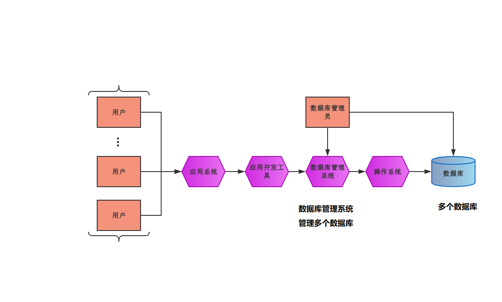

# 关系型数据库

## MySQL 

说明：[官方参考手册](https://dev.mysql.com/doc/refman/8.0/en/)    [MySQL 中文文档](https://www.shiyanlou.com/courses/9)

### 主要内容介绍

1. 主要知识点包括

   - E-R 模型
   - 数据库的 3 范式
   - mysql 的数据字段的类型、字段约束

   - 与 mysql 建立连接
   - 创建数据库、表，分别从图形界面和脚本界面两个方面讲解

2. 主要操作

   - 数据的操作：创建、删除
   - 表的操作：创建、修改、删除
   - 数据的操作：增加、删除、修改、查询，简称 crud（create、read、updata、delete）

### MySQL 卸载与安装

#### 卸载

1. Windows 的卸载（Windows 安装好像会有两种方式，但是卸载大同小异）

   - 第一步：

     1. 停掉 MySQL 服务（管理器 --> 服务）

        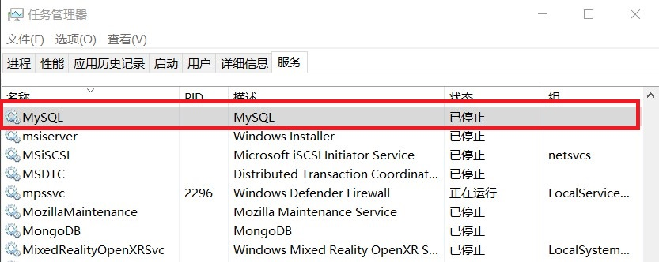

   - 第二步：

     1. 使用 __控制面板__ 删除 MySQL 安装包，或者直接到 MySQL 安装目录中删除软件包（此种做法是 Mysql 的另一种安装方式，因为在控制面板中找不到 MySQL 的安装包）

   - 第三步：

     1. 删除 MySQL 残留的文件，及 MySQL 存储的数据
     2. 如果 MySQL 安装时指定了安装目录和数据的存储位置，直接到相应目录去删除
     3. 如果 MySQL 安装时没有指定位置，或数据存储没有指定位置，__数据存放一般在 `C:\ProgramData` 目录下__，此目录是隐藏目录

   - 第四步：

     1. 删除注册信息

     2. `win+R` 输入 `regedit` 打开注册表，删除以下注册信息

        __说明：`ControlSet001` 有可能是 `002/003` 等等 __

        ```tex
        计算机\HKEY_LOCAL_MACHINE\SYSTEM\CurrentControlSet\Services\EventLog\Application\MySQL
        计算机\HKEY_LOCAL_MACHINE\SYSTEM\CurrentControlSet\Services\MySQL
        计算机\HKEY_LOCAL_MACHINE\SYSTEM\ControlSet001\Services\EventLog\Application\MySQL
        计算机\HKEY_LOCAL_MACHINE\SYSTEM\ControlSet001\Services\MySQL
        ```


#### 安装

1. 安装 MySQL 数据库

   - [参考地址: 菜鸟教程](https://www.runoob.com/mysql/mysql-install.html) ，包含 Windows 和 Linux 的安装
   - [参考地址: 简书参考地址](https://www.jianshu.com/p/fd56e1ce7379) ，自己亲身实践，包含基于Ubuntu 的安装

### 数据库介绍

说明：数据库分为 __服务端__ 和 __客户端__ ，使用 TCP/IP 协议

1. 服务端（server）：存储数据（一个服务端，可以连接多个客户端）
2. 客户端（client）：读写存储数据

### E-R 模型

说明：当前物理的数据库都是按照 E-R 模型进行设计的，E-R 模型是用 E-R 图面描述现实世界的概念模型，主要概念，包括 __实体、属性、实体之间的联系等__ 

1. E-R 解释

   - E 表示 entity，实体
   - R 表示 relationship，关系
   - attribute 表示属性（一个实体具有多个属性）

2. __在关系型数据库中，一个实体抽象为数据库中的一张表，一个属性为表中的一列，一行为实体的一个对象__

   - 学生表

     | 学号   | 姓名 | 性别 | 出生年份 | 专业     | 入学年份 |
     | ------ | ---- | ---- | -------- | -------- | -------- |
     | 123456 | 小明 | 男   | 2000.1.1 | 计算机   | 2019.9.1 |
     | 678901 | 小红 | 女   | 2000.1.4 | 软件科学 | 2020.9.1 |

   - 学生表中，学生的属性（学号、姓名等）为表的列，行为实体的对象

3. 实体之间的联系

   说明：实体之间的联系可以分为 3 种

   - 一对一联系 (1:1)

     例如：学校里一个班级只有一个正班长，而一个班长旨在一个班级中任职，则班级与班长之间具有一对一联系

   - 一对多联系 (1:n)

     例如：一个班级中有若干名学生，而每个学生只在一个班级中学习，则班级与学生之间具有一对多联系

   - 多对一联系 (m:n)

     例如：一门课程同时有若干个学生选修，而一个学生可以同时选修多门课程，则课程与学生之间具有多对多联系

4. 实体的联系（又称：关系表）

   说明：使用外键，唯一标识实体表中的实体对象

### 范式

说明：对设计数据库提出了以希尔规范，这些规范被称之为范式。后一个范式是建立在前一个范式的基础之上。

1. 第一范式（1NF）

   - 列不可拆分，实体的属性（实体对象：对应表中的列）

2. 第二范式（2NF）

   - 唯一标识

     在一个实体表中，有一个属性可以唯一标识一个实体对象（实体对象：对应表的一行数据）

3. 第三范式（3NF）

   - 引用主键

     在关系中，只能引用主键（2NF 的唯一标识）

### 数据完整性

说明：数据完整性（integrity）是指数据的正确性（correctness）和相容性（compat-ability）。

1. 数据的正确性

   - 数据的正确性是指数据是符合现实世界语义，反应当前实际状况

2. 数据相容性

   - 数据相容性是指数据库同一对象在不同关系表中的数据是符合逻辑的

3. 数据完整性例子

   - 例如：学生的学号必须是唯一的、性别只能是男或女、~~本科学生年龄的取值范围为 [14, 50]~~ 、学生所选的可必须是学校开设的课程、学生所在院系必须是学校已成立的院系等

4. 数据类型

   说明：mysql 常见的几种数据类型

   - __整数类型__ （常用类型标粗）

     | 类型              | 大小     | 范围（有符号）          | 范围（无符号） | 用途     |
     | ----------------- | -------- | ----------------------- | -------------- | -------- |
     | __tinyint__       | 1 个字节 | (-128, 127)             | (0, 255)       | 小整数型 |
     | smallint          | 2 个字节 | (-2^15, 2^15-1)         | (0, 2^16-1)    |          |
     | mediumint         | 3 个字节 | (-2^23, 2^23-1)         | (0, 2^23-1)    |          |
     | __int / integer__ | 4 个字节 | (-8 388 608, 8 388 607) | (0, 65 535)    | 大整数型 |
     | bigint            | 8 个字节 | (-2^63, 2^63-1)         | (0, 2^63-1)    |          |
     
     解释：bit 一般用于状态的标记,因为 2 进制，所以一位二进制可以表示两种状态
     
   - 浮点数类型

     | 类型        | 大小                                                         | 范围（有符号） | 范围（无符号） | 用途   |
     | ----------- | ------------------------------------------------------------ | -------------- | -------------- | ------ |
     | **decimal** | 可以单独使用，也可以精度先设置对 decimal(M,D) 为最多 M位，小数占 D 位 <br> 底层使用字符串存储，以提高精度 | 依赖于 M，D    | 依赖于 M，D    | 小数值 |
     | float       | 4 个字节，可以单独使用，也可以精度设置 float(M,D)            |                |                |        |
     | double      | 8 个字节，可以单独使用，也可以精度设置 double(M,D)           |                |                |        |
     | **bit**     | bit(M)，占 M 个位，M 的取值范围 [1, 64] ，默认是 1           |                |                | 位类型 |

   - __字符串类型__

     | 类型       | 大小          | 用途         |
     | ---------- | ------------- | ------------ |
     | char       | 0-255 字节    | 定长字符串   |
     | varchar(M) | 0-65 535 字节 | 变长字符串   |
     | text       | 0-65 535 字节 | 长文本字符串 |

     解释：char(4)，长度位 4 个字符，不足右边补空格，超出截取（效率高，浪费空间）。varchar(4)，最长 4 个字符（实际长度 = 实际字符 + 2 个字节，用来记录个数的），可以不足，但超出截取（效率低，节省空间，Mysql 对其进一步优化，效率也不错，使用率高）。

   - __日期和时间类型__

     | 类型      | 大小     | 范围                                      | 格式                   | 用途                                             |
     | --------- | -------- | ----------------------------------------- | ---------------------- | ------------------------------------------------ |
     | date      | 3 个字节 | 1000-01-01 / 9999-12-31                   | YYYY-MM-DD             | 日期值                                           |
     | time      | 3 个字节 | -838:59:59 / 838:59:59                    | HH:MM:SS               | 时间值                                           |
     | datetime  | 8 个字节 | 1000-01-10 00:00:00 / 9999-12-31 23:59:59 | YYYY-MM-DD HH:MM:SS    | 混合时间和日期值                                 |
     | year      | 1 个字节 | 1901 / 2155                               | YYYY 或者 YY（不推荐） | 年份类型                                         |
     | timestamp | 4 个字节 | 1970-01-01 00:00:00 / 2038-01-19 03:14:07 | YYYY-MM-DD HH:MM:SS    | __时间戳__（实际存储的是毫秒值，取出时进行计算） |
     
   - __int 类型使用注意__

     1. `int(M)` ，M 表示宽度，需要结合 ~~`unsigned`~~ 和 `zerofill` 使用。设置了 `zerofill` 填充后，就意味着无符号
     2. `unsigned` ，表示无符号数（没有负数）
     3. `zerofill` ，表示使用 0 填充
     4. 例如 `int(3) zerofill`  ，整数位数不足 3 位的，左边使用 0 补齐，位数超出 3 位的，正常显示（默认情况 M 为 int 的存储能力大小，以空格填充） 。`1` 使用 `001` 表示 。
     5. __`unsigned` 和 `zerofill` 只有整数类型数据拥有__

   - __日期输入注意__

     1. `year` 类型，可以输入 4 位数 ，如 `2020` ，也可以输入 2 位数，如 `20` 。如 `19-20` 则表示 `2019-2020` 。
     2. `YYYY-MM-DD HH:MM:SS` `YY-MM-DD HH:MM:SS` 或 `YYYY-MM-DD` `YY-MM-DD` ，允许不严格输入：__任何标点符都可以作为日期部分和时间部分的分隔符__ 。例如 `10-12-01 01:01:00` 、`10.12.01 01+20+09` 、`20@01@01 01^01^01` 等等
     3. `YYYYMMDD` 和 `YYMMDD` 没有间隔符的字符串：如果该字符串对于时间有意义，如 `20200820` 和 `200505` 可以被解释为 `2020-08-20` 和 `20-0505` ；如果该字符串对于时间没有意义，如 `20201490` (月份不合法) ，将解释为 `0000-00-00`
     4. 对于包含日期部分并带有分隔符的字符串，如果日期小于 10 时，不需要指定 2 位数，如 `2020-5-5` 与 `2020-05-05` 相同。对于包含时间部分并带有分隔符的字符串，如果时间小于 10 时，也不需要使用 2 位，如 `2020-05-05 05:05:05` 与 `2020-5-5 5-5-5` 相同。
     5. 一般时间选用 `timestamp` ，有一个重要特征，如果输入 `null` 自定设置为系统当前时间

5. __约束__

   - 主键：（primary key）

     在表中唯一表示一个对象的属性，称为主键（对象为一行数据，属性为一列），不重复、默认不为空

   - 非空：（not null）

     输入数据时，不允许为空

   - 唯一：（unique）

     在表中，每一个对象的属性（添加 unique 约束）唯一

   - 默认：（default）

     录入数据时，该属性有默认值（年龄默认 20）不录入该属性，则该属性值为 20，如录入已录入为准

   - 外键：（foreign key）

     实体表的属性在关系表中存在，且可以标识实体表的每一个实体对象
     
   - 自增约束：（auto_increment）
   
     属性值，随录入数据增加（无法修改）
   
   - 检查约束：（check）
   
     录入数据时，检查属性值，是否在其规定范围之内

### Navicat 操作

说明：[参考文档](https://www.navicat.com.cn/support/online-manual)    启动数据库 `mysql -h hostname -P port -u username -ppassword` ，`-p` 与密码中间没有空格。一般直接使用 `mysql -u root -p` ，因为是连接自己的主机，使用默认的端口号，密码为空，所以简单。可以输入 `mysql --help` ，查看帮助

1. 用户连接

   - 如图

     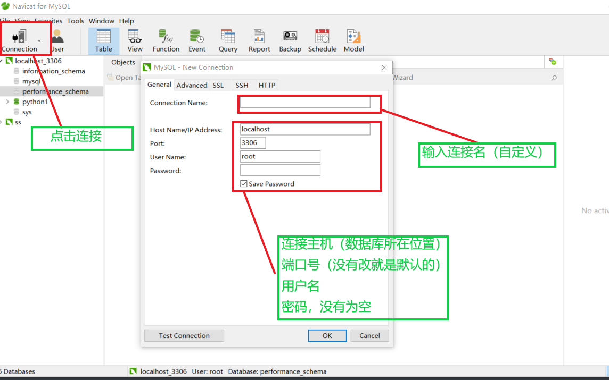

2. 创建数据库

   - 如图

     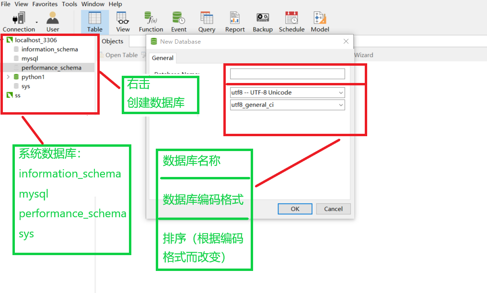

3. 创建表

   - 如图

     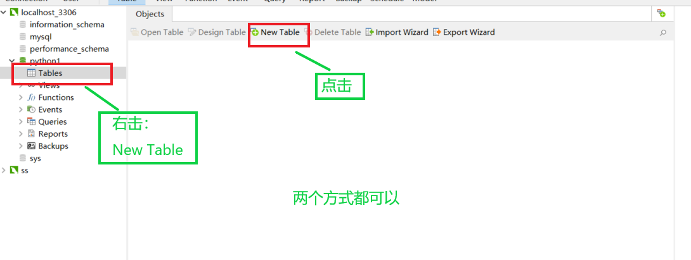

### 逻辑删除

说明：使用一个字段标记是否删除

1. 数据的重要性，要根据实际开发决定
2. 对于重要的数据，并不希望物理删除，一旦删除，数据无法找回。
3. 对于重要的数据，会设置一个 isDelete 的属性（列），类型为 bit ，表示逻辑删除。
4. 大量增长的非重要数据，可以进行物理删除。

## 命令脚本操

### SQL 语法规则

1. 单引号、双引号使用

   - 字符串、日期时间类型使用 `''` 单引号，变量别名使用 `""` 双引号

2. 注释

   - 单行注释

      ```sql
     # 注释
     -- 注释
     ```

   - 多行注释

     ```sql
     /*
      * 多行注释
     */
     ```

3. 命令规则

   - 必须使用 `A-Z, a-z, 0-9` ，共 63 个字符
   
4. 别名

   - 列的别名可以是用双引号 `""` ，没有空格可以省略
   - 表的别名不要使用双引号 `""` ，
   - 别名，`as` 也可以省略

###  用户权限及忘记密码问题

__说明：[官方参考地址](https://dev.mysql.com/doc/refman/5.7/en/access-control.html)__

1. 用户权限

   - 身份认证 __（用户名+IP认证）__

     1. `root@localhost` ：只允许本机使用 root 用户登录，`127.0.0.1` 和 `localhost` 等价 `root@127.0.0.1` 
     2. `root@%` ：任何主机都可以使用 root 用户登录
     3. `root@192.168.43.118` ：只允许在 `192.168.43.118` 主机使用 root 登录。__注意：即使本地主机的 IP 是 `192.168.43.118` 没有此用户也不可登录，只能使用 `root@localhost` 用户登录__。
     4. `sshen@%` ：任何主机都可以使用 sshen 用户登录

   - 设置用户 [官方参考地址](https://dev.mysql.com/doc/refman/5.7/en/creating-accounts.html)

     1. 创建用户
        - `create user 'finley'@'localhost' identified by '';` 只可本地主机登录，无需密码
        - `create user 'finley'@'%' identified by '123456';` 任何主机都可以登录
        - `create user 'finley'@'192.169.10.110' identified by '123456';` 只可主机 `192.168.10.110` 可登录
     2. 删除用户
        - `drop user 'user'@"host";`
     3. 修改密码
        - 修改当前用户密码  `set passeord = password('passwd');`
        - 修改密码 `set password for 'user'@'host' = password('passwd');`

   - 用户的 4 个权限级别

     1. 全局
     2. 特定数据库
     3. 特定表
     4. 特定字段
     5. 依次校验权限，前面权限通过，后面权限不需再校验

   - 设置用户级别 [官方参考地址](https://dev.mysql.com/doc/refman/5.7/en/privileges-provided.html)

     1.   查看用户默认级别 `show grants for user@host;`

        - 查看 root 用户级别

          ```sql
          mysql> show grants for root@localhost; -- 查看 root 用户默认级别
          +---------------------------------------------------------------------+
          | Grants for root@localhost                                           |
          +---------------------------------------------------------------------+
          | GRANT ALL PRIVILEGES ON *.* TO 'root'@'localhost' WITH GRANT OPTION |
          | GRANT PROXY ON ''@'' TO 'root'@'localhost' WITH GRANT OPTION        |
          +---------------------------------------------------------------------+
          2 rows in set (0.00 sec)
          ```

        - 其中 `with grant option` 表示其拥有的权限可以授予其他用户

     2. 授权用户级别 `grant privileges on databasename.tablename to 'user'@'host' [with grant option];`

        - 参数说明
          1. privileges：表示操作动作 `select/ insert/ update/ delete` ，全部允许为 `all/all privileges` 
          2. databasename.tablename：表示数据库名.表名，所有数据库表为 `*.*`
          3. user@host：表示，被授予的用户
          4. [with grant option] ：表示被授予权限，是否可以在授予其他用户
        - root 用户的权限，是对所有数据库，所有表拥有所有权限，并且可以授予其他用户
          1. `GRANT ALL PRIVILEGES ON *.* TO 'root'@'localhost' WITH GRANT OPTION`
        - root  用户授予 sshen 用户权限（mysql 数据库的 user 表的查询权限），并且可以再次授予
          1. `grant select on mysql.user 'sshen'@'localhost' with grant option;`

     3. 撤销用户权限 `revoke privilege on databasename.tablename from 'user'@'host';`

        - 参数（同上）

2. ~~忘记密码（修改 root 用户密码）~~

   __说明：不好用__

   - 关闭 mysql 服务
   - 使用 `mysqld --skip-grant-tables;` 开启 mysqld 服务，只是跳过了认证。
   - 登录 mysql `mysql -u root` ，无密码登录
   - 修改权限表
     1. `use mysql;` 进入名 mysql 数据库
     2. 更新 user 表的 Password 字段 `update user set Password = password('12') where User = 'root';`
     3. 刷新系统权限表 `flush privileges;`
   - 关闭 mysqld 服务
   - 再次开启 mysql 服务
   - 使用新密码登录

### 运算符

1. 算数运算符

   - 加 `+` 、减 `-` 、乘 `*`  、除`/` 、取模 `%` (`mod` 也是取模)

   - 除法取整 `div`

     ```sql
     3 div 2 = 1
     3 / 2 = 1.5
     ```

2. 比较运算符

   - 等于 `=` 、大于 `>` 、大于等于 `>=` 、小于 `<` 、小于等于 `<=` 、不等于 `!=` （不等于 `<>` ）
   - 安全等于 `<=>` ，用于与 `null` 比较

3. 逻辑运算符

   - 逻辑与 `&&` ，也可以是 `and`
   - 逻辑或 `||` ，也可以是 `or`
   - 逻辑非 `!` ，也可以是 `not`
   - 逻辑异或 `^` ，也可以是 `xor`

4. 范围符

   - 在什么范围内 `between...and...`  （`>=...and...<=`）
   - 不在什么范围内 `not between...and...` （`<...||...>`）

5. 集合

   - 在集合中 `in`
   - 不在集合中 `not in`

6. 模糊查询

   - `like` 或 `not like` 
   - 通配符： `%` 表示任意多个任意字符；`_` 表示任意一个字符

7. __null__ 值判断

   - 使用 `is null` 或者 `is not null`
   - 或 `value<=> null` 或者 `not vaule<=>null`

### 数据库、表的创建删除等操作（DDL）

说明：使用命令窗口对 mysql 进行操作   [mysql 语法文档](https://dev.mysql.com/doc/refman/8.0/en/)

1. 显示当前 mysql 中的所有数据库

   - `show databases;`

     ```sql
     mysql> show databases;
     +--------------------+
     | Database           |
     +--------------------+
     | information_schema |
     | mysql              |
     | performance_schema |
     | python1            |
     | sys                |
     +--------------------+
     5 rows in set (0.00 sec)
     ```

2. 显示 mysql 版本、当前时间

   - 显示版本号 `select version();`

   - 显示当前时间 `select now();`

     ```sql
     mysql> select version();
     +-----------+
     | version() |
     +-----------+
     | 5.7.21    |
     +-----------+
     1 row in set (0.00 sec)
     
     mysql> select now();
     +---------------------+
     | now()               |
     +---------------------+
     | 2019-10-26 09:12:16 |
     +---------------------+
     1 row in set (0.00 sec)
     ```

3. 查看支持的编码格式

   - `show character set;`

   - 显示删除了一部分数据（一共 41 行）。`Default collation` 为校对规则，以 `ci` 结尾的数据库中存放的数据不区分大小写，以 `cs/bin` 结尾的数据区分大小写。__大小写：数据库中存放的数据，不是指命令行（命令行不区分大小写）__

     ```sql
     mysql> show character set;
     +----------+---------------------------------+---------------------+--------+
     | Charset  | Description                     | Default collation   | Maxlen |
     +----------+---------------------------------+---------------------+--------+
     | ascii    | US ASCII                        | ascii_general_ci    |      1 |
     | ujis     | EUC-JP Japanese                 | ujis_japanese_ci    |      3 |
     | latin5   | ISO 8859-9 Turkish              | latin5_turkish_ci   |      1 |
     | armscii8 | ARMSCII-8 Armenian              | armscii8_general_ci |      1 |
     | utf8     | UTF-8 Unicode                   | utf8_general_ci     |      3 |
     | ucs2     | UCS-2 Unicode                   | ucs2_general_ci     |      2 |
     | utf32    | UTF-32 Unicode                  | utf32_general_ci    |      4 |
     | binary   | Binary pseudo charset           | binary              |      1 |
     +----------+---------------------------------+---------------------+--------+
     41 rows in set (0.01 sec)
     ```

4. 删除数据库

   - `drop database python1`

     ```sql
     mysql> drop database python1;
     Query OK, 0 rows affected (2.46 sec)
     
     mysql> show databases;
     +--------------------+
     | Database           |
     +--------------------+
     | information_schema |
     | mysql              |
     | performance_schema |
     | sys                |
     +--------------------+
     4 rows in set (0.00 sec)
     ```

5. 创建数据库

   - `create database python3 charset=utf8;` 需要指定编码格式

     ```sql
     mysql> create database python3;
     Query OK, 1 row affected (0.01 sec)
     
     mysql> show databases;
     +--------------------+
     | Database           |
     +--------------------+
     | information_schema |
     | mysql              |
     | performance_schema |
     | python3            |
     | sys                |
     +--------------------+
     5 rows in set (0.00 sec)
     ```

6. 切换使用数据库

   - `use python3`

   - `select database();` 查看当前使用的数据库

     ```sql
     mysql> use python3;
     Database changed
     mysql> select database();
     +------------+
     | database() |
     +------------+
     | python3    |
     +------------+
     1 row in set (0.00 sec)
     ```

7. 查看数据库的表

   - `show tables from 数据库` ，可以数据库中，查看其它数据库中的表。

   - `show tables;` 当前数据库没有表，在该数据库时，默认查询本库的表。

     ```sql
     mysql> show tables;
     Empty set (0.01 sec)
     ```

8. 创建表

   - `create table 数据库.表名();` ，指定哪个数据库。

   - `create table 表名(列类型 [是否自动增长] 约束 默认值\是否为空);` 多列使  ',' 分割

     ```sql
     mysql> create table students(
         -> id int auto_increment primary key not null,
         -> name varchar(10) not null,
         -> gender bit(1) default b'1',
         -> birthday date);
     Query OK, 0 rows affected (0.43 sec)
     ```

     解释：使用 bit 表明占用几个 bit 为，值为 b'1' 标记为二进制数值
     
   - 修改字段位置

     1. 修改字段位置

        `alter table 表名 modify 字段名 数据类型 first/after 字段` 

     2. 添加字段，默认添加到最后，也可以指定添加位置 

        `alter table students add column age int not null first/after 字段` 指定第一行或者指定字段的后面。

   - 主键约束设置

     说明：主键不为 `null`

     1. 添加主键约束

        `alter table 表名 add primary key(字段);`

     2. __复合主键约束（多个字段共同组成主键）__

        `primary key(字段1, 字段2)` 创建表示时，或 `alter table 表名 add primary key(字段1, 字段2);`

     3. 取消主键约束

        `alter table 表名 drop primary key;` ，`delete` 删除数据相关；`drop` 删除表结构相关

   - 唯一约束

     1. 注意事项

        - 唯一约束，可以为 `null`
        - 唯一键约束名称可以自定义，默认：如果是单列，是列名；如果是多列组合唯一，默认是第一列列名
        - 创建唯一键约束，也会自定创建索引
        - 删除唯一约束，是通过删除索引来实现的

     2. 设置唯一约束

        `字段 unique key` 或者 `unique key(字段1, 字段2)` 复合唯一约束

     3. 添加唯一约束

        `alter table 表名 add unique key(字段1, 字段2);`

     4. 取消唯一约束（是通过删除索引，删除唯一约束）

        `alter table 表名 drop index 索引名;` ，查看表的索引 `show index from 表名;`

   - 非空约束

     1. 针对某一个字段不能为 `null`

     2. 添加非空约束

         `字段 not null` 创建表时，或者 `alter table 表名 modify 字段 数据类型 not null;`

     3. 取消非空约束

         `alter table 表名 modify 字段 数据类型;`

   - 默认值约束

     1. 针对某一个字段，如果没有录入数据（或使用 `default` 时），使用有默认值

     2. 添加默认值

        `字段 default 默认值` 创建表时，`alter table 表名 modify 字段 数据类型 default 默认值 [not null]`

     3. 取消默认值约束

        `alter table 表名 modify 字段 数据类型 [not null]`

   - 检查约束（check） 

     __说明：mysql 中不起作用__
     
   - 自增约束

     1. 一个表只能有一个自增约束，因为一个表只有一个维护自增值的变量

     2. 自增约束的字段，只能是整数类型（+1）

     3. __自增约束的字段必须是主键、唯一键和外键，实际主键自增约束最为常见__

     4. __录入数据时__

        - 没有指定整数 、`0` 和 `null` 表示自增
        - 录入正整数时，按整数存储；录入负整数，按负整数存储（负数在前）
        - 当指定整数时，可以进行插入（`1, 2, 4`） 这时可以指定 3 ，插到 2 后面。

     5. 取消自增约束

        `alter table 表名 modify 字段 数据类型 [not null];`

   - 外键约束

     1. 一个表可以有多个外键约束，外键必须是唯一键或者是主键（主键偏多）

     2. 外键在 __从表__ 中建立

        - 学生表、课程表（主表）
        - 选课表（从表），引用了学生表和课程表的字段

     3. 使用外键时，主表、从表的数据操作受到约束

     4. 约束等级（5 种），默认 Restrict 方式

        - Cascade 方式：

          在主表 `update/delete` 记录时，从表同步 `update/delete` 匹配的记录

        - Set null 方式：

          在主表 `update/delete` 记录时，将表匹配的记录设为 `null` ，注意从表外键不能设置非空约束

        - No action 方式：

          从表有匹配的记录，则不允许主表 `update/delete` 记录

        - Restrict 方式：

          与 No action 一样，Mysql 默认等级

        - Set default 方式（Innodb 引擎不识别 ）：

          Mysql 不支持

     5. 添加外键

        - `foreign key(从表字段) references 主表名(外键引用字段) [on update 等级] [on delete 等级];` 建表时
        - `alter table 从表名 add foreign key(从表字段) references 主表名(外键引用字段) [on update 等级] [on delete 等级];`
        - Mysql  默认等级为 Restrict 。更新、删除等级可以分别设置。 
        - 指定外键约束名 `constraint 外键约束名 foreign key(从表字段) references 主表名(外键引用字段) [on update 等级] [on delete 等级];` __只要添加都可以设置，主键约束也可以__

     6. 取消外键

        - `alter table 从表名 drop foreign key 约束名`
        - 获取约束名 `select * from information_schema.table_constraints where table_name = 表名`

9. 查看表的结构

   - `desc 表名`

     ```sql
     mysql> show tables;
     +-------------------+
     | Tables_in_python3 |
     +-------------------+
     | students          |
     +-------------------+
     1 row in set (0.00 sec)
     
     mysql> desc students;
     +----------+-------------+------+-----+---------+----------------+
     | Field    | Type        | Null | Key | Default | Extra          |
     +----------+-------------+------+-----+---------+----------------+
     | id       | int(11)     | NO   | PRI | NULL    | auto_increment |
     | name     | varchar(10) | NO   |     | NULL    |                |
     | gender   | bit(1)      | YES  |     | b'1'    |                |
     | birthday | date        | YES  |     | NULL    |                |
     +----------+-------------+------+-----+---------+----------------+
     4 rows in set (0.00 sec)
     ```

10. 删除表

   - `drop table 表名`

     ```sql
     mysql> show tables;
     +-------------------+
     | Tables_in_python3 |
     +-------------------+
     | students          |
     | test              |
     +-------------------+
     2 rows in set (0.00 sec)
     
     mysql> drop table test;
     Query OK, 0 rows affected (0.13 sec)
     
     mysql> show tables;
     +-------------------+
     | Tables_in_python3 |
     +-------------------+
     | students          |
     +-------------------+
     1 row in set (0.00 sec)
     ```

11. 更改表名

    - `alter table old_name rename new_name;`

    - `rename table old_name to new_name`

      ```sql
      mysql> show tables;
      +-------------------+
      | Tables_in_python3 |
      +-------------------+
      | students          |
      | test              |
      +-------------------+
      2 rows in set (0.00 sec)
      
      mysql> rename table test to new_test;
      Query OK, 0 rows affected (0.97 sec)
      
      mysql> show tables;
      +-------------------+
      | Tables_in_python3 |
      +-------------------+
      | new_test          |
      | students          |
      +-------------------+
      2 rows in set (0.00 sec)
      ```

11. 修改表中的属性、属性定义

    说明：对于表的修改，会有很多麻烦，最好在构建表的时候多一些考虑。表中一旦存在数据，修改表的结构会引来一堆错误，也有可能数据丢失，所以对于表的修改慎重操作   [参考文档](https://dev.mysql.com/doc/refman/5.5/en/alter-table.html#alter-table-add-drop-column) <br> __删除这块应该看一下官方文档__

    - `alter table 表名 add | change | modify | drop column 列名 类型 [默认值] 约束`

    - 在 students 增加 age 列 <br>`alter table students add column age int not null;` 默认添加到最后，也可以指定添加位置 `alter table students add column age int not null first/after 字段` 指定第一行或者指定字段的后面。

      ```sql
      mysql> alter table students add column age int not null;
      Query OK, 0 rows affected (2.71 sec)
      Records: 0  Duplicates: 0  Warnings: 0
      
      mysql> desc students;
      +----------+-------------+------+-----+---------+----------------+
      | Field    | Type        | Null | Key | Default | Extra          |
      +----------+-------------+------+-----+---------+----------------+
      | id       | int(11)     | NO   | PRI | NULL    | auto_increment |
      | name     | varchar(10) | NO   |     | NULL    |                |
      | gender   | bit(1)      | YES  |     | b'1'    |                |
      | birthday | date        | YES  |     | NULL    |                |
      | age      | int(11)     | NO   |     | NULL    |                |
      +----------+-------------+------+-----+---------+----------------+
      5 rows in set (0.00 sec)
      ```

    - 在 students 修改 age 列名字段的数据类型 <br> `alter table students modify age varchar(10)`

      ```sql
      mysql> alter table students modify age varchar(10);
      Query OK, 0 rows affected (2.67 sec)
      Records: 0  Duplicates: 0  Warnings: 0
      
      mysql> desc students;
      +----------+-------------+------+-----+---------+----------------+
      | Field    | Type        | Null | Key | Default | Extra          |
      +----------+-------------+------+-----+---------+----------------+
      | id       | int(11)     | NO   | PRI | NULL    | auto_increment |
      | name     | varchar(10) | NO   |     | NULL    |                |
      | gender   | bit(1)      | YES  |     | b'1'    |                |
      | birthday | date        | YES  |     | NULL    |                |
      | age      | varchar(10) | YES  |     | NULL    |                |
      +----------+-------------+------+-----+---------+----------------+
      5 rows in set (0.00 sec)
      ```

      解释：` alter table students change age age int;` 使用 change 修改字段定义

    - 在 students 修改列名。__注意：修改列名，需要重新写明列定义__ <br> `alter table students change age grade int not null;`

      ```sql
      mysql> alter table students change age grade int not null;
      Query OK, 0 rows affected (2.53 sec)
      Records: 0  Duplicates: 0  Warnings: 0
      
      mysql> desc students;
      +----------+-------------+------+-----+---------+----------------+
      | Field    | Type        | Null | Key | Default | Extra          |
      +----------+-------------+------+-----+---------+----------------+
      | id       | int(11)     | NO   | PRI | NULL    | auto_increment |
      | name     | varchar(10) | NO   |     | NULL    |                |
      | gender   | bit(1)      | YES  |     | b'1'    |                |
      | birthday | date        | YES  |     | NULL    |                |
      | grade    | int(11)     | NO   |     | NULL    |                |
      +----------+-------------+------+-----+---------+----------------+
      5 rows in set (0.00 sec)
      ```

    - 在 students 删除 grade 列 <br> ` alter table students drop column grade` 

      ```sql
      mysql> alter table students drop column grade;
      Query OK, 0 rows affected (2.55 sec)
      Records: 0  Duplicates: 0  Warnings: 0
      
      mysql> desc students;
      +----------+-------------+------+-----+---------+----------------+
      | Field    | Type        | Null | Key | Default | Extra          |
      +----------+-------------+------+-----+---------+----------------+
      | id       | int(11)     | NO   | PRI | NULL    | auto_increment |
      | name     | varchar(10) | NO   |     | NULL    |                |
      | gender   | bit(1)      | YES  |     | b'1'    |                |
      | birthday | date        | YES  |     | NULL    |                |
      +----------+-------------+------+-----+---------+----------------+
      4 rows in set (0.00 sec)
      ```

12. 查看表的创建语句

    - `show create table students`

      ```sql
      mysql> show create table students;
      +----------+------------------------------------------------------------------------------------------------------------------------------------------------------------------------------------------------------------------------------+
      | Table    | Create Table                                                                                                                                                                                                                 |
      +----------+------------------------------------------------------------------------------------------------------------------------------------------------------------------------------------------------------------------------------+
      | students | CREATE TABLE `students` (
        `id` int(11) NOT NULL AUTO_INCREMENT,
        `name` varchar(10) NOT NULL,
        `gender` bit(1) DEFAULT b'1',
        `birthday` date DEFAULT NULL,
        PRIMARY KEY (`id`)
      ) ENGINE=InnoDB DEFAULT CHARSET=latin1 |
      +----------+------------------------------------------------------------------------------------------------------------------------------------------------------------------------------------------------------------------------------+
      1 row in set (0.00 sec)
      ```

      解释：`ENGINE=InnoDB DEFAULT CHARSET=latin1` 引擎使用 InnoDB（引擎不同，导致底层数据结构不同），数据库的编码格式使用 latin1

### 数据操作

说明：数据操作是基于数据库下的表的操作， 以上面建立的 students表为例

1. 查询

   - `select * from 表名` 

     说明：查询表的所有数据 ，* 表示所有

2. 单条插入数据

   说明：__二进制数据，在界面显示效果不一样，在win10 的 comd 中 b'0' 就像没有，b'1'  为一个框__

   - `insert into 表名 value(值1, 值2...)` <br>`insert into 表名(列1, 列2...) value(值1, 值2...)`

     说明：__插入数据顺序按照表的属性顺序填写，自动增长的属性也添加数据，一般使用 0 填充，插入成功后已自动增长数据为准__

     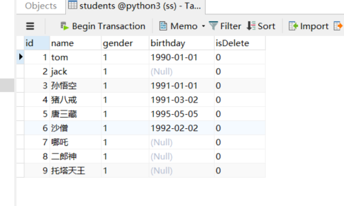

   -  全列插入 `insert into students value(0, 'tom', 1, '1990-1-1', 0);`

     ```sql
     mysql> insert into students value(0, 'tom', 1, '1990-1-1', 0);
     Query OK, 1 row affected (2.27 sec)
     
     mysql> select * from students;
     +----+------+--------+------------+----------+
     | id | name | gender | birthday   | isDelete |
     +----+------+--------+------------+----------+
     |  1 | tom  |       | 1990-01-01 |          |
     +----+------+--------+------------+----------+
     1 row in set (0.00 sec)
     ```

   - 部分列插入 `insert into students(name) value('jack');`

     说明：__没有指定的列属性 1.允许为空，2.自增列，3.有默认值__

     ```sql
     mysql> insert into students(name) value('jack');
     Query OK, 1 row affected (2.25 sec)
     
     mysql> select * from students;
     +----+------+--------+------------+----------+
     | id | name | gender | birthday   | isDelete |
     +----+------+--------+------------+----------+
     |  1 | tom  |       | 1990-01-01 |          |
     |  2 | jack |       | NULL       |          |
     +----+------+--------+------------+----------+
     2 rows in set (0.01 sec)
     ```

3. 一次性插入多条数据（Mysql 特有的性质）

   - `insert into 表名 value(值1, 值2...) ,(值1, 值2...)...` <br>`insert into 表名(列1, 列2...) value(值1, 值2...), (值1, 值2...)...`

   - 全列插入 `insert into students value(0, '孙悟空', 1, '1991-1-1', 0), (0, '猪八戒', 1, '1991-3-2', 0), (0, '唐三藏', 1, '1995-5-5', 0), (0, '沙僧', 1, '1992-2-2', 0);`

     ```sql
     mysql> insert into students value(0, '孙悟空', 1, '1991-1-1', 0), (0, '猪八戒', 1, '1991-3-2', 0), (0, '唐三藏', 1, '1995-5-5', 0), (0, '沙僧', 1, '1992-2-2', 0);
     Query OK, 4 rows affected (0.05 sec)
     Records: 4  Duplicates: 0  Warnings: 0
     
     mysql> select * from students;
     +----+--------+--------+------------+----------+
     | id | name   | gender | birthday   | isDelete |
     +----+--------+--------+------------+----------+
     |  1 | tom    |       | 1990-01-01 |          |
     |  2 | jack   |       | NULL       |          |
     |  3 | 孙悟空 |       | 1991-01-01 |          |
     |  4 | 猪八戒 |       | 1991-03-02 |          |
     |  5 | 唐三藏 |       | 1995-05-05 |          |
     |  6 | 沙僧   |       | 1992-02-02 |          |
     +----+--------+--------+------------+----------+
     6 rows in set (0.29 sec)
     ```

   - 部分列插入 `insert into students(name) value('哪吒'), ('二郎神'), ('托塔天王');`

     ```sql
     mysql> insert into students(name) value('哪吒'), ('二郎神'), ('托塔天王');
     Query OK, 3 rows affected (2.24 sec)
     Records: 3  Duplicates: 0  Warnings: 0
     
     mysql> select * from students;
     +----+----------+--------+------------+----------+
     | id | name     | gender | birthday   | isDelete |
     +----+----------+--------+------------+----------+
     |  1 | tom      |       | 1990-01-01 |          |
     |  2 | jack     |       | NULL       |          |
     |  3 | 孙悟空   |       | 1991-01-01 |          |
     |  4 | 猪八戒   |       | 1991-03-02 |          |
     |  5 | 唐三藏   |       | 1995-05-05 |          |
     |  6 | 沙僧     |       | 1992-02-02 |          |
     |  7 | 哪吒     |       | NULL       |          |
     |  8 | 二郎神   |       | NULL       |          |
     |  9 | 托塔天王 |       | NULL       |          |
     +----+----------+--------+------------+----------+
     9 rows in set (0.00 sec)
     ```

4. 修改数据操作

   说明：对现有数据进行修改

   - `update 数据库.表名 set 列1=值1, 列2=值2... where 条件`

     说明：__可以一次修改一行，也可以一次修改多行，关键看 where 条件满足什么，如果没有写 where 表中数据就全部被修改__

   - 修改一行数据 `update students set gender=b'0' where name='哪吒';`

     ```sql
     mysql> update students set gender=b'0' where name='哪吒';
     Query OK, 1 row affected (0.39 sec)
     Rows matched: 1  Changed: 1  Warnings: 0
     
     mysql> select * from students;
     +----+----------+--------+------------+----------+
     | id | name     | gender | birthday   | isDelete |
     +----+----------+--------+------------+----------+
     |  1 | tom      |       | 1990-01-01 |          |
     |  2 | jack     |       | NULL       |          |
     |  3 | 孙悟空   |       | 1991-01-01 |          |
     |  4 | 猪八戒   |       | 1991-03-02 |          |
     |  5 | 唐三藏   |       | 1995-05-05 |          |
     |  6 | 沙僧     |       | 1992-02-02 |          |
     |  7 | 哪吒     |        | NULL       |          |
     |  8 | 二郎神   |       | NULL       |          |
     |  9 | 托塔天王 |       | NULL       |          |
     +----+----------+--------+------------+----------+
     9 rows in set (0.00 sec)
     ```

   - 不写 where 条件 `update students set isDelete=1;`

     ```sql
     mysql> update students set isDelete=1;
     Query OK, 9 rows affected (2.23 sec)
     Rows matched: 9  Changed: 9  Warnings: 0
     
     mysql> select * from students;
     +----+----------+--------+------------+----------+
     | id | name     | gender | birthday   | isDelete |
     +----+----------+--------+------------+----------+
     |  1 | tom      |       | 1990-01-01 |         |
     |  2 | jack     |       | NULL       |         |
     |  3 | 孙悟空   |       | 1991-01-01 |         |
     |  4 | 猪八戒   |       | 1991-03-02 |         |
     |  5 | 唐三藏   |       | 1995-05-05 |         |
     |  6 | 沙僧     |       | 1992-02-02 |         |
     |  7 | 哪吒     |        | NULL       |         |
     |  8 | 二郎神   |       | NULL       |         |
     |  9 | 托塔天王 |       | NULL       |         |
     +----+----------+--------+------------+----------+
     9 rows in set (0.00 sec)
     ```

5. 删除（物理是删除、逻辑删除）

   - 物理删除 `delete from 表名 where 条件`

   - 物理删除 `delete from students where id=8;`

     ```sql
     mysql> delete from students where id=8;
     Query OK, 1 row affected (2.32 sec)
     
     mysql> select * from students;
     +----+----------+--------+------------+----------+
     | id | name     | gender | birthday   | isDelete |
     +----+----------+--------+------------+----------+
     |  1 | tom      |       | 1990-01-01 |          |
     |  2 | jack     |       | NULL       |          |
     |  3 | 孙悟空   |       | 1991-01-01 |          |
     |  4 | 猪八戒   |       | 1991-03-02 |          |
     |  5 | 唐三藏   |       | 1995-05-05 |          |
     |  6 | 沙僧     |       | 1992-02-02 |          |
     |  7 | 哪吒     |        | NULL       |          |
     |  9 | 托塔天王 |       | NULL       |          |
     +----+----------+--------+------------+----------+
     8 rows in set (0.00 sec)
     ```

     解释：id=8 的数据没有，也恢复不了

   - 逻辑删除 ` update students set isDelete=1 where id=6; `

     说明：逻辑删除使用列属性标记，实际上就是修改数据

     ```sql
     mysql> update students set isDelete=1 where id=6;
     Query OK, 1 row affected (2.23 sec)
     Rows matched: 1  Changed: 1  Warnings: 0
     
     mysql> select * from students;
     +----+----------+--------+------------+----------+
     | id | name     | gender | birthday   | isDelete |
     +----+----------+--------+------------+----------+
     |  1 | tom      |       | 1990-01-01 |          |
     |  2 | jack     |       | NULL       |          |
     |  3 | 孙悟空   |       | 1991-01-01 |          |
     |  4 | 猪八戒   |       | 1991-03-02 |          |
     |  5 | 唐三藏   |       | 1995-05-05 |          |
     |  6 | 沙僧     |       | 1992-02-02 |         |
     |  7 | 哪吒     |        | NULL       |          |
     |  9 | 托塔天王 |       | NULL       |          |
     +----+----------+--------+------------+----------+
     8 rows in set (0.00 sec)
     ```

     解释：使用属性 isDelete 标记数据是否被删除

### 备份与恢复

说明：项目迁移，就是将数据移到另一个服务器

1. 备份

   说明：Linux 启用 __超级管理员__ --> __进入 mysql 数据库目录（数据存放目录，配置文件中  `datadir= /var/lib/mysql`）__ 。 windows 不需要进入数据库存放目录（前提将 mysql 加入环境变量中）。不需要进入 Mysql 用户交互界面执行 `mysqldump` 命令，因为其命令是脚本不是 mysql 的语法命令。

   - 运行 `mysqldump -h 主机 -P 端口号 -u root -p 数据库名 > path\xx.sql`

     ```sql
     # 开始备份
     D:\>mysqldump -u root -p python3 > C:\Users\SS沈\Desktop\bak.sql
     Enter password:
     # 备份完成
     D:\>
     ```

     解释：我这是客户端与服务器在一台主机上（win10），端口号默认，所以没有写

2. 数据恢复

   说明：__数据备份只对表的备份，不对数据库备份， 所以恢复时，需要创建数据库，再对数据进行恢复__

   - 连接 mysql，创建数据库

   - 退出 mysql 交互界面

   - 运行 `mysql -h 主机 -P 端口号 -u root -p 数据库名 < path\xx.sql`

     ```sql
     # 开始恢复数据
     D:\>mysql -u root -p py3 < C:\Users\SS沈\Desktop\bak.sql
     Enter password:
     # 恢复完成
     
     # 进入 mysql 交互界面
     D:\>mysql -u root -p
     
     # 进入之前创建好的数据库 py3
     mysql> use py3
     Database changed
     mysql> show tables;
     +---------------+
     | Tables_in_py3 |
     +---------------+
     | students      |
     +---------------+
     1 row in set (0.00 sec)
     
     # 查看表的的数据
     mysql> select * from students;
     +----+----------+--------+------------+----------+
     | id | name     | gender | birthday   | isDelete |
     +----+----------+--------+------------+----------+
     |  1 | tom      |       | 1990-01-01 |          |
     |  2 | jack     |       | NULL       |          |
     |  3 | 孙悟空   |       | 1991-01-01 |          |
     |  4 | 猪八戒   |       | 1991-03-02 |          |
     |  5 | 唐三藏   |       | 1995-05-05 |          |
     |  6 | 沙僧     |       | 1992-02-02 |         |
     |  7 | 哪吒     |        | NULL       |          |
     |  9 | 托塔天王 |       | NULL       |          |
     +----+----------+--------+------------+----------+
     8 rows in set (0.00 sec)
     ```

## 函数

### 单行函数

1. 介绍

   - 只对一行进行变换，每行返回一个结果
   - 可以嵌套
   - 参数可以是一个字段、一个表达式或一个值
   - 包含几种数据类型函数
     1. 字符串函数
     2. 数学函数
     3. 日期时间函数
     4. 加密函数

2. 字符串函数

   - 如表

     | 函数                           | 用法                                                         |
     | ------------------------------ | ------------------------------------------------------------ |
     | concat(S1, S2, ... Sn)         | 连接 S1, S2, ... Sn 为一个字符串                             |
     | concat_ws(s, S1, S2, ... Sn)   | 同函数 concat 一样，注释字符串之间有个 s                     |
     | char_length(s)                 | 返回字符串 s 的字符数                                        |
     | length(s)                      | 返回字符串的字节数（utf-8 一个中文占 3 个字节）              |
     | insert(str, index, len, instr) | 将字符串 str 从第 index 开始，len 个长度的子字符串替换为 instr |
     | upper(s)/ucase(s)              | 将字符串转换为大写字母                                       |
     | lower(s)/lcase(s)              | 将字符串转换为小写字母                                       |
     | left(s, n)                     | 返回字符串最左边的 n 个字符                                  |
     | righ(s, n)                     | 返回字符串最右边的 n 个字符                                  |
     | lpad(str, len, pad)            | 用字符串 pad 对 str 字符串最左边进行填充，知道 str 长度为 len |
     | rpad(str, len, pad)            | 用字符串 pad 对 str 字符串最右边进行填充，知道 str 长度为 len |
     | ltrim(s)                       | 去掉字符串 s 左侧空格                                        |
     | rtrim(s)                       | 去掉字符串 s 右侧空格                                        |
     | trim(s)                        | 去掉 s 开始和结尾处的空格                                    |
     | trim([both], s1 form s)        | 去掉字符串 s，开始和结尾处的 s1                              |
     | trim([leading], s1 form s)     | 去掉字符串 s，开始处的 s1                                    |
     | trim([trailing], s1 form s)    | 去掉字符串 s，结尾处的 s1                                    |
     | repeat(str, n)                 | 返回 str 重复 n 次结果                                       |
     | replace(str, a, b)             | 用字符串 b 替换在 str 中出现的 a字符串                       |
     | strcmp(s1, s2)                 | 比较字符串 s1 和 s2                                          |
     | substring(s, index, len)       | 返回 s 字符串从 index 位置的 len 长度子字符串                |

   - 使用实例

     1. `concat_ws(s, S1, S2,... Sn)` 字符串拼接

        ```sql
        mysql> select concat_ws('-', bid, bname, price) as '拼接演示' from books;
        +----------------+
        | 拼接演示       |
        +----------------+
        | 1-java书-100   |
        | 2-mysql书-102  |
        | 3-css-90       |
        +----------------+
        3 rows in set (0.00 sec)
        ```

3. 数值函数

   - 如表

     | 函数           | 用法                                         |
     | -------------- | -------------------------------------------- |
     | abs(x)         | 返回 x 的绝对值                              |
     | ceil(x)        | 返回大于 x 的最小整数                        |
     | floor(x)       | 返回小于 x 的最小整数                        |
     | mod(x, y)      | 返回 x / y 的模                              |
     | rand()         | 返回 0-1 随机数                              |
     | round(x, y)    | 返回参数 x 保留 y 位小数的值（采用四舍五入） |
     | truncate(x, y) | 返回参数 x 保留 y 位小数的值（采用阶段）     |
     | squt(x)        | 返回 x 的平方                                |
     | pow(x, y)      | 返回 x 的 y 次方                             |

4. 日期函数

   - 如图（参数为时间数据类型）

     | 函数                                                         | 用法                                               |
     | ------------------------------------------------------------ | -------------------------------------------------- |
     | curdate()/current_date()                                     | 返回当前日期                                       |
     | curtime()/current_time()                                     | 返回当前时间                                       |
     | now()/sysdate()/current_timestamp()/localtime()/localtimestamp() | 返回当前系统日期时间                               |
     | year(date)/month(date)/day(date)/hour(time)/minute(time)/second(time) | 返回具体时间值                                     |
     | week(date)/weekofyear(date)                                  | 返回一年中的第几周                                 |
     | dayofweek(date)                                              | 返回周几（周日为 1，周六为 7）                     |
     | weekday(date)                                                | 返回周几（周一为 0，周六为 6）                     |
     | dayname(date)                                                | 返回星期（monday，tuesday...）                     |
     | monthname(date)                                              | 返回月份（january）                                |
     | datediff(date1, date2)/timediff(time1, time2)                | 返回 date1 - date2 日期间隔/time1 - time2 时间间隔 |
     | date_add(datetime, interval expr type)                       | 返回与给定日期时间相差 interval 时间段的日期时间   |
     | date_format(datetime, fmt)                                   | 按照字符串格式 fmt，格式化 datetime 值             |
     | str_to_date(str, fmt)                                        | 按照字符串 fmt 格式解析 str为一个日期              |

   - `date_add(datetime, interval expr type)`

     1. 表达式类型

        | 参数类型 | 参数类型      |
        | -------- | ------------- |
        | year     | year_month    |
        | month    | day_hour      |
        | day      | day_minute    |
        | hour     | day_second    |
        | minute   | hour_minute   |
        | second   | hour_second   |
        |          | minute_second |

     2. 实例演示

        - `select date_add(now(), interval 1 year);` 在当前时间添加 1 年，返回时间

          ```sql
          mysql> select date_add(now(), interval 1 year);
          +----------------------------------+
          | date_add(now(), interval 1 year) |
          +----------------------------------+
          | 2021-05-28 16:13:23              |
          +----------------------------------+
          1 row in set (0.00 sec)
          ```

        - `select date_add(now(), interval -1 year);` 在当前时间减去 1 年

        - `select date_add(now(), interval '1_2' year_month);`  当前时间添加 1年 1 个月

   - `date_format(datetime, fmt)` 和 `str_to_date(str, fmt)` 中格式说明

     1. 如表

        | 格式符（1） | 说明（1）                                   | 格式符（2） | 说明（2）                                   |
        | ----------- | ------------------------------------------- | ----------- | ------------------------------------------- |
        | %Y          | 以 4 位数表示年份                           | %y          | 以 2 位数表示年份                           |
        | %M          | 以英文（January）表示月份                   | %m          | 以 2 位数表示月份（01, 02）                 |
        | %b          | 以英文缩写（jan）表示月份                   | %c          | 以数字表示月份（1, 2）                      |
        | %D          | 以英文后缀名（1st, 2nd, 3rd）表示月份中天数 | %d          | 以 2 位数表示月份中天数（01, 02）           |
        | %e          | 以数字形式（1, 2, 3）表示月中的天数         |             |                                             |
        | %H          | 以 2 为数（01， 02）表示小时数（24 小时制） | %h 和 %I    | 以 2 为数（01， 02）表示小时数（12 小时制） |
        | %k          | 以数字形式（1, 2）表示小时数（24小时制）    | %I          | 以数字形式（1, 2）表示小时数（12 小时制）   |
        | %i          | 以两位数表示分钟数（00, 01）                | %S 和 %s    | 以两位数表示秒数（00, 01）                  |
        | %W          | 一周中的星期名称（Sunday, Tuesday）         | %a          | 一周中星期的缩写（Sun, Mon, Tues）          |
        | %w          | 以数字表示一周中的天数（0 = Sunday）        |             |                                             |

     2. 实例

        - 格式字符的使用，要看存入的时间的格式如何

          1. 存入时间格式 `2020-01-01` 

             ```sql
             mysql> select date_format('2020-10-10' ,'%Y年%m月%d日');
             +----------------------------------------------+
             | date_format('2020-10-10' ,'%Y年%m月%d日')    |
             +----------------------------------------------+
             | 2020年10月10日                               |
             +----------------------------------------------+
             1 row in set (0.00 sec)
             ```

          2. 解析 `2020-20-10` 字符串

             ```sql
             mysql> select str_to_date('2020-10-10' ,'%Y-%m-%d');
             +---------------------------------------+
             | str_to_date('2020-10-10' ,'%Y-%m-%d') |
             +---------------------------------------+
             | 2020-10-10                            |
             +---------------------------------------+
             1 row in set (0.00 sec)
             
             ```

5. 流程函数

   - 如表

     | 函数                                                         | 用法                                           |
     | ------------------------------------------------------------ | ---------------------------------------------- |
     | if(vaule, t, f)                                              | 如果 value 位真，返回 t，否则返回 f            |
     | ifnull(value1, valude2)                                      | 如果 value1不为空，返回 value，否则返回 value2 |
     | case where 条件1 then result1 where 条件2 result2 ... [else result] end | 相当于 if...else if...else                     |
     | case expr where 常量1 then 值1 where 常量2 then 值2 ... [else 值n]  end | 相当于switch...case                            |

6. 其它函数

   - 如表

     | 函数        | 用法                           |
     | ----------- | ------------------------------ |
     | datebase()  | 返回当前版本数据库             |
     | version()   | 返回当前数据库版本             |
     | user()      | 返回当前登录用户               |
     | passwd(str) | 返回 str 加密版，41 位长字符串 |
     | md5(str)    | 返回 str MD5 值                |

### 分组函数

1. 介绍
   - 下面的聚合函数就是分组函数

## 数据查询（单表操作）

说明：表默认使用 students 的这张表（上面有所介绍）

```sql
mysql> select * from students;
+----+----------+--------+------------+----------+
| id | name     | gender | birthday   | isDelete |
+----+----------+--------+------------+----------+
|  1 | tom      |       | 1990-01-01 |          |
|  2 | jack     |       | NULL       |          |
|  3 | 孙悟空   |       | 1991-01-01 |          |
|  4 | 猪八戒   |       | 1991-03-02 |          |
|  5 | 唐三藏   |       | 1995-05-05 |          |
|  6 | 沙僧     |       | 1992-02-02 |         |
|  7 | 哪吒     |        | NULL       |          |
|  9 | 托塔天王 |       | NULL       |          |
+----+----------+--------+------------+----------+
8 rows in set (0.00 sec)
```

### 查询介绍

1. 基本语法介绍

   - 查询的基本语法

     `select * from 表名;`

   - `from` 关键字后面写__表名__，表示数据来源于这张表

   - `select` 关键字后面写__列名__ ，如果是 `*` 表示表中所有列

   - `select` 后面的列名部分，可以使用 `as` 为列起别名，别名会出现在 __结果集__中（结果集：是某次查询的结果）

     `select id as '学号',name as '姓名' from students;`

   - 如果查询多个列，可以使用 `,` 分割

     `select id,name from students;`

### 消除查询结果集重复行 distinct

1. 消除重复行基本语法

   说明：重复行是相对于整个查询结果集来说的，重点在 __行__ 上

   - 使用关键字 `distinct` ，在 select 后面、列名前面（因为消除重复行，所以一次查询使用一次，而不是喝查询列有关）

     `select distinct 列名1,列名2... from 表名`

2. 使用对比

   - 不使用 distinct

     ```sql
     mysql> select gender from students;
     +--------+
     | gender |
     +--------+
     |       |
     |       |
     |       |
     |       |
     |       |
     |       |
     |        |
     |       |
     +--------+
     8 rows in set (0.00 sec)
     ```

   - 使用 distinct

     ```sql
     mysql> select distinct gender from students;
     +--------+
     | gender |
     +--------+
     |       |
     |        |
     +--------+
     2 rows in set (2.26 sec)
     ```

   - 查询多列使用 distinct

     说明：distinct 去重，是相对于查询结果集的 __行中每一列都相同才会去重__

     ```sql
     mysql> select distinct name as '姓名',gender as '性别' from students;
     +----------+------+
     | 姓名     | 性别 |
     +----------+------+
     | tom      |     |
     | jack     |     |
     | 孙悟空   |     |
     | 猪八戒   |     |
     | 唐三藏   |     |
     | 沙僧     |     |
     | 哪吒     |      |
     | 托塔天王 |     |
     +----------+------+
     8 rows in set (0.01 sec)
     ```

### 查询体条件 where （exists 用法）

说明：使用 where 子句对表中数据进行帅选，结果为 True 的行会出现在结果集中

1. 基本语法

   - `select * from 表名 where 条件;`

2. 比较运算符

   | 符号    | 作用     |
   | ------- | -------- |
   | =       | 等于     |
   | >       | 大于     |
   | >=      | 大于等于 |
   | <       | 小于     |
   | <=      | 小于等于 |
   | != \ <> | 不等于   |

3. 使用方式

   - 查询 id 大于 3 

     ```sql
     mysql> select * from students where id > 3;
     +----+----------+--------+------------+----------+
     | id | name     | gender | birthday   | isDelete |
     +----+----------+--------+------------+----------+
     |  4 | 猪八戒   |       | 1991-03-02 |          |
     |  5 | 唐三藏   |       | 1995-05-05 |          |
     |  6 | 沙僧     |       | 1992-02-02 |         |
     |  7 | 哪吒     |        | NULL       |          |
     |  9 | 托塔天王 |       | NULL       |          |
     +----+----------+--------+------------+----------+
     5 rows in set (2.33 sec)
     ```

   - 查询不是 __哪吒__ 的学生

     ```sql
     mysql> select * from students where name != '哪吒';
     +----+----------+--------+------------+----------+
     | id | name     | gender | birthday   | isDelete |
     +----+----------+--------+------------+----------+
     |  1 | tom      |       | 1990-01-01 |          |
     |  2 | jack     |       | NULL       |          |
     |  3 | 孙悟空   |       | 1991-01-01 |          |
     |  4 | 猪八戒   |       | 1991-03-02 |          |
     |  5 | 唐三藏   |       | 1995-05-05 |          |
     |  6 | 沙僧     |       | 1992-02-02 |         |
     |  9 | 托塔天王 |       | NULL       |          |
     +----+----------+--------+------------+----------+
     7 rows in set (2.23 sec)
     ```

4. 逻辑运算符

   | 符号 | 作用                             |
   | ---- | -------------------------------- |
   | and  | 逻辑与（条件同时满足）           |
   | or   | 逻辑或（满足其中一个）           |
   | not  | 逻辑非（在原有的基础上加一个非） |

5. 使用方式

   - 查询编号大于 5 的女同学

     ```sql
     mysql> select * from students where id > 5 and gender = 0;
     +----+------+--------+----------+----------+
     | id | name | gender | birthday | isDelete |
     +----+------+--------+----------+----------+
     |  7 | 哪吒 |        | NULL     |          |
     +----+------+--------+----------+----------+
     1 row in set (0.00 sec)
     ```

   - 查询编号小于 4 或没有被删除的学生

     说明：使用 or，两个条件满足一个就好

     ```sql
     mysql> select * from students where id < 4 or isDelete = 0;
     +----+----------+--------+------------+----------+
     | id | name     | gender | birthday   | isDelete |
     +----+----------+--------+------------+----------+
     |  1 | tom      |       | 1990-01-01 |         |
     |  2 | jack     |       | NULL       |          |
     |  3 | 孙悟空   |       | 1991-01-01 |          |
     |  4 | 猪八戒   |       | 1991-03-02 |          |
     |  5 | 唐三藏   |       | 1995-05-05 |          |
     |  7 | 哪吒     |        | NULL       |          |
     |  9 | 托塔天王 |       | NULL       |          |
     +----+----------+--------+------------+----------+
     7 rows in set (0.00 sec)
     ```

6. 模糊查询

   | 符号 | 作用             |
   | ---- | ---------------- |
   | like | 模糊查询关键字   |
   | %    | 表示任意多个字符 |
   | _    | 表示任意一个字符 |

7. 使用方式

   - 查询姓为 __孙__ 的学生（一共两个）

     说明：% 表示任意多个字符

     ```sql
     mysql> select * from students where name like '孙%';
     +----+--------+--------+------------+----------+
     | id | name   | gender | birthday   | isDelete |
     +----+--------+--------+------------+----------+
     |  3 | 孙悟空 |       | 1991-01-01 |          |
     | 10 | 孙行者 |       | NULL       |          |
     +----+--------+--------+------------+----------+
     2 rows in set (2.27 sec)
     ```

   - 查询姓唐的姓名为两个字的学生

     说明：_ 表示一个任意字符

     ```sql
     # 没有查询到，为 Empty 空
     mysql> select * from students where name like '唐_';
     Empty set (0.00 sec)
     
     mysql> select * from students where name like '唐__';
     +----+--------+--------+------------+----------+
     | id | name   | gender | birthday   | isDelete |
     +----+--------+--------+------------+----------+
     |  5 | 唐三藏 |       | 1995-05-05 |          |
     | 11 | 唐太宗 |       | NULL       |          |
     +----+--------+--------+------------+----------+
     2 rows in set (0.00 sec)
     ```

   - 查询姓唐的或者姓孙学生

     ```sql
     mysql> select * from students where name like '唐%' or name like '孙%';
     +----+--------+--------+------------+----------+
     | id | name   | gender | birthday   | isDelete |
     +----+--------+--------+------------+----------+
     |  3 | 孙悟空 |       | 1991-01-01 |          |
     |  5 | 唐三藏 |       | 1995-05-05 |          |
     | 10 | 孙行者 |       | NULL       |          |
     | 11 | 唐太宗 |       | NULL       |          |
     +----+--------+--------+------------+----------+
     4 rows in set (0.00 sec)
     ```

     解释：错误的写法 `select * from students where name like '唐%' or '孙%';`

8. 范围查询

   - 介绍

     查询范围分为 __连续范围、不连续范围__ 内查询

     - | 符号          | 作用                         |
       | ------------- | ---------------------------- |
       | in            | 在一个不连续的范围内进行查询 |
       | between...and | 在一个连续范围内进行查询     |

9. 使用方式

   说明：分别使用 in 和 between...and 匹配

   - 使用 in 匹配，查询 id 是 1、3 或 8 的学生

     ```sql
     mysql> select * from students where id in (1, 3, 8);
     +----+--------+--------+------------+----------+
     | id | name   | gender | birthday   | isDelete |
     +----+--------+--------+------------+----------+
     |  1 | tom    |       | 1990-01-01 |         |
     |  3 | 孙悟空 |       | 1991-01-01 |          |
     +----+--------+--------+------------+----------+
     2 rows in set (2.24 sec)
     ```

     解释：原有表中没有 id = 8 的学生

   - 使用 between...and，查询 id 从 3 到 8 的学生

     ```sql
     mysql> select * from students where id between 3 and 8;
     +----+--------+--------+------------+----------+
     | id | name   | gender | birthday   | isDelete |
     +----+--------+--------+------------+----------+
     |  3 | 孙悟空 |       | 1991-01-01 |          |
     |  4 | 猪八戒 |       | 1991-03-02 |          |
     |  5 | 唐三藏 |       | 1995-05-05 |          |
     |  6 | 沙僧   |       | 1992-02-02 |         |
     |  7 | 哪吒   |        | NULL       |          |
     +----+--------+--------+------------+----------+
     5 rows in set (2.23 sec)
     ```

   - __注意 between...and 和 与（and）匹配顺序__

     1. 从左向右，遇 between 找最近的 and 就是和 between 匹配的

     2. 查询 id 从 5 到 9 的女生

        ```sql
        mysql> select * from students where id between 5 and 9 and gender = 0;
        +----+------+--------+----------+----------+
        | id | name | gender | birthday | isDelete |
        +----+------+--------+----------+----------+
        |  7 | 哪吒 |        | NULL     |          |
        +----+------+--------+----------+----------+
        1 row in set (0.00 sec)
        ```

10. 空判断

    说明：__null 和 '' 不同__， 一个是什么都没有，一个空字符串

    - 空判断 `is null` \  非空判断·`is not null`

11. 使用方式

    - 查询出生年月日为空的学生

      ```sql
      mysql> select * from students where birthday is null;
      +----+----------+--------+----------+----------+
      | id | name     | gender | birthday | isDelete |
      +----+----------+--------+----------+----------+
      |  2 | jack     |       | NULL     |          |
      |  7 | 哪吒     |        | NULL     |          |
      |  9 | 托塔天王 |       | NULL     |          |
      | 10 | 孙行者   |       | NULL     |          |
      | 11 | 唐太宗   |       | NULL     |          |
      +----+----------+--------+----------+----------+
      5 rows in set (2.22 sec)
      ```

    - 查询出生年月日不为空的学生

      ```sql
      mysql> select * from students where birthday is not null;
      +----+--------+--------+------------+----------+
      | id | name   | gender | birthday   | isDelete |
      +----+--------+--------+------------+----------+
      |  1 | tom    |       | 1990-01-01 |         |
      |  3 | 孙悟空 |       | 1991-01-01 |          |
      |  4 | 猪八戒 |       | 1991-03-02 |          |
      |  5 | 唐三藏 |       | 1995-05-05 |          |
      |  6 | 沙僧   |       | 1992-02-02 |         |
      +----+--------+--------+------------+----------+
      5 rows in set (0.00 sec)
      ```

12. __优先级__

    - 从高到底
      1. 小括号
      2. not
      3. 比较运算符
      4. 逻辑运算符（and 比 or 先运算）
    -  可以使用 () 提高运算优先级
    
13. exists 用法

    - 介绍
      1. 用于判断子查询是否有记录，如果有一条或多条记录存在返回 True，否则返回 False
      2. `not exists` 于 `exists` 作用想法
    - 用法
      1. 一般用法 `select 字段... from 表名1 where exists (select 字段... from 表名2 where 表名1.字段=表名2.字段);`
      2. 子查询不返回查询记录，只返回 True\False
      3. 运行规则是，将 __表1__ 的每一条记录带入 __子查询__中，去匹配 __相关联的字段__ ，如果匹配成功返回 True，否则返回 False。__感觉就是个 2 层循环嵌套，外层出一个记录，里层将外层这个记录与自己的记录进行比较相同返回 True，没有相同返回 False__

### 聚合函数

说明：常用 5 个聚合函数，只能查看最后结果

1. 介绍

   - 数据库为快速统计数据，提供了一些 __聚合函数__

   - 常用 5 个聚合函数

     | 函数          | 作用                                                   |
     | ------------- | ------------------------------------------------------ |
     | count(*/字段) | 统计总行数，不用指出具体哪一行                         |
     | max(列)       | 表示求此列的最大值，指明具体哪一列                     |
     | min(列)       | 表示求此列的最小值，指明具体哪一列                     |
     | sum(列)       | 表示求此列的和，指明具体哪一列，该列数据必须为数字     |
     | avg(列)       | 表示求此列的平均值，指明具体哪一列，该列数据必须为数字 |

2. count 用法

   - 查询一共有多少的学生

     说明：__先拿原始数据，再进行聚合__

     ```sql
     mysql> select count(*) from students;
     +----------+
     | count(*) |
     +----------+
     |       10 |
     +----------+
     1 row in set (2.27 sec)
     ```

   - 查询没有被删除的学生（这样才有意义）

     说明：__先拿原始数据，再做筛选，最后做聚合__

     ```sql
     mysql> select count(*) from students where isDelete = 0;
     +----------+
     | count(*) |
     +----------+
     |        8 |
     +----------+
     1 row in set (0.00 sec)
     ```

3. min \ max 使用

   - 查询女生 id  最大的学生

     ```sql
     mysql> select max(id) as '女生编号'from students where gender=0;
     +----------+
     | 女生编号 |
     +----------+
     |        7 |
     +----------+
     1 row in set (0.01 sec)
     ```

   - 查询男生 id 最小的学生

     ```sql
     mysql> select min(id) as '男生编号'from students where gender=1;
     +----------+
     | 男生编号 |
     +----------+
     |        1 |
     +----------+
     1 row in set (0.00 sec)
     ```

   - 扩展以下，查看男生最小 id 的学生的姓名

     说明：子查询

     ```sql
     mysql> select name from students where id = (select min(id) as '男生编号'from students where gender=1);
     +------+
     | name |
     +------+
     | tom  |
     +------+
     1 row in set (2.25 sec)
     ```

4. sum

   - 查询男生 id 的和

     ```sql
     mysql> select sum(id) from students where gender=1;
     +---------+
     | sum(id) |
     +---------+
     |      51 |
     +---------+
     1 row in set (2.24 sec)
     ```

5. avg

   - 查询女生的 id 平均值

     ```sql
     mysql> select avg(id) from students where gender=0;
     +---------+
     | avg(id) |
     +---------+
     |  7.0000 |
     +---------+
     1 row in set (0.00 sec)
     ```

### 分组

说明：分组最终目的是为了聚合而使用的

1. 介绍

   - 按照某些字段分组，表示这些字段相同的数据会被分在一个组中（可以多个字段一起分组，多个字段都相同会被分到一组）
   - 分组后，结果集只显示用于分组的字段，其他的字段无法显示（会有语法错误）
   - 可以对分组的数据进行统计，做聚合运算

2. 语法介绍

   - 正确语法（用于分组的字段，得出现在 select 之后，没有用于分组的字段不能出现在 select 后面）

     `select 列1,列2,列3,聚合...from 表名 group by 列1,列2,列3...`

     `select 聚合...from 表名 group by 列1,列2,列3...` 但是此语句查询结果集不直观

   - 错误语法（使用 students 表为例）

     `select name from students group by gender` 分组字段没有出现在 select 后面

     `select gender,name from students group by gender` 没有用于分组的字段出现在 select 后面

3. 使用方式

   - 查询男女生总人数 __（使用聚合函数 `count()`）__

     ```sql
     mysql> select gender,count(*) from students group by gender;
     +--------+----------+
     | gender | count(*) |
     +--------+----------+
     |        |        1 |
     |       |        9 |
     +--------+----------+
     2 rows in set (1.06 sec)
     ```

4. __分组后对结果集进行筛选__

   说明：会与 where 进行对比

   - 基本语法（与 where 条件语法相同）

     `select 列1,列2,列3,聚合...from 表名 group by 列1,列2,列3... having 条件` 

   - group by 与 where 进行对比

     1. __where__ 条件是对于 __表__ 进行筛选得出 __结果集(1)__，__group by__ 是相对于 __结果集(1)__ 分组得出 __结果集(2)__，__having__  是相对于 __结果集(2)__ 进行筛选得出最终__结果集__

     2. 如图

        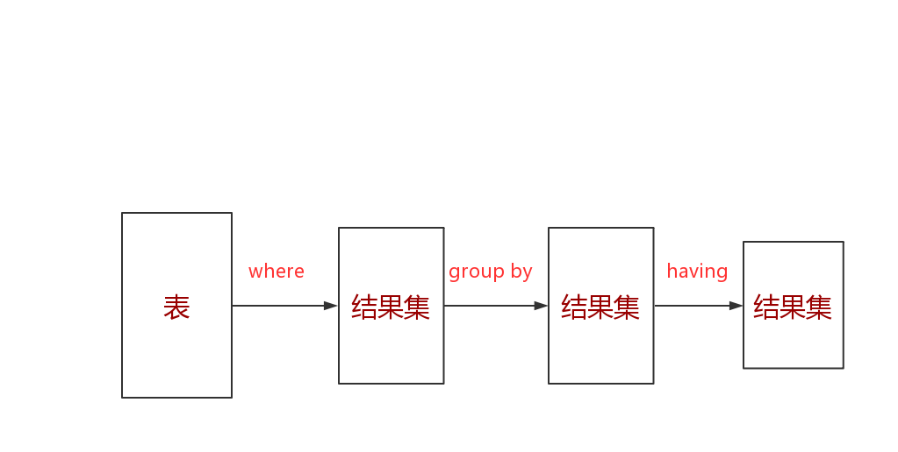

5. 使用方式

   - 查询男女生人数，且统计人数大于 5 的一方（列子不是十分好，凑合看吧！！）

     ```sql
     mysql> select gender,count(*) from students group by gender having count(*)>5;
     +--------+----------+
     | gender | count(*) |
     +--------+----------+
     |       |        9 |
     +--------+----------+
     1 row in set (2.28 sec)
     ```

### 排序

说明：为了方便查看数据，可以对数据进行排序

1. 介绍

   - 语法__（应该先对 where 条件筛选，再对结果集进行排序，最后根据 seelct 后面列名显示结果集）__

     `select * from 表名 order by 列1 asc|desc,列2 asc|desc...`

   - 将数据按照 __列1__ 进行排序，如果有些 __列1__ 相同，再按照 __列2__ 排序

   - 默认按照从小到大排序 `select * from 表名 order by 列1` 默认

   - __asc__ 升序，从小到大

   - __desc__ 降序，从大到小

2. 使用方式

   - 查询未删除的男生信息，按学号降序（order by 写在 where 后面）

     ```sql
     mysql> select * from students where isDelete=0 order by id desc;
     +----+----------+--------+------------+----------+
     | id | name     | gender | birthday   | isDelete |
     +----+----------+--------+------------+----------+
     | 11 | 唐太宗   |       | NULL       |          |
     | 10 | 孙行者   |       | NULL       |          |
     |  9 | 托塔天王 |       | NULL       |          |
     |  7 | 哪吒     |        | NULL       |          |
     |  5 | 唐三藏   |       | 1995-05-05 |          |
     |  4 | 猪八戒   |       | 1991-03-02 |          |
     |  3 | 孙悟空   |       | 1991-01-01 |          |
     |  2 | jack     |       | NULL       |          |
     +----+----------+--------+------------+----------+
     8 rows in set (0.54 sec)
     ```

   - 查询学生姓名，以学号降序排序（select 后面可以不写，排序列名）

     ```sql
     mysql> select name from students order by id desc;
     +----------+
     | name     |
     +----------+
     | 唐太宗   |
     | 孙行者   |
     | 托塔天王 |
     | 哪吒     |
     | 沙僧     |
     | 唐三藏   |
     | 猪八戒   |
     | 孙悟空   |
     | jack     |
     | tom      |
     +----------+
     10 rows in set (2.21 sec)
     ```

### 分页

说明：当查询数据过大时，在一页中查看数据非常麻烦，减轻数据库压力，以及用户压力（一般用户查看 10 页也就放弃了）

1. 介绍

   - 语法

     `select * from 表名 limit start,count;`

   - start 起始位置（索引从 0 开始）

   - count 获取多少条数据

2. 使用方式

   - 用法

     1. 已知：每页显示 m 条数据，当前显示第 n 页
     2. 求：第 n 页的数据（用户页数从 1 开始算，数据库中的数据除 __自增__ 是从 1 开始，其余都是 从 0 开始）
     3. 结果：`select * from 表名 where isDelete=0 limit (n-1)*m,m` 按用户页算

   - 例子

     1. 以上 m = 5 = count = 5

     2. 如表格

        | 用户页码 | 数据库页码 | 起始start | 多少条数据count               |
        | -------- | ---------- | --------- | ----------------------------- |
        | 1        | 0          | 0         | [0, 1, 2, 3, 4] 5 条数据      |
        | 2        | 1          | 5         | [5, 6, 7, 8, 9] 5 条数据      |
        | 3        | 2          | 10        | [10, 11, 12, 13, 14] 5 条数据 |

     3. 所以：start = (n-1)*m \ count = m

     4. limit (n-1)*m, m

   - 查询未被删除的学上，按学号降序排序，获取从 0 开始的 2 条数据

     ```sql
     mysql> select * from students where isDelete=0 order by id desc limit 0,2;
     +----+--------+--------+----------+----------+
     | id | name   | gender | birthday | isDelete |
     +----+--------+--------+----------+----------+
     | 11 | 唐太宗 |       | NULL     |          |
     | 10 | 孙行者 |       | NULL     |          |
     +----+--------+--------+----------+----------+
     2 rows in set (2.22 sec)
     ```


### 总结 （以后查看此处）

1. 完整的 select 语句

   - 代码演示

     ```sql
     select distinct *          # distinct 去除重复的行
     from 表名
     where ...
     group by ... having...     # 分组（为了聚合）
     order by...                # 排序
     limit start,count          # 分页
     ```

2. 执行顺序 __（一个完整得 SQL 语言执行得顺序，这就解释了为什么表的别名，可以在 select 中使用 `select province.id from areas as province where title='辽宁省';` 表名为 areas 别名为 province）__

   - 讲解（注意表和结果集，查询得时间顺序）
     1. from 表名 ：从哪些表中筛选
     2. where ... ：从表中帅选得条件
     3. group by ：表中数据分组依据
     4. select distinct * ：选择得字段
     5. having... ：在统计结果中再次刷选
     6. order by... ：结果集排序
     7. limit start,count ：结果集分页
   - 实际中，只会使用部分语句的组合，而不是全部
   - `select` 之前是对表中数据得筛选，之后是结果集得筛选

## 高级（多表操作）

说明：实体与实体之间有 3 种对应关系，这些关系也需要被存储下来 <br>           视图是用于完成查询语句的封装 <br> 		  事务可以保证复杂的增删改查操作有效 <br> 		  当数据巨大时，为提高查询速度可以通过索引实现

### 关系（关系字段建立）

说明：已有 __学生表__，在创建 __科目表__ 和 __成绩表__

1. 创建 subjects 表（id, title），并插入数据

   说明：__自增字段，可以重复填 0，但不可以重复填其他数字，报错（Duplicate...）__

   - 代码

     ```sql
     mysql> insert into subjects value(0,'c'),(0,'java'),(0,'python');
     Query OK, 3 rows affected (2.28 sec)
     Records: 3  Duplicates: 0  Warnings: 0
     
     mysql> select * from subjects;
     +----+--------+
     | id | title  |
     +----+--------+
     |  2 | c      |
     |  3 | java   |
     |  4 | python |
     +----+--------+
     3 rows in set (0.00 sec)
     ```

2. 创建 scores 表（id, score, student_id, title_id）

   - 创建 scores 表，遵循 __第三范式引用主键，主键可以唯一标识出表（实体）中一个对象__

     

   - __引用主键时，类型应保存一致__

   - __实体之间关系存在三种关系__

     说明：在大部分实际开发中都是 __一对多__

     | 实体关系 | (A: B) | 关系字段-存储位置       |
     | -------- | ------ | ----------------------- |
     | 一对一   | (1: 1) | 存在 A 或 B 表都可以    |
     | 一对多   | (1: n) | 存在 B 表中             |
     | 多对多   | (m: n) | 新建一张表存储-关系字段 |

   - 成绩表与学生表和科目表关系

     1. 学生表一条数据对应成绩表多条数据，科目表一条数据对应成绩表多条数据
     2. 反过来成绩表一条数据只能对应 [学生表, 科目表] 一条数据
     3. 或者（此说法感觉更贴切）成绩表多条数据对应 [学生表, 课程表] 一条数据

   - 题外话

     1. 数据库中的表是现实世界实体的表现形式，在现实世界中事物都会有者千丝万缕的关系，所以数据库的表也不例外。如图：

        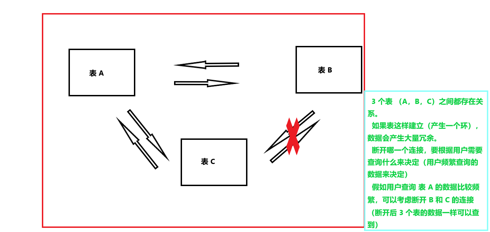

   - 代码演示（关系也是数据字段）

     说明：先建立关系在加入引用外键，要保持外键的有效性，添加一种约束
     
     1. 建立 scores 表（建立关系字段，没有添加外键约束）
     
        ```sql
        mysql> create table scores(
            -> id int auto_increment primary key,
            -> stuid int,
            -> subid int,
            -> score decimal(5,2));
        Query OK, 0 rows affected (2.43 sec)
        
        mysql> desc scores;
        +-------+--------------+------+-----+---------+----------------+
        | Field | Type         | Null | Key | Default | Extra          |
        +-------+--------------+------+-----+---------+----------------+
        | id    | int(11)      | NO   | PRI | NULL    | auto_increment |
        | stuid | int(11)      | YES  |     | NULL    |                |
        | subid | int(11)      | YES  |     | NULL    |                |
        | score | decimal(5,2) | YES  |     | NULL    |                |
        +-------+--------------+------+-----+---------+----------------+
        4 rows in set (0.00 sec)
        ```
     
     2. 添加外键
     
        说明：引用外键必须存在
     
        ```sql
        mysql> alter table scores add constraint students_score foreign key(stuid) references students(id);
        Query OK, 0 rows affected (2.86 sec)
        Records: 0  Duplicates: 0  Warnings: 0
        
        mysql> alter table scores add constraint subject_score foreign key(subid) references subjects(id);
        Query OK, 0 rows affected (2.66 sec)
        Records: 0  Duplicates: 0  Warnings: 0
        
        mysql> desc scores;
        +-------+--------------+------+-----+---------+----------------+
        | Field | Type         | Null | Key | Default | Extra          |
        +-------+--------------+------+-----+---------+----------------+
        | id    | int(11)      | NO   | PRI | NULL    | auto_increment |
        | stuid | int(11)      | YES  | MUL | NULL    |                |
        | subid | int(11)      | YES  | MUL | NULL    |                |
        | score | decimal(5,2) | YES  |     | NULL    |                |
        +-------+--------------+------+-----+---------+----------------+
        4 rows in set (0.00 sec)
        ```
     
        解释： `alter table 表名1 add constraint 约束名 foreign key(约束字段) references 表名2(引用约束字段);`  约束名：自定义，但是不能重复
     
     3. 在建立 scores 表时，添加引用约束
     
        ```sql
        mysql> create table scores(
            -> id int auto_increment primary key,
            -> foreign key(stuid) references students(id),
            -> foreign key(subid) references subjects(id),
            -> score decimal(5,2));
        Query OK, 0 rows affected (2.43 sec)
        ```
     
   - 向 scores 表插入数据
   
     1. 插入正确的数据（插入多条数据）
   
        ```sql
        mysql> insert into scores value(0,1,2,98.1);
        Query OK, 1 row affected (2.31 sec)
        ```
   
     2. 插入非正确数据
   
        ```sql
        mysql> insert into scores value(0,15,2,98.1);
        ERROR 1452 (23000): Cannot add or update a child row: a foreign key constraint fails (`python3`.`scores`, CONSTRAINT `students_score` FOREIGN KEY (`stuid`) REFERENCES `students` (`id`))
        ```
   
   - 外键的级联操作
   
     说明：在删除 students 表的数据时，如果这个 id 值在 scores 中已经存在，则会抛出异常。推荐使用逻辑删除（isDelete 字段），可以解决这个问题。__可以创建表时指定级联操作，也可以在创建表后修改外键的级联操作__
   
     1. 语法
     
        `alter table 表1 add constraint 约束名 foreign key(列1) references 表2(列名) on update 级联类型[restrict, cascade, set null, noaction];` <br>`alter table 表1 add constraint 约束名 foreign key(列1) references 表2(列名) on delete 级联类型[restrict, cascade, set null, noaction];`
     
     2. 级联操作类型
     
        - restrict （限制）：默认值，抛出异常
        - cascade （级联）：如果主表的记录删除，则从表的相关记录都将被删除
        - set null ：将外键设置为空
        - no action：什么都不做
     
     3. 以上这几种做法，都不好，最好使用逻辑删除
   

### 关联查询

说明：查询数据存在多张表时，使用连接查询，表的属性太长，可使用 `as` 简写名称。 <br>__连接查询就是把之前查询一张表，转换为多张表一起查询，[inner, left, right] 实际就是查询字段来自（from） 多张表了，有多个字段了，其他语句执行顺序不变，其中应查询存放关系字段的表，在连接其他表__

1. 连接查询分类如下

   - 如表

     | 连接方式                     | 语法                                                         | 查询结果集显示                                               |
     | ---------------------------- | ------------------------------------------------------------ | ------------------------------------------------------------ |
     | 内连接（可以多张表查询）     | A inner join B                                               | 表 A 与 表 B 的匹配的行，会出现在结果集中                    |
     | 左（外）连接（只可以两张表） | A left join B                                                | A 和 B 相同行，外加 A 表中独有的数据，未对应的数据用 null    |
     | 右（外）连接（只可以两张表） | A right join B                                               | A 和 B 相同行，外加 B 表中独有的数据，未对应的数据用 null    |
   | 全（外）连接（只可以两张表） | full join                                                    | __mysql 不支持，可以使用 union 合并__                        |
     | union                        | 将多个 select  结果，合并成一个结果集（去重，union all 不去重），__合并的 select 查询的字段得相同__ | [参考地址：菜鸟](https://www.runoob.com/mysql/mysql-union-operation.html) |
     

2. 内连查询实例（没有关联条件 `on` 会出现笛卡尔积）

   - 查询内容

     | 学生姓名 | 科目名称 | 分数 |
     | -------- | -------- | ---- |
     | xxx      | xxx      | xxx  |

   - 分析数据来源及关系

     1. 学生姓名 --> students（学生表），级联关系 students.id = scaores.stuid
     2. 科目名称 --> subjects（科目表），级联关系 subjects.id = scaores.subid
     3. 分数 --> scores（分数表），没有级联，分数字段在 scores 表中

   - 查询语句

     ```sql
     mysql> select students.name,subjects.title,scores.score from scores
         -> inner join students on scores.stuid=students.id
         -> inner join subjects on scores.subid=subjects.id;
         
     +--------+--------+--------+
     | name   | title  | score  |
     +--------+--------+--------+
     | tom    | c      |  98.10 |
     | tom    | java   | 100.00 |
     | tom    | python |  50.33 |
     | jack   | c      |  99.33 |
     | jack   | java   |  88.92 |
     | 孙行者 | java   |  88.62 |
     +--------+--------+--------+
     6 rows in set (2.28 sec)
     
     /* 另一种写法，使用 where 多表查询
        mysql> select students.name,subjects.title,scores.score from scores,
        -> students, subjects where scores.stuid=students.id and
        -> scores.subid=subjects.id;
      */
     ```
   - 解释
   
     scores 表储存关系，所以 scores 表的数据没有多余数据，当实体关系为 (1: n) 时，关系存储在 n 对应的表中

3. 外联查询实例

   说明：使用右连接实例

   - 先显示两表对应数据，在显示右表独有数据，未对应上的数据使用 null 填充

   - 查询 score 表连接 students 表

     ```sql
     mysql> select * from scores
         -> right join students on scores.stuid=students.id;
         
     +------+-------+-------+--------+----+----------+--------+------------+----------+
     | id   | stuid | subid | score  | id | name     | gender | birthday   | isDelete |
     +------+-------+-------+--------+----+----------+--------+------------+----------+
     |    1 |     1 |     2 |  98.10 |  1 | tom      |       | 1990-01-01 |         |
     |    3 |     1 |     3 | 100.00 |  1 | tom      |       | 1990-01-01 |         |
     |    4 |     1 |     4 |  50.33 |  1 | tom      |       | 1990-01-01 |         |
     |    5 |     2 |     2 |  99.33 |  2 | jack     |       | NULL       |          |
     |    6 |     2 |     3 |  88.92 |  2 | jack     |       | NULL       |          |
     |    7 |    10 |     3 |  88.62 | 10 | 孙行者   |       | NULL       |          |
     | NULL |  NULL |  NULL |   NULL |  3 | 孙悟空   |       | 1991-01-01 |          |
     | NULL |  NULL |  NULL |   NULL |  4 | 猪八戒   |       | 1991-03-02 |          |
     | NULL |  NULL |  NULL |   NULL |  5 | 唐三藏   |       | 1995-05-05 |          |
     | NULL |  NULL |  NULL |   NULL |  6 | 沙僧     |       | 1992-02-02 |         |
     | NULL |  NULL |  NULL |   NULL |  7 | 哪吒     |        | NULL       |          |
     | NULL |  NULL |  NULL |   NULL |  9 | 托塔天王 |       | NULL       |          |
     | NULL |  NULL |  NULL |   NULL | 11 | 唐太宗   |       | NULL       |          |
     +------+-------+-------+--------+----+----------+--------+------------+----------+
     13 rows in set (2.23 sec)
     ```

4. 练习

   - 查询学生的姓名、平均分

     说明：__级联查询当作 from 级别（从哪个表来的数据就行），其他执行顺序不表__

     ```sql
     mysql> select students.name,avg(scores.score) from scores
         -> inner join students on scores.stuid=students.id
         -> group by students.id;
         
     +--------+-------------------+
     | name   | avg(scores.score) |
     +--------+-------------------+
     | tom    |         82.810000 |
     | jack   |         94.125000 |
     | 孙行者 |         88.620000 |
     +--------+-------------------+
     3 rows in set (2.28 sec)
     ```

   - 查询男生姓名、总分

     说明：在 scores 表中，查询字段 name, sum(score)，关联 students，where 男生，group by name，order by 排序

     ```sql
     mysql> select students.name,sum(scores.score) from scores
         -> inner join students on students.id=scores.stuid
         -> where students.gender=1
         -> group by students.name
         -> order by sum(scores.score);
         
     +--------+-------------------+
     | name   | sum(scores.score) |
     +--------+-------------------+
     | 孙行者 |             88.62 |
     | jack   |            188.25 |
     | tom    |            248.43 |
     +--------+-------------------+
     3 rows in set (2.26 sec)
     ```

     解释：__如果按姓名分组，名字相同的可能会出现误差，应该按主键分组__
     
   - 查询科目名称、平均分
   
     1. 分析：科目名称来自于 subjects.title。分数来自于 scores.score，平均分为 avg(scores,score)。两张表连接为 subjects.id = scores.subid 。平均分是一定要分组的为 group by subjects.title
   
     2. ```sql
        mysql> select subjects.title,avg(scores.score) from scores
            -> inner join subjects on subjects.id=scores.subid
            -> group by subjects.title
            -> order by avg(scores.score);
        +--------+-------------------+
        | title  | avg(scores.score) |
        +--------+-------------------+
        | python |         50.330000 |
        | java   |         92.513333 |
        | c      |         98.715000 |
        +--------+-------------------+
        3 rows in set (2.23 sec)
        ```

### 自关联查询

说明：将有相似结构的表，合成一个表

1. 介绍

   - 减少开销

     在数据库中，创建一张表的开销是非常大的，而一张表使用大量数据（大量实体对象：行），开销远小于创建一张表。

   - 使用要求

     要求具有相似结构的多张表，__相似结构__ ，相差一两个字段无所谓，有的表实体没有字段可以添加上去，设为 null

   - 自关联使用广泛

2. 图解

   - 相似结构的多张表

     说明：__(省: 市) 为 (1: n)关系，所以关系存放在市的表中；市、区县表也相同__

     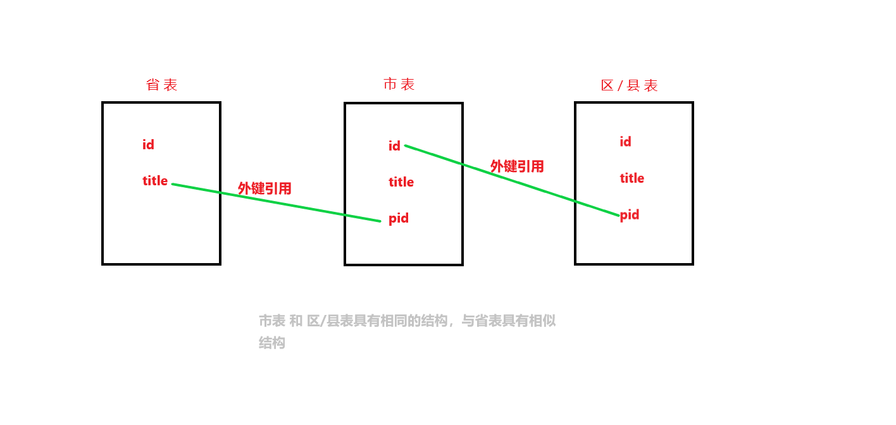

   - 合成一张表

     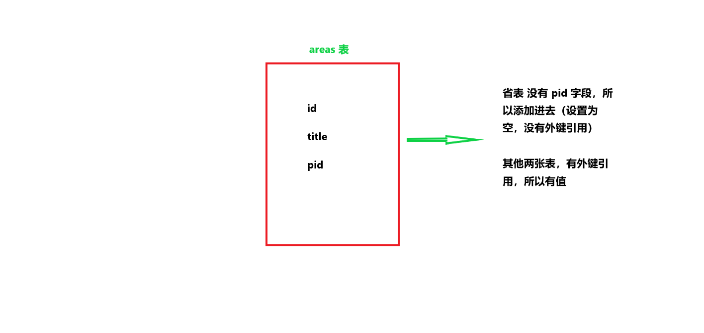

3. 实现 __省、市、区县 合并一张表的插入__

   - 代码实现

     1. 正确

        ```sql
        mysql> create table areas(
            -> id int auto_increment primary key not null,
            -> title varchar(20),
            -> pid int,
            -> foreign key(pid) references areas(id)
            -> );
        Query OK, 0 rows affected (2.49 sec)
        
        mysql> desc areas;
        +-------+-------------+------+-----+---------+----------------+
        | Field | Type        | Null | Key | Default | Extra          |
        +-------+-------------+------+-----+---------+----------------+
        | id    | int(11)     | NO   | PRI | NULL    | auto_increment |
        | title | varchar(20) | YES  |     | NULL    |                |
        | pid   | int(11)     | YES  | MUL | NULL    |                |
        +-------+-------------+------+-----+---------+----------------+
        3 rows in set (2.24 sec)
        ```
      ```
     
      ```
   2. 错误 __（外键引用上注意）__
     
        ```sql
        mysql> create table areas(
            -> id int auto_increment primary key not null,
            -> title varchar(20),
            -> foreign key(pid) references areas(id)
            -> );
        ERROR 1072 (42000): Key column 'pid' doesn't exist in table
      ```
     
        解释：要先创建 pid 字段，然后再用用外键

4. __插入数据__

   - 命令

     `source xxx.sql;`

   - 使用命令行进行插入数据 __报错__

     1. 错误信息

        ```txt
        as_ibfk_1` FOREIGN KEY (`pid`) REFERENCES `areas` (`id`))
        ERROR 1406 (22001): Data too long for column 'title' at row 1
        ERROR 1366 (HY000): Incorrect string value: '\xAE\xB6\xE6\xB8\xA0\xE5...' for column 'title' at row 1
        ERROR 1452 (23000): Cannot add or update a child row: a foreign key constraint fails (`python3`.`areas`, CONSTRAINT `areas_ibfk_1` FOREIGN KEY (`pid`) REFERENCES `areas` (`id`))
        ERROR 1406 (22001): Data too long for column 'title' at row 1
        ERROR 1406 (22001): Data too long for column 'title' at row 1
        ERROR 1406 (22001): Data too long for column 'title' at row 1
        ```

     2. 有可能错误原因

        - xxx.sql 与数据库表格编码格式不一样，但是我查看了一下，都是 utf8 编码格式，所以无法解决

   - 使用 Navicat

     1. 在数据库右击鼠标，出现导入 SQL 文件，执行正确

        ```sql
        mysql> select count(*) from areas;
        +----------+
        | count(*) |
        +----------+
        |     3508 |
        +----------+
        1 row in set (0.00 sec)
        ```

5. 查询数据

   说明：两种方法：__子查询、连接查询__，但是不推荐使用子查询
   
   - 合并表介绍
     
     1. areas 表是合并表，是 3 张表数据合在一张表，虽然存储再一张表中，但是查询时，分开查询，就是查省时，areas 表变成 province 表；查市时，areas 表变成 city 表，这样在逻辑上会显得清晰。
   - 子查询
   
     查询属于辽宁省的市
   
     1. 先下查询辽宁省的 id
   
        ```sql
        mysql> select province.id from areas as province where title='辽宁省';
        +--------+
        | id     |
        +--------+
        | 210000 |
        +--------+
        1 row in set (0.00 sec)
        ```
   
     2. 再查询 pid=辽宁id 的市
   
        ```sql
        mysql> select city.id,city.title from areas as city where pid=(select province.id from areas as province where title='辽宁省');
        +--------+----------+
        | id     | title    |
        +--------+----------+
        | 210100 | 沈阳市   |
        | 210200 | 大连市   |
        | 210300 | 鞍山市   |
        | 210400 | 抚顺市   |
        | 210500 | 本溪市   |
        | 210600 | 丹东市   |
        | 210700 | 锦州市   |
        | 210800 | 营口市   |
        | 210900 | 阜新市   |
        | 211000 | 辽阳市   |
        | 211100 | 盘锦市   |
        | 211200 | 铁岭市   |
        | 211300 | 朝阳市   |
        | 211400 | 葫芦岛市 |
        +--------+----------+
        14 rows in set (0.00 sec)
        ```
   
   - 连接查询
   
     1. 先连接表（省表和市表连接）
   
        `from areas as province inner join areas as city on province.id=city.pid `
   
     2. 查询 省的id、省名称、市id、 市名
   
        `select province.id as proid,province.title as protitle,city.id as cid,city.title as ctitle`
   
     3. 查询条件
   
        `where province.title='辽宁省'`
   
     4. 查询结果
   
        ```sql
        mysql> select province.id as proid,province.title as protitle,city.id as cid,city.title as ctitle
            -> from areas as province inner join areas as city on province.id=city.pid
            -> where province.title='辽宁省';
        +--------+----------+--------+----------+
        | proid  | protitle | cid    | ctitle   |
        +--------+----------+--------+----------+
        | 210000 | 辽宁省   | 210100 | 沈阳市   |
        | 210000 | 辽宁省   | 210200 | 大连市   |
        | 210000 | 辽宁省   | 210300 | 鞍山市   |
        | 210000 | 辽宁省   | 210400 | 抚顺市   |
        | 210000 | 辽宁省   | 210500 | 本溪市   |
        | 210000 | 辽宁省   | 210600 | 丹东市   |
        | 210000 | 辽宁省   | 210700 | 锦州市   |
        | 210000 | 辽宁省   | 210800 | 营口市   |
        | 210000 | 辽宁省   | 210900 | 阜新市   |
        | 210000 | 辽宁省   | 211000 | 辽阳市   |
        | 210000 | 辽宁省   | 211100 | 盘锦市   |
        | 210000 | 辽宁省   | 211200 | 铁岭市   |
        | 210000 | 辽宁省   | 211300 | 朝阳市   |
        | 210000 | 辽宁省   | 211400 | 葫芦岛市 |
        +--------+----------+--------+----------+
        14 rows in set (0.00 sec)
        ```
   
   - 连接查询（areas 的 省、市、区 联合查询）
   
     1. 查询语句
   
        说明：查询存放 __关系字段__ 的表，再连接其他表 __（查询的主表 city 对应这关系最多，上对应省表、下对应区县表）__
   
        ```sql
        mysql> select province.title as protitle,city.title as cititle,county.title as cotitle from areas as city
            -> inner join areas as province on city.pid=province.id
            -> inner join areas as county on city.id=county.pid
            -> where province.title='辽宁省';
        ```
   
     2. 查询结果（显示一小部分）
   
        ```sql
        +----------+----------+------------------------+
        | protitle | cititle  | cotitle                |
        +----------+----------+------------------------+
        | 辽宁省   | 沈阳市   | 市辖区                 |
        | 辽宁省   | 沈阳市   | 和平区                 |
        | 辽宁省   | 沈阳市   | 沈河区                 |
        | 辽宁省   | 沈阳市   | 大东区                 |
        | 辽宁省   | 沈阳市   | 皇姑区                 |
        | 辽宁省   | 沈阳市   | 铁西区                 |
        | 辽宁省   | 沈阳市   | 苏家屯区               |
        ```

### 视图

1. 介绍

   - 视图是从一个或多个基本表（或视图）导出的表。
   - 与基本表不同，它是个虚拟表。即数据库只存放视图的定义，而不存放视图对应的数据，这些数据仍存放在原来的基本表中
   - 一旦基本表数据发生变化，从视图中查询的数据也随之变化
   - 视图一经定义，就可以与基本一样被查询、被删除，也可以在一个是视图上，再定义一个视图，但对视图的更新（增、删、改）操作有一定限制

2. 目的

   - 对于复杂的查询，多次使用，维护时一件麻烦的事情
   - 解决：定义视图，对查询进行一个分装

3. 语法

   - `create view 视图 as SQL查询语句;`

     视图一般加 `v_` 表明是视图，多个表重名字段，不查询、取别名

   - 先写好 查询语句

     ```sql
     mysql> select students.id as stuid,students.name, students.gender,subjects.title,scores.score from scores
         -> inner join students on students.id=scores.stuid
         -> inner join subjects on subjects.id=scores.subid
         -> where students.isDelete=0;
     +-------+--------+--------+-------+-------+
     | stuid | name   | gender | title | score |
     +-------+--------+--------+-------+-------+
     |     2 | jack   |       | c     | 99.33 |
     |     2 | jack   |       | java  | 88.92 |
     |    10 | 孙行者 |       | java  | 88.62 |
     +-------+--------+--------+-------+-------+
     3 rows in set (0.02 sec)
     ```

   - 再创建视图

     ```sql
     mysql> create view v_stu_sub_sco as
         -> select students.id as stuid,students.name, students.gender,subjects.title,scores.score from scores
         -> inner join students on students.id=scores.stuid
         -> inner join subjects on subjects.id=scores.subid
         -> where students.isDelete=0;
     Query OK, 0 rows affected (2.35 sec)
     
     mysql> select * from v_stu_sub_sco;
     +-------+--------+--------+-------+-------+
     | stuid | name   | gender | title | score |
     +-------+--------+--------+-------+-------+
     |     2 | jack   |       | c     | 99.33 |
     |     2 | jack   |       | java  | 88.92 |
     |    10 | 孙行者 |       | java  | 88.62 |
     +-------+--------+--------+-------+-------+
     3 rows in set (0.21 sec)
     ```

   - 修改视图

     ```sql
     mysql> alter view v_stu_sub_sco as
         -> select students.id as stuid,students.name, students.gender,subjects.title,scores.score from scores
         -> inner join students on students.id=scores.stuid
         -> inner join subjects on subjects.id=scores.subid
         -> where students.isDelete=1;
     Query OK, 0 rows affected (2.27 sec)
     
     mysql> select * from v_stu_sub_sco;
     +-------+------+--------+--------+--------+
     | stuid | name | gender | title  | score  |
     +-------+------+--------+--------+--------+
     |     1 | tom  |       | c      |  98.10 |
     |     1 | tom  |       | java   | 100.00 |
     |     1 | tom  |       | python |  50.33 |
     +-------+------+--------+--------+--------+
     3 rows in set (0.00 sec)
     ```

### 事物

说明：当一个业务逻辑需要多条 sql 语句完成时，如果其中一条 sql 语句出现错误，则希望整个操作都退回，保证逻辑的正确性。__表的引擎（engine）必须是 InnoDB 、 BDB 类型，才可以使用事务__。<br>修改表的类型 `alter table '表名' engine=InnoDB;`

1. 介绍

   - 事务

     1. 所谓事务是用户定义的一个数据库操作序列，这些操作要么全做，要么全都不做，是一个不可分割的工作单位

   - 定义事务 3 条语句

     1. `begin`
     2. `commit`
     3. `rollback`
     
   - 事务通常是以 `begin` 开始，以 `commit` 或 `roolback` 结束

     1. `commit` 表示提交，即提交事务所有操作，具体地说：是将事务中所有对数据库的更新写回到磁盘上的物理数据中去，事务正常结束。
     2. `rollback` 表示回滚，即在事务运行过程中发生某种故障，事务不能正常执行，系统将事务中对数据库的所有已完成操作全部撤回，回滚到数据库开始执行的状态

   - 事务的 4 大特性（简称 ACID）

     1. 原子性（Atomicity）

        - 事务是数据库的逻辑工作单位，事务中包含诸多操作，要么都做，要么全部做，即事务的全部操作在数据库中是不可分的，

     2. 一致性（Consistency）

        - 多个并行执行的事务，其执行结果必须与按某一顺序串行执行的结果相一致 
      -  某公司在银行有 A，B 两个账号，现在想从 A 账号中取出 1 万，存入 B 中，那么就定义一个事务，该事务包括 2 个操作，第一个操作是从 A 账号取出 1 万，第二个操作向 B 存入 1 万。这两个操作要么全做，要么全不做。全做、全不做，数据库都处于一致性状态。如果只做一个操作，则逻辑上就发生错误，减少或增加 1 万，这是数据库处于不一致状态。__可见一致性核原子性是密切相关的__
     
   3. 隔离性（Isolation）
     
      - 数据库允许多个并发事务同时对其数据进行读写和修改的能力，隔离性可以防止多个事务并发执行时由于交叉执行而导致数据的不一致。并发执行的事务之间不能相互干扰 [菜鸟教程](https://www.runoob.com/mysql/mysql-transaction.html)
       
      - __事务隔离分为不同级别__
       
          1. 读未提交（Read uncommitted）：允许事务读取违背其他事务提交的变更。脏读、不可重复、幻读问题都会出现
             - 事务1，可以读取到事务2 已经修改，但是还没有提交的数据
          2. 读提交（read committed）：只允许事务读取已被其他事务提交的变更。可以避免脏读，但不可重复和幻读问题依然会出现
             - 事务1，只可以读取事务2 已提交的数据
          3. 可重复读（repeatable read）：确保事务可以多次从一个字段读取相同的值，这个事务在持续期间，禁止其他事务对该字段进行更新。可以避免脏读和不可重复读，但幻读问题仍然存在（随着 mysql 的优化，次级别也可以避免幻读）。
          4. 串行化（Serializable）：确保事务可以从一个表中读取相同行。这个事务在持续期间，禁止其他事务对该表进行更新、插入、删除。可以避免脏读、不可重复读和幻读问题，但性能超低。
       
        - 脏读、不可重复读、幻读现象
       
          1. 脏读现象（针对未提交的记录）：事务1 对表的某个记录进行修改，但还未提交，事务2 就可以查看事务1 未提交的数据。这样造成的问题是，如果事务1 回滚，那么事务2 在此之前所查看的数据就是脏数据。
          2. 不可重复的现象（针对表中行的数据）：是指同一个事务在整个事务过程中对表中同一记录进行读取，每次读取结果都不同。事务1 对表的某个记录进行修改，并已提交。在事务1 提交之前，事务2 查询了该条记录；在提交之后，事务2 又查询该条记录。
          3. 幻读现象（针对记录的条数）：是指同一个事务在整个事务过程中对表中的记录进行读取，查询所得的结果集是不一样的（行数不同）。在事务1 提交之前，事务2 查询了表中记录；在提交之后，事务2 又查询表中记录。__两次读取的表中记录数不同__
          4. 不可重复与幻读的区别：不可重复针对的是表中的记录的数据不同；幻读是针对查询的结果集数量不同（记录条数不同）
       
        - 事务隔离级别的作用
       
          | 事务级别                     | 脏读 | 不可重复读 | 幻读                        |
          | ---------------------------- | ---- | ---------- | --------------------------- |
          | read uncommitted（读未提交） | 1    | 1          | 1                           |
          | read committed（读提交）     | 0    | 1          | 1                           |
          | repeatable read（可重复读）  | 0    | 0          | 1（mysql 优化后也可以避免） |
          | serializable（串行化）       | 0    | 0          | 0                           |
       
        - 对事物级别和问题的理解
       
          1. __读未提交、读提交__ 是针对提交而言
          2. __可重复读__ 是针对记录（行）而言，事务持续期间将操作的表中记录（行）锁住禁止更新（优化后幻读也可以解决）。
          3. __幻读__ 是将操作的表锁住，禁止更新、插入、删除。
       
        - 查看 mysql 默认隔离级别
       
          1. 查看当前的个级别 `select @@tx_isolation;`
       
          2. 查看全卷隔离级别 `select @@global.tx_isolation;`
       
             ```sql
             mysql> select @@tx_isolation;
             +-----------------+
             | @@tx_isolation  |
             +-----------------+
             | REPEATABLE-READ |
             +-----------------+
             1 row in set, 1 warning (0.00 sec)
             ```
       
        - 修改事务隔离级别
       
          1. 修改全局 (永久有效)`set global tx_isolation = 'read-committed';`
          2. 只对本次连接有效 `set tx_isolation = 'read-uncommitted';`
     
     4. 持续性（Durability）
     
        - 持续性也称持久性，指一个事务一旦提交，他对数据库中数据的改变应该是永久性的。接下来的其他操作或者发生故障不应对其执行结果产生任何影响

2. 开始事务与结束事务

   - > MySQL 命令行的默认设置下，事务都是自动提交的，即执行 SQL 语句后就会马上执行 `commit`
     > 操作。因此要显式地开启一个事务务须使用命令 `begin` 或 `start transaction`，或者执行命令 `set autocommit=0`，用来禁止使用当前会话的自动提交。

   - 手动提交事务方法一

     1. 关闭自动提交 `set autocommit=0[false];`
     2. 接下来执行的 SQL 语句都需要手动提交
     3. 手动提交 `set autocommit=0[true];` 或者回滚 `rollback;`
     4. __此次设置只在本次连接有效__ 。缺点事务提交不灵活
     5. JDBC 支持这种方式

   - 手动提交事务方法二

     1. 开启事务 `begin;` 或者 `set transaction;`
     2. 事务描述的 SQL 语句
     3. 手动提交 `commit;` 或者回滚 `rollback;`
     4. 使用灵活、方便

3. 使用事务的情况

   __说明：数据库回滚时只对，包括：insert \ update \ delete 的语句有效。`truncate 表名` 删除整张表数据，回滚对其无效，但删除数据快（底层实现是使用 `drop` 表，再创建一张相同结构的表）。__

   - 事务操作流程图

     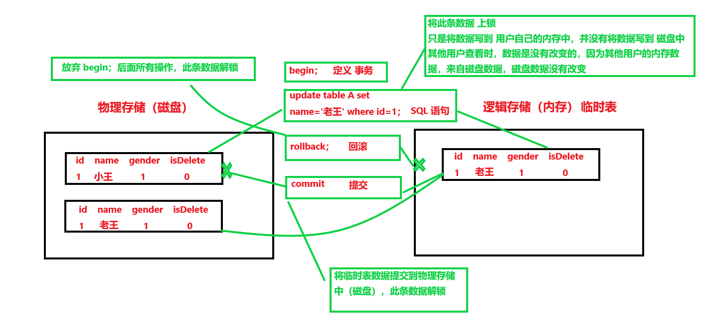

   - 代码演示

     说明：__此处将打开 2 个命令行窗口，看来模拟不同的用户，进而展示事务的操作原理。定义用户 A，B__

     1. 数据库原始数据

        ```sql
        mysql> select * from subjects;
        +----+--------+
        | id | title  |
        +----+--------+
        |  2 | c      |
        |  3 | java   |
        |  4 | python |
        +----+--------+
        3 rows in set (2.26 sec)
        ```

     2. 用户 A，事务，修改数据

        - 修改、查询

          说明：__此条数据被上锁__，其他改变此条数据的操作是不被允许的

          ```sql
          mysql> begin;
          Query OK, 0 rows affected (0.00 sec)
          
          mysql> update subjects set title='c/c++' where id=2;
          Query OK, 1 row affected (0.00 sec)
          Rows matched: 1  Changed: 1  Warnings: 0
          
          mysql> select * from subjects;
          +----+--------+
          | id | title  |
          +----+--------+
          |  2 | c/c++  |	-- 此条记录被修改
          |  3 | java   |
          |  4 | python |
          +----+--------+
          3 rows in set (0.00 sec)
          ```

          解释：用户 A，数据显示已被修改，但是没有提交

     3. 用户 B 查看 subjects；

        - 查询

          ```sql
          mysql> select * from subjects;
          +----+--------+
          | id | title  |
          +----+--------+
          |  2 | c      |	-- 此条记录没有被修改
          |  3 | java   |
          |  4 | python |
          +----+--------+
          3 rows in set (0.01 sec)
          ```

          解释：用户 B，数据没有修改，所以，事务在没有提交时，修改在内存的临时表中

     4. 用户 A，回滚

        - 用户 A，回滚：撤销修改、查询

          ```sql
          mysql> select * from subjects;
          +----+--------+
          | id | title  |
          +----+--------+
          |  2 | c      |
          |  3 | java   |
          |  4 | python |
          +----+--------+
          3 rows in set (0.00 sec)
          ```

        - 对比用户 B 数据

          ```sql
          mysql> select * from subjects;
          +----+--------+
          | id | title  |
          +----+--------+
          |  2 | c      |
          |  3 | java   |
          |  4 | python |
          +----+--------+
          3 rows in set (0.00 sec)
          ```

        - 解释，用户 B 还是没有变化

     5. 用户 A， 再次修改数据

        - 事务定义、修改数据、提交、查询

          ```sql
          mysql> begin;
          Query OK, 0 rows affected (0.00 sec)
          
          mysql> update subjects set title='c/c++' where id=2;
          Query OK, 1 row affected (0.00 sec)
          Rows matched: 1  Changed: 1  Warnings: 0
          
          mysql> commit;
          Query OK, 0 rows affected (0.05 sec)
          
          mysql> select * from subjects;
          +----+--------+
          | id | title  |
          +----+--------+
          |  2 | c/c++  |
          |  3 | java   |
          |  4 | python |
          +----+--------+
          3 rows in set (0.00 sec)
          ```

        - 对比用户 B

          ```sql
          mysql> select * from subjects;
          +----+--------+
          | id | title  |
          +----+--------+
          |  2 | c/c++  |
          |  3 | java   |
          |  4 | python |
          +----+--------+
          3 rows in set (0.00 sec)
          ```

          解释：用户 B 数据显示修改，所以提交之后，数据写入磁盘（物理存储），数据正式修改成功

### 索引

说明：当表的数据量比较大时（索引建立，要根据实际情况来判断，且的有大量数据支撑），查询会比较耗时。建立索引是加快查询速度的有效手段

1. 介绍

   - 索引能快速定位到要查找的内容
   - 数据库有默认索引，数据库存储是按照主键存储
   - 索引虽然能够加快数据库查询，但需要占用一定的存储空间，当基本更新时，索引要进行相应的维护，这些都增加了数据库的负担。
   - 再没建立索引时，where 是每一行逐条数据进行查找（就算找到了，where 还是会进行逐行查找，知道找完，返回查询信息），当你建立索引时，是根据 where 条件对哪一列进行筛选（频率大），对哪一列，建立索引
   - 索引可以对单列建立索引，也可以对多列建立一个索引，索引对等值有用，对范围来说，索引没用
   - 范围、or 是终断索引的逻辑运算符
   - __Mysql 会在主键、唯一键和外键自动创建索引，其它字段需要手动创建索引__
     1. 删除主键，索引也会随之删除
     2. 删除唯一键的方式是通过删除索引来实现
     3. 删除外键时，外键索引依然存在，需另删除

2. 索引数据类型

   - 通常数据类型越小越好，越小的数据类型通常在磁盘、内存和 cpu 缓存占用更少的空间，处理起来更快
   - 越简单的数据类型，越好。数型类型数据比字符，处理开销更小，因为字符串比较复杂
   - 避免 NULL，索引列因该指明 NOT NULL，除非你想存储 NULL。在 Mysql 中，含有 NULL 的列很难进行查询优化，因为它使得索引、索引的统计信息以及比较运算更加复杂。__最好用 0、一个特殊的值或者一个空字符串代替 空值__

3. 语法

   - 查看表的索引  <br>`show index from '表名'`

     说明：表的默认索引为 主键

     ```sql
     mysql> show index from students;
     +----------+------------+----------+--------------+-------------+-----------+-------------+----------+--------+------+------------+---------+---------------+
     | Table    | Non_unique | Key_name | Seq_in_index | Column_name | Collation | Cardinality | Sub_part | Packed | Null | Index_type | Comment | Index_comment |
     +----------+------------+----------+--------------+-------------+-----------+-------------+----------+--------+------+------------+---------+---------------+
     | students |          0 | PRIMARY  |            1 | id          | A         |           9 |     NULL | NULL   |      | BTREE      |         |               |
     +----------+------------+----------+--------------+-------------+-----------+-------------+----------+--------+------+------------+---------+---------------+
     1 row in set (0.06 sec)
     ```

   - 创建索引

     说明：最好查一下官方文档 [官方文档](https://dev.mysql.com/doc/refman/5.6/en/create-index.html)

     1. 索引，不能再 primary key 上建立。很好理解，primary key 是默认索引

     2. `create index index_name on tabl_name(col_name[(length)])`

        index_name ：索引名字（自定义）<br> tabl_name：表名 <br> col_name：表的列名 <br> length：定义长度（不用写）

     3. 删除索引

        `drop index [index_name] on tabl_name`

     4. 实现创建索引

        ```sql
        mysql> create index index_name on test(name);
        Query OK, 0 rows affected (0.29 sec)
        Records: 0  Duplicates: 0  Warnings: 0
        
        mysql> show index from test;
        +-------+------------+------------+--------------+-------------+-----------+-------------+----------+--------+------+------------+---------+---------------+
        | Table | Non_unique | Key_name   | Seq_in_index | Column_name | Collation | Cardinality | Sub_part | Packed | Null | Index_type | Comment | Index_comment |
        +-------+------------+------------+--------------+-------------+-----------+-------------+----------+--------+------+------------+---------+---------------+
        | test  |          0 | PRIMARY    |            1 | id          | A         |           0 |     NULL | NULL   |      | BTREE      |         |               |
        | test  |          1 | index_name |            1 | name        | A         |           0 |     NULL | NULL   |      | BTREE      |         |               |
        +-------+------------+------------+--------------+-------------+-----------+-------------+----------+--------+------+------------+---------+---------------+
        2 rows in set (0.00 sec)
        ```

     5. 实现删除索引（默认主键索引，删不去）

        - 删除自定义索引

          ```sql
          mysql> drop index index_name on test;
          Query OK, 0 rows affected (0.10 sec)
          Records: 0  Duplicates: 0  Warnings: 0
          
          mysql> show index from test;
          +-------+------------+----------+--------------+-------------+-----------+-------------+----------+--------+------+------------+---------+---------------+
          | Table | Non_unique | Key_name | Seq_in_index | Column_name | Collation | Cardinality | Sub_part | Packed | Null | Index_type | Comment | Index_comment |
          +-------+------------+----------+--------------+-------------+-----------+-------------+----------+--------+------+------------+---------+---------------+
          | test  |          0 | PRIMARY  |            1 | id          | A         |           0 |     NULL | NULL   |      | BTREE      |         |               |
          +-------+------------+----------+--------------+-------------+-----------+-------------+----------+--------+------+------------+---------+---------------+
          1 row in set (0.00 sec)
          ```

        - 不能删除主键索引

          ```sql
          mysql> drop index primaty on test;
          ERROR 1091 (42000): Can't DROP 'primaty'; check that column/key exists
          ```

### 索引性能对比

1. 查看执行时间

   - 开启时间监控

     `set profiling=1;`

   - 执行语句

   - 查看语句运行时间

     `show profiles;`

2. 对 areas 表，创建索引（col_name=title）

   - 实验

     ```sql
     # 开启语句执行时间监控
     mysql> set profiling=1;
     Query OK, 0 rows affected, 1 warning (0.06 sec)
     
     # 查询语句
     mysql> select * from areas where title='呼和浩特市';
     +--------+------------+--------+
     | id     | title      | pid    |
     +--------+------------+--------+
     | 150100 | 呼和浩特市 | 150000 |
     +--------+------------+--------+
     1 row in set (0.01 sec)
     
     # 创建索引
     mysql> create index index_title on areas(title);
     Query OK, 0 rows affected (0.51 sec)
     Records: 0  Duplicates: 0  Warnings: 0
     
     # 查询语句
     mysql> select * from areas where title='呼和浩特市';
     +--------+------------+--------+
     | id     | title      | pid    |
     +--------+------------+--------+
     | 150100 | 呼和浩特市 | 150000 |
     +--------+------------+--------+
     1 row in set (0.03 sec)
     
     # 执行时间对比
     mysql> show profiles;
     +----------+------------+---------------------------------------------+
     | Query_ID | Duration   | Query                                       |
     +----------+------------+---------------------------------------------+
     |        1 | 0.01842175 | select * from areas where title='?????????' |
     |        2 | 0.50237800 | create index index_title on areas(title)    |
     |        3 | 0.02832325 | select * from areas where title='?????????' |
     +----------+------------+---------------------------------------------+
     3 rows in set, 1 warning (0.00 sec)
     ```

   - 结果

     没有建立索引查询时间较短，不知为何。正常情况下，应该是建立索引的查询时间短啊 ！！！:blonde_woman:

# 非关系型数据库

## NoSQL 介绍

说明：NoSQL（not only sql） 是对不同于传统的关系型数据库的数据库管理系统的统称 [NoSQ百科](https://zh.wikipedia.org/wiki/NoSQL)。__本人理解：NoSQL 是为了解决一些查询频繁，而写入相对较少的应用，提供了一种基于内存数据查询，以提高查询速度，当然 NoSQL 也可以物理存储的__

1. 介绍

   说明：[键值存储](https://zh.wikipedia.org/wiki/%E9%94%AE-%E5%80%BC%E5%AD%98%E5%82%A8)    [面向文档数据库](https://zh.wikipedia.org/wiki/%E9%9D%A2%E5%90%91%E6%96%87%E6%AA%94%E7%9A%84%E6%95%B8%E6%93%9A%E5%BA%AB)    [JOIN](https://zh.wikipedia.org/wiki/连接_(SQL))    [分布式散列表](https://zh.wikipedia.org/wiki/分散式雜湊表)

   - 介绍

     > NoSQl，全名 Not Only SQl，指的是非关系型数据库（现在这样定义的）。因此，对 NoSQL 最普遍的解释是“非关联型的”，强调 __键-值存储__ 和 __面向文档数据库__ 的优点，而不是单纯的反对RDBMS。
     >
     > 两者存在许多显著的不同点，其中最重要的是NoSQL不使用SQL作为查询语言。其数据存储可以不需要固定的表格模式，也经常会避免使用 __SQL 的 JOIN 操作__，一般有 __水平可扩__ 的特征。
     >
     > 当代典型的 __关系型数据库__ 在一些数据敏感应用中表现了糟糕的性能。例如：为巨量文档创建索引、高流量网站的网页服务，以及发送流式媒体。关系型数据库的典型实现主要被调整用于执行规模小而读写频繁，或者大批量极少写访问的事务。__于是 NoSQL 被设计出来。NoSQL的结构通常提供弱一致性的保证，少数NoSQL系统部署了分布式结构，通常使用分布式散列表（DHT）将数据以冗余方式保存在多台服务器上。依此，扩充系统时候添加服务器更容易，并且扩大了对服务器失效的承受能程度。__

   - 暂时使用流程图

     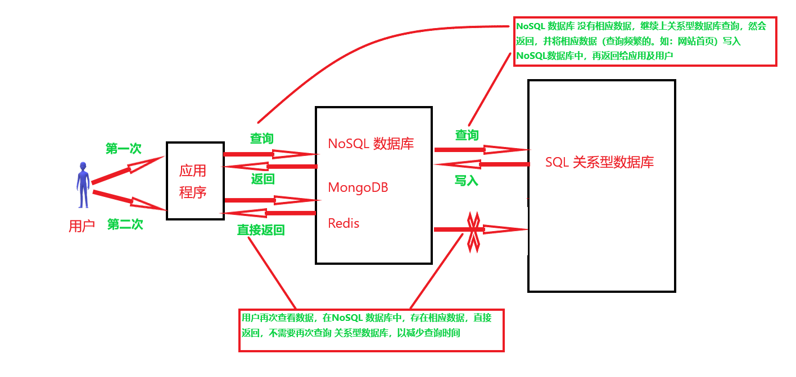

     

2. 特点

   - 优点
     1. 高可扩展性
     2. 分布式计算
     3. 低成本
     4. 框架的灵活性，半结构化数据
     5. 没有复杂的关系
   - 缺点
     1. 无标准化（因为提供数据弱一致性的保证）
     2. 有限的查询功能（目前）
     3. 程序不直观
   
3. 分类介绍 

   - 如表

     | 类型             | 部分代表                                                     | 特点                                                         |
     | ---------------- | ------------------------------------------------------------ | ------------------------------------------------------------ |
     | 列存储           | Cassandra <br> Hupertable                                    | 是按照列存储数据的，最大特点是方便存储结构化和半结构化数据。方便数据压缩，对针对某一列或者某几列的查询有非常大的 IO 优势 |
     | 文档存储         | MongoDB <br> CouchDB                                         | 文档存储一般用类似 JSON 的格式存储，存储内容是文档型的。这样就有机会对某些字段建立索引，实现关系数据库的某些功能 |
     | (key-value) 存储 | Tokyo Cabinet / tyrant <br> Berkeley DB <br> MemcacheDB <br> Redis | 可以通过 key 快速查询到 value。一般来说，不管是不是 value 格式，照单全收（Redis 还有其它功能） |
     | 图存储           | Neo4J <br> FlockDB <br>                                      | 图像关系最佳存储。使用传统关系型数据库来解决的话性能低下，而且设计使用不方便 |
     | 对象存储         | db4o <br> versant                                            | 通过类似面向对象的语法操作数据库，通过对象的方式存取数据     |
     | xml 数据库       | Berkeler DB XML <br> BaseX                                   | 高效的存储 XML 数据，并支持 XML 的内部查询语法，比如 XQuery，Xpath |
     

## MongDB

### 理论介绍

1. 介绍
   - MongoDB 是一种基于 __分布式__ 文件存储的 NoSQL 的数据库
   - 由 c++ 语言编写，运行稳定、性能高
   - 目的在于为 WEB 应用提供可扩展的高性能的数据库存查询决方案
2. 特点
   - __模式自由__：可以把不同结构的文档存储在同一个数据库中
   - __面向集合的存储__：适合存储 JSON 风格文件的形式
   - __完整的索引支持__：对任何属性都可索引
   - __复制和高可用性__：支持服务器之间的数据复制，支持 --> 从模式及服务器之间相互复制。复制的主要目的是提供冗余及自动故障转移
   - __自动分片__：支持云级别的伸缩性：自动分片功能支持水平的数据库集群，可以动态添加额外的机器
   - __丰富的查询__：支持丰富的查询表达式，查询指令使用 JSON 形式的标记，可以轻易查询文档中内嵌对象及数据
   - __快速就地更新__：查询优化器会分析查询表达式，并生成一个高效的查询计划
   - __高效的传统的存储方式__：支持二进制数据及大型对象（如，照片）

### MongoDB 安装

说明：两个网址介绍 MongoDB 安装过程 [简书](https://www.jianshu.com/p/d6c7adfe45cf)    [菜鸟教程](https://www.runoob.com/mongodb/mongodb-window-install.html)。这里只说明本人安装 MongoDB 出现的错误以及解决的方法

1. `net start MongoDB` 提示：发生系统错误 5，拒绝访问

   - 解决办法

     选择 __管理员身份__ 运行

2. `net start MongoDB` 提示：服务没有相应功能 

   - 解决办法

     1. 输入命令

        `sc delete MongoDB` 不知道什么意思，但是好用。（从注册表中删除服务子项）

     2. 重新输入

        `mongod.exe --config "(配置文件路径)mongod.cfg" --install`

### 启动 MongoDB 

说明：启动分为两种方法，因为安装分为两种方式，这里主要介绍一种（感觉启动简单），可以使用 `mongod --help` 查看

1. 初始化 `mongod.cfg` 文件的启动方法

   - 启动 MongoDB，__使用管理员权限__

     `net start MongoDB`

   - 客户端连接

     `mongo`

   - 关闭 MongoDB

     `net stop MongoDB`

2. 另一种启动方式在 __复制（副本集中提到）__，可以指定一些参数，而不是用默认的配置（配置文件）

   - 启动语法

     `mongod --bind_ip xxx --port xxx --dbpath xxx --logpath xxx`

   - 客户端连接

     `mongo`

3. 查看 MongoDB 基本操作

   - 查看当前数据库

     ```sql
     > db;
     test
     ```

   - 查看当前数据库信息

     ```sql
     > db.stats;
     function (scale) {
             return this.runCommand({dbstats: 1, scale: scale});
         }
     ```

   - 查看当前所有数据库

     ```sql
     > show databases;
     admin   0.000GB
     config  0.000GB
     local   0.000GB
     ```

   - 退出

     ```sql
     quit()
     ```


### 数据格式、基本操作（重点）

说明：数据库的创建，集合的创建与删除

1. 主要内容

   - MongoDB 将数据存储为一个文档，数据结构由键值（key-value） 对组成
   - MongoDB 文档类似于 JSON 对象，字段值可以包含其他文档、数组、文档数据
   - 安装管理 MongoDB 环境
   - 完成数据库、集合管理
   - 数据的增、删、改、查

2. 与 SQL 名词对比

   - 如表

     | SQL 术语 / 概念 | MongoDB 术语 / 概念 | 解释 / 说明                            |
     | --------------- | ------------------- | -------------------------------------- |
     | database        | database            | 数据库                                 |
     | table           | collection          | 数据库 表 / 集合                       |
     | row             | document            | 数据记录行 / 文件                      |
     | column          | field               | 数据字段 / 域                          |
     | index           | index               | 索引                                   |
     | table joins     |                     | 表连接 / MongoDB 不支持                |
     | primary key     | primary key         | 主键 / MongoDB 自动将 _id 字段设为主键 |

   - MongoDB 组成 3 元素

     1. __数据库__
     2. __集合__：集合就是关系型数据库的 __表__
     3. __文档__：文档对应着关系型数据的 __行__

   - 文档 <br> 就是一个对象，由键值对构成，是 Json 的扩展 Dson 形式 

     `{'id': 0, name': '老王', 'gender': 1, age: 100}`

   - 集合 <br> 类似于关系数据库中的表，存储多个文档，文档结构不固定，可以存储多个文档在集合中

     ```json
     {'id': 0, name': '老王', 'gender': 1, age: 100}
     {'id': 0, name': '小王', 'gender': 1}
     {'id': 0, name': '张三',  age: 99}
     {'id': 0, name': '李四', 'gender': 0, age: 90}
     ```

   - 数据库 <br> 是一个集合的物理存储。一个数据库中可以包含多个集合 <br> 一个服务器通常包含多个数据库

3. 基本语法操作

   - __数据库操作__

     1. 启动 MongoDB 服务，进入客户端

        ```sql
        C:\WINDOWS\system32>net start MongoDB
        MongoDB 服务正在启动 ..
        MongoDB 服务已经启动成功。
        
        # 进入客户端
        C:\WINDOWS\system32>mongo
        ```

     2. 查看所有数据库，以及当前使用的数据库， 和切换数据库

        说明：当查看所有数据库是，并没有 test 数据库，这是因为 __默认数据库为 test，如果没有创建新的数据库，集合将存储 test 数据库中，切换数据库，则指向数据库，但不创建，直到插入数据或者创建集合时数据库才会被创建，所以，查看所有数据库，并没有默认数据库 test，是因为 test 数据库没有数据__

        ```sql
        # 查看所有数据库
        > show databases;
        admin   0.000GB
        config  0.000GB
        local   0.000GB
        
        # 查看当前使用的数据库
        > db;
        test
        
        # 切换数据库
        use '数据库'
        ```

     3. 删除数据库

        说明：删除当前指向数据库，如果数据库不存在什么也不做

        ```sql
        db.dropDatabase();
        ```

   - __创建集合__

     1. 语法讲解

        - 基本语法

          `db.createCollection(name, [options])`

        - name 是创建集合的名称

        - options 是一个文档类型数据，如 {capped: true, size: 10} （指定 集合上线，超将其之前覆盖），用于指定集合配置

        - options 参数可选，所以一般只需要指定集合名称，不限制集合大小

          `db.createCollection("stu")`

     2. 创建集合（先创建数据库）

        - 创建集合（数据库）

          ```sql
          > use python3
          switched to db python3
          > db.createCollection("stu", {capped: true, size: 5});
          { "ok" : 1 }
          ```

        - 创建集合（没有约束）

          `db.createCollection("stu")`

          1. 参数 name 为集合名称，__必写__
          2. 参数 {capped: true} :默认值为 false ，表示不设置上限，ture 表示设置上限
          3. 参数 {size：10} 表示设置集合上限大小（capped 为 ture），当文档达到一定数目，就会覆盖前面数据

   - __查看数据库集合__ 及 __删除集合__

     1. 语法

        ```sql
        # 查看数据库集合
        > show collections;
        stu
        
        # 删除数据库集合
        > db.stu.drop();
        true
        
        # 再次查看数据库集合
        > show collections;
        # 返回为空
        ```


### 支持数据类型

1. 下表为 MongoDB 常见几种数据类型

   - 如表

     | 数据类型  | 含义                                         |
     | --------- | -------------------------------------------- |
     | Object ID | 文档 ID                                      |
     | String    | 字符串，最常用，必须是有效的 UTF-8           |
     | Boolean   | 存储一个布尔值  [true, false]                |
     | integer   | 整数可以是 32 位，或者是 64 位，取决于服务器 |
     | Double    | 存储浮点值                                   |
     | Arrarys   | 数组或者列表，多个值存储到一个键里           |
     | Object    | 用于嵌入式的文档，即一个值，为一个文档       |
     | Null      | 存储 Null 值                                 |
     | Timestamp | 时间戳                                       |
     | Date      | 存储当前日期或者时间的 UNIX 时间格式         |

2. 解释数据类型的含义

   - Object ID
     1. 每一个文档都有的一个属性，为 _id ，保证每一个文档的唯一性
     2. 可以自己设置 _id 插入文档（一般不自己设置）
     3. 如果没有提供，MongoDB 为每一个文档提供一个独特的 _id ，类型为 ObjectID
     4. ObjectID 是一个 12 字节的十六进制数
        - 前四个字节为当前时间
        - 接下来 3 个字节为机器 ID
        -  接下来的 2 个字节为 MongoDB 的服务进程 ID
        - 最后 3 个为简单的增量值

### 数据操作

说明：插入，简单的查询，更新数据，保存，删除集合中数据

1. 插入数据，查询集合数据

   - 插入语法
     1. `db.集合名称.insert(document)` 
     2. document：为文档（就是 key-value 值）
     3. 插入文档时，如果不指定 _id 参数，MongoDB 会为文档分配一个唯一的 ObjectID
     4. __插入数据时，和创建数据库有点类似（创建了，数据库也不存在，只有在其中创建集合了，才可以检索到），可以先不创建集合，而是直接使用插入语句，就可以创建集合，并且插入数据，__
   - 查询语法
     
   1. `db.集合名称.find()`
   
   - 例1

     ```sql
     > show databases;
     admin    0.000GB
     config   0.000GB
     local    0.000GB
     python3  0.000GB
     
     # 切换数据库
     > use python3;
     switched to db python3
     
     # 创建集合
     > db.createCollection("stu");
     { "ok" : 1 }
     > show collections;
     stu
     
     # 向集合插入数据
     > db.stu.insert({"name": "tom", "gender": 1, "age": 99});
     WriteResult({ "nInserted" : 1 })
     
     # 查询集合中数据
     > db.stu.find();
     { "_id" : ObjectId("5dc8b3c61e728fe09d9a3acf"), "name" : "tom", "gender" : 1, "age" : 99 }
     ```

     解释：_id 为 mongoDB 自动进行维护

   - 例2

     说明：文档（key-value），key  可以不使用 分号（""）

     ```sql
     # 先定义文档
     > s1 = {name: "jack"};
     { "name" : "jack" }
     # 向文档添加属性
     > s1.gender = 1;
     1
     
     # 将文档插入集合中
     > db.stu.insert(s1)
     WriteResult({ "nInserted" : 1 })
     
     # 查询集合数据
     > db.stu.find();
     { "_id" : ObjectId("5dc8b3c61e728fe09d9a3acf"), "name" : "tom", "gender" : 1, "age" : 99 }
     { "_id" : ObjectId("5dc8b5911e728fe09d9a3ad2"), "name" : "jack", "gender" : 1 }
     ```

2. 更新数据

   - 语法

     1. `db.集合名称.update(<query>,<update>,{multi: <boolean>});`
     2. 参数 query ：查询条件，类似 SQL 语句中的 where 部分
     3. 参数 update ：更新操作符，类似 SQL 语句中的 update 中 set 部分
     4. 参数 multi ：可选，默认时 false，表示只更新找到的第一条数据，值为 true，表示把满足条件的文档全部更新，需要和关键字 `$set` 一起使用

   - 例 1 __（全文档更新，修改文档结构）__

     说明：参数 query、update 是必须要的，参数 multi 是可选的（默认更新一条）

     1. 集合数据

        ```sql
        # 查看集合的文档
        > db.stu.find();
        { "_id" : ObjectId("5dc8bf1a1e728fe09d9a3ad3"), "name" : "tom", "gender" : 1, "age" : 99 }
        { "_id" : ObjectId("5dc8bf2b1e728fe09d9a3ad4"), "name" : "jack", "gender" : 1, "age" : 99 }
        { "_id" : ObjectId("5dc8bf451e728fe09d9a3ad5"), "name" : "race", "gender" : 0, "age" : 9 }
        ```

     2. 不使用 multi 参数（默认为 fasle）

        说明：修改 name 为 "race" 的文档

        ```sql
        # 修改 name 为 "race" 的文档
        > db.stu.update({name: "race"},{name: "Race"})
        WriteResult({ "nMatched" : 1, "nUpserted" : 0, "nModified" : 1 })
        
        # 查看集合文档
        > db.stu.find();
        { "_id" : ObjectId("5dc8bf1a1e728fe09d9a3ad3"), "name" : "tom", "gender" : 1, "age" : 99 }
        { "_id" : ObjectId("5dc8bf2b1e728fe09d9a3ad4"), "name" : "jack", "gender" : 1, "age" : 99 }
        { "_id" : ObjectId("5dc8bf451e728fe09d9a3ad5"), "name" : "Race" }
        ```

        解释：全文档修改，就是将整个文档全部修改，__仔细查看文档变化细节__

   - 例 2 __（指定属性跟新 $set）__

     说明：使用关键字 `$set`

     1. 集合文档

        ```sql
        # 集合文档
        > db.stu.find();
        { "_id" : ObjectId("5dc8bf1a1e728fe09d9a3ad3"), "name" : "tom", "gender" : 1, "age" : 100 }
        { "_id" : ObjectId("5dc8bf2b1e728fe09d9a3ad4"), "name" : "jack", "gender" : 1, "age" : 99 }
        { "_id" : ObjectId("5dc8bf451e728fe09d9a3ad5"), "name" : "Race" }
        ```

     2. 修改 name : "tom" 的 age 属性

        ```sql
        # 修改指定属性
        > db.stu.update({name: "tom"},{$set: {age: 19}});
        WriteResult({ "nMatched" : 1, "nUpserted" : 0, "nModified" : 1 })
        > db.stu.find();
        { "_id" : ObjectId("5dc8bf1a1e728fe09d9a3ad3"), "name" : "tom", "gender" : 1, "age" : 19 }
        { "_id" : ObjectId("5dc8bf2b1e728fe09d9a3ad4"), "name" : "jack", "gender" : 1, "age" : 99 }
        { "_id" : ObjectId("5dc8bf451e728fe09d9a3ad5"), "name" : "Race" }
        ```

   - 例 3 （修改匹配到的多条文档）

     说明：__参数 multi 为 true，指定修改的属性，好像不能修改全文档__

     1. 集合文档

        ```sql
        > db.stu.find();
        { "_id" : ObjectId("5dc8bf1a1e728fe09d9a3ad3"), "name" : "tom", "gender" : 1, "age" : 19 }
        { "_id" : ObjectId("5dc8bf2b1e728fe09d9a3ad4"), "name" : "jack", "gender" : 1, "age" : 99 }
        { "_id" : ObjectId("5dc8bf451e728fe09d9a3ad5"), "name" : "Race" }
        ```

     2. 修改多个文档属性

        ```sql
        > db.stu.update({gender: 1},{$set: {age: 111}},{multi: true});
        WriteResult({ "nMatched" : 2, "nUpserted" : 0, "nModified" : 2 })
        
        # 查看文档
        > db.stu.find();
        { "_id" : ObjectId("5dc8bf1a1e728fe09d9a3ad3"), "name" : "tom", "gender" : 1, "age" : 111 }
        { "_id" : ObjectId("5dc8bf2b1e728fe09d9a3ad4"), "name" : "jack", "gender" : 1, "age" : 111 }
        { "_id" : ObjectId("5dc8bf451e728fe09d9a3ad5"), "name" : "Race" }
        ```

3. 保存操作

   - 语法

     1. `db.集合名称.save(document)`
     2. 如果文档 _id 已经存在，则发生修改
     3. 如果文档 _id 不存在，则发生插入 

   - 例 1

     说明：自定义文档 _id 属性

     1. 集合文档

        ```sql
        > db.stu.find();
        { "_id" : ObjectId("5dc8bf1a1e728fe09d9a3ad3"), "name" : "tom", "gender" : 1, "age" : 111 }
        { "_id" : ObjectId("5dc8bf2b1e728fe09d9a3ad4"), "name" : "jack", "gender" : 1, "age" : 111 }
        { "_id" : ObjectId("5dc8bf451e728fe09d9a3ad5"), "name" : "Race" }
        ```

     2. 保存一个 _id 不重复的文档

        ```sql
        # 先定义一个文档
        > s = {_id:1234, name: "老王", gender: 1, age: 35};
        { "_id" : 1234, "name" : "老王", "gender" : 1, "age" : 35 }
        
        # 保存文档
        > db.stu.save(s);
        WriteResult({ "nMatched" : 0, "nUpserted" : 1, "nModified" : 0, "_id" : 1234 })
        
        # 查询文档
        > db.stu.find();                                 };
        { "_id" : ObjectId("5dc8bf1a1e728fe09d9a3ad3"), "name" : "tom", "gender" : 1, "age" : 111 }
        { "_id" : ObjectId("5dc8bf2b1e728fe09d9a3ad4"), "name" : "jack", "gender" : 1, "age" : 111 }
        { "_id" : ObjectId("5dc8bf451e728fe09d9a3ad5"), "name" : "Race" }
        { "_id" : 1234, "name" : "老王", "gender" : 1, "age" : 35 }
        ```

     3. 保存一个重复 _id 的文档

        ```sql
        # 查询文档
        > db.stu.find();                                 };
        { "_id" : ObjectId("5dc8bf1a1e728fe09d9a3ad3"), "name" : "tom", "gender" : 1, "age" : 111 }
        { "_id" : ObjectId("5dc8bf2b1e728fe09d9a3ad4"), "name" : "jack", "gender" : 1, "age" : 111 }
        { "_id" : ObjectId("5dc8bf451e728fe09d9a3ad5"), "name" : "Race" }
        { "_id" : 1234, "name" : "老王", "gender" : 1, "age" : 35 }
        
        # 保存文档
        > s = {_id:1234, name: "隔壁老王", gender: 1, age: 35};
        { "_id" : 1234, "name" : "隔壁老王", "gender" : 1, "age" : 35 }
        
        # 查询文档
        > db.stu.find();                                   35};
        { "_id" : ObjectId("5dc8bf1a1e728fe09d9a3ad3"), "name" : "tom", "gender" : 1, "age" : 111 }
        { "_id" : ObjectId("5dc8bf2b1e728fe09d9a3ad4"), "name" : "jack", "gender" : 1, "age" : 111 }
        { "_id" : ObjectId("5dc8bf451e728fe09d9a3ad5"), "name" : "Race" }
        { "_id" : 1234, "name" : "隔壁老王", "gender" : 1, "age" : 35 }
        ```

4. 删除

   - 语法

     1. `db.集合名.remove(<query>,{justOne: <boolean>})`
     2. 参数 query：删除的文档条件，必须写，但是以为空 ，如 `{}`
     3. 参数 justOne：可选，如果设为 true 或 1，表示删除一条，默认 fase，表示删除多条

   - 例 1

     1. 集合数据

        ```sql
        > db.stu.find();
        { "_id" : ObjectId("5dc8bf1a1e728fe09d9a3ad3"), "name" : "tom", "gender" : 1, "age" : 111 }
        { "_id" : ObjectId("5dc8bf2b1e728fe09d9a3ad4"), "name" : "jack", "gender" : 1, "age" : 111 }
        { "_id" : ObjectId("5dc8bf451e728fe09d9a3ad5"), "name" : "Race" }
        { "_id" : 1234, "name" : "隔壁老王", "gender" : 1, "age" : 35 }
        ```

     2. 删除一条数据

        ```sql
        # 删除一条数据
        > db.stu.remove({age: 111}, {justOne: 1})
        WriteResult({ "nRemoved" : 1 })
        > db.stu.find();
        { "_id" : ObjectId("5dc8bf2b1e728fe09d9a3ad4"), "name" : "jack", "gender" : 1, "age" : 111 }
        { "_id" : ObjectId("5dc8bf451e728fe09d9a3ad5"), "name" : "Race" }
        { "_id" : 1234, "name" : "隔壁老王", "gender" : 1, "age" : 35 }
        ```

        解释：age:111 文档有两个，只删除了一个

     3. 全部删除

        ```sql
        > db.stu.find();
        { "_id" : ObjectId("5dc8bf2b1e728fe09d9a3ad4"), "name" : "jack", "gender" : 1, "age" : 111 }
        { "_id" : ObjectId("5dc8bf451e728fe09d9a3ad5"), "name" : "Race" }
        { "_id" : 1234, "name" : "隔壁老王", "gender" : 1, "age" : 35 }
        
        # 删除所有
        > db.stu.remove({});
        WriteResult({ "nRemoved" : 3 })
        > db.stu.find();
        >
        ```

        解释：条件 `{}` key-value 可以不写值，但必须有面（位置）

### 关于 SIZE 的使用

- 介绍

  在创建集合时，指定 size 大小。当插入数据大于 size 时，后面的数据就会覆盖掉前面的数据

- 实例

  1. 创建一个集合，并设置 size 为 5

     ```sql
     > db.createCollection("stu", {capped: true, size: 5});
     { "ok" : 1 }
     > show collections;
     stu
     ```

  2. 在集合 stu 中，插入 5 个文档

     ```sql
     # 定义数据
     > s1 = {anme: "哪吒"}
     { "anme" : "哪吒" }
     > s2 = {name: "孙悟空"};
     { "name" : "孙悟空" }
     > s3 = {name: "玉皇大帝"};
     { "name" : "玉皇大帝" }
     > s4 = {name: "太上老君"};
     { "name" : "太上老君" }
     > s5 = {name: "猪八戒"};
     { "name" : "猪八戒" }
     
     # 插入文档
     > db.stu.insert(s1);
     WriteResult({ "nInserted" : 1 })
     > db.stu.insert(s2);
     WriteResult({ "nInserted" : 1 })
     > db.stu.insert(s3);
     WriteResult({ "nInserted" : 1 })
     > db.stu.insert(s4);
     WriteResult({ "nInserted" : 1 })
     > db.stu.insert(s5);
     WriteResult({ "nInserted" : 1 })
     
     # 查询
     > db.stu.find()
     { "_id" : ObjectId("5dc8d15d1e728fe09d9a3ad6"), "anme" : "哪吒" }
     { "_id" : ObjectId("5dc8d1651e728fe09d9a3ad7"), "name" : "孙悟空" }
     { "_id" : ObjectId("5dc8d1691e728fe09d9a3ad8"), "name" : "玉皇大帝" }
     { "_id" : ObjectId("5dc8d16d1e728fe09d9a3ad9"), "name" : "太上老君" }
     { "_id" : ObjectId("5dc8d1701e728fe09d9a3ada"), "name" : "猪八戒" }
     ```

  3. 再插入 2 个文档

     ```sql
     # 插入一个文档
     > db.stu.insert({name: "斗战神圣佛"});
     WriteResult({ "nInserted" : 1 })
     
     # 查询
     > db.stu.find()
     { "_id" : ObjectId("5dc8d1651e728fe09d9a3ad7"), "name" : "孙悟空" }
     { "_id" : ObjectId("5dc8d1691e728fe09d9a3ad8"), "name" : "玉皇大帝" }
     { "_id" : ObjectId("5dc8d16d1e728fe09d9a3ad9"), "name" : "太上老君" }
     { "_id" : ObjectId("5dc8d1701e728fe09d9a3ada"), "name" : "猪八戒" }
     { "_id" : ObjectId("5dc8d1d51e728fe09d9a3adb"), "name" : "斗战神圣佛" }
     
     # 插入第二个文档
     > db.stu.insert({name: "经坛使者"});
     WriteResult({ "nInserted" : 1 })
     # 查询
     > db.stu.find()
     { "_id" : ObjectId("5dc8d1691e728fe09d9a3ad8"), "name" : "玉皇大帝" }
     { "_id" : ObjectId("5dc8d16d1e728fe09d9a3ad9"), "name" : "太上老君" }
     { "_id" : ObjectId("5dc8d1701e728fe09d9a3ada"), "name" : "猪八戒" }
     { "_id" : ObjectId("5dc8d1d51e728fe09d9a3adb"), "name" : "斗战神圣佛" }
     { "_id" : ObjectId("5dc8d20f1e728fe09d9a3adc"), "name" : "经坛使者" }
     ```

     __解释：当达到 size 大小，在插入文档，就会替换最先插入的文档__

### 数据查询

1. 基本查询

   - 方法 `find()`

     1. `db.集合名称.find({查询条件)`

        ```sql
        > db.stu.find({name: "猪八戒"});
        { "_id" : ObjectId("5dc8d1701e728fe09d9a3ada"), "name" : "猪八戒" }
        ```

     2. 查询条件可以不写 `db.集合名称,.find()` ，表示查询集合所有数据

        ```sql
        > db.stu.find();
        { "_id" : ObjectId("5dc8d1691e728fe09d9a3ad8"), "name" : "玉皇大帝" }
        { "_id" : ObjectId("5dc8d16d1e728fe09d9a3ad9"), "name" : "太上老君" }
        { "_id" : ObjectId("5dc8d1701e728fe09d9a3ada"), "name" : "猪八戒" }
        { "_id" : ObjectId("5dc8d1d51e728fe09d9a3adb"), "name" : "斗战神圣佛" }
        { "_id" : ObjectId("5dc8d20f1e728fe09d9a3adc"), "name" : "经坛使者" }
        ```

   - 方法 `findOne()`

     1. `db.stu.findOne({查询条件})`  查询条件不写，查询集合中第一条数据

        ```sql
        > db.stu.find();
        { "_id" : ObjectId("5dca521ff3c285c4652590c7"), "name" : "python", "credit" : 2 }
        { "_id" : ObjectId("5dca5225f3c285c4652590c8"), "name" : "c", "credit" : 3 }
        { "_id" : ObjectId("5dca5228f3c285c4652590c9"), "name" : "java", "credit" : 3 }
        { "_id" : ObjectId("5dca522cf3c285c4652590ca"), "name" : "linux", "credit" : 1 }
        
        # 查询
        > db.stu.findOne();
        {
                "_id" : ObjectId("5dca521ff3c285c4652590c7"),
                "name" : "python",
                "credit" : 2
        }
        ```

     2. `db.stu.findOne({条件})` 写条件则返回符合条件的第一个

        ```sql
        > db.stu.find();
        { "_id" : ObjectId("5dca521ff3c285c4652590c7"), "name" : "python", "credit" : 2 }
        { "_id" : ObjectId("5dca5225f3c285c4652590c8"), "name" : "c", "credit" : 3 }
        { "_id" : ObjectId("5dca5228f3c285c4652590c9"), "name" : "java", "credit" : 3 }
        { "_id" : ObjectId("5dca522cf3c285c4652590ca"), "name" : "linux", "credit" : 1 }
        
        # 查询
        > db.stu.findOne({credit: 3});
        { "_id" : ObjectId("5dca5225f3c285c4652590c8"), "name" : "c", "credit" : 3 }
        ```

   - 查询结果格式化

     1. `.pretty()`

        ```sql
        # 结果格式化
        > db.stu.find().pretty();
        {
                "_id" : ObjectId("5dca521ff3c285c4652590c7"),
                "name" : "python",
                "credit" : 2
        }
        { "_id" : ObjectId("5dca5225f3c285c4652590c8"), "name" : "c", "credit" : 3 }
        {
                "_id" : ObjectId("5dca5228f3c285c4652590c9"),
                "name" : "java",
                "credit" : 3
        }
        {
                "_id" : ObjectId("5dca522cf3c285c4652590ca"),
                "name" : "linux",
                "credit" : 1
        }
        ```

2. 比较运算符

   - 如表

     | 含义     | 符号                        |
     | -------- | --------------------------- |
     | 等于     | __无__，默认就是等于        |
     | 小于     | __$lt__ (less than)         |
     | 小于等于 | __$lte__ (less than equal)  |
     | 大于     | __$gt__ (great than)        |
     | 大于等于 | __$gte__ (great than equal) |
     | 不等于   | __$ne__ (not equal)         |

   - 等于运算符

     ```sql
     > db.stu.find({name:"c"});
     { "_id" : ObjectId("5dca5225f3c285c4652590c8"), "name" : "c", "credit" : 3 }
     ```

   - 小于运算符（可以不是数型）

     ```sql
     > db.stu.find({credit:{$lt:3}})
     { "_id" : ObjectId("5dca521ff3c285c4652590c7"), "name" : "python", "credit" : 2 }
     { "_id" : ObjectId("5dca522cf3c285c4652590ca"), "name" : "linux", "credit" : 1 }
     ```

   - 小于等于运算符

     ```sql
     > db.stu.find({credit:{$lte:2}})
     { "_id" : ObjectId("5dca521ff3c285c4652590c7"), "name" : "python", "credit" : 2 }
     { "_id" : ObjectId("5dca522cf3c285c4652590ca"), "name" : "linux", "credit" : 1 }
     ```

   - 大于运算符

     ```sql
     > db.stu.find({credit:{$gt:2}})
     { "_id" : ObjectId("5dca5225f3c285c4652590c8"), "name" : "c", "credit" : 3 }
     { "_id" : ObjectId("5dca5228f3c285c4652590c9"), "name" : "java", "credit" : 3 }
     ```

   - 大于等于运算符

     ```sql
     > db.stu.find({credit:{$gte:2}})
     { "_id" : ObjectId("5dca521ff3c285c4652590c7"), "name" : "python", "credit" : 2 }
     { "_id" : ObjectId("5dca5225f3c285c4652590c8"), "name" : "c", "credit" : 3 }
     { "_id" : ObjectId("5dca5228f3c285c4652590c9"), "name" : "java", "credit" : 3 }
     ```

   - 不等于运算符（可以不是数型）

     ```sql
     > db.stu.find({credit:{$ne:3}})
     { "_id" : ObjectId("5dca521ff3c285c4652590c7"), "name" : "python", "credit" : 2 }
     { "_id" : ObjectId("5dca522cf3c285c4652590ca"), "name" : "linux", "credit" : 1 }
     ```

3. 逻辑运算符

   说明：查询时可以有多个条件，多个条件需要使用 __逻辑运算符__ 连接

   - __逻辑与__ ：默认使用逻辑与关系，就是 __逗号分割__

     1. 例 （查询年龄小于20，并且 gender： 1）

        ```sql
        > db.stu.find();
        { "_id" : ObjectId("5dca60bff3c285c4652590cb"), "name" : "tom", "gender" : 1, "age" : 19 }
        { "_id" : ObjectId("5dca60c2f3c285c4652590cc"), "name" : "jack", "gender" : 0, "age" : 13 }
        { "_id" : ObjectId("5dca60c5f3c285c4652590cd"), "name" : "race", "gender" : 1, "age" : 99 }
        { "_id" : ObjectId("5dca60c9f3c285c4652590ce"), "name" : "mary", "gender" : 1, "age" : 35 }
        { "_id" : ObjectId("5dca61a9f3c285c4652590cf"), "name" : "lunc", "gender" : 0, "age" : 26 }
        # 查询
        > db.stu.find({age:{$lt:20}, gender: 1});
        { "_id" : ObjectId("5dca60bff3c285c4652590cb"), "name" : "tom", "gender" : 1, "age" : 19 }
        ```

        注意：{} 的位置

   - __逻辑或__ ：使用 `$or` 注意使用 `[]`

     1. 例 （查询年龄小于 20，或者 gender：1）

        ```sql
        > db.stu.find();
        { "_id" : ObjectId("5dca60bff3c285c4652590cb"), "name" : "tom", "gender" : 1, "age" : 19 }
        { "_id" : ObjectId("5dca60c2f3c285c4652590cc"), "name" : "jack", "gender" : 0, "age" : 13 }
        { "_id" : ObjectId("5dca60c5f3c285c4652590cd"), "name" : "race", "gender" : 1, "age" : 99 }
        { "_id" : ObjectId("5dca60c9f3c285c4652590ce"), "name" : "mary", "gender" : 1, "age" : 35 }
        { "_id" : ObjectId("5dca61a9f3c285c4652590cf"), "name" : "lunc", "gender" : 0, "age" : 26 }
        # 查询结果
        > db.stu.find({$or:[{age:{$lt:20}}, {gender:1}]});
        { "_id" : ObjectId("5dca60bff3c285c4652590cb"), "name" : "tom", "gender" : 1, "age" : 19 }
        { "_id" : ObjectId("5dca60c2f3c285c4652590cc"), "name" : "jack", "gender" : 0, "age" : 13 }
        { "_id" : ObjectId("5dca60c5f3c285c4652590cd"), "name" : "race", "gender" : 1, "age" : 99 }
        { "_id" : ObjectId("5dca60c9f3c285c4652590ce"), "name" : "mary", "gender" : 1, "age" : 35 }
        ```

        注意：__[] 和 {} 的位置关系，和 逻辑与 不同__

   - __逻辑或__ 、 __逻辑与__ 一起使用

     1. 例（查询年龄小 20，或者大于 80 ，并且 gender：1）

        ```sql
        # 查询结果（好复杂）
        > db.stu.find({$or:[{age:{$lt:20}}, {age:{$gt:80}}], gender: 1});
        { "_id" : ObjectId("5dca60bff3c285c4652590cb"), "name" : "tom", "gender" : 1, "age" : 19 }
        { "_id" : ObjectId("5dca60c5f3c285c4652590cd"), "name" : "race", "gender" : 1, "age" : 99 }
        ```

   - __范围运算符__ ：使用`$in`  \  `$nin`

     1. 例（查询年龄是 35 或者 100 的）

        ```sql
        > db.stu.find({age:{$in:[35, 100]}});
        { "_id" : ObjectId("5dca60c9f3c285c4652590ce"), "name" : "mary", "gender" : 1, "age" : 35 }
        ```

     2. 例（查询年龄不是 19， 99， 35， 26的）

        ```sql
        > db.stu.find({age:{$nin:[19, 35, 99, 26]}});
        { "_id" : ObjectId("5dca60c2f3c285c4652590cc"), "name" : "jack", "gender" : 0, "age" : 13 }
        ```

   - __支持正则表达式__：使用 `//` 或者 `$regex`

     说明：json 本身支持正则，所以 MongoDB 也支持

     1. 例（查询 以 j 字母开头的 name）

        ```sql
        # 第一种
        > db.stu.find({name:/^j/});
        { "_id" : ObjectId("5dca60c2f3c285c4652590cc"), "name" : "jack", "gender" : 0, "age" : 13 }
        
        # 第二种
        >> db.stu.find({name:{$regex:"^j"}});
        { "_id" : ObjectId("5dca60c2f3c285c4652590cc"), "name" : "jack", "gender" : 0, "age" : 13 }
        ```

4. 自定义查询 

   说明：最极致的查询方式

   - 语法

     使用 `$where` 后面写一个函数，返回满足条件的数据（使用 Javascript）

   - 例

     ```sql
     > db.stu.find({$where:function(){return this.age>30}});
     { "_id" : ObjectId("5dca60c5f3c285c4652590cd"), "name" : "race", "gender" : 1, "age" : 99 }
     { "_id" : ObjectId("5dca60c9f3c285c4652590ce"), "name" : "mary", "gender" : 1, "age" : 35 }
     ```

     解释：this 表示该集合，this.age 表示属性

5. Limit 关键字

   说明：可以类比 SQL 的关键字

   - 介绍

     使用 `limit()` ：用于读取指定数量的文档，如果没有指定参数，将获取全部数据

   - 语法

     `db.集合名称.find().limit(number)` number 表示文档数量

   - 例（查询 3 条学生信息）

     ```sql
     # 查询 3 条数据
     > db.stu.find().limit(3)
     { "_id" : ObjectId("5dca60bff3c285c4652590cb"), "name" : "tom", "gender" : 1, "age" : 19 }
     { "_id" : ObjectId("5dca60c2f3c285c4652590cc"), "name" : "jack", "gender" : 0, "age" : 13 }
     { "_id" : ObjectId("5dca60c5f3c285c4652590cd"), "name" : "race", "gender" : 1, "age" : 99 }
     ```

6. skip

   - 介绍

     使用 `skip()` ：用于指定跳过多少文档

   - 语法

     `db.集合名称.find().skip(number)` number：表示跳过的文档数，没有指定不跳过

   - 例（一共 5 个数，跳过 3 个，结果可以查到 2 个）

     ```sql
     # 跳过 3 条数据
     > db.stu.find().skip(3);
     { "_id" : ObjectId("5dca60c9f3c285c4652590ce"), "name" : "mary", "gender" : 1, "age" : 35 }
     { "_id" : ObjectId("5dca61a9f3c285c4652590cf"), "name" : "lunc", "gender" : 0, "age" : 26 }
     ```

7. limit 和 skip 一起使用 可以起到与 SQL 分页功能

   - 例（跳过 3 个数据，限制查询一个，就是得到第 4 个数据）

     说明：skip 与 limit 使用部分先后顺序（本人感觉先使用 skip ，因为着用方便理解，先跳过，再查询）

     ```sql
     # 一共 5 条数据
     > db.stu.find()
     { "_id" : ObjectId("5dca60bff3c285c4652590cb"), "name" : "tom", "gender" : 1, "age" : 19 }
     { "_id" : ObjectId("5dca60c2f3c285c4652590cc"), "name" : "jack", "gender" : 0, "age" : 13 }
     { "_id" : ObjectId("5dca60c5f3c285c4652590cd"), "name" : "race", "gender" : 1, "age" : 99 }
     { "_id" : ObjectId("5dca60c9f3c285c4652590ce"), "name" : "mary", "gender" : 1, "age" : 35 }
     { "_id" : ObjectId("5dca61a9f3c285c4652590cf"), "name" : "lunc", "gender" : 0, "age" : 26 }
     
     # 跳过 3 条，限制 1 条，结果为第 4 条
     > db.stu.find().skip(3).limit(1);
     { "_id" : ObjectId("5dca60c9f3c285c4652590ce"), "name" : "mary", "gender" : 1, "age" : 35 }
     
     > db.stu.find().limit(1).skip(3);
     { "_id" : ObjectId("5dca60c9f3c285c4652590ce"), "name" : "mary", "gender" : 1, "age" : 35 }
     ```

8. 投影（显示想要的结果集）

   - 语法

     1. `db.集合名称.find({查询条件}, {字段1: 1字段2: 0})` 
     2. 参数 0 ：表示不显示
     3. 参数 1 ：表示显示

   - 例（投影 姓名 年龄）

     ```sql
     > db.stu.find({},{name:1, age:1}).limit(2)
     { "_id" : ObjectId("5dca60bff3c285c4652590cb"), "name" : "tom", "age" : 19 }
     { "_id" : ObjectId("5dca60c2f3c285c4652590cc"), "name" : "jack", "age" : 13 }
     ```

     解释：_id 默认为 1，默认显示，所以不显示 _id ，要将其设为 0，其他字段无所谓

   - 例（不显示 _id）

     ```sql
     > db.stu.find({},{_id: 0,name:1, age:1}).limit(2)
     { "name" : "tom", "age" : 19 }
     { "name" : "jack", "age" : 13 }
     ```

9. 排序

   说明：默认为升序

   - 语法

     1. `db.集合名称.find().sort(字段1:1, 字段2:-1)` 
     2. 参数 1： 表示升序
     3. 参数 -1： 表示降序

   - 例（按照 性别 降序，再根据 年龄升序）

     ```sql
     > db.stu.find().sort({gender:-1, age:1});
     { "_id" : ObjectId("5dca60bff3c285c4652590cb"), "name" : "tom", "gender" : 1, "age" : 19 }
     { "_id" : ObjectId("5dca60c9f3c285c4652590ce"), "name" : "mary", "gender" : 1, "age" : 35 }
     { "_id" : ObjectId("5dca60c5f3c285c4652590cd"), "name" : "race", "gender" : 1, "age" : 99 }
     { "_id" : ObjectId("5dca60c2f3c285c4652590cc"), "name" : "jack", "gender" : 0, "age" : 13 }
     { "_id" : ObjectId("5dca61a9f3c285c4652590cf"), "name" : "lunc", "gender" : 0, "age" : 26 }
     ```

10. 统计个数

    - 语法

      1. `db.集合名称.find({条件}).count()`
      2. `db.集合名称.count({条件})` 可以简化，将条件写到 count() 中

    - 例（查询 gender 为 1 的数量）

      ```sql
      # 正常写
      > db.stu.find({gender:1}).count()
      3
      
      # 简化写
      > db.stu.count({gender:1})
      3
      ```

    - 例（查询 年龄大于 30 的 数量）

      ```sql
      > db.stu.count({age:{$gt:30}})
      2
      ```

11. 消除重复

    说明：感觉有点鸡肋啊！！！

    - 语法

      1. `db.集合名称.distinct('去重字段',{条件})` __去重字段要加引号__

    - 例（gender 为 1 的 name 去重）

      ```sql
      > db.stu.distinct('name',{gender:1});
      [ "tom", "race", "mary" ]
      ```

    - 例（gender 去重）

      说明：推荐条件占位

      ```sql
      # {条件}可以占位
      > db.stu.distinct('gender',{});
      [ 1, 0 ]
      
      # {条件} 可以不占位
      > db.stu.distinct('gender');
      [ 1, 0 ] 
      ```

##  MongoDB 高级操作

说明：聚合、主从复制、分片、备份与恢复、MR

### 聚合 aggregate 介绍

1. 介绍

   - 意义

     聚合（aggregate）主要用于计算数据，类似于 SQL 中的 sum() 、avg()

   - 语法

     `db.集合名称.aggregate([{管道1:{表达式}},{管道2:{表达式}}...])` 参数位列表

2. 管道

   - 管道再 Unix 和 Linux 中一般用于将当前命令得输出结果作为下一个命令得输入
   - 在 MongoDB 中，管道具有相同得作用，文档处理完毕后，通过管道进行下一次处理
   - MongoDB 常用管道
     1. `$group`：将集合中的文档分组，可用于统计结果
     2. `$match`：过滤数据，只输出符合条件的文档，__类似于 find()__
     3. `project`：修改输入文档结构，如重命名、增加、删除字段、创建计算结果，__类似于 投影__
     4. `$sort`：将输入文档排序后输出
     5. `limit`：限制聚合管道返回的文档数
     6. `skip`：跳过指定数量的文档，并返回余下的文档
     7. `unwind`：将数组类型的字段进行拆分

3. 表达式

   - 作用

     处理输入文档并输出

   - 语法

     `表达式:'$列名'`

   - 常用表达式

     1. `$sum`：计算总和，`$sum:1` 和 `count` 表示计数
     2. `$avg`：计算平均值
     3. `$min`：获取最小值
     4. `$max`：获取最大值
     5. `$push`：将结构文档插入一个数据中
     6. `$first`：根据资源文档的排序获取第一个文档数据
     7. `$last`：获取最后一个文档

### $group 分组

1. 介绍

   - 语法

     ```sql
     db.集合名称.aggregate([
         {$group:
         	{
         		_id:'$字段'，
         		counter:{表达式:'$字段'}
         	}
         }
     ])
     ```

   - 解释

     1. 参数 _id ：为要分组的 __字段__，使用某个字段的格式为 `$字段`, _id 参数名不能变
     2. 参数 counter：为分组后输出结果，再次使用 __表达式处理__，这个参数可以随便更改

2. 实例

   - 例 1（统计男生、女生总人数）

     ```sql
     # 集合中所有数据
     > db.stu.find();
     { "_id" : ObjectId("5dca60bff3c285c4652590cb"), "name" : "tom", "gender" : 1, "age" : 19 }
     { "_id" : ObjectId("5dca60c2f3c285c4652590cc"), "name" : "jack", "gender" : 0, "age" : 13 }
     { "_id" : ObjectId("5dca60c5f3c285c4652590cd"), "name" : "race", "gender" : 1, "age" : 99 }
     { "_id" : ObjectId("5dca60c9f3c285c4652590ce"), "name" : "mary", "gender" : 1, "age" : 35 }
     { "_id" : ObjectId("5dca61a9f3c285c4652590cf"), "name" : "lunc", "gender" : 0, "age" : 26 }
     
     # 进行聚合，统计个数
     > db.stu.aggregate([{$group:{_id:'$gender', counter:{$sum:1}}}])
     { "_id" : 0, "counter" : 2 }
     { "_id" : 1, "counter" : 3 }
     ```

     解释：表达式  `$sum:1` 表示统计个数

   - 例 2（统计男生、女生年龄的总和、平均值）

     ```sql
     # 集合数据
     > db.stu.find()
     { "_id" : ObjectId("5dca60bff3c285c4652590cb"), "name" : "tom", "gender" : 1, "age" : 19 }
     { "_id" : ObjectId("5dca60c2f3c285c4652590cc"), "name" : "jack", "gender" : 0, "age" : 13 }
     { "_id" : ObjectId("5dca60c5f3c285c4652590cd"), "name" : "race", "gender" : 1, "age" : 99 }
     { "_id" : ObjectId("5dca60c9f3c285c4652590ce"), "name" : "mary", "gender" : 1, "age" : 35 }
     { "_id" : ObjectId("5dca61a9f3c285c4652590cf"), "name" : "lunc", "gender" : 0, "age" : 26 }
     
     # 按性别分组，统计男女生年龄总和
     > db.stu.aggregate([{$group:{_id:'$gender',counter:{$sum:'$age'}}}])
     { "_id" : 0, "counter" : 39 }
     { "_id" : 1, "counter" : 153 }
     
     # 按性别分组，统计男女生年龄平均值
     > db.stu.aggregate([{$group:{_id:'$gender',counter:{$avg:'$age'}}}])
     { "_id" : 0, "counter" : 19.5 }
     { "_id" : 1, "counter" : 51 }
     ```

   - 例 3 （按性别分组，取分组第一个文档、最后一个文档）

     ```sql
     # 集合数据
     { "_id" : ObjectId("5dca60bff3c285c4652590cb"), "name" : "tom", "gender" : 1, "age" : 19 }
     { "_id" : ObjectId("5dca60c2f3c285c4652590cc"), "name" : "jack", "gender" : 0, "age" : 13 }
     { "_id" : ObjectId("5dca60c5f3c285c4652590cd"), "name" : "race", "gender" : 1, "age" : 99 }
     { "_id" : ObjectId("5dca60c9f3c285c4652590ce"), "name" : "mary", "gender" : 1, "age" : 35 }
     { "_id" : ObjectId("5dca61a9f3c285c4652590cf"), "name" : "lunc", "gender" : 0, "age" : 26 }
     
     # 获取分组的，各组第一个文档
     > db.stu.aggregate([{$group:{_id:'$gender',counter:{$first:'$age'}}}])
     { "_id" : 0, "counter" : 13 }
     { "_id" : 1, "counter" : 19 }
     
     # 获取分组的，各组最后一个文档
     > db.stu.aggregate([{$group:{_id:'$gender',counter:{$last:'$age'}}}])
     { "_id" : 0, "counter" : 26 }
     { "_id" : 1, "counter" : 35 }
     ```

   - 例 4 （将分完组的目标字段值，添加进入数组中）

     ```sql
     # 将 age 字段，加入数组中
     > db.stu.aggregate([{$group:{_id:'$gender',counter:{$push:'$age'}}}])
     { "_id" : 0, "counter" : [ 13, 26 ] }
     { "_id" : 1, "counter" : [ 19, 99, 35 ] }
     ```

   - 例 5  （将分完组的文档，全部文档存入数组中）

     ```sql
     # 将整个文档存入数组中
     > db.stu.aggregate([{$group:{_id:'$gender',counter:{$push:'$$ROOT'}}}])
     
     # 分组，gender 为 0 的
     { "_id" : 0, "counter" : [ { "_id" : ObjectId("5dca60c2f3c285c4652590cc"), "name" : "jack", "gender" : 0, "age" : 13 }, { "_id" : ObjectId("5dca61a9f3c285c4652590cf"), "name" : "lunc", "gender" : 0, "age" : 26 } ] }
     
     # 分组，gender 为 1 的
     { "_id" : 1, "counter" : [ { "_id" : ObjectId("5dca60bff3c285c4652590cb"), "name" : "tom", "gender" : 1, "age" : 19 }, { "_id" : ObjectId("5dca60c5f3c285c4652590cd"), "name" : "race", "gender" : 1, "age" : 99 }, { "_id" : ObjectId("5dca60c9f3c285c4652590ce"), "name" : "mary", "gender" : 1, "age" : 35 } ] }
     ```

     解释：SQL 数据库，分组之后，无法在查看，单个数据内容，MongoDB 看一查看

   - 例 6 （将集合数据分为一组，求学生总人数，平均年龄）Group by null

     ```sql
     > db.stu.aggregate([{$group:{_id:'null',counter:{$sum:1},avgAge:{$avg:'$age'}}}])
     { "_id" : "null", "counter" : 5, "avgAge" : 38.4 }
     ```

### $match  筛选

1. 介绍

   - 用于过滤，只输出符合条件的文档，使用 MongoDB 的标准查询操作

   - 语法

     ```sql
     db.集合名称.aggreagte([
         {$match:
         	{
         		字段：{MongoDB 标准条件表达式}
         	}
         }
     ])
     ```

   - $mtch:{} 这个 {} 表达式和 MongoDB 的 find() 筛选语法一样（函数.....都可以）

2. 实例

   - 例 1 （查询年龄大于 20）

     ```sql
     > db.stu.aggregate([{$match:{age:{$gt:20}}}])
     { "_id" : ObjectId("5dca60c5f3c285c4652590cd"), "name" : "race", "gender" : 1, "age" : 99 }
     { "_id" : ObjectId("5dca60c9f3c285c4652590ce"), "name" : "mary", "gender" : 1, "age" : 35 }
     { "_id" : ObjectId("5dca61a9f3c285c4652590cf"), "name" : "lunc", "gender" : 0, "age" : 26 }
     ```

   - 例 2 （查询年龄大于 20 的 男女人数各多少）

     ```sql
     #查询年龄大于 20 的
     > db.stu.aggregate([{$match:{age:{$gt:20}}}])
     { "_id" : ObjectId("5dca60c5f3c285c4652590cd"), "name" : "race", "gender" : 1, "age" : 99 }
     { "_id" : ObjectId("5dca60c9f3c285c4652590ce"), "name" : "mary", "gender" : 1, "age" : 35 }
     { "_id" : ObjectId("5dca61a9f3c285c4652590cf"), "name" : "lunc", "gender" : 0, "age" : 26 }
     
     # 查询年龄大于 20 的男女人数
     > db.stu.aggregate([{$match:{age:{$gt:20}}},{$group:{_id:'$gender', counter:{$sum:1}}}])
     { "_id" : 0, "counter" : 1 }
     { "_id" : 1, "counter" : 2 }
     ```

     解释：此条语句使用两个 __管道__ ，前一个的输出，为后一个的输入

### $project 投影

说明：显示一部分字段，一般和其他管道一起使用

1. 介绍

   - 修改输入文档的结构，如重命名、增加、删除字段、创建计算结构

   - 语法

     ```sql
     db.集合名称.aggregate([
         {$project:
         	{字段1:1,字段2:0...}
         }
     ])
     ```

   - 字段 1 表示显示，字段 0 表示不显示

2. 实例

   - 例 1 （查询年龄大于 20 的 姓名，年龄）

     ```sql
     > db.stu.aggregate([{$match:{age:{$gt:20}}},{$project:{_id:0, name:1, age:1}}])
     { "name" : "race", "age" : 99 }
     { "name" : "mary", "age" : 35 }
     { "name" : "lunc", "age" : 26 }
     ```

### $sort 排序

1. 介绍

   - 将输入文档排序后输出

   - 语法

     ```sql
     db.集合名称.aggregate([
         {$sort:
         	{字段1:1,字段2:1}
         }
     ])
     ```

   - 1 为升序，-1 为降序

2. 实例

   - 例 1（查询男生、按年龄降序输出）

     ```sql
     > db.stu.aggregate([{$match:{gender:1}},{$sort:{age:-1}}])
     { "_id" : ObjectId("5dca60c5f3c285c4652590cd"), "name" : "race", "gender" : 1, "age" : 99 }
     { "_id" : ObjectId("5dca60c9f3c285c4652590ce"), "name" : "mary", "gender" : 1, "age" : 35 }
     { "_id" : ObjectId("5dca60bff3c285c4652590cb"), "name" : "tom", "gender" : 1, "age" : 19 }
     ```

### limit \ skip（一起使用：分页）

说明：一起使用，skip 先使用

1. 介绍

   - limit 

     限制聚合管道返回的文档数量

   - 语法

     `db.集合名称.aggregate([{$limit:number}])` number 为输出几个文档

   - skip

     跳过指定数量的文档，返回余下的文档

   - 语法

     `db.集合名称.aggregate([{$skip:number}])` number 为跳过文档数量

2. 实例

   - 例 1 （跳过两条数据）

     ```sql
     > db.stu.find()
     { "_id" : ObjectId("5dca60bff3c285c4652590cb"), "name" : "tom", "gender" : 1, "age" : 19 }
     { "_id" : ObjectId("5dca60c2f3c285c4652590cc"), "name" : "jack", "gender" : 0, "age" : 13 }
     { "_id" : ObjectId("5dca60c5f3c285c4652590cd"), "name" : "race", "gender" : 1, "age" : 99 }
     { "_id" : ObjectId("5dca60c9f3c285c4652590ce"), "name" : "mary", "gender" : 1, "age" : 35 }
     { "_id" : ObjectId("5dca61a9f3c285c4652590cf"), "name" : "lunc", "gender" : 0, "age" : 26 }
     
     # 聚合语句
     # 共 5 个文档，跳过 2 个，剩下 3 个
     > db.stu.aggregate([{$skip:2}])
     { "_id" : ObjectId("5dca60c5f3c285c4652590cd"), "name" : "race", "gender" : 1, "age" : 99 }
     { "_id" : ObjectId("5dca60c9f3c285c4652590ce"), "name" : "mary", "gender" : 1, "age" : 35 }
     { "_id" : ObjectId("5dca61a9f3c285c4652590cf"), "name" : "lunc", "gender" : 0, "age" : 26 }
     ```

   - 例 2 （限制查询 2 条数据）

     ```sql
     > db.stu.find()
     { "_id" : ObjectId("5dca60bff3c285c4652590cb"), "name" : "tom", "gender" : 1, "age" : 19 }
     { "_id" : ObjectId("5dca60c2f3c285c4652590cc"), "name" : "jack", "gender" : 0, "age" : 13 }
     { "_id" : ObjectId("5dca60c5f3c285c4652590cd"), "name" : "race", "gender" : 1, "age" : 99 }
     { "_id" : ObjectId("5dca60c9f3c285c4652590ce"), "name" : "mary", "gender" : 1, "age" : 35 }
     { "_id" : ObjectId("5dca61a9f3c285c4652590cf"), "name" : "lunc", "gender" : 0, "age" : 26 }
     
     # 限制 2 条数据
     > db.stu.aggregate([{$limit:2}])
     { "_id" : ObjectId("5dca60bff3c285c4652590cb"), "name" : "tom", "gender" : 1, "age" : 19 }
     { "_id" : ObjectId("5dca60c2f3c285c4652590cc"), "name" : "jack", "gender" : 0, "age" : 13 }
     
     ```

   - 例 3 （跳过 4 条，限制一条数据）

     ```sql
     > db.stu.find()
     { "_id" : ObjectId("5dca60bff3c285c4652590cb"), "name" : "tom", "gender" : 1, "age" : 19 }
     { "_id" : ObjectId("5dca60c2f3c285c4652590cc"), "name" : "jack", "gender" : 0, "age" : 13 }
     { "_id" : ObjectId("5dca60c5f3c285c4652590cd"), "name" : "race", "gender" : 1, "age" : 99 }
     { "_id" : ObjectId("5dca60c9f3c285c4652590ce"), "name" : "mary", "gender" : 1, "age" : 35 }
     { "_id" : ObjectId("5dca61a9f3c285c4652590cf"), "name" : "lunc", "gender" : 0, "age" : 26 }
     
     # 查询数据，显示第五条数据
     > db.stu.aggregate([{$skip:4},{$limit:1}])
     { "_id" : ObjectId("5dca61a9f3c285c4652590cf"), "name" : "lunc", "gender" : 0, "age" : 26 }
     ```

### $unwind 拆分

说明：由于字段的不同，使 `$unwind` 出现两种用法

1. 介绍

   - 将文档中某个数组字段拆分成多条，每条包含一个值

   - 语法 1

     `db.集合名称.aggregate([{$unwind:'$字段'}])` __字段是数组__

   - 语法 2

     1. 对处理空数组、非数组、无字段、null 情况，为防止数据丢失，出现以下语法，

        ```sql
        db.集合名称.aggregate([
        	{$unwind:
        		{path:'$字段',preserveNullAndEmptyArrays:<boolean>}
        	}
        ])
        ```

     2. 参数 `preserveNullAndEmptyArrays` 为防止数据丢失，出现的，`true` 为不丢失，`false` 丢失

2. 实例（语法 1）

   - 例 1（拆分一个文档数组）

     ```sql
     # 插入数据（带有数组的字段）
     > db.stu.insert({_id:1,name:"item",item:[1, 2, 3]})
     WriteResult({ "nInserted" : 1 })
     
     > db.stu.find({_id:1})
     { "_id" : 1, "name" : "item", "item" : [ 1, 2, 3 ] }
     
     # 进行拆分
     > db.stu.aggregate([{$unwind:'$item'}])
     { "_id" : 1, "name" : "item", "item" : 1 }
     { "_id" : 1, "name" : "item", "item" : 2 }
     { "_id" : 1, "name" : "item", "item" : 3 }
     ```

3. 实例（语法 2）

   说明：先构建可拆分的字段（空数组、非数组、无字段、null ），然后对其拆分，查看 __语法 1、语法 2（true、false）__

   - 建立集合（满足上面要求）

     ```sql
     > db.item.find()
     { "_id" : 1, "name" : "item1", "item" : [ 1, 2, 3 ] }
     { "_id" : 2, "name" : "item2", "item" : [ ] }
     { "_id" : 3, "name" : "item3", "item" : "4" }
     { "_id" : 4, "name" : "item4", "item" : null }
     { "_id" : 5, "name" : "item5" }
     { "_id" : 6, "name" : "item", "item" : "arrays" }
     ```

   - 使用 __语法 1__，对其进行分组

     ```sql
     > db.item.aggregate([{$unwind:"$item"}])
     { "_id" : 1, "name" : "item1", "item" : 1 }
     { "_id" : 1, "name" : "item1", "item" : 2 }
     { "_id" : 1, "name" : "item1", "item" : 3 }
     { "_id" : 3, "name" : "item3", "item" : "4" }
     { "_id" : 6, "name" : "item", "item" : "arrays" }
     ```

     解释：__可以对含有该字段的 数组、和 非数组 进行拆分__

   - 使用 __语法 2（false）__

     ```sql
     > db.item.aggregate([{$unwind:{path:"$item",preserveNullAndEmptyArrays:false}}])
     { "_id" : 1, "name" : "item1", "item" : 1 }
     { "_id" : 1, "name" : "item1", "item" : 2 }
     { "_id" : 1, "name" : "item1", "item" : 3 }
     { "_id" : 3, "name" : "item3", "item" : "4" }
     { "_id" : 6, "name" : "item", "item" : "arrays" }
     ```

     解释：__可以对含有该字段的 数组、和 非数组 进行拆分__

   - 使用 __语法 2（true）__

     ```sql
     > db.item.aggregate([{$unwind:{path:"$item",preserveNullAndEmptyArrays:true}}])
     { "_id" : 1, "name" : "item1", "item" : 1 }
     { "_id" : 1, "name" : "item1", "item" : 2 }
     { "_id" : 1, "name" : "item1", "item" : 3 }
     { "_id" : 2, "name" : "item2" }
     { "_id" : 3, "name" : "item3", "item" : "4" }
     { "_id" : 4, "name" : "item4", "item" : null }
     { "_id" : 5, "name" : "item5" }
     { "_id" : 6, "name" : "item", "item" : "arrays" }
     ```

     解释：__可以对集合中的数据全部拆分__

### 索引

说明：创建大量数据，创建索引。对比查询速度

1. 介绍

   - 在 SQL 数据库中，索引可以提升查询速度。MongoDB 也支持索引，以提升查询速

2. 创建、查看、删除索引语法

   - 创建 语法 1
     1. `db.集合名称.ensureIndex({字段:1})`
     2. 参数 1 表示升序，-1 表示降序
   - 创建 语法 2 （唯一索引）
     1. `db.集合名称.ensureIndex({字段:1},{"unique":true})`
     2. 参数 `{"unique:true"}` 表示创建唯一索引
   - 创建 语法 3 （联合索引，对多个属性创建一个索引，按照 find() 出现的顺序）
     1. `db.集合名称.ensureIndex({字段1:1,字段2:1})`
     2. 根据 `find()` 查询顺序，建立索引。意义：查询时，先查询 find 的第一个字段，在一个条件符合要求，在查询第二个字段，所以索引的建立需要按照 find 的查询顺序创建
   - 查看 语法
     1. `db.集合名称.getIndexes()`
   - 删除 索引
     1. `db.集合名称.dropIndex("索引名称")`

3. 创建大量数据

   说明：创建大量数据，用于测试索引。MongoDB 命令窗口实际也是 Javascript 的编辑器，支持 javascript （弱语言）脚本

   - 代码

     ```javascript
     > for (i = 0; i < 100000; i++){db.index_co.insert({name:"index" + i, num:i})}
     WriteResult({ "nInserted" : 1 })
     ```

   - 检测创建结果

     ```sql
     # 统计集合数据个数
     > db.index_co.count()
     100000
     
     # 跳过 99994 条数据，	查询最后 4 条数据
     > db.index_co.find().skip(99994).limit(6)
     { "_id" : ObjectId("5dcd35c0d2d52318b228d466"), "name" : "index99994", "num" : 99994 }
     { "_id" : ObjectId("5dcd35c0d2d52318b228d467"), "name" : "index99995", "num" : 99995 }
     { "_id" : ObjectId("5dcd35c0d2d52318b228d468"), "name" : "index99996", "num" : 99996 }
     { "_id" : ObjectId("5dcd35c0d2d52318b228d469"), "name" : "index99997", "num" : 99997 }
     { "_id" : ObjectId("5dcd35c0d2d52318b228d46a"), "name" : "index99998", "num" : 99998 }
     { "_id" : ObjectId("5dcd35c0d2d52318b228d46b"), "name" : "index99999", "num" : 99999 }
     ```

4. 分析工具（explain）

   - 介绍

     分析 MongoDB 语法，及执行时间

   - 代码（解释）

     ```sql
     > db.index_co.find({num: 10000}).explain("executionStats");
     {
             "queryPlanner" : {
                     "plannerVersion" : 1,
                     "namespace" : "python3.index_co", # 集合
                     "indexFilterSet" : false,         # 是否有索引
                     "parsedQuery" : {                 # 查询条件
                             "num" : {
                                     "$eq" : 10000
                             }
                     },
                     "winningPlan" : {
                             "stage" : "COLLSCAN",
                             "filter" : {
                                     "num" : {
                                             "$eq" : 10000
                                     }
                             },
                             "direction" : "forward"  # 向前查询，逐行查询
                     },
                     "rejectedPlans" : [ ]
             },
             "executionStats" : {                    # 执行状态
                     "executionSuccess" : true,
                     "nReturned" : 1,
                     "executionTimeMillis" : 196,    # 执行时间（毫秒）196 毫秒
                     "totalKeysExamined" : 0,
                     "totalDocsExamined" : 100000,
                     "executionStages" : {
                             "stage" : "COLLSCAN",
                             "filter" : {
                                     "num" : {
                                             "$eq" : 10000
                                     }
                             },
                             "nReturned" : 1,
                             "executionTimeMillisEstimate" : 121,
                             "works" : 100002,
                             "advanced" : 1,
                             "needTime" : 100000,
                             "needYield" : 0,
                             "saveState" : 784,
                             "restoreState" : 784,
                             "isEOF" : 1,
                             "invalidates" : 0,
                             "direction" : "forward",
                             "docsExamined" : 100000
                     }
             },
             "serverInfo" : {
                     "host" : "SShen-computer",
                     "port" : 27017,
                     "version" : "4.0.9",
                     "gitVersion" : "fc525e2d9b0e4bceff5c2201457e564362909765"
             },
             "ok" : 1
     }
     ```

5. 创建索引

   - 实例（基于 name 字段创建索引）

     ```sql
     > db.index_co.ensureIndex({name:1})
     {
             "createdCollectionAutomatically" : false,
             "numIndexesBefore" : 1,
             "numIndexesAfter" : 2,
             "ok" : 1
     }
     ```

   - 执行查询时间

     ```sql
     > db.index_co.find({num: 10000}).explain("executionStats");
     {
             "queryPlanner" : {
                     "plannerVersion" : 1,
                     "namespace" : "python3.index_co",
                     "indexFilterSet" : false,
                     "parsedQuery" : {
                             "num" : {
                                     "$eq" : 10000
                             }
                     },
                     "winningPlan" : {
                             "stage" : "COLLSCAN",
                             "filter" : {
                                     "num" : {
                                             "$eq" : 10000
                                     }
                             },
                             "direction" : "forward"
                     },
                     "rejectedPlans" : [ ]
             },
             "executionStats" : {
                     "executionSuccess" : true,
                     "nReturned" : 1,
                     "executionTimeMillis" : 43,
                     "totalKeysExamined" : 0,
                     "totalDocsExamined" : 100000,
                     "executionStages" : {
                             "stage" : "COLLSCAN",
                             "filter" : {
                                     "num" : {
                                             "$eq" : 10000
                                     }
                             },
                             "nReturned" : 1,
                             "executionTimeMillisEstimate" : 43,
                             "works" : 100002,
                             "advanced" : 1,
                             "needTime" : 100000,
                             "needYield" : 0,
                             "saveState" : 782,
                             "restoreState" : 782,
                             "isEOF" : 1,
                             "invalidates" : 0,
                             "direction" : "forward",
                             "docsExamined" : 100000
                     }
             },
             "serverInfo" : {
                     "host" : "SShen-computer",
                     "port" : 27017,
                     "version" : "4.0.9",
                     "gitVersion" : "fc525e2d9b0e4bceff5c2201457e564362909765"
             },
             "ok" : 1
     }
     ```

6. 对比时间

   1.   "executionTimeMillisEstimate" : 43,
   2.   "executionTimeMillis" : 196,    # 执行时间（毫秒）196 毫秒
   3. 提升查询速度还是挺快的

7. 查看索引

   - 代码

     ```sql
     > db.index_co.getIndexes()
     [
             {
                     "v" : 2,
                     "key" : {
                             "_id" : 1
                     },
                     "name" : "_id_",
                     "ns" : "python3.index_co"
             },
             {
                     "v" : 2,
                     "key" : {
                             "name" : 1
                     },
                     "name" : "name_1",
                     "ns" : "python3.index_co"
             }
     ]
     ```

     解释：索引名称，可以查看

8. 删除索引

   - 代码

     ```sql
     # 删除索引
     > db.index_co.dropIndex("name_1")
     { "nIndexesWas" : 2, "ok" : 1 }
     
     # 查看索引
     > db.index_co.getIndexes()
     [
             {
                     "v" : 2,
                     "key" : {
                             "_id" : 1
                     },
                     "name" : "_id_",
                     "ns" : "python3.index_co"
             }
     ]
     ```

### 安全性

说明：安全性--->创建超级管理员--->[修改配置]-->创建普通用户（指定使用数据库 `authenticationDatabase`）

1. 超级管理员

   - 为了更安全的访问 MongoDB，需要访问者提供同户名和密码，于是需要在 MongoDB 中创建用户
   - 采用了 __角色-用户-数据库__ 的安全管理模式（创建角色向用户分发，使用户获得权限）
   - 常用系统角色如下：
     1. __root__：只是 admin 数据库中可用，超级账户，超级权限（对任何数据库都可以读写操作）
     2. __Read__：允许用户读取指定数据库（对某个数据库有读操作）
     3. __readWrite__：允许用户读写指定数据库（对某个数据库有写操作）

2. 创建超级管理员用户

   - 代码（不管下面的哪种方法，都需要先创建 管理员数据库）

     ```sql
     > use admin
     switched to db admin
     
     # 创建 用户名 admin、密码 123、角色[root、数据库为 admin]
     > db.createUser({user:"admin",pwd:"123",roles:[{role:"root",db:"admin"}]});
     Successfully added user: {
             "user" : "admin",
             "roles" : [
                     {
                             "role" : "root",
                             "db" : "admin"
                     }
             ]
     }
     ```

   - 使用 `--auth` 参数，进行登录

     说明：使用 `auth` 关键字，可以自由选择是否启用 __用户、密码登录__

     1. 开启 MongoDB 服务（在一个终端）

        ```sql
        mongod --auth  --dbpath E:\MongoDB\data\db
        ```

     2. 开启 MongoDB 客户端（在另一个终端）

        - 没有输入用户名密码（什么也看不到）

          ```sql
          C:\Users\SS沈>mongo
          MongoDB shell version v4.0.9
          
          # 显示数据库
          > show dbs;
          >
          > quit()
          ```

        - 开启客户端时，输入用户名密码（连接服务器同时传入用户名密码）

          ```sql
          C:\Users\SS沈>mongo -u admin -p 123
          MongoDB shell version v4.0.9
          
          # 显示数据库
          > show dbs;
          admin    0.000GB
          config   0.000GB
          local    0.000GB
          python3  0.003GB
          >
          ```

        - 开启客户端，连接上服务器时，再输入用户名密码

          ```sql
          C:\Users\SS沈>mongo
          MongoDB shell version v4.0.9
          
          # 选择 管理员数据库
          > use admin;
          switched to db admin
          # 输入用户名密码进行连接
          > db.auth("admin", "123")
          1
          > show dbs
          admin    0.000GB
          config   0.000GB
          local    0.000GB
          python3  0.003GB
          ```

   - 修改配置文件，进行登录

     说明：优点：方便不用每次开启服务都需要输入一堆参数，缺点：不能自主选择是否开启身份验证

     1. 设置配置文件（.cfg 文件）

        ```txt
        security:
            # 开启安全验证
            authorization: enabled
        ```

        解释：`:` 有空格

     2. 启动服务

        ```sql
        C:\WINDOWS\system32>net start MongoDB
        MongoDB 服务正在启动 ..
        MongoDB 服务已经启动成功。
        ```

     3. 客户端连接（连接时传入用户名密码）

        同上

     4. 客户端启动（连接后，出入用户名密码）

        同上

3. 查看当前所有用户（使用 admin 登录）

   - 进入 admin 数据库

     `use admin`

   - 查看当前用户

     `show users;`

     ```sql
     > show users;
     {
             "_id" : "admin.admin",
             "userId" : UUID("782f4977-ac86-42f9-ac52-0893ec017d93"),
             "user" : "admin",
             "db" : "admin",
             "roles" : [
                     {
                             "role" : "root",
                             "db" : "admin"
                     }
             ],
             "mechanisms" : [
                     "SCRAM-SHA-1",
                     "SCRAM-SHA-256"
             ]
     }
     ```

4. 创建普通用户

   - 使用 admin （超级管理员登录）

   - 切换数据库

     `use 数据库名`

   - 创建用户集合

     1. 代码

        ```sql
        > use python3;
        switched to db python3
        > show collections
        index_co
        item
        stu
        > db.createUser({user:"py",pwd:"123",roles:[{role:"readWrite",db:"python3"}]})
        Successfully added user: {
                "user" : "py",
                "roles" : [
                        {
                                "role" : "readWrite",
                                "db" : "python3"
                        }
                ]
        }
        ```

5. 使用普通用户登录

   - 介绍

     管理员创建普通用户时，会指定用户所使用的数据库及使用权限，所以在登陆时，需指定所使用的数据库。管理员，好像不用指定。普通用户只能看到可以会使用的数据库，其他数据库不能看到。

   - 登录

     `mongo -u py -p 123 --authenticationDatabase python3` 参数 `authenticationDatabase` 指定的 数据库

     ```sql
     C:\Users\SS沈>mongo -u py -p 123 --authenticationDatabase python3
     MongoDB shell version v4.0.9
     connecting to: mongodb://127.0.0.1:27017/?authSource=python3&gssapiServiceName=mongodb
     Implicit session: session { "id" : UUID("5b111a09-cfde-4481-866d-7ccd61ca8142") }
     MongoDB server version: 4.0.9
     
     # 只会显示可以操作的数据库
     > show dbs;
     python3  0.003GB
     >
     ```

   - 权限说明

     只能操作管理员授予的数据库

6. 修改密码

   - 介绍

     只有超级管理员可以操作

   - 修改密码

     `db.changeUserPassword("用户名","新密码")`

   - 修改 role 属性（感觉是这样写的）

     `db.updateUser("数据库名"，{pwd:"新密码"}，{roles：{role:权限, db:数据库}})`
   
7. 删除用户

   说明：应该只有超级管理员可以操作，且进入数据库目录下

   - 删除一个用户

     `db.dropUser(<user_name>)`

     例：`db.dropUser("py")` 删除 py 用户

   - 删除当前数据库所有用户

     `db.dropAllUser()`

### 复制（副本集）

说明：设置副本集，分为 9 个步骤，之后讲解手动备份

1. 介绍

   - 什么是复制
     1. 复制提供了数据的冗余备份，并在多个服务器上存放数据副本，提高数据的可用性，并可以保证数据的安全性
     2. 复制还允许从硬件故障和服务器中断恢复数据

   - 为什么要复制
     1. 数据备份
     2. 数据灾难恢复
     3. 读写分离
     4. 高可用性（24 * 7）
     5. 无宕机维护
     6. 副本集对应用透明

   - 复制的工作原理
     1. 复制至少需要两个节点 A、B
     2. A是主节点，负责处理客户端请求
     3. 其余节点都是从节点，负责复制主节点的上的数据
     4. 节点常见的搭配方式：一主一从、一主多从
     5. 主节点记录在其上的所有操作，从节点定期轮询主节点获取这些操作，然后对自己的数据副本执行这些操作，从而保证自己的数据和主节点一致
     6. 主节点和从节点的数据交互保证了数据的一致性
     7. __从节点每个一段时间轮询一次主节点，所以会有一段时间是空窗期（心跳），如果主节点宕机，会有一段时间的主节点操作丢失（无法避免）__

   - 复制特点
     1. N 个节点集群
     2. 任何节点可以作为主节点
     3. 所有写入操作都在主节点上
     4. 自动故障转移
     5. 自动恢复（A 主节点宕机，B 自动成为主节点，A 在重启时，已不是主节点，则需要轮询 主节点 A 获取操作）

2. 设置复制节点

   - 步骤 一

     创建两个数据库目录 tc1、tc2，用于存放数据库（在本机桌面演示 Desktop，win10 系统）

     ```sql
     # 创建两个文件夹
     C:\Users\SS沈\Desktop>mkdir tc1
     
     C:\Users\SS沈\Desktop>mkdir tc2
     ```

   - 步骤 二

     启动 MongoDB（开启多个终端），参数 `bind_ip` 为本机 IP ，参数 `port` 为启动服务的端口号（没被占用），参数 `replSet`  名称一致，构成一个副本集

     ```sql
     mongod --bind_ip 22.11.182.60 --port 27012 --dbpath C:\Users\SS沈\Desktop\tc1 --replSet rs0
     mongod --bind_ip 22.11.182.60 --port 27010 --dbpath C:\Users\SS沈\Desktop\tc2 --replSet rs0
     ```

     解释：可以指定日志文件 `--logpath xxx\xx.log`

   - 步骤 三

     设置主节点（主服务器），此处设置：22.11.182.60:27012 为主节点

     ```sql
     mongo --host 22.11.182.60 --port 27012
     ```

   - 步骤 四

     初始化主节点（主服务器）。如果不初始化，对数据库进行操作，会提示报错

     `rs.initiate()`

     ```sql
     > rs.initiate()
     {
             "info2" : "no configuration specified. Using a default configuration for the set",
             "me" : "22.11.182.60:27012",
             "ok" : 1,
             "operationTime" : Timestamp(1573885934, 1),
             "$clusterTime" : {
                     "clusterTime" : Timestamp(1573885934, 1),
                     "signature" : {
                             "hash" : BinData(0,"AAAAAAAAAAAAAAAAAAAAAAAAAAA="),
                             "keyId" : NumberLong(0)
                     }
             }
     }
     
     # 初始化完成，会提示此处信息
     rs0:OTHER>
     ```

   - 步骤 五

     查看主节点当前状态（有多少节点连接主节点）

     `rs.status()`

     ```sql
     rs0:OTHER> rs.status()
     {
             "set" : "rs0", # 副本集名称
             "date" : ISODate("2019-11-16T06:33:30.489Z"),
             "myState" : 1,
             "term" : NumberLong(1),
             "syncingTo" : "",
             "syncSourceHost" : "",
             "syncSourceId" : -1,
             "heartbeatIntervalMillis" : NumberLong(2000),
             "optimes" : {
                     "lastCommittedOpTime" : {
                             "ts" : Timestamp(1573886007, 1),
                             "t" : NumberLong(1)
                     },
                     "readConcernMajorityOpTime" : {
                             "ts" : Timestamp(1573886007, 1),
                             "t" : NumberLong(1)
                     },
                     "appliedOpTime" : {
                             "ts" : Timestamp(1573886007, 1),
                             "t" : NumberLong(1)
                     },
                     "durableOpTime" : {
                             "ts" : Timestamp(1573886007, 1),
                             "t" : NumberLong(1)
                     }
             },
             "lastStableCheckpointTimestamp" : Timestamp(1573885979, 4),
             
             # members 成员信息（此处成员只有一个）
             "members" : [ 
                     {
                             "_id" : 0,
                             "name" : "22.11.182.60:27012", # IP PORT 信息
                             "health" : 1,
                             "state" : 1,
                             "stateStr" : "PRIMARY",        # 节点信息（是否为主节点）
                             "uptime" : 2137,
                             "optime" : {
                                     "ts" : Timestamp(1573886007, 1),
                                     "t" : NumberLong(1)
                             },
                             "optimeDate" : ISODate("2019-11-16T06:33:27Z"),
                             "syncingTo" : "",
                             "syncSourceHost" : "",
                             "syncSourceId" : -1,
                             "infoMessage" : "could not find member to sync from",
                             "electionTime" : Timestamp(1573885935, 1),
                             "electionDate" : ISODate("2019-11-16T06:32:15Z"),
                             "configVersion" : 1,
                             "self" : true,
                             "lastHeartbeatMessage" : ""
                     }
             ],
             "ok" : 1,
             "operationTime" : Timestamp(1573886007, 1),
             "$clusterTime" : {
                     "clusterTime" : Timestamp(1573886007, 1),
                     "signature" : {
                             "hash" : BinData(0,"AAAAAAAAAAAAAAAAAAAAAAAAAAA="),
                             "keyId" : NumberLong(0)
                     }
             }
     }
     
     # 查询完状态，提示此节点为主节点
     rs0:PRIMARY>
     ```

   - 步骤 六

     添加副本集（在主节点客户端添加），及此时状态检测（部分状态信息），删除为 `remove`

     `rs.add("IP:PORT")`

     ```sql
     > rs.add("22.11.182.60:27010")
     {
             "ok" : 1,
             "operationTime" : Timestamp(1573886911, 1),
             "$clusterTime" : {
                     "clusterTime" : Timestamp(1573886911, 1),
                     "signature" : {
                             "hash" : BinData(0,"AAAAAAAAAAAAAAAAAAAAAAAAAAA="),
                             "keyId" : NumberLong(0)
                     }
             }
     }
     >
     ```

   - 步骤 七

     检测此时主节点状态（部分状态信息），此时有两个节点（一主，一从）

     ```sql
     "members" : [
                     {
                             "_id" : 0,
                             "name" : "22.11.182.60:27012",
                             "health" : 1,
                             "state" : 1,
                             "stateStr" : "PRIMARY",
                             "uptime" : 3068,
                             "optime" : {
                                     "ts" : Timestamp(1573886934, 1),
                                     "t" : NumberLong(1)
                             },
                             "optimeDate" : ISODate("2019-11-16T06:48:54Z"),
                             "syncingTo" : "",
                             "syncSourceHost" : "",
                             "syncSourceId" : -1,
                             "infoMessage" : "",
                             "electionTime" : Timestamp(1573885935, 1),
                             "electionDate" : ISODate("2019-11-16T06:32:15Z"),
                             "configVersion" : 2,
                             "self" : true,
                             "lastHeartbeatMessage" : ""
                     },
                     {
                             "_id" : 1,
                             "name" : "22.11.182.60:27010",
                             "health" : 1,
                             "state" : 2,
                             "stateStr" : "SECONDARY",
                             "uptime" : 30,
                             "optime" : {
                                     "ts" : Timestamp(1573886934, 1),
                                     "t" : NumberLong(1)
                             },
                             "optimeDurable" : {
                                     "ts" : Timestamp(1573886934, 1),
                                     "t" : NumberLong(1)
                             },
                             "optimeDate" : ISODate("2019-11-16T06:48:54Z"),
                             "optimeDurableDate" : ISODate("2019-11-16T06:48:54Z"),
                             "lastHeartbeat" : ISODate("2019-11-16T06:49:01.524Z"),
                             "lastHeartbeatRecv" : ISODate("2019-11-16T06:48:59.953Z"),
                             "pingMs" : NumberLong(0),
                             "lastHeartbeatMessage" : "",
                             "syncingTo" : "22.11.182.60:27012",
                             "syncSourceHost" : "22.11.182.60:27012",
                             "syncSourceId" : 0,
                             "infoMessage" : "",
                             "configVersion" : 2
                     }
             ],
             "ok" : 1,
     ```

   - 步骤 八

     连接从节点服务器（端口号不同）

     ```sql
     mongo --host 22.11.182.60 --port 27010
     
     # 连接成功提示信息
     rs0:SECONDARY>
     ```

   - 步骤 九

     设置从节点 `rs.slaveOk()` ，间隔一定时间，轮询主节点

     ```sql
     rs0:SECONDARY> rs.slaveOk()
     rs0:SECONDARY>
     ```

3. 验证副本集是否设置成功

   - 检查从节点数据

     ```sql
     # 检查数据库
     rs0:SECONDARY> show dbs;
     admin   0.000GB
     config  0.000GB
     local   0.000GB
     ```

   - 向主节点插入数据，并查询

     ```sql
     > db
     py3
     > show collections;
     
     # 创建 集合
     > db.createCollection("stu");
     {
             "ok" : 1,
             "operationTime" : Timestamp(1573887625, 1),
             "$clusterTime" : {
                     "clusterTime" : Timestamp(1573887625, 1),
                     "signature" : {
                             "hash" : BinData(0,"AAAAAAAAAAAAAAAAAAAAAAAAAAA="),
                             "keyId" : NumberLong(0)
                     }
             }
     }
     
     # 插入数据
     > db.stu.insert({name:"齐天大圣"})
     WriteResult({ "nInserted" : 1 })
     
     # 查询数据
     > db.stu.find()
     { "_id" : ObjectId("5dcf9efa23b1b82afa225d07"), "name" : "齐天大圣" }
     ```

   - 再次检查从节点

     ```sql
     # 查看数据库，新增 py3 数据库
     rs0:SECONDARY> show dbs;
     admin   0.000GB
     config  0.000GB
     local   0.000GB
     py3     0.000GB
     
     # 使用 py3
     rs0:SECONDARY> use py3
     switched to db py3
     
     # 检查集合
     rs0:SECONDARY> show collections;
     stu
     
     # 查询数据
     rs0:SECONDARY> db.stu.find()
     { "_id" : ObjectId("5dcf9efa23b1b82afa225d07"), "name" : "齐天大圣" }
     rs0:SECONDARY>
     ```

4. 副本集设置成功

   - 解释
     1. `rs` ：MongoDB 内置对象，管理副本集的（MongoDB 是一个 JavaScript 编辑器）
     2. 删除从节点 `rs.remove("IP:PORT")`

5. 自动主从切换

   - 假如，关闭主节点服务 `ctrl + c` ，从节点服务不能关闭
   - 关闭两个客户端，在进行重新连接
   - 可以发现主从节点互换，成为从节点的要执行 `rs.slaveOk()` ，确定轮询
   - 再次向主节点更新数据，就可以在从节点查询到了

6. 手动备份

   - 语法

     1. `mongodump -h host -d db_name -o db_directory`
     2. `-h`：服务器地址，也可以指定端口号
     3. `-d`：需要备份的数据库名称
     4. `-o`：备份数据库存放位置，此目录存放备份数据库的数据

   - 例

     1. 启动 MongoDB 服务

        ```sql
        C:\WINDOWS\system32>net start MongoDB
        MongoDB 服务正在启动 ..
        MongoDB 服务已经启动成功。
        ```

     2. 备份文件

        ```sql
        C:\WINDOWS\system32>mongodump -h 127.0.0.1:27017 -d python3 -o C:\Users\SS沈\Desktop\db
        2019-11-16T15:39:44.330+0800    writing python3.index_co to
        2019-11-16T15:39:44.400+0800    writing python3.stu to
        2019-11-16T15:39:44.431+0800    writing python3.item to
        2019-11-16T15:39:44.685+0800    done dumping python3.item (6 documents)
        2019-11-16T15:39:44.685+0800    done dumping python3.stu (6 documents)
        2019-11-16T15:39:45.166+0800    done dumping python3.index_co (100000 documents)
        ```

        __解释：每一个集合对应两种文件（.bson \ .json），数据存在 bson，结构存在 json中__

7. 恢复数据库

   - 语法

     1. -`mongorestore -h host -d db_name --dir db_directory`
     2. `-h`：服务器地址
     3. `-d`：需要恢复数据库实例
     4. `--dir`：备份数据库所在位置，指定数据库文件

   - 例

     1. 同样启动服务

     2. 恢复数据库

        ```sql
        C:\WINDOWS\system32>mongorestore -h 127.0.0.1:27017 -d py3 --dir C:\Users\SS沈\Desktop\db\python3
        
        2019-11-16T15:50:37.646+0800    the --db and --collection args should only be used when restoring from a BSON file. Other uses are deprecated and will not exist in the future; use --nsInclude instead
        2019-11-16T15:50:37.654+0800    building a list of collections to restore from C:\Users\SS沈\Desktop\db\python3 dir
        2019-11-16T15:50:37.656+0800    reading metadata for py3.index_co from C:\Users\SS沈\Desktop\db\python3\index_co.metadata.json
        2019-11-16T15:50:37.656+0800    reading metadata for py3.stu from C:\Users\SS沈\Desktop\db\python3\stu.metadata.json
        2019-11-16T15:50:37.658+0800    reading metadata for py3.item from C:\Users\SS沈\Desktop\db\python3\item.metadata.json
        2019-11-16T15:50:37.843+0800    restoring py3.index_co from C:\Users\SS沈\Desktop\db\python3\index_co.bson
        2019-11-16T15:50:37.966+0800    restoring py3.item from C:\Users\SS沈\Desktop\db\python3\item.bson
        2019-11-16T15:50:38.099+0800    no indexes to restore
        2019-11-16T15:50:38.099+0800    finished restoring py3.item (6 documents)
        2019-11-16T15:50:38.100+0800    restoring py3.stu from C:\Users\SS沈\Desktop\db\python3\stu.bson
        2019-11-16T15:50:38.102+0800    no indexes to restore
        2019-11-16T15:50:38.102+0800    finished restoring py3.stu (6 documents)
        2019-11-16T15:50:39.182+0800    no indexes to restore
        2019-11-16T15:50:39.182+0800    finished restoring py3.index_co (100000 documents)
        2019-11-16T15:50:39.183+0800    done
        ```

     3. 检查

        ```sql
        # 数据库，新增 py3
        > show dbs;
        admin    0.000GB
        config   0.000GB
        local    0.000GB
        py3      0.000GB
        python3  0.003GB
        
        # py3 数据库，存在数据
        > use py3;
        switched to db py3
        > show collections;
        index_co
        item
        stu
        ```

## Redis

### Redis 安装及配置文件

说明：本人为 win10 操作系统

1. Redis 安装

   说明：Redis 官方网址 [网址]([https://redis.io](https://redis.io/))

   - 安装过程参考地址 [菜鸟](https://www.runoob.com/redis/redis-install.html)
   - 指出：下载压缩文件，解压即安装完成，可以将其添加环境变量中，启动方便

2. windows 下 Redis 配置文件说明

   说明：一个讲的不错的博客 [地址](https://www.jianshu.com/p/41f393f594e8)，这里只说明几个配置注意事项。Windows 下的服务器总是会出不知名的错误！！！

   - 配置文件地址及名称

     1. 解压文件夹下

        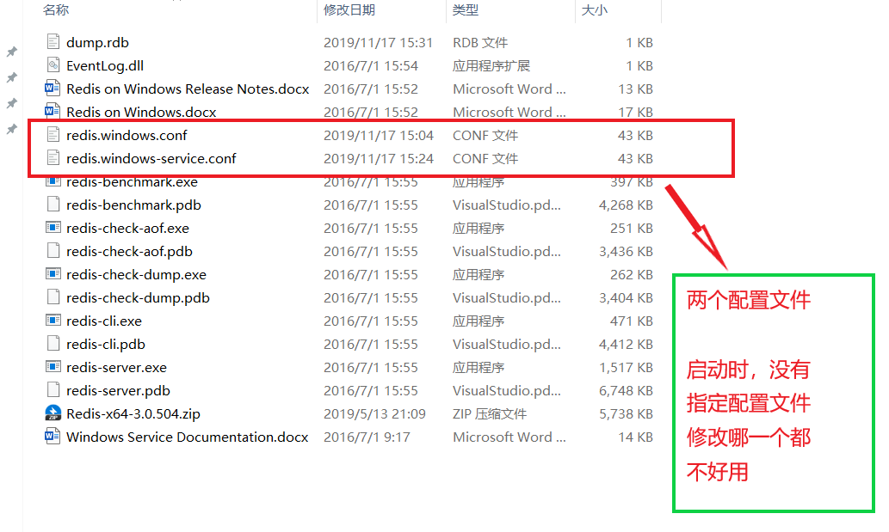

   - windows 下，查看网上资料说：`redis.windows-service.conf` 是默认配置文件，但是修改端口号，在没有指定配置文件启动 Redis 并不好使 `redis-server.exe`，`redis.windows.conf` 一样的效果（感觉可能原因是 Redis 自动维护了配置，在没有指定配置文件时 ）

   - 指定配置文件（先切换到 Redis 文件夹下）

     1. `redis-server.exe redis.windows-service.conf` 

        启动不了 Redis，应该是日志文件的路径不对，所以启动不了

     2. `redis-server.exe redis.windows.conf`

        可以启动，修改配置成功

   - 总结启动 Redis 

     1. 使用指定配置文件启动

        `redis-server.exe redis.windows.conf`

3. 修改配置文件的一些配置，复制 `redis.windows.conf` 文件，命名为 `redis.conf` 再做修改

   1. 端口号（可以修改）

      ```tex
      # Accept connections on the specified port, default is 6379.
      # If port 0 is specified Redis will not listen on a TCP socket.
      port 6379
      ```

   2. 绑定 IP

      ```tex
      # By default Redis listens for connections from all the network interfaces
      # available on the server. It is possible to listen to just one or multiple
      # interfaces using the "bind" configuration directive, followed by one or
      # more IP addresses.
      #
      # Examples:
      #
      # bind 192.168.1.100 10.0.0.1
      # bind 127.0.0.1
      ```

      解释：此配置文件，没有绑定 IP，所以任何 IP 都不限制

   3. 日志文件存放地址（修改）

      ```tex
      # Specify the log file name. Also 'stdout' can be used to force
      # Redis to log on the standard output. 
      # 将日志存入文档中
      # logfile "E:/Redis_data/Logs/redis_log.txt"
      # 标准输出，在命令窗口
      logfile stdout
      ```

      解释：日志文件存放位置

   4. Redis 数据库的数量（默认没有名字从 0 到 15）

      ```tex
      # Set the number of databases. The default database is DB 0, you can select
      # a different one on a per-connection basis using SELECT <dbid> where
      # dbid is a number between 0 and 'databases'-1
      databases 16
      ```

   5. Redis 是基于内存的读写，但是也会向硬盘存储

      ```tex
      #   In the example below the behaviour will be to save:
      #   after 900 sec (15 min) if at least 1 key changed
      #   after 300 sec (5 min) if at least 10 keys changed
      #   after 60 sec if at least 10000 keys changed
      #
      #   Note: you can disable saving completely by commenting out all "save" lines.
      #
      #   It is also possible to remove all the previously configured save
      #   points by adding a save directive with a single empty string argument
      #   like in the following example:
      #
      #   save ""
      
      save 900 1
      save 300 10
      save 60 10000
      ```

      解释：保存形式，900 秒内，更新超过 1 次、300 秒内，更新超过 10 次、60 秒内，更新超过 10000 次，会向硬盘写入。如果不想向硬盘写入，可以将 `save 900 1` 这样的 3 个语句注释，将 `save ""` 打开。查询不算更新。

   6. __物理存储数据库的名字及地址__（修改）

      - 物理存储数据库名

        ```tex
        # The filename where to dump the DB
        dbfilename dump.rdb
        ```

        解释：可以修改嘛

      - 数据库存放位置（文件夹）

        ```sql
        # The working directory.
        #
        # The DB will be written inside this directory, with the filename specified
        # above using the 'dbfilename' configuration directive.
        #
        # The Append Only File will also be created inside this directory.
        #
        # Note that you must specify a directory here, not a file name.
        dir E:/Redis_data/db
        ```

### Redis 启动

1. 启动服务

   说明：开启 CMD 命令窗口，切换到 Redis 文件夹下（因为配置文件在那）

   - 命令
     1. `redis-server.exe redis.conf`
     2. `redis.conf` 为配置文件

   - 演示

     ```shell
     # 切换路径，输入命令
     D:\redis_data>redis-server.exe redis.conf
     # 日志信息标准输出
     [19488] 17 Nov 17:03:31.957 * Redis 3.0.504 (00000000/0) 64 bit, standalone mode, port 6379, pid 19488 ready to start.
     [19488] 17 Nov 17:03:31.957 # Server started, Redis version 3.0.504
     [19488] 17 Nov 17:03:31.973 * DB loaded from disk: 0.000 seconds
     [19488] 17 Nov 17:03:31.973 * The server is now ready to accept connections on port 6379
     
     ```

2. 客户端连接服务

   说明：再开启一个 CMD 命令窗口

   - 命令

     `redis-cli.exe`

   - 演示

     ```shell
     C:\Users\SS沈>redis-cli.exe
     127.0.0.1:6379> ping
     PONG
     127.0.0.1:6379>
     ```

###              数据格式、数据操作

说明：[Redis 中文命令大全](http://www.redis.cn/commands.html)

1. 数据格式格式介绍
   - Redis 是 key-value 的数据，所以每个数据都是一个键值对
   - __键__（key）的类型
     1. 字符串
   - __值__（value）的类型分为 5 种
     1. string：（字符串）
     2. hash：（哈希）
     3. list：（列表）
     4. set：（集合）
     5. zset：（有序集合）
   
2. 切换数据库

   - 介绍

     Redis 默认有 16 个数据库，数据库名称从 0 到 15，默认使用 0 的数据库

   - 语法

     `select 数据库名称`

     ```shell
     # 连接数据库
     C:\Users\SS沈>redis-cli.exe --raw
     # 默认连接 0 的数据库
     127.0.0.1:6379> keys *
     set_list
     zset_list
     i
     # 切换 1 的数据库
     127.0.0.1:6379> select 1
     OK
     127.0.0.1:6379[1]> keys *
     
     127.0.0.1:6379[1]>
     ```

3. __string__

   - 介绍

     1. string 是 Redis 最基本的类型
     2. 最大存储 512 MB 数据
     3. string是二进制安全的字符串（`"010101101"`），既可以为任何数据、比如，数字、图片、序列化对象等

   - Windows-cmd 命令行窗口问题（Linux 没有试过）

     1. 不加参数启动 Redis 客户端，录入中文显示乱码

        ```shell
        # 正常启动 Redis 客户端
        C:\Users\SS沈>redis-cli.exe
        # 录入键值对
        127.0.0.1:6379> set name "ﾶﾷￕﾽ￉￱ﾷ￰" # 乱码（斗战神佛）
        OK # 录入成功
        ```

     2. 取值是二进制字符串

        ```shell
        127.0.0.1:6379> get name
        "\xb6\xb7\xd5\xbd\xc9\xf1\xb7\xf0"
        ```

     3. 使用参数 `raw` 启动客户端，录入中文

        ```shell
        # 使用参数 raw
        C:\Users\SS沈>redis-cli.exe --raw
        127.0.0.1:6379> set name "ﾶﾷￕﾽ￉￱ﾷ￰" # 乱码（斗战神佛）
        OK # 录入成功
        ```

     4. 取值（成功）

        ```shell
        127.0.0.1:6379> get name
        斗战神佛
        ```

     5. 总结

        Windows-cmd 默认编码格式（GBK），一般都是用 UTF-8 编码啦！！，所以会出现一些问题。以下实例尽量不使用中文

   - 设置

     1. 设置 __键__ __值__ (key-value)

        `set key value`

        ```shell
        127.0.0.1:6379> set name_1 "Tom"
        OK
        127.0.0.1:6379>
        ```

     2. 设置键值及过期时间，以秒为单位

        `SETEX key seconds value`

        ```shell
        127.0.0.1:6379> SETEX name_2 1 "Jack"
        OK
        (2.21s)
        127.0.0.1:6379> get name2
                                 # 空值（Linux 下是 nil，Windows 是什么也没有）
        127.0.0.1:6379>
        ```

     3. 获取

        说明：根据键获取值，如果不存在此键，则返回 nil

        `get key`

        ```shell
        # 获取存在的键
        127.0.0.1:6379> get name
        tom
        # 获取不存在的键
        127.0.0.1:6379> get name_3
        
        127.0.0.1:6379>
        ```

     4. 根据多个键，后去多个值

        ` mget key [key1,key2...]`

        ```shell
        # name name_1 有值，name_2 没有此键
        127.0.0.1:6379> mget name name_1 name_2
        tom
        Tom
        
        127.0.0.1:6379>
        ```

     5. 运算（要求：值是数字）

        - 将 key 对应的 value 加 1

          `incr key`

          ```shell
          127.0.0.1:6379> get i
          3
          127.0.0.1:6379> incr i
          4
          127.0.0.1:6379> get i
          4
          ```

        - 将 key 对应的 value 加整数

          `incrby key increment`

          ```shell
          127.0.0.1:6379> get i
          4
          127.0.0.1:6379> incrby i 2
          6
          127.0.0.1:6379> get i
          6
          ```

        - 将 key 对应的 value 减 1

          `decr key`

          ```shell
          127.0.0.1:6379> get i
          6
          127.0.0.1:6379> decr i
          5
          127.0.0.1:6379> get i
          5
          ```

        - 将 key 对应的 value 减整数

          `decrby key decrement`

          ```shell
          127.0.0.1:6379> get i
          5
          127.0.0.1:6379> decrby i 2
          3
          127.0.0.1:6379> get i
          3
          ```

     6. 其他

        - 追加值

          `append key value`

          ```shell
          127.0.0.1:6379> get name
          tom
          127.0.0.1:6379> append name " jack"
          8                                  # 8 是字符串长度
          127.0.0.1:6379> get name
          tom jack                           # 结果显示
          ```

        - 获取值的长度

          `strlen key`

          ```shell
          127.0.0.1:6379> get name
          tom jack
          127.0.0.1:6379> strlen name
          8
          ```

4. __键的命令__

   - 查找键，参数支持正则

     `keys pattern`

     ```shell
     127.0.0.1:6379> keys *
     i
     name_1
     name
     (2.21s)
     ```

   - 判断键是否存在，如果存在返回 1，不存在返回 0

     `exists key [key1...]`

     ```shell
     # 存在的键 查询
     127.0.0.1:6379> exists name
     1
     # 不存在的键 查询
     127.0.0.1:6379> exists name_2
     0
     ```

   - 查看键对应的 value 的类型

     `type key`

     ```shell
     127.0.0.1:6379> type name
     string
     127.0.0.1:6379> type i
     string
     ```

     解释：value 的类型上面说过就 5 种，整型也是按照 string 存储的

   - 删除键及对应值

     `del key [key1...]`

     ```shell
     127.0.0.1:6379> keys *
     i
     name_1
     name
     127.0.0.1:6379> del i
     1
     # 删除了 i
     127.0.0.1:6379> keys *
     name_1
     name
     ```

   - 设置过期时间，以秒为单位

     说明：创建时，没有设置过期时间，则会一直存在，直到使用 `del` 移除，也可以使用它修改之前设置的过期时间（录入键值的时候设置的）

     `expire key seconds`

     ```shell
     # 查询全部的 key-value
     127.0.0.1:6379> keys *
     name_1
     name
     #  设置 name_1 过期时间为 100
     127.0.0.1:6379> expire name_1 100
     1
     # 查看 key-value 的有效时间
     127.0.0.1:6379> ttl name_1
     86
     ```

   - 查看有效时间，以秒为单位

     `ttl key`

     ```shell
     # 查看有效时间
     127.0.0.1:6379> ttl name_1
     86
     # 有效时间已过，被删除
     127.0.0.1:6379> ttl name_1
     -2
     # 验证
     127.0.0.1:6379> keys *
     name
     ```

5. __hash__

   说明：hash 用于存储对象，对象的格式为键值对（json ）

   - 设置

     `{name:"tom" gender: 0}` json 对象

     1. 设置单个属性

        `hset key field value` field 也是 string 类型

        ```shell
        # 注意格式 key filed value
        127.0.0.1:6379> hset stu_1 name "tom"
        1
        (2.23s)
        127.0.0.1:6379> type stu_1
        hash
        ```

     2. 设置多个属性

        `hmset key field value [filed value...]`

        ```shell
        127.0.0.1:6379> hmset stu_1 name "tom" gender 0
        OK
        127.0.0.1:6379> type stu_1
        hash
        ```

   - 获取

     1. 获取一个属性

        `hget key field`

        ```shell
        127.0.0.1:6379> hget stu_1 name
        tom
        ```

     2. 获取多个属性

        `hmset key filed field1..`

        ```shell
        127.0.0.1:6379> hmget stu_1 name gender
        tom
        0
        ```

     3. 获取所有属性值

        `hgetall key`

        ```shell
        127.0.0.1:6379> hgetall stu_1
        name
        tom
        gender
        0
        ```

     4. 获取所有的属性（field）

        `hkeys key`

        ```shell
        127.0.0.1:6379> hkeys stu_1
        name                        # field 属性值
        gender
        ```

     5. 返回包含属性的个数

        `hlen key`

        ```shell
        127.0.0.1:6379> hlen stu_1
        2
        ```

     6. 获取所有值

        `hvals key`

        ```shell
        127.0.0.1:6379> hvals stu_1
        tom
        0
        ```

     7. 其他

        - 判断属性是否存在

          `hexists key field`

          ```shell
          127.0.0.1:6379> hexists stu_1 name
          1
          ```

        - 删除属性及值

          `hdel key field [field1...]`

          ```shell
          127.0.0.1:6379> hdel stu_1 name
          1
          127.0.0.1:6379> hkeys stu_1
          gender
          ```

        - 返回值的字符串长度

          `hstrlen key field`

          出错！！！

6. __list__ 

   - 介绍

     1. 列表的元素类型为 string
     2. 按照插入顺序排序
     3. 在列表的头部或尾部添加元素
     4. 左右都可以进入数据
     5. 值没有键也会被删除

   - 设置

     1. 在左部插入数据

        `lpush key value [value...]`

        ```shell
        # 查看所有元素
        127.0.0.1:6379> lrange i 0 -1
        0
        # 从左侧插入元素
        127.0.0.1:6379> lpush i 1
        2                         # 返回元素个数
        # 查看所有元素
        127.0.0.1:6379> lrange i 0 -1
        1
        0
        ```

     2. 在右部插入数据

        `rpush key value [value...]`

        ```shell
        # 查看
        127.0.0.1:6379> lrange i 0 -1
        1
        0
        # 右侧添加
        127.0.0.1:6379> rpush i -1
        3
        # 查看
        127.0.0.1:6379> lrange i 0 -1
        1
        0
        -1
        ```

     3. 在一个指定元素的 __前 | 后__ 插入数据，从左边开始数

        `linset key before | after pivot value`

        参数：pivot 元素值

        ```shell
        # 在元素 0 之前插入一个 100
        127.0.0.1:6379> linsert i before 0 100
        4
        # 查看
        127.0.0.1:6379> lrange i 0 -1
        1
        100
        0
        -1
        # 在 0 之后插入一个 -100
        127.0.0.1:6379> linsert i after "0" -100
        5                                        # 返回元素当前个数
        127.0.0.1:6379> lrange i 0 -1
        1
        100
        0
        -100
        -1
        ```

   - 获取

     1. 移除并返回 key 对应的 list 左侧第一个值

        `lpop key`

        ```shell
        # 查看元素
        127.0.0.1:6379> lrange i 0 -1
        1
        100
        0
        -100
        -1
        # 左侧弹出
        127.0.0.1:6379> lpop i
        1                       # 弹出的值
        # 查看
        127.0.0.1:6379> lrange i 0 -1
        100
        0
        -100
        -1
        ```

     2. 移除并返回 右侧第一个值

        `rpop key`

        ```shell
        # 查看
        127.0.0.1:6379> lrange i 0 -1
        100
        0
        -100
        -1
        # 右侧弹出
        127.0.0.1:6379> rpop i
        -1
        # 查看
        127.0.0.1:6379> lrange i 0 -1
        100
        0
        -100
        ```

     3. 获取部分 list 元素值

        `lrange key start stop`

        ```shell
        # 获取全部元素
        127.0.0.1:6379> lrange i 0 -1
        100
        0
        -100
        ```

   - 其他

     1. 返回 list 长度

        `llen key`

        ```shell
        127.0.0.1:6379> llen i
        3
        ```

     2. 返回 list 索引对应的元素

        `lindex key index`

        ```shell
        127.0.0.1:6379> lindex i 0
        100
        ```

     3. 裁剪列表

        `ltrim key start stop`

        ```shell
        # 原始 list
        127.0.0.1:6379> lrange i 0 -1
        0
        -100
        1
        2
        3
        4
        5
        # 裁剪 索引 1 到 3
        127.0.0.1:6379> ltrim i 1 3
        OK
        # 结果
        127.0.0.1:6379> lrange i 0 -1
        -100
        1
        2
        ```

7. __set__（集合）

   - 介绍

     1. 无序集合
     2. 元素为 string 类型
     3. 元素具有唯一性，不重复

   - 设置

     1. 添加元素

        `sadd key member [member...]`

        ```shell
        # 添加元素（重复的没有添加成功）
        127.0.0.1:6379> sadd set_list 4 1 2 3 3
        4                                    # 返回元素个数
        ```

     2. 获取（返回集合所有元素）

        `smembers key`

        ```shell
        # 元素无序性，不依赖添加顺序
        127.0.0.1:6379> smembers set_list
        1
        2
        3
        4
        (1.43s)
        ```

     3. 返回元素个数

        `scard key`

        ```shell
        127.0.0.1:6379> scard set_list
        4
        ```

   - 其他

     1. 求多个集合交集

        `sinter key1 key2 [key3...]`

     2. 求某一集合与其他集合的差集

        `sdiff key1 key2 [key3...]`

     3. 求多个集合的合集

        `sunion key1 key2 [key3...]`

     4. 判断元素是否在集合中

        `sismember key member`

        ```shell
        # 集合元素
        127.0.0.1:6379> smembers set_list
        1
        2
        3
        4
        # 判断 0 是否在集合中
        127.0.0.1:6379> sismember set_list 0
        0								  # 0 表示否
        # 判断 4 是否在集合中
        127.0.0.1:6379> sismember set_list 4
        1
        ```

8. __zset__

   - 介绍

     1. sort set ，有序集合
     2. 元素为 string 类型
     3. 元素具有唯一性，不重复
     4. 每个元素都会关联一个 double 类型的 score，表示权重，通过权大小将元素从小到大排序

   - 设置

     1. 添加

        `zadd key score member [socre1 menber1]`

        ```shell
        # 注意插入顺序，score value
        127.0.0.1:6379> zadd zset_list 0 0 1 1 3 2 2 3
        4
        (2.24s)
        ```

     2. 获取

        `zrange key start stop`

        ```shell
        # 权重越大，越靠前
        127.0.0.1:6379> zrange zset_list 0 -1
        0
        1
        3
        2
        (2.21s)
        ```

     3. 返回元素个数

        `zcard key`

   - 使用 score 获取

     1. 返回有序集合 key 中，score 值在 min 和 max 之间的成员个数

        `zcount key min max`

        ```shell
        127.0.0.1:6379> zrange zset_list 0 -1
        0
        1
        3
        2
        # 返回 score 在 0，3 之间的元素个数
        127.0.0.1:6379> zcount zset_list 0 3
        4
        127.0.0.1:6379> zcount zset_list 0 1
        2
        ```

     2. 返回有序集合 key 中，成员 member 的 score 值

        `zscore key member`

        ```shell
        # 元素集排列顺序
        127.0.0.1:6379> zrange zset_list 0 -1
        0
        1
        3
        2
        (2.21s)
        # 获取 元素 2 的 score
        127.0.0.1:6379> zscore zset_list 2
        3
        127.0.0.1:6379> zscore zset_list 3
        2
        ```

## Redis 高级操作

### 发布订阅

1. 介绍
   
   - 发布者不是计划发送消息给特定的接收者（订阅者），而是发布消息的消息分到不同的频道，不需要直到什么样的订阅者订阅
   - 订阅者对一个或多个频道感兴趣，只需要接受感兴趣的消息，不需要知道什么样的发布者发布的
   - 发布者和订阅者的解耦合可以带来更大的扩展性和更加动态的网络拓扑
   - 客户端发送到频道的消息，将会被推送到所有订阅者此频道的客户端
   - 客户端不需要主动去获取消息，只需要订阅频道，这个频道的内容就会被推送过来
   
2. 消息格式

   - 推送消息的格式包含 3 部分

     1. 第一部分：消息类型
     2. 第二部分：频道
     3. 第三部分：订阅频道数量、消息内容

   - 消息类型

     1. subscribe：表示订阅成功
     2. unsubscribe：表示取消订阅成功
     3. message：表示其终端发布消息

   - 3 种格式说明

     1. 如果消息类型是 __subscribe__ ，则第二部分是 __频道__ ，第三部分是订阅该频道的数量（多少个终端订阅了该频道）
     2. 如果消息类型是 __unsubscribe__ ，则第二部分是 __频道__ ，第三部分是现在订阅该频道的数量，如果是 0 则表示当前没有订阅任何频道，当在 __Pub / Sub__ 以外状态，客户端可以发出任何 __Redis__ 命令
     3. 如果消息类型是 __message__ ，则第二部分是 __原频道名称__，第三部分是 __消息的内容__（推送消息）

   - 命令

     1. 订阅

        `subscribe 频道名称 [频道名称1...]`

        ```shell
        C:\Users\SS沈>redis-cli.exe --raw
        127.0.0.1:6379> subscribe channel1
        subscribe           # 订阅频道
        channel1            # 频道
        1                   # 状态好像是（客户端状态）
        
        # 接受频道发布的消息
        message
        channel1
        hello world welcome
        ```

     2. 取消订阅

        不写参数，表示取消所有订阅

        `unsubscribe 频道名称 [频道名称1...]`

     3. 发布

        `publish 频道 消息`

        ```shell
        127.0.0.1:6379> publish channel1 "hello world,welcome" # 发布消息
        2                       # 被订阅频道状态
        ```

### 主从配置

1. 介绍

   - 从服务器，轮询主服务器
   - 可参考 MonogDB 副本集的理论

2. 配置主从服务器

   - 启用两台电脑 A 、B

     1. A 的 IP 为 IP_1
     2. B 的 IP 为 IP_2

   - 修改两台电脑的 Redis 的配置文件 （redis.conf）

     1. 主服务器 A

        ```tex
        # Examples:
        #
        # bind 192.168.1.100 10.0.0.1
        # bind 127.0.0.1
        bind IP_1
        ```

     2. 从服务器 B

        ```tex
        # Examples:
        #
        # bind 192.168.1.100 10.0.0.1
        # bind 127.0.0.1
        bind IP_2
        
        slaveof IP_1
        ```

3. 再次启动服务端，与客户端

   - 在主服务器上操作，从服务器可以有相同的操作和数据

### 待续......

   


