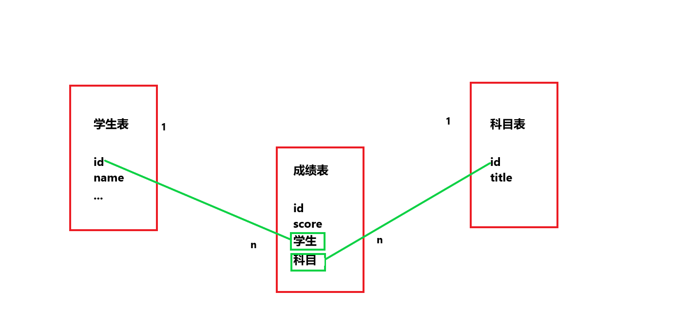

# 数据库技术

## 数据库概述

### 数据库 4 个基本概念

说明：数据、数据库、数据库管理系统、数据库系统是与数据库技术密切相关的 4 个概念

1. 数据（Data）

   - 数据是数据库存储的基本对象

   - 广义的理解认为数据有很多种，例如：文本（text）、图像（graph）、图像（image）、音频（audio）、视频（video）、学生的档案记录等，这些都是数据

   - 数据可做如下定义：描述事物的符号记录称之为数据
   - 数据的表型形式还不能完全表达其内容，需要经过解释，数据和关于数据解释是不可分的，例如：93 是一个数据，但可以表示某个学生某门课的成绩，也可以表示某个人的体重。__数据的解释是指对数据的含义说明，数据的含义称之为数据的语义，数据和语义是分不开的__

2. 数据库（DataBase，DB）

   - 数据库，顾名思义，是存放数据的仓库。只不过这个仓库是在计算机存储设备上，而且数据是按照一定格式存放的
   - 严格来将，数据库是长期存储在计算机内、有组织、可共享的大量数据集合。数据库中的数据按一定数据模型组织、描述存储，具有较小的冗余度（redundancy），较高的数据独立性（data independency）和一扩展性（scalability），并可为各种用户共享。
   - __概括来讲，数据库数据具有永久存储、有组织和可共享三个基本特点__

3. 数据库管理系统（DataBase Management System）

   - 如何科学组织和存储数据，如何高效地获取和维护数据。完成这个任务的是一个系统软件 ==> _数据库管理系统_ 

   - 数据库管理系统是位于用户与操作系统之间的一层数据管理软件。数据库管理系统和操作系统一样是计算机基础软件，也是一个大型复杂软件系统。主要功能包括以下几个方面：

     1. 数据定义功能

        数据库管理系统提供数据定义语句（Data Definition Language，DDL），用户通过它可以方便地对数据库中的数据对象的组成与结构进行定义

     2. 数据组织、存储和管理

        数据库管理系统要分类组织、存储和管理各种数据，包括数据字典、用户数据、数据存储路径等。要确定以何种文件结构和存储方式在存储级上组织这些数据，如何实现这些数据之间的联系。数据组织和存储的基本目标是提高存储空间利用率和方便存储，提供多种存储方法（如：索引查找、hash 查找、顺序查找等）来提高存储率。

     3. 数据操纵功能

        数据库管理系统还提供数据操纵语言（Data Manipulation Language，DML），用户可以使用它操纵数据库，实现对数据库的基本操作，如：查询、插入、删除和修改等。

     4. 数据库的事务管理和运行管理

        数据库在建立、运用和维护时由数据库管理系系统统一管理和控制，以确保事物的正确运行，保证数据的安全性、完整性、多用户对数据的并发使用及发生故障的系统恢复

     5. 数据库的建立和维护功能

        数据库的建立和维护功能包括数据库的初始数据的输入、转换功能，数据库的存储、恢复功能、数据库的重组功能和性能监视、分析功能。这些功能通常是由一些使用程序或管理工具完成

     6. 其他功能

        其他功能包括数据库管理系统与网络中其他软件系统的通信功能，一个数据库管理系统与另一个数据库管理系统或文件系统的数据转换功能，异构数据库之间的互访和互相操作功能

4. 数据库系统（DataBase System， DBS）

   - 数据库系统是由数据库、数据库管理系统（及应用开发工具）、应用程序和数据库管理员（DataBase Administrator，DBA）组成的存储、管理、处理和维护数据的系统

### 数据系统图

1. 其中数据库提供数据存储功能，数据库管理系统提供数据的组织、存储、管理和维护等基础功能，数据库应用系统根据应用需要使用数据库，数据库管理员负责全面的管理数据库系统

   - 如图

     

# 关系型数据库

## MySQL 

说明：[官方参考手册](https://dev.mysql.com/doc/refman/8.0/en/)    [MySQL 中文文档](https://www.shiyanlou.com/courses/9)

### 主要内容介绍

1. 主要知识点包括

   - E-R 模型
   - 数据库的 3 范式
   - mysql 的数据字段的类型、字段约束

   - 与 mysql 建立连接
   - 创建数据库、表，分别从图形界面和脚本界面两个方面讲解

2. 主要操作

   - 数据的操作：创建、删除
   - 表的操作：创建、修改、删除
   - 数据的操作：增加、删除、修改、查询，简称 crud（create、read、updata、delect）

### 数据库介绍

说明：数据库分为 __服务端__ 和 __客户端__

1. 服务端（server）：存储数据（一个服务端，可以连接多个客户端）
2. 客户端（client）：读写存储数据

### E-R 模型

说明：当前物理的数据库都是按照 E-R 模型进行设计的，E-R 模型是用 E-R 图面描述现实世界的概念模型，主要概念，包括 __实体、属性、实体之间的联系等__ 

1. E-R 解释

   - E 表示 entity，实体
   - R 表示 relationship，关系
   - attribute 表示属性（一个实体具有多个属性）

2. __在关系型数据库中，一个实体抽象为数据库中的一张表，一个属性为表中的一列，一行为实体的一个对象__

   - 学生表

     | 学号   | 姓名 | 性别 | 出生年份 | 专业   | 入学年份  |
     | ------ | ---- | ---- | -------- | ------ | --------- |
     | 123456 | 小明 | 男   | 2000.1.1 | 计算机 | 2019..9.1 |

   - 学生表中，学生的属性（学号、姓名等）为表的列，行为实体的对象

3. 实体之间的联系

   说明：实体之间的联系可以分为 3 种

   - 一对一联系 (1:1)

     例如：学校里一个班级只有一个正班长，而一个班长旨在一个班级中任职，则班级与班长之间具有一对一联系

   - 一对多联系 (1:n)

     例如：一个班级中有若干名学生，而每个学生只在一个班级中学习，则班级与学生之间具有一对多联系

   - 多对一联系 (m:n)

     例如：一门课程同时有若干个学生选修，而一个学生可以同时选修多门课程，则课程与学生之间具有多对多联系

4. 实体的联系（关系）表

   说明：待续

### 范式

说明：对设计数据库提出了以希尔规范，这些规范被称之为范式。后一个范式是建立在前一个范式的基础之上。

1. 第一范式（1NF）

   - 列不可拆分

2. 第二范式（2NF）

   - 唯一标识

     在一个实体表中，有一个属性可以唯一标识一个实体对象（表的一行）

3. 第三范式（3NF）

   - 引用主键

     在关系中，只能引用主键（2NF 的唯一标识）

### 数据完整性

说明：数据完整性（integrity）是指数据的正确新（correctness）和相容性（compat-ability）。

1. 数据的正确性

   - 数据的正确性是指数据是符合现实世界语音，反应当前实际状况

2. 数据相容性

   - 数据相容性是指数据库同一对象在不同关系表中的数据是符合逻辑的

3. 数据完整性例子

   - 例如：学生的学号必须是为一的，性别只能是男或女，本科学生年龄的取值范围为 [14, 50] 学生所选的可必须是学校开设的课程，学生所在院系必须是学校已成立的院系等

4. 数据类型

   说明：mysql 常见的几种数据类型

   - __数值类型__

     | 类型          | 大小                                    | 范围（有符号）          | 范围（无符号） | 用途     |
     | ------------- | --------------------------------------- | ----------------------- | -------------- | -------- |
     | tinyint       | 1 个字节                                | (-128, 127)             | (0, 255)       | 小整数型 |
     | int / integer | 4 个字节                                | (-8 388 608, 8 388 607) | (0, 65 535)    | 大整数型 |
     | decimal       | 对 decimal(M,D) 为最多 M位，小数占 D 位 | 依赖于 M，D             | 依赖于 M，D    | 小数值   |
     | bit           | bit(2),占 2 个位                        |                         |                | 布尔值   |

     解释：bit 一般用于状态的标记,因为 2 进制，所以一位二进制可以表示两种状态

   - __字符串类型__

     | 类型    | 大小          | 用途         |
     | ------- | ------------- | ------------ |
     | char    | 0-255 字节    | 定长字符串   |
     | varchar | 0-65 535 字节 | 变长字符串   |
     | text    | 0-65 535 字节 | 长文本字符串 |

     解释：char(4)，长度位 4 个字符，不足右边补空格，超出截取。varchar(4)，最长 4 个字符，可以不足，但超出截取

   - __日期和时间类型__

     | 类型     | 大小     | 范围                                      | 格式                | 用途             |
     | -------- | -------- | ----------------------------------------- | ------------------- | ---------------- |
     | date     | 3 个字节 | 1000-01-01 / 9999-12-31                   | YYYY-MM-DD          | 日期值           |
     | time     | 3 个字节 | -838:59:59 / 838:59:59                    | HH:MM:SS            | 时间值           |
     | datetime | 8 个字节 | 1000-01-10 00:00:00 / 9999-12-31 23:59:59 | YYYY-MM-DD HH:MM:SS | 混合时间和日期值 |

5. 约束

   - 主键：（primary key）

     在表中唯一表示一个对象的属性，称为主键（对象为一行数据，属性为一列），不重复、默认不为空

   - 非空：（not null）

     输入数据时，不允许为空

   - 唯一：（unique）

     在表中，每一个对象的属性（添加 unique 约束）唯一

   - 默认：（default）

     录入数据时，该属性有默认值（年龄默认 20）不录入该属性，则该属性值为 20，如录入已录入为准

   - 外键：（foreign key）

     实体表的属性在关系表中存在，且可以标识实体表的每一个实体对象

### Navicat 操作

说明：[参考文档](https://www.navicat.com.cn/support/online-manual)    启动数据库 `mysql -h hostname -P port -u username -p password` 。一般直接使用 `mysql -u root -p` ，因为是连接自己的主机，使用默认的端口号，密码为空，所以简单。可以输入 `mysql --help` ，查看帮助

1. 用户连接

   - 如图

     

2. 创建数据库

   - 如图

     

3. 创建表

   - 如图

     

### 逻辑删除

说明：使用一个字段标记是否删除

1. 数据的重要性，要根据实际开发决定
2. 对于重要的数据，并不希望物理删除，一旦删除，数据无法找回。
3. 对于重要的数据，会设置一个 isDelete 的属性（列），类型为 bit ，表示逻辑删除。
4. 大量增长的非重要数据，可以进行物理删除。

## 命令脚本操作

### 数据库、表的创建删除等操作

说明：使用命令窗口对 mysql 进行操作   [mysql 语法文档](https://dev.mysql.com/doc/refman/8.0/en/)

1. 显示当前 mysql 中的所有数据库

   - `show databases;`

     ```sql
     mysql> show databases;
     +--------------------+
     | Database           |
     +--------------------+
     | information_schema |
     | mysql              |
     | performance_schema |
     | python1            |
     | sys                |
     +--------------------+
     5 rows in set (0.00 sec)
     ```

2. 显示 mysql 版本、当前时间

   - 显示版本号 `select version();`

   - 显示当前时间 `select now();`

     ```sql
     mysql> select version();
     +-----------+
     | version() |
     +-----------+
     | 5.7.21    |
     +-----------+
     1 row in set (0.00 sec)
     
     mysql> select now();
     +---------------------+
     | now()               |
     +---------------------+
     | 2019-10-26 09:12:16 |
     +---------------------+
     1 row in set (0.00 sec)
     ```

3. 删除数据库

   - `drop database python1`

     ```sql
     mysql> drop database python1;
     Query OK, 0 rows affected (2.46 sec)
     
     mysql> show databases;
     +--------------------+
     | Database           |
     +--------------------+
     | information_schema |
     | mysql              |
     | performance_schema |
     | sys                |
     +--------------------+
     4 rows in set (0.00 sec)
     ```

4. 创建数据库

   - `create database python3 charset=utf8;` 需要指定编码格式

     ```sql
     mysql> create database python3;
     Query OK, 1 row affected (0.01 sec)
     
     mysql> show databases;
     +--------------------+
     | Database           |
     +--------------------+
     | information_schema |
     | mysql              |
     | performance_schema |
     | python3            |
     | sys                |
     +--------------------+
     5 rows in set (0.00 sec)
     ```

5. 切换使用数据库

   - `use python3`

   - `select database();` 查看当前使用的数据库

     ```sql
     mysql> use python3;
     Database changed
     mysql> select database();
     +------------+
     | database() |
     +------------+
     | python3    |
     +------------+
     1 row in set (0.00 sec)
     ```

6. 查看数据库的表

   - `show tables;` 当前数据库没有表

     ```sql
     mysql> show tables;
     Empty set (0.01 sec)
     ```

7. 创建表

   - `create table 表名(列类型 [是否自动增长] 约束 默认值\是否为空);` 多列使  ',' 分割

     ```sql
     mysql> create table students(
         -> id int auto_increment primary key not null,
         -> name varchar(10) not null,
         -> gender bit(1) default b'1',
         -> birthday date);
     Query OK, 0 rows affected (0.43 sec)
     ```

     解释：使用 bit 表明占用几个 bit 为，值为 b'1' 标记为二进制数值

8. 查看表的结构

   - `desc 表名`

     ```sql
     mysql> show tables;
     +-------------------+
     | Tables_in_python3 |
     +-------------------+
     | students          |
     +-------------------+
     1 row in set (0.00 sec)
     
     mysql> desc students;
     +----------+-------------+------+-----+---------+----------------+
     | Field    | Type        | Null | Key | Default | Extra          |
     +----------+-------------+------+-----+---------+----------------+
     | id       | int(11)     | NO   | PRI | NULL    | auto_increment |
     | name     | varchar(10) | NO   |     | NULL    |                |
     | gender   | bit(1)      | YES  |     | b'1'    |                |
     | birthday | date        | YES  |     | NULL    |                |
     +----------+-------------+------+-----+---------+----------------+
     4 rows in set (0.00 sec)
     ```

9. 删除表

   - `drop table 表名`

     ```sql
     mysql> show tables;
     +-------------------+
     | Tables_in_python3 |
     +-------------------+
     | students          |
     | test              |
     +-------------------+
     2 rows in set (0.00 sec)
     
     mysql> drop table test;
     Query OK, 0 rows affected (0.13 sec)
     
     mysql> show tables;
     +-------------------+
     | Tables_in_python3 |
     +-------------------+
     | students          |
     +-------------------+
     1 row in set (0.00 sec)
     ```

10. 更改表名

   - `rename table name to new_name`

     ```sql
     mysql> show tables;
     +-------------------+
     | Tables_in_python3 |
     +-------------------+
     | students          |
     | test              |
     +-------------------+
     2 rows in set (0.00 sec)
     
     mysql> rename table test to new_test;
     Query OK, 0 rows affected (0.97 sec)
     
     mysql> show tables;
     +-------------------+
     | Tables_in_python3 |
     +-------------------+
     | new_test          |
     | students          |
     +-------------------+
     2 rows in set (0.00 sec)
     ```

11. 修改表中的属性、属性定义

    说明：对于表的修改，会有很多麻烦，最好在构建表的时候多一些考虑。表中一旦存在数据，修改表的结构会引来一堆错误，也有可能数据丢失，所以对于表的修改慎重操作   [参考文档](https://dev.mysql.com/doc/refman/5.5/en/alter-table.html#alter-table-add-drop-column) <br> __删除这块应该看一下官方文档__

    - `alter table 表名 add | change | modify | drop 列名 类型 [默认值] 约束`

    - 在 students 增加 age 列 <br>`alter table students add column age int not null;`

      ```sql
      mysql> alter table students add column age int not null;
      Query OK, 0 rows affected (2.71 sec)
      Records: 0  Duplicates: 0  Warnings: 0
      
      mysql> desc students;
      +----------+-------------+------+-----+---------+----------------+
      | Field    | Type        | Null | Key | Default | Extra          |
      +----------+-------------+------+-----+---------+----------------+
      | id       | int(11)     | NO   | PRI | NULL    | auto_increment |
      | name     | varchar(10) | NO   |     | NULL    |                |
      | gender   | bit(1)      | YES  |     | b'1'    |                |
      | birthday | date        | YES  |     | NULL    |                |
      | age      | int(11)     | NO   |     | NULL    |                |
      +----------+-------------+------+-----+---------+----------------+
      5 rows in set (0.00 sec)
      ```

    - 在 students 修改 age 列名字段的数据类型 <br> `alter table students modify age varchar(10)`

      ```sql
      mysql> alter table students modify age varchar(10);
      Query OK, 0 rows affected (2.67 sec)
      Records: 0  Duplicates: 0  Warnings: 0
      
      mysql> desc students;
      +----------+-------------+------+-----+---------+----------------+
      | Field    | Type        | Null | Key | Default | Extra          |
      +----------+-------------+------+-----+---------+----------------+
      | id       | int(11)     | NO   | PRI | NULL    | auto_increment |
      | name     | varchar(10) | NO   |     | NULL    |                |
      | gender   | bit(1)      | YES  |     | b'1'    |                |
      | birthday | date        | YES  |     | NULL    |                |
      | age      | varchar(10) | YES  |     | NULL    |                |
      +----------+-------------+------+-----+---------+----------------+
      5 rows in set (0.00 sec)
      ```

      解释：` alter table students change age age int;` 使用 change 修改字段定义

    - 在 students 修改列名。__注意：修改列名，需要重新写明列定义__ <br> `alter table students change age grade int not null;`

      ```sql
      mysql> alter table students change age grade int not null;
      Query OK, 0 rows affected (2.53 sec)
      Records: 0  Duplicates: 0  Warnings: 0
      
      mysql> desc students;
      +----------+-------------+------+-----+---------+----------------+
      | Field    | Type        | Null | Key | Default | Extra          |
      +----------+-------------+------+-----+---------+----------------+
      | id       | int(11)     | NO   | PRI | NULL    | auto_increment |
      | name     | varchar(10) | NO   |     | NULL    |                |
      | gender   | bit(1)      | YES  |     | b'1'    |                |
      | birthday | date        | YES  |     | NULL    |                |
      | grade    | int(11)     | NO   |     | NULL    |                |
      +----------+-------------+------+-----+---------+----------------+
      5 rows in set (0.00 sec)
      ```

    - 在 students 删除 grade 列 <br> ` alter table students drop column grade` 

      ```sql
      mysql> alter table students drop column grade;
      Query OK, 0 rows affected (2.55 sec)
      Records: 0  Duplicates: 0  Warnings: 0
      
      mysql> desc students;
      +----------+-------------+------+-----+---------+----------------+
      | Field    | Type        | Null | Key | Default | Extra          |
      +----------+-------------+------+-----+---------+----------------+
      | id       | int(11)     | NO   | PRI | NULL    | auto_increment |
      | name     | varchar(10) | NO   |     | NULL    |                |
      | gender   | bit(1)      | YES  |     | b'1'    |                |
      | birthday | date        | YES  |     | NULL    |                |
      +----------+-------------+------+-----+---------+----------------+
      4 rows in set (0.00 sec)
      ```

12. 查看表的创建语句

    - `show create table students`

      ```sql
      mysql> show create table students;
      +----------+------------------------------------------------------------------------------------------------------------------------------------------------------------------------------------------------------------------------------+
      | Table    | Create Table                                                                                                                                                                                                                 |
      +----------+------------------------------------------------------------------------------------------------------------------------------------------------------------------------------------------------------------------------------+
      | students | CREATE TABLE `students` (
        `id` int(11) NOT NULL AUTO_INCREMENT,
        `name` varchar(10) NOT NULL,
        `gender` bit(1) DEFAULT b'1',
        `birthday` date DEFAULT NULL,
        PRIMARY KEY (`id`)
      ) ENGINE=InnoDB DEFAULT CHARSET=latin1 |
      +----------+------------------------------------------------------------------------------------------------------------------------------------------------------------------------------------------------------------------------------+
      1 row in set (0.00 sec)
      ```

      解释：`ENGINE=InnoDB DEFAULT CHARSET=latin1` 引擎使用 InnoDB（引擎不同，导致底层数据结构不同），数据库的编码格式使用 latin1

### 数据操作

说明：数据操作是基于数据库下的表的操作， 以上面建立的 students表为例

1. 查询

   - `select * from 表名` 

     说明：查询表的所有数据 ，* 表示所有

2. 单条插入数据

   说明：__二进制数据，在界面显示效果不一样，在win10 的 comd 中 b'0' 就像没有，b'1'  为一个框__

   - `insert into 表名 value(值1, 值2...)` <br>`insert into 表名(列1, 列2...) value(值1, 值2...)`

     说明：__插入数据顺序按照表的属性顺序填写，自动增长的属性也添加数据，一般使用 0 填充，插入成功后已自动增长数据为准__

     

   -  全列插入 `insert into students value(0, 'tom', 1, '1990-1-1', 0);`

     ```sql
     mysql> insert into students value(0, 'tom', 1, '1990-1-1', 0);
     Query OK, 1 row affected (2.27 sec)
     
     mysql> select * from students;
     +----+------+--------+------------+----------+
     | id | name | gender | birthday   | isDelete |
     +----+------+--------+------------+----------+
     |  1 | tom  |       | 1990-01-01 |          |
     +----+------+--------+------------+----------+
     1 row in set (0.00 sec)
     ```

   - 部分列插入 `insert into students(name) value('jack');`

     说明：__没有指定的列属性 1.允许为空，2.自增列，3.有默认值__

     ```sql
     mysql> insert into students(name) value('jack');
     Query OK, 1 row affected (2.25 sec)
     
     mysql> select * from students;
     +----+------+--------+------------+----------+
     | id | name | gender | birthday   | isDelete |
     +----+------+--------+------------+----------+
     |  1 | tom  |       | 1990-01-01 |          |
     |  2 | jack |       | NULL       |          |
     +----+------+--------+------------+----------+
     2 rows in set (0.01 sec)
     ```

3. 一次性插入多条数据（Mysql 特有的性质）

   - `insert into 表名 value(值1, 值2...) ,(值1, 值2...)...` <br>`insert into 表名(列1, 列2...) value(值1, 值2...), (值1, 值2...)...`

   - 全列插入 `insert into students value(0, '孙悟空', 1, '1991-1-1', 0), (0, '猪八戒', 1, '1991-3-2', 0), (0, '唐三藏', 1, '1995-5-5', 0), (0, '沙僧', 1, '1992-2-2', 0);`

     ```sql
     mysql> insert into students value(0, '孙悟空', 1, '1991-1-1', 0), (0, '猪八戒', 1, '1991-3-2', 0), (0, '唐三藏', 1, '1995-5-5', 0), (0, '沙僧', 1, '1992-2-2', 0);
     Query OK, 4 rows affected (0.05 sec)
     Records: 4  Duplicates: 0  Warnings: 0
     
     mysql> select * from students;
     +----+--------+--------+------------+----------+
     | id | name   | gender | birthday   | isDelete |
     +----+--------+--------+------------+----------+
     |  1 | tom    |       | 1990-01-01 |          |
     |  2 | jack   |       | NULL       |          |
     |  3 | 孙悟空 |       | 1991-01-01 |          |
     |  4 | 猪八戒 |       | 1991-03-02 |          |
     |  5 | 唐三藏 |       | 1995-05-05 |          |
     |  6 | 沙僧   |       | 1992-02-02 |          |
     +----+--------+--------+------------+----------+
     6 rows in set (0.29 sec)
     ```

   - 部分列插入 `insert into students(name) value('哪吒'), ('二郎神'), ('托塔天王');`

     ```sql
     mysql> insert into students(name) value('哪吒'), ('二郎神'), ('托塔天王');
     Query OK, 3 rows affected (2.24 sec)
     Records: 3  Duplicates: 0  Warnings: 0
     
     mysql> select * from students;
     +----+----------+--------+------------+----------+
     | id | name     | gender | birthday   | isDelete |
     +----+----------+--------+------------+----------+
     |  1 | tom      |       | 1990-01-01 |          |
     |  2 | jack     |       | NULL       |          |
     |  3 | 孙悟空   |       | 1991-01-01 |          |
     |  4 | 猪八戒   |       | 1991-03-02 |          |
     |  5 | 唐三藏   |       | 1995-05-05 |          |
     |  6 | 沙僧     |       | 1992-02-02 |          |
     |  7 | 哪吒     |       | NULL       |          |
     |  8 | 二郎神   |       | NULL       |          |
     |  9 | 托塔天王 |       | NULL       |          |
     +----+----------+--------+------------+----------+
     9 rows in set (0.00 sec)
     ```

4. 修改数据操作

   说明：对现有数据进行修改

   - `update 表名 set 列1=值1, 列2=值2... where 条件`

     说明：__可以一次修改一行，也可以一次修改多行，关键看 where 条件满足什么，如果没有写 where 表中数据就全部被修改__

   - 修改一行数据 `update students set gender=b'0' where name='哪吒';`

     ```sql
     mysql> update students set gender=b'0' where name='哪吒';
     Query OK, 1 row affected (0.39 sec)
     Rows matched: 1  Changed: 1  Warnings: 0
     
     mysql> select * from students;
     +----+----------+--------+------------+----------+
     | id | name     | gender | birthday   | isDelete |
     +----+----------+--------+------------+----------+
     |  1 | tom      |       | 1990-01-01 |          |
     |  2 | jack     |       | NULL       |          |
     |  3 | 孙悟空   |       | 1991-01-01 |          |
     |  4 | 猪八戒   |       | 1991-03-02 |          |
     |  5 | 唐三藏   |       | 1995-05-05 |          |
     |  6 | 沙僧     |       | 1992-02-02 |          |
     |  7 | 哪吒     |        | NULL       |          |
     |  8 | 二郎神   |       | NULL       |          |
     |  9 | 托塔天王 |       | NULL       |          |
     +----+----------+--------+------------+----------+
     9 rows in set (0.00 sec)
     ```

   - 不写 where 条件 `update students set isDelete=1;`

     ```sql
     mysql> update students set isDelete=1;
     Query OK, 9 rows affected (2.23 sec)
     Rows matched: 9  Changed: 9  Warnings: 0
     
     mysql> select * from students;
     +----+----------+--------+------------+----------+
     | id | name     | gender | birthday   | isDelete |
     +----+----------+--------+------------+----------+
     |  1 | tom      |       | 1990-01-01 |         |
     |  2 | jack     |       | NULL       |         |
     |  3 | 孙悟空   |       | 1991-01-01 |         |
     |  4 | 猪八戒   |       | 1991-03-02 |         |
     |  5 | 唐三藏   |       | 1995-05-05 |         |
     |  6 | 沙僧     |       | 1992-02-02 |         |
     |  7 | 哪吒     |        | NULL       |         |
     |  8 | 二郎神   |       | NULL       |         |
     |  9 | 托塔天王 |       | NULL       |         |
     +----+----------+--------+------------+----------+
     9 rows in set (0.00 sec)
     ```

5. 删除（物理是删除、逻辑删除）

   - 物理删除 `delete from 表名 where 条件`

   - 物理删除 `delete from students where id=8;`

     ```sql
     mysql> delete from students where id=8;
     Query OK, 1 row affected (2.32 sec)
     
     mysql> select * from students;
     +----+----------+--------+------------+----------+
     | id | name     | gender | birthday   | isDelete |
     +----+----------+--------+------------+----------+
     |  1 | tom      |       | 1990-01-01 |          |
     |  2 | jack     |       | NULL       |          |
     |  3 | 孙悟空   |       | 1991-01-01 |          |
     |  4 | 猪八戒   |       | 1991-03-02 |          |
     |  5 | 唐三藏   |       | 1995-05-05 |          |
     |  6 | 沙僧     |       | 1992-02-02 |          |
     |  7 | 哪吒     |        | NULL       |          |
     |  9 | 托塔天王 |       | NULL       |          |
     +----+----------+--------+------------+----------+
     8 rows in set (0.00 sec)
     ```

     解释：id=8 的数据没有，也恢复不了

   - 逻辑删除 ` update students set isDelete=1 where id=6; `

     说明：逻辑删除使用列属性标记，实际上就是修改数据

     ```sql
     mysql> update students set isDelete=1 where id=6;
     Query OK, 1 row affected (2.23 sec)
     Rows matched: 1  Changed: 1  Warnings: 0
     
     mysql> select * from students;
     +----+----------+--------+------------+----------+
     | id | name     | gender | birthday   | isDelete |
     +----+----------+--------+------------+----------+
     |  1 | tom      |       | 1990-01-01 |          |
     |  2 | jack     |       | NULL       |          |
     |  3 | 孙悟空   |       | 1991-01-01 |          |
     |  4 | 猪八戒   |       | 1991-03-02 |          |
     |  5 | 唐三藏   |       | 1995-05-05 |          |
     |  6 | 沙僧     |       | 1992-02-02 |         |
     |  7 | 哪吒     |        | NULL       |          |
     |  9 | 托塔天王 |       | NULL       |          |
     +----+----------+--------+------------+----------+
     8 rows in set (0.00 sec)
     ```

     解释：使用属性 isDelete 标记数据是否被删除

### 备份与恢复

说明：项目迁移，就是将数据移到另一个服务器

1. 备份

   说明：Linux 进入 __超级管理员__ --> __进入 mysql 数据库目录（数据存放目录）__ <br> windows 不用（前提将 mysql 加入环境变量中），都不用进入 Mysql 用户交互界面

   - 运行 `mysqldump -h 主机 -P 端口号 -u root -p 数据库名 > path\xx.sql`

     ```sql
     # 开始备份
     D:\>mysqldump -u root -p python3 > C:\Users\SS沈\Desktop\bak.sql
     Enter password:
     # 备份完成
     D:\>
     ```

     解释：我这是客户端与服务器在一台主机上（win10），端口号默认，所以没有写

2. 数据恢复

   说明：__数据备份只对表的备份，不对数据库备份， 所以恢复时，需要创建数据库，再对数据进行恢复__

   - 连接 mysql，创建数据库

   - 退出 mysql 交互界面

   - 运行 `mysql -h 主机 -P 端口号 -u root -p 数据库名 < path\xx.sql`

     ```sql
     # 开始恢复数据
     D:\>mysql -u root -p py3 < C:\Users\SS沈\Desktop\bak.sql
     Enter password:
     # 恢复完成
     
     # 进入 mysql 交互界面
     D:\>mysql -u root -p
     
     # 进入之前创建好的数据库 py3
     mysql> use py3
     Database changed
     mysql> show tables;
     +---------------+
     | Tables_in_py3 |
     +---------------+
     | students      |
     +---------------+
     1 row in set (0.00 sec)
     
     # 查看表的的数据
     mysql> select * from students;
     +----+----------+--------+------------+----------+
     | id | name     | gender | birthday   | isDelete |
     +----+----------+--------+------------+----------+
     |  1 | tom      |       | 1990-01-01 |          |
     |  2 | jack     |       | NULL       |          |
     |  3 | 孙悟空   |       | 1991-01-01 |          |
     |  4 | 猪八戒   |       | 1991-03-02 |          |
     |  5 | 唐三藏   |       | 1995-05-05 |          |
     |  6 | 沙僧     |       | 1992-02-02 |         |
     |  7 | 哪吒     |        | NULL       |          |
     |  9 | 托塔天王 |       | NULL       |          |
     +----+----------+--------+------------+----------+
     8 rows in set (0.00 sec)
     ```

## 数据查询（单表操作）

说明：表默认使用 students 的这张表（上面有所介绍）

```sql
mysql> select * from students;
+----+----------+--------+------------+----------+
| id | name     | gender | birthday   | isDelete |
+----+----------+--------+------------+----------+
|  1 | tom      |       | 1990-01-01 |          |
|  2 | jack     |       | NULL       |          |
|  3 | 孙悟空   |       | 1991-01-01 |          |
|  4 | 猪八戒   |       | 1991-03-02 |          |
|  5 | 唐三藏   |       | 1995-05-05 |          |
|  6 | 沙僧     |       | 1992-02-02 |         |
|  7 | 哪吒     |        | NULL       |          |
|  9 | 托塔天王 |       | NULL       |          |
+----+----------+--------+------------+----------+
8 rows in set (0.00 sec)
```

### 查询介绍

1. 基本语法介绍

   - 查询的基本语法

     `select * from 表名;`

   - `from` 关键字后面写__表名__，表示数据来源于这张表

   - `select` 关键字后面写__列名__ ，如果是 `*` 表示表中所有列

   - `select` 后面的列名部分，可以使用 `as` 为列起别名，别名会出现在 __结果集__中（结果集：是某次查询的结果）

     `select id as '学号',name as '姓名' from students;`

   - 如果查询多个列，可以使用 `,` 分割

     `select id,name from students;`

### 消除查询结果集重复行 distinct

1. 消除重复行基本语法

   说明：重复行是相对于整个查询结果集来说的，重点在 __行__ 上

   - 使用关键字 `distinct` ，在 select 后面、列名前面（因为消除重复行，所以一次查询使用一次，而不是喝查询列有关）

     `select distinct 列名1,列名2... from 表名`

2. 使用对比

   - 不使用 distinct

     ```sql
     mysql> select gender from students;
     +--------+
     | gender |
     +--------+
     |       |
     |       |
     |       |
     |       |
     |       |
     |       |
     |        |
     |       |
     +--------+
     8 rows in set (0.00 sec)
     ```

   - 使用 distinct

     ```sql
     mysql> select distinct gender from students;
     +--------+
     | gender |
     +--------+
     |       |
     |        |
     +--------+
     2 rows in set (2.26 sec)
     ```

   - 查询多列使用 distinct

     说明：distinct 去重，是相对于查询结果集的 __行中每一列都相同才会去重__

     ```sql
     mysql> select distinct name as '姓名',gender as '性别' from students;
     +----------+------+
     | 姓名     | 性别 |
     +----------+------+
     | tom      |     |
     | jack     |     |
     | 孙悟空   |     |
     | 猪八戒   |     |
     | 唐三藏   |     |
     | 沙僧     |     |
     | 哪吒     |      |
     | 托塔天王 |     |
     +----------+------+
     8 rows in set (0.01 sec)
     ```

### 查询体条件 where

说明：使用 where 子句对表中数据进行帅选，结果为 True 的行会出现在结果集中

1. 基本语法

   - `select * from 表名 where 条件;`

2. 比较运算符

   | 符号    | 作用     |
   | ------- | -------- |
   | =       | 等于     |
   | >       | 大于     |
   | >=      | 大于等于 |
   | <       | 小于     |
   | <=      | 小于等于 |
   | != \ <> | 不等于   |

3. 使用方式

   - 查询 id 大于 3 

     ```sql
     mysql> select * from students where id > 3;
     +----+----------+--------+------------+----------+
     | id | name     | gender | birthday   | isDelete |
     +----+----------+--------+------------+----------+
     |  4 | 猪八戒   |       | 1991-03-02 |          |
     |  5 | 唐三藏   |       | 1995-05-05 |          |
     |  6 | 沙僧     |       | 1992-02-02 |         |
     |  7 | 哪吒     |        | NULL       |          |
     |  9 | 托塔天王 |       | NULL       |          |
     +----+----------+--------+------------+----------+
     5 rows in set (2.33 sec)
     ```

   - 查询不是 __哪吒__ 的学生

     ```sql
     mysql> select * from students where name != '哪吒';
     +----+----------+--------+------------+----------+
     | id | name     | gender | birthday   | isDelete |
     +----+----------+--------+------------+----------+
     |  1 | tom      |       | 1990-01-01 |          |
     |  2 | jack     |       | NULL       |          |
     |  3 | 孙悟空   |       | 1991-01-01 |          |
     |  4 | 猪八戒   |       | 1991-03-02 |          |
     |  5 | 唐三藏   |       | 1995-05-05 |          |
     |  6 | 沙僧     |       | 1992-02-02 |         |
     |  9 | 托塔天王 |       | NULL       |          |
     +----+----------+--------+------------+----------+
     7 rows in set (2.23 sec)
     ```

4. 逻辑运算符

   | 符号 | 作用                             |
   | ---- | -------------------------------- |
   | and  | 逻辑与（条件同时满足）           |
   | or   | 逻辑或（满足其中一个）           |
   | not  | 逻辑非（在原有的基础上加一个非） |

5. 使用方式

   - 查询编号大于 5 的女同学

     ```sql
     mysql> select * from students where id > 5 and gender = 0;
     +----+------+--------+----------+----------+
     | id | name | gender | birthday | isDelete |
     +----+------+--------+----------+----------+
     |  7 | 哪吒 |        | NULL     |          |
     +----+------+--------+----------+----------+
     1 row in set (0.00 sec)
     ```

   - 查询编号小于 4 或没有被删除的学生

     说明：使用 or，两个条件满足一个就好

     ```sql
     mysql> select * from students where id < 4 or isDelete = 0;
     +----+----------+--------+------------+----------+
     | id | name     | gender | birthday   | isDelete |
     +----+----------+--------+------------+----------+
     |  1 | tom      |       | 1990-01-01 |         |
     |  2 | jack     |       | NULL       |          |
     |  3 | 孙悟空   |       | 1991-01-01 |          |
     |  4 | 猪八戒   |       | 1991-03-02 |          |
     |  5 | 唐三藏   |       | 1995-05-05 |          |
     |  7 | 哪吒     |        | NULL       |          |
     |  9 | 托塔天王 |       | NULL       |          |
     +----+----------+--------+------------+----------+
     7 rows in set (0.00 sec)
     ```

6. 模糊查询

   | 符号 | 作用             |
   | ---- | ---------------- |
   | like | 模糊查询关键字   |
   | %    | 表示任意多个字符 |
   | _    | 表示任意一个字符 |

7. 使用方式

   - 查询姓为 __孙__ 的学生（一共两个）

     说明：% 表示任意多个字符

     ```sql
     mysql> select * from students where name like '孙%';
     +----+--------+--------+------------+----------+
     | id | name   | gender | birthday   | isDelete |
     +----+--------+--------+------------+----------+
     |  3 | 孙悟空 |       | 1991-01-01 |          |
     | 10 | 孙行者 |       | NULL       |          |
     +----+--------+--------+------------+----------+
     2 rows in set (2.27 sec)
     ```

   - 查询姓唐的姓名为两个字的学生

     说明：_ 表示一个任意字符

     ```sql
     # 没有查询到，为 Empty 空
     mysql> select * from students where name like '唐_';
     Empty set (0.00 sec)
     
     mysql> select * from students where name like '唐__';
     +----+--------+--------+------------+----------+
     | id | name   | gender | birthday   | isDelete |
     +----+--------+--------+------------+----------+
     |  5 | 唐三藏 |       | 1995-05-05 |          |
     | 11 | 唐太宗 |       | NULL       |          |
     +----+--------+--------+------------+----------+
     2 rows in set (0.00 sec)
     ```

   - 查询姓唐的或者姓孙学生

     ```sql
     mysql> select * from students where name like '唐%' or name like '孙%';
     +----+--------+--------+------------+----------+
     | id | name   | gender | birthday   | isDelete |
     +----+--------+--------+------------+----------+
     |  3 | 孙悟空 |       | 1991-01-01 |          |
     |  5 | 唐三藏 |       | 1995-05-05 |          |
     | 10 | 孙行者 |       | NULL       |          |
     | 11 | 唐太宗 |       | NULL       |          |
     +----+--------+--------+------------+----------+
     4 rows in set (0.00 sec)
     ```

     解释：错误的写法 `select * from students where name like '唐%' or '孙%';`

8. 范围查询

   - 介绍

     查询范围分为 __连续范围、不连续范围__ 内查询

     - | 符号          | 作用                         |
       | ------------- | ---------------------------- |
       | in            | 在一个不连续的范围内进行查询 |
       | between...and | 在一个连续范围内进行查询     |

9. 使用方式

   说明：分别使用 in 和 between...and 匹配

   - 使用 in 匹配，查询 id 是 1、3 或 8 的学生

     ```sql
     mysql> select * from students where id in (1, 3, 8);
     +----+--------+--------+------------+----------+
     | id | name   | gender | birthday   | isDelete |
     +----+--------+--------+------------+----------+
     |  1 | tom    |       | 1990-01-01 |         |
     |  3 | 孙悟空 |       | 1991-01-01 |          |
     +----+--------+--------+------------+----------+
     2 rows in set (2.24 sec)
     ```

     解释：原有表中没有 id = 8 的学生

   - 使用 between...and，查询 id 从 3 到 8 的学生

     ```sql
     mysql> select * from students where id between 3 and 8;
     +----+--------+--------+------------+----------+
     | id | name   | gender | birthday   | isDelete |
     +----+--------+--------+------------+----------+
     |  3 | 孙悟空 |       | 1991-01-01 |          |
     |  4 | 猪八戒 |       | 1991-03-02 |          |
     |  5 | 唐三藏 |       | 1995-05-05 |          |
     |  6 | 沙僧   |       | 1992-02-02 |         |
     |  7 | 哪吒   |        | NULL       |          |
     +----+--------+--------+------------+----------+
     5 rows in set (2.23 sec)
     ```

   - __注意 between...and 和 与（and）匹配顺序__

     1. 从左向右，遇 between 找最近的 and 就是和 between 匹配的

     2. 查询 id 从 5 到 9 的女生

        ```sql
        mysql> select * from students where id between 5 and 9 and gender = 0;
        +----+------+--------+----------+----------+
        | id | name | gender | birthday | isDelete |
        +----+------+--------+----------+----------+
        |  7 | 哪吒 |        | NULL     |          |
        +----+------+--------+----------+----------+
        1 row in set (0.00 sec)
        ```

10. 空判断

    说明：__null 和 '' 不同__， 一个是什么都没有，一个空字符串

    - 空判断 `is null` \  非空判断·`is not null`

11. 使用方式

    - 查询出生年月日为空的学生

      ```sql
      mysql> select * from students where birthday is null;
      +----+----------+--------+----------+----------+
      | id | name     | gender | birthday | isDelete |
      +----+----------+--------+----------+----------+
      |  2 | jack     |       | NULL     |          |
      |  7 | 哪吒     |        | NULL     |          |
      |  9 | 托塔天王 |       | NULL     |          |
      | 10 | 孙行者   |       | NULL     |          |
      | 11 | 唐太宗   |       | NULL     |          |
      +----+----------+--------+----------+----------+
      5 rows in set (2.22 sec)
      ```

    - 查询出生年月日不为空的学生

      ```sql
      mysql> select * from students where birthday is not null;
      +----+--------+--------+------------+----------+
      | id | name   | gender | birthday   | isDelete |
      +----+--------+--------+------------+----------+
      |  1 | tom    |       | 1990-01-01 |         |
      |  3 | 孙悟空 |       | 1991-01-01 |          |
      |  4 | 猪八戒 |       | 1991-03-02 |          |
      |  5 | 唐三藏 |       | 1995-05-05 |          |
      |  6 | 沙僧   |       | 1992-02-02 |         |
      +----+--------+--------+------------+----------+
      5 rows in set (0.00 sec)
      ```

12. __优先级__

    - 从高到底
      1. 小括号
      2. not
      3. 比较运算符
      4. 逻辑运算符（and 比 or 先运算）
    -  可以使用 () 提高运算优先级

### 聚合函数

说明：常用 5 个聚合函数，只能查看最后结果

1. 介绍

   - 数据库为快速统计数据，提供了一些 __聚合函数__

   - 常用 5 个聚合函数

     | 函数     | 作用                                                   |
     | -------- | ------------------------------------------------------ |
     | count(*) | 统计总行数，不用之处具体哪一行                         |
     | max(列)  | 表示求此列的最大值，指明具体哪一列                     |
     | min(列)  | 表示求此列的最小值，指明具体哪一列                     |
     | sum(列)  | 表示求此列的和，指明具体哪一列，该列数据必须为数字     |
     | avg(列)  | 表示求此列的平均值，指明具体哪一列，该列数据必须为数字 |

2. count 用法

   - 查询一共有多少的学生

     说明：__先拿原始数据，再进行聚合__

     ```sql
     mysql> select count(*) from students;
     +----------+
     | count(*) |
     +----------+
     |       10 |
     +----------+
     1 row in set (2.27 sec)
     ```

   - 查询没有被删除的学生（这样才有意义）

     说明：__先拿原始数据，再做筛选，最后做聚合__

     ```sql
     mysql> select count(*) from students where isDelete = 0;
     +----------+
     | count(*) |
     +----------+
     |        8 |
     +----------+
     1 row in set (0.00 sec)
     ```

3. min \ max 使用

   - 查询女生 id  最大的学生

     ```sql
     mysql> select max(id) as '女生编号'from students where gender=0;
     +----------+
     | 女生编号 |
     +----------+
     |        7 |
     +----------+
     1 row in set (0.01 sec)
     ```

   - 查询男生 id 最小的学生

     ```sql
     mysql> select min(id) as '男生编号'from students where gender=1;
     +----------+
     | 男生编号 |
     +----------+
     |        1 |
     +----------+
     1 row in set (0.00 sec)
     ```

   - 扩展以下，查看男生最小 id 的学生的姓名

     说明：子查询

     ```sql
     mysql> select name from students where id = (select min(id) as '男生编号'from students where gender=1);
     +------+
     | name |
     +------+
     | tom  |
     +------+
     1 row in set (2.25 sec)
     ```

4. sum

   - 查询男生 id 的和

     ```sql
     mysql> select sum(id) from students where gender=1;
     +---------+
     | sum(id) |
     +---------+
     |      51 |
     +---------+
     1 row in set (2.24 sec)
     ```

5. avg

   - 查询女生的 id 平均值

     ```sql
     mysql> select avg(id) from students where gender=0;
     +---------+
     | avg(id) |
     +---------+
     |  7.0000 |
     +---------+
     1 row in set (0.00 sec)
     ```

### 分组

说明：分组最终目的是为了聚合而使用的

1. 介绍

   - 按照某些字段分组，表示这些字段相同的数据会被分在一个组中（可以多个字段一起分组，多个字段都相同会被分到一组）
   - 分组后，结果集只显示用于分组的字段，其他的字段无法显示（会有语法错误）
   - 可以对分组的数据机型统计，做聚合运算

2. 语法介绍

   - 正确语法（用于分组的字段，得出现在 select 之后，没有用于分组的字段不能出现在 select 后面）

     `select 列1,列2,列3,聚合...from 表名 group by 列1,列2,列3...`

     `select 聚合...from 表名 group by 列1,列2,列3...` 但是此语句查询结果集不直观

   - 错误语法（使用 students 表为列）

     `select name from students group by gender` 分组字段没有出现在 select 后面

     `select genser,name from students group by gender` 没有用与分组得字段出现在 select 后面

3. 使用方式

   - 查询男女生总人数

     ```sql
     mysql> select gender,count(*) from students group by gender;
     +--------+----------+
     | gender | count(*) |
     +--------+----------+
     |        |        1 |
     |       |        9 |
     +--------+----------+
     2 rows in set (1.06 sec)
     ```

4. __分组后对结果集进行筛选__

   说明：会与 where 进行对比

   - 基本语法（与 where 条件语法相同）

     `select 列1,列2,列3,聚合...from 表名 group by 列1,列2,列3... having 条件` 

   - group by 与 where 进行对比

     1. __where__ 条件是对于 __表__ 进行筛选得出 __结果集(1)__，__group by__ 是相对于 __结果集(1)__ 分组得出 __结果集(2)__，__having__  是相对于 __结果集(2)__ 进行筛选得出最终__结果集__

     2. 如图

        

5. 使用方式

   - 查询男女生人数，且统计人数大于 5 的一方（列子不是十分好，凑合看吧！！）

     ```sql
     mysql> select gender,count(*) from students group by gender having count(*)>5;
     +--------+----------+
     | gender | count(*) |
     +--------+----------+
     |       |        9 |
     +--------+----------+
     1 row in set (2.28 sec)
     ```

### 排序

说明：为了方便查看数据，可以对数据进行排序

1. 介绍

   - 语法__（应该先对 where 条件筛选，再对结果集进行排序，最后根据 seelct 后面列名显示结果集）__

     `select * from 表名 order by 列1 asc|desc,列2 asc|desc...`

   - 将数据按照 __列1__ 进行排序，如果有些 __列1__ 相同，再按照 __列2__ 排序

   - 默认按照从小到大排序 `select * from 表名 order by 列1` 默认

   - __asc__ 升序，从小到大

   - __desc__ 降序，从大到小

2. 使用方式

   - 查询未删除的男生信息，按学号降序（order by 写在 where 后面）

     ```sql
     mysql> select * from students where isDelete=0 order by id desc;
     +----+----------+--------+------------+----------+
     | id | name     | gender | birthday   | isDelete |
     +----+----------+--------+------------+----------+
     | 11 | 唐太宗   |       | NULL       |          |
     | 10 | 孙行者   |       | NULL       |          |
     |  9 | 托塔天王 |       | NULL       |          |
     |  7 | 哪吒     |        | NULL       |          |
     |  5 | 唐三藏   |       | 1995-05-05 |          |
     |  4 | 猪八戒   |       | 1991-03-02 |          |
     |  3 | 孙悟空   |       | 1991-01-01 |          |
     |  2 | jack     |       | NULL       |          |
     +----+----------+--------+------------+----------+
     8 rows in set (0.54 sec)
     ```

   - 查询学生姓名，以学号降序排序（select 后面可以不写，排序列名）

     ```sql
     mysql> select name from students order by id desc;
     +----------+
     | name     |
     +----------+
     | 唐太宗   |
     | 孙行者   |
     | 托塔天王 |
     | 哪吒     |
     | 沙僧     |
     | 唐三藏   |
     | 猪八戒   |
     | 孙悟空   |
     | jack     |
     | tom      |
     +----------+
     10 rows in set (2.21 sec)
     ```

### 分页

说明：当查询数据过大时，在一页中查看数据非常麻烦，减轻数据库压力，以及用户压力（一般用户查看 10 页也就放弃了）

1. 介绍

   - 语法

     `select * from 表名 limit start,count;`

   - start 起始位置（索引从 0 开始）

   - count 获取多少条数据

2. 使用方式

   - 用法

     1. 已知：每页显示 m 条数据，当前显示第 n 页
     2. 求：第 n 页的数据（用户页数从 1 开始算，数据库中的数据除 __自增__ 是从 1 开始，其余都是 从 0 开始）
     3. 结果：`select * from 表名 where isDelete=0 limit (n-1)*m,m`

   - 例子

     1. 以上 m = 5 = count = 5

     2. 如表格

        | 用户页码 | 数据库页码 | 起始start | 多少条数据count               |
        | -------- | ---------- | --------- | ----------------------------- |
        | 1        | 0          | 0         | [0, 1, 2, 3, 4] 5 条数据      |
        | 2        | 1          | 5         | [5, 6, 7, 8, 9] 5 条数据      |
        | 3        | 2          | 10        | [10, 11, 12, 13, 14] 5 条数据 |

     3. 所以：start = (n-1)*m \ count = m

     4. limit (n-1)*m, m

   - 查询未被删除的学上，按学号降序排序，获取从 0 开始的 2 条数据

     ```sql
     mysql> select * from students where isDelete=0 order by id desc limit 0,2;
     +----+--------+--------+----------+----------+
     | id | name   | gender | birthday | isDelete |
     +----+--------+--------+----------+----------+
     | 11 | 唐太宗 |       | NULL     |          |
     | 10 | 孙行者 |       | NULL     |          |
     +----+--------+--------+----------+----------+
     2 rows in set (2.22 sec)
     ```


### 总结 （以后查看此处）

1. 完整的 select 语句

   - 代码演示

     ```sql
     select distinct *          # distinct 去除重复的行
     from 表名
     where ...
     group by ... having...     # 分组（为了聚合）
     order by...                # 排序
     limit start,count          # 分页
     ```

2. 执行顺序

   - 讲解
     1. from 表名
     2. where ...
     3. group by
     4. select distinct *
     5. having...
     6. order by...
     7. limit start,count
   - 实际中，只会使用部分语句的组合，而不是全部

## 高级（多表操作）

说明：实体与实体之间有 3 种对应关系，这些关系也需要被存储下来 <br>           视图是用于完成查询语句的封装 <br> 		  事务可以保证复杂的增删改查操作有效 <br> 		  当数据巨大时，为提高查询速度可以通过索引实现

### 关系（关系字段建立）

说明：已有 __学生表__，在创建 __科目表__ 和 __成绩表__

1. 创建 subjects 表（id, title），并插入数据

   说明：__自增字段，可以重复填 0，但不可以重复填其他数字，报错（Duplicate...）__

   - 代码

     ```sql
     mysql> insert into subjects value(0,'c'),(0,'java'),(0,'python');
     Query OK, 3 rows affected (2.28 sec)
     Records: 3  Duplicates: 0  Warnings: 0
     
     mysql> select * from subjects;
     +----+--------+
     | id | title  |
     +----+--------+
     |  2 | c      |
     |  3 | java   |
     |  4 | python |
     +----+--------+
     3 rows in set (0.00 sec)
     ```

2. 创建 scores 表（id, score, student_id, title_id）

   - 创建 scores 表，遵循 __第三范式引用主键，主键可以唯一标识出表（实体）中一个对象__

     

   - __引用主键时，类型应保存一致__

   - __实体之间关系存在三种关系__

     说明：在大部分实际开发中都是 __一对多__

     | 实体关系 | (A: B) | 关系字段-存储位置       |
     | -------- | ------ | ----------------------- |
     | 一对一   | (1: 1) | 存在 A 或 B 表都可以    |
     | 一对多   | (1: n) | 存在 B 表中             |
     | 多对多   | (m: n) | 新建一张表存储-关系字段 |

   - 成绩表与学生表和科目表关系

     1. 学生表一条数据对应成绩表多条数据，科目表一条数据对应成绩表多条数据
     2. 反过来成绩表一条数据只能对应 [学生表, 科目表] 一条数据
     3. 或者（此说法感觉更贴切）成绩表多条数据对应 [学生表, 课程表] 一条数据

   - 题外话

     1. 数据库中的表是现实世界实体的表现形式，在现实世界中事物都会有者千丝万缕的关系，所以数据库的表也不例外。如图：

        

   - 代码演示（关系也是数据字段）

     说明：先建立关系在加入引用外键，要保持外键的有效性，添加一种约束
     
     1. 建立 scores 表（建立关系字段，没有添加外键约束）
     
        ```sql
        mysql> create table scores(
            -> id int auto_increment primary key,
            -> stuid int,
            -> subid int,
            -> score decimal(5,2));
        Query OK, 0 rows affected (2.43 sec)
        
        mysql> desc scores;
        +-------+--------------+------+-----+---------+----------------+
        | Field | Type         | Null | Key | Default | Extra          |
        +-------+--------------+------+-----+---------+----------------+
        | id    | int(11)      | NO   | PRI | NULL    | auto_increment |
        | stuid | int(11)      | YES  |     | NULL    |                |
        | subid | int(11)      | YES  |     | NULL    |                |
        | score | decimal(5,2) | YES  |     | NULL    |                |
        +-------+--------------+------+-----+---------+----------------+
        4 rows in set (0.00 sec)
        ```
     
     2. 添加外键
     
        说明：引用外键必须存在
     
        ```sql
        mysql> alter table scores add constraint students_score foreign key(stuid) references students(id);
        Query OK, 0 rows affected (2.86 sec)
        Records: 0  Duplicates: 0  Warnings: 0
        
        mysql> alter table scores add constraint subject_score foreign key(subid) references subjects(id);
        Query OK, 0 rows affected (2.66 sec)
        Records: 0  Duplicates: 0  Warnings: 0
        
        mysql> desc scores;
        +-------+--------------+------+-----+---------+----------------+
        | Field | Type         | Null | Key | Default | Extra          |
        +-------+--------------+------+-----+---------+----------------+
        | id    | int(11)      | NO   | PRI | NULL    | auto_increment |
        | stuid | int(11)      | YES  | MUL | NULL    |                |
        | subid | int(11)      | YES  | MUL | NULL    |                |
        | score | decimal(5,2) | YES  |     | NULL    |                |
        +-------+--------------+------+-----+---------+----------------+
        4 rows in set (0.00 sec)
        ```
     
        解释： `alter table 表名1 add constraint 约束名 foreign key(约束字段) references 表名2(引用约束字段);`  约束名：自定义，但是不能重复
     
     3. 在建立 scores 表时，添加引用约束
     
        ```sql
        mysql> create table scores(
            -> id int auto_increment primary key,
            -> foreign key(stuid) references students(id),
            -> foreign key(subid) references subjects(id),
            -> score decimal(5,2));
        Query OK, 0 rows affected (2.43 sec)
        ```
     
   - 向 scores 表插入数据
   
     1. 插入正确的数据（插入多条数据）
   
        ```sql
        mysql> insert into scores value(0,1,2,98.1);
        Query OK, 1 row affected (2.31 sec)
        ```
   
     2. 插入非正确数据
   
        ```sql
        mysql> insert into scores value(0,15,2,98.1);
        ERROR 1452 (23000): Cannot add or update a child row: a foreign key constraint fails (`python3`.`scores`, CONSTRAINT `students_score` FOREIGN KEY (`stuid`) REFERENCES `students` (`id`))
        ```
   
   - 外键的级联操作
   
     说明：在删除 students 表的数据时，如果这个 id 值在 scores 中已经存在，则会抛出异常。推荐使用逻辑删除（isDelete 字段），可以解决这个问题。__可以创建表时指定级联操作，也可以在创建表后修改外键的级联操作__
   
     1. 语法
     
        `alter table 表1 add constraint 约束名 foreign key(列1) references 表2(列名) on update 级联类型[restrict, cascade, set null, noaction];` <br>`alter table 表1 add constraint 约束名 foreign key(列1) references 表2(列名) on delete 级联类型[restrict, cascade, set null, noaction];`
     
     2. 级联操作类型
     
        - restrict （限制）：默认值，抛出异常
        - cascade （级联）：如果主表的记录删除，则从表的相关记录都将被删除
        - set null ：将外键设置为空
        - no action：什么都不做
     
     3. 以上这几种做法，都不好，最好使用逻辑删除
   

### 关联查询（3种）

说明：查询数据存在多张表时，使用连接查询，表的属性太长，可使用 `as` 简写名称。 <br>__连接查询就是把之前查询一张表，转换为多张表一起查询，[inner, left, right] 实际就是查询字段来自（from） 多张表了，有多个字段了，其他语句执行顺序不变，其中应查询存放关系字段的表，在连接其他表__

1. 连接查询分类如下

   - 如表

     | 连接方式 | 语法           | 查询结果集显示                                            |
     | -------- | -------------- | --------------------------------------------------------- |
     | 内连接   | A inner join B | 表 A 与 表 B 向匹配的行，会出现在结果集中                 |
     | 左连接   | A left join B  | A 和 B 相同行，外加 A 表中独有的数据，未对应的数据用 null |
     | 右连接   | A right join B | A 和 B 相同行，外加 B 表中独有的数据，未对应的数据用 null |

     

2. 内敛查询实例

   - 查询内容

     | 学生姓名 | 科目名称 | 分数 |
     | -------- | -------- | ---- |
     |          |          |      |

   - 分析数据来源及关系

     1. 学生姓名 --> students（学生表），级联关系 students.id = scaores.stuid
     2. 科目名称 --> subjects（科目表），级联关系 subjects.id = scaores.subid
     3. 分数 --> scores（分数表），同上

   - 查询语句

     ```sql
     mysql> select students.name,subjects.title,scores.score from scores
         -> inner join students on scores.stuid=students.id
         -> inner join subjects on scores.subid=subjects.id;
         
     +--------+--------+--------+
     | name   | title  | score  |
     +--------+--------+--------+
     | tom    | c      |  98.10 |
     | tom    | java   | 100.00 |
     | tom    | python |  50.33 |
     | jack   | c      |  99.33 |
     | jack   | java   |  88.92 |
     | 孙行者 | java   |  88.62 |
     +--------+--------+--------+
     6 rows in set (2.28 sec)
     ```

   - 解释

     scores 表储存关系，所以 scores 表的数据没有多余数据，当实体关系为 (1: n) 时，关系存储在 n 的表中
   
3. 外联查询实例

   说明：使用右连接实例

   - 先显示两表对应数据，在显示右表独有数据，为对应上的数据使用 null 填充

   - 查询 score 表连接 students 表

     ```sql
     mysql> select * from scores
         -> right join students on scores.stuid=students.id;
         
     +------+-------+-------+--------+----+----------+--------+------------+----------+
     | id   | stuid | subid | score  | id | name     | gender | birthday   | isDelete |
     +------+-------+-------+--------+----+----------+--------+------------+----------+
     |    1 |     1 |     2 |  98.10 |  1 | tom      |       | 1990-01-01 |         |
     |    3 |     1 |     3 | 100.00 |  1 | tom      |       | 1990-01-01 |         |
     |    4 |     1 |     4 |  50.33 |  1 | tom      |       | 1990-01-01 |         |
     |    5 |     2 |     2 |  99.33 |  2 | jack     |       | NULL       |          |
     |    6 |     2 |     3 |  88.92 |  2 | jack     |       | NULL       |          |
     |    7 |    10 |     3 |  88.62 | 10 | 孙行者   |       | NULL       |          |
     | NULL |  NULL |  NULL |   NULL |  3 | 孙悟空   |       | 1991-01-01 |          |
     | NULL |  NULL |  NULL |   NULL |  4 | 猪八戒   |       | 1991-03-02 |          |
     | NULL |  NULL |  NULL |   NULL |  5 | 唐三藏   |       | 1995-05-05 |          |
     | NULL |  NULL |  NULL |   NULL |  6 | 沙僧     |       | 1992-02-02 |         |
     | NULL |  NULL |  NULL |   NULL |  7 | 哪吒     |        | NULL       |          |
     | NULL |  NULL |  NULL |   NULL |  9 | 托塔天王 |       | NULL       |          |
     | NULL |  NULL |  NULL |   NULL | 11 | 唐太宗   |       | NULL       |          |
     +------+-------+-------+--------+----+----------+--------+------------+----------+
     13 rows in set (2.23 sec)
     ```

4. 练习

   - 查询学生的姓名、平均分

     说明：__级联查询当作 from 级别（从哪个表来的数据就行），其他执行顺序不表__

     ```sql
     mysql> select students.name,avg(scores.score) from scores
         -> inner join students on scores.stuid=students.id
         -> group by students.id;
         
     +--------+-------------------+
     | name   | avg(scores.score) |
     +--------+-------------------+
     | tom    |         82.810000 |
     | jack   |         94.125000 |
     | 孙行者 |         88.620000 |
     +--------+-------------------+
     3 rows in set (2.28 sec)
     ```

   - 查询男生姓名、总分

     说明：在 scores 表中，查询字段 name, sum(score)，关联 students，where 男生，group by name，order by 排序

     ```sql
     mysql> select students.name,sum(scores.score) from scores
         -> inner join students on students.id=scores.stuid
         -> where students.gender=1
         -> group by students.name
         -> order by sum(scores.score);
         
     +--------+-------------------+
     | name   | sum(scores.score) |
     +--------+-------------------+
     | 孙行者 |             88.62 |
     | jack   |            188.25 |
     | tom    |            248.43 |
     +--------+-------------------+
     3 rows in set (2.26 sec)
     ```

     解释：__如果按姓名分组，名字相同的可能会出现误差，应该按主键分组__
     
   - 查询科目名称、平均分
   
     1. 分析：科目名称来自于 subjects.title。分数来自于 scores.score，平均分为 avg(scores,score)。两张表连接为 subjects.id = scores.subid 。平均分是一定要分组的为 group by subjects.title
   
     2. ```sql
        mysql> select subjects.title,avg(scores.score) from scores
            -> inner join subjects on subjects.id=scores.subid
            -> group by subjects.title
            -> order by avg(scores.score);
        +--------+-------------------+
        | title  | avg(scores.score) |
        +--------+-------------------+
        | python |         50.330000 |
        | java   |         92.513333 |
        | c      |         98.715000 |
        +--------+-------------------+
        3 rows in set (2.23 sec)
        ```

### 自关联查询

说明：将有相似结构的表，合成一个表

1. 介绍

   - 减少开销

     在数据库中，创建一张表的开销是非常大的，而一张表使用大量数据（大量实体对象：行），开销远小于创建一张表。

   - 使用要求

     要求具有相似结构的多张表，__相似结构__ ，相差一两个字段无所谓，有的表实体没有字段可以添加上去，设为 null

   - 自关联使用广泛

2. 图解

   - 相似结构的多张表

     说明：__(省: 市) 为 (1: n)关系，所以关系存放在市的表中__

     

   - 合成一张表

     

3. 实现 __省、市、区县 合并一张表的插入_

   - 代码实现

     1. 正确

        ```sql
        mysql> create table areas(
            -> id int auto_increment primary key not null,
            -> title varchar(20),
            -> pid int,
            -> foreign key(pid) references areas(id));
        Query OK, 0 rows affected (2.49 sec)
        
        mysql> desc areas;
        +-------+-------------+------+-----+---------+----------------+
        | Field | Type        | Null | Key | Default | Extra          |
        +-------+-------------+------+-----+---------+----------------+
        | id    | int(11)     | NO   | PRI | NULL    | auto_increment |
        | title | varchar(20) | YES  |     | NULL    |                |
        | pid   | int(11)     | YES  | MUL | NULL    |                |
        +-------+-------------+------+-----+---------+----------------+
        3 rows in set (2.24 sec)
        ```

     2. 错误

        ```sql
        mysql> create table areas(
            -> id int auto_increment primary key not null,
            -> title varchar(20),
            -> foreign key(pid) references areas(id)
            -> );
        ERROR 1072 (42000): Key column 'pid' doesn't exist in table
        ```

        解释：要先创建 pid 字段，然后再用用外键

4. __插入数据__

   - 命令

     `source xxx.sql;`

   - 使用命令行进行插入数据 __报错__

     1. 错误信息

        ```txt
        as_ibfk_1` FOREIGN KEY (`pid`) REFERENCES `areas` (`id`))
        ERROR 1406 (22001): Data too long for column 'title' at row 1
        ERROR 1366 (HY000): Incorrect string value: '\xAE\xB6\xE6\xB8\xA0\xE5...' for column 'title' at row 1
        ERROR 1452 (23000): Cannot add or update a child row: a foreign key constraint fails (`python3`.`areas`, CONSTRAINT `areas_ibfk_1` FOREIGN KEY (`pid`) REFERENCES `areas` (`id`))
        ERROR 1406 (22001): Data too long for column 'title' at row 1
        ERROR 1406 (22001): Data too long for column 'title' at row 1
        ERROR 1406 (22001): Data too long for column 'title' at row 1
        ```

     2. 有可能错误原因

        - xxx.sql 与数据库表格编码格式不一样，但是我查看了一下，都是 utf8 编码格式，所以无法解决

   - 使用 Navicat

     1. 在数据库右击鼠标，出现导入 SQL 文件，执行正确

        ```sql
        mysql> select count(*) from areas;
        +----------+
        | count(*) |
        +----------+
        |     3508 |
        +----------+
        1 row in set (0.00 sec)
        ```

5. 查询数据

   说明：两种方法：__子查询、连接查询__，但是不推荐使用子查询
   
   - 合并表介绍
     1. 合并表是 3 张表数据合在一张表，虽然存储再一张表中，但是查询时，分开查询，就是查省时，areas 表变成 province 表，查市时，areas 表变成 city 表，这样在逻辑上会显得清晰
   
   - 子查询
   
     查询属于辽宁省的市
   
     1. 先下查询辽宁省的 id
   
        ```sql
        mysql> select province.id from areas as province where title='辽宁省';
        +--------+
        | id     |
        +--------+
        | 210000 |
        +--------+
        1 row in set (0.00 sec)
        ```
   
     2. 再查询 pid=辽宁id 的市
   
        ```sql
        mysql> select city.id,city.title from areas as city where pid=(select province.id from areas as province where title='辽宁省');
        +--------+----------+
        | id     | title    |
        +--------+----------+
        | 210100 | 沈阳市   |
        | 210200 | 大连市   |
        | 210300 | 鞍山市   |
        | 210400 | 抚顺市   |
        | 210500 | 本溪市   |
        | 210600 | 丹东市   |
        | 210700 | 锦州市   |
        | 210800 | 营口市   |
        | 210900 | 阜新市   |
        | 211000 | 辽阳市   |
        | 211100 | 盘锦市   |
        | 211200 | 铁岭市   |
        | 211300 | 朝阳市   |
        | 211400 | 葫芦岛市 |
        +--------+----------+
        14 rows in set (0.00 sec)
        ```
   
   - 连接查询
   
     1. 先连接表（省表和市表连接）
   
        `from areas as province inner join areas as city on province.id=city.pid `
   
     2. 查询 省的id、省名称、市id、 市名
   
        `select province.id as proid,province.title as protitle,city.id as cid,city.title as ctitle`
   
     3. 查询条件
   
        `where province.title='辽宁省'`
   
     4. 查询结果
   
        ```sql
        mysql> select province.id as proid,province.title as protitle,city.id as cid,city.title as ctitle
            -> from areas as province inner join areas as city on province.id=city.pid
            -> where province.title='辽宁省';
        +--------+----------+--------+----------+
        | proid  | protitle | cid    | ctitle   |
        +--------+----------+--------+----------+
        | 210000 | 辽宁省   | 210100 | 沈阳市   |
        | 210000 | 辽宁省   | 210200 | 大连市   |
        | 210000 | 辽宁省   | 210300 | 鞍山市   |
        | 210000 | 辽宁省   | 210400 | 抚顺市   |
        | 210000 | 辽宁省   | 210500 | 本溪市   |
        | 210000 | 辽宁省   | 210600 | 丹东市   |
        | 210000 | 辽宁省   | 210700 | 锦州市   |
        | 210000 | 辽宁省   | 210800 | 营口市   |
        | 210000 | 辽宁省   | 210900 | 阜新市   |
        | 210000 | 辽宁省   | 211000 | 辽阳市   |
        | 210000 | 辽宁省   | 211100 | 盘锦市   |
        | 210000 | 辽宁省   | 211200 | 铁岭市   |
        | 210000 | 辽宁省   | 211300 | 朝阳市   |
        | 210000 | 辽宁省   | 211400 | 葫芦岛市 |
        +--------+----------+--------+----------+
        14 rows in set (0.00 sec)
        ```
   
   - 连接查询（areas 的 省、市、区 联合查询）
   
     1. 查询语句
   
        说明：查询存放 __关系字段__ 的表，再连接其他表
   
        ```sql
        mysql> select province.title as protitle,city.title as cititle,county.title as cotitle from areas as city
            -> inner join areas as province on city.pid=province.id
            -> inner join areas as county on city.id=county.pid
            -> where province.title='辽宁省';
        ```
   
     2. 查询结果
   
        ```sql
        +----------+----------+------------------------+
        | protitle | cititle  | cotitle                |
        +----------+----------+------------------------+
        | 辽宁省   | 沈阳市   | 市辖区                 |
        | 辽宁省   | 沈阳市   | 和平区                 |
        | 辽宁省   | 沈阳市   | 沈河区                 |
        | 辽宁省   | 沈阳市   | 大东区                 |
        | 辽宁省   | 沈阳市   | 皇姑区                 |
        | 辽宁省   | 沈阳市   | 铁西区                 |
        | 辽宁省   | 沈阳市   | 苏家屯区               |
        ```

### 视图

1. 介绍

   - 视图是从一个或多个基本表（或视图）导出的表。
   - 与基本表不同，它是个虚拟表。即数据库只存放视图的定义，而不存放视图对应的数据，这些数据仍存放在原来的基本表中
   - 一旦基本表数据发生变化，从视图中查询的数据也随之变化
   - 视图一经定义，就可以与基本一样被查询、被删除，也可以在一个是视图上，再定义一个视图，但对视图的更新（增、删、改）操作有一定限制

2. 目的

   - 对于复杂的查询，多次使用，维护时一件麻烦的事情
   - 解决：定义视图，对查询进行一个分装

3. 语法

   - `create view 视图 as SQL查询语句;`

     视图一般加 `v_` 表明是视图，多个表重名字段，不查询、取别名

   - 先写好 查询语句

     ```sql
     mysql> select students.id as stuid,students.name, students.gender,subjects.title,scores.score from scores
         -> inner join students on students.id=scores.stuid
         -> inner join subjects on subjects.id=scores.subid
         -> where students.isDelete=0;
     +-------+--------+--------+-------+-------+
     | stuid | name   | gender | title | score |
     +-------+--------+--------+-------+-------+
     |     2 | jack   |       | c     | 99.33 |
     |     2 | jack   |       | java  | 88.92 |
     |    10 | 孙行者 |       | java  | 88.62 |
     +-------+--------+--------+-------+-------+
     3 rows in set (0.02 sec)
     ```

   - 再创建视图

     ```sql
     mysql> create view v_stu_sub_sco as
         -> select students.id as stuid,students.name, students.gender,subjects.title,scores.score from scores
         -> inner join students on students.id=scores.stuid
         -> inner join subjects on subjects.id=scores.subid
         -> where students.isDelete=0;
     Query OK, 0 rows affected (2.35 sec)
     
     mysql> select * from v_stu_sub_sco;
     +-------+--------+--------+-------+-------+
     | stuid | name   | gender | title | score |
     +-------+--------+--------+-------+-------+
     |     2 | jack   |       | c     | 99.33 |
     |     2 | jack   |       | java  | 88.92 |
     |    10 | 孙行者 |       | java  | 88.62 |
     +-------+--------+--------+-------+-------+
     3 rows in set (0.21 sec)
     ```

   - 修改视图

     ```sql
     mysql> alter view v_stu_sub_sco as
         -> select students.id as stuid,students.name, students.gender,subjects.title,scores.score from scores
         -> inner join students on students.id=scores.stuid
         -> inner join subjects on subjects.id=scores.subid
         -> where students.isDelete=1;
     Query OK, 0 rows affected (2.27 sec)
     
     mysql> select * from v_stu_sub_sco;
     +-------+------+--------+--------+--------+
     | stuid | name | gender | title  | score  |
     +-------+------+--------+--------+--------+
     |     1 | tom  |       | c      |  98.10 |
     |     1 | tom  |       | java   | 100.00 |
     |     1 | tom  |       | python |  50.33 |
     +-------+------+--------+--------+--------+
     3 rows in set (0.00 sec)
     ```

### 事物

说明：

# 非关系型数据库

