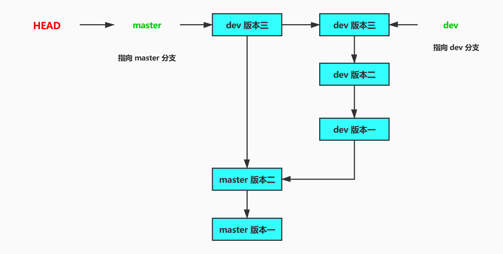
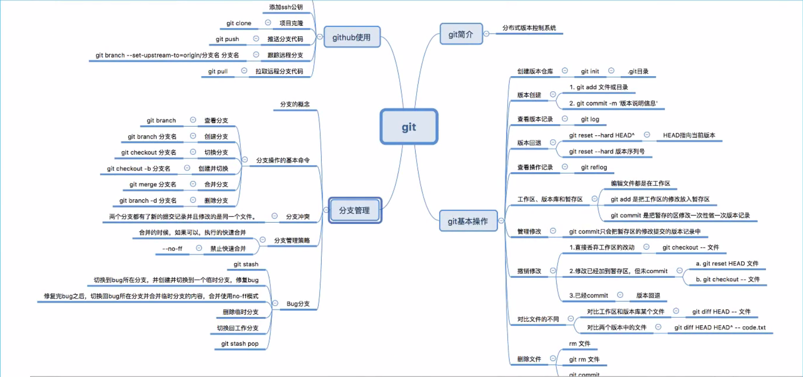
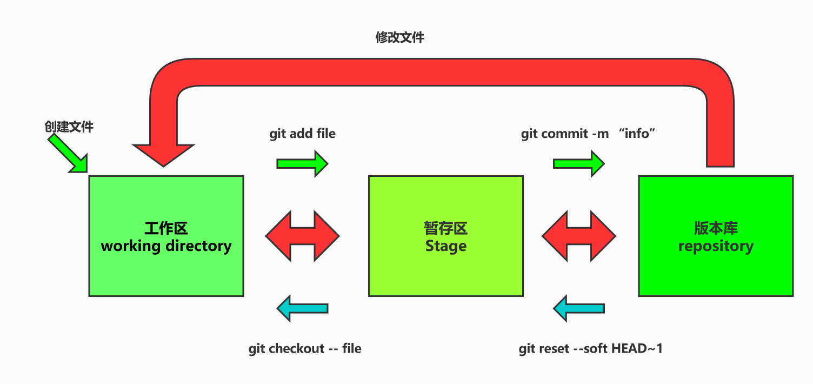
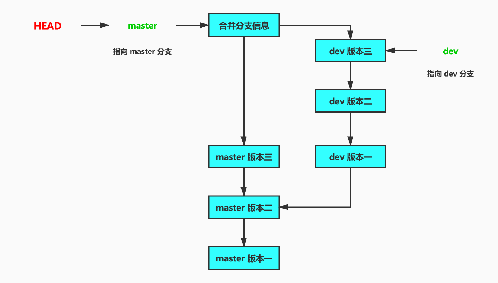

# Git 使用笔记

## Git 基本操作

### Git 分支示意图

1. 个人理解
   
   - git 中指针运用的十分频繁，每一步都是和指针有关的。HEAD 就是指向当前操作的分支(maste：指向 master 分支当前的版本)的当前版本。每当创建一个新的版本时，master 就会指向最新的版本，而 HEAD 指向 master。每一个版本的创建好比是一个时间线上(时间线是一个直线)的节点。当创建分支时，就好比在当前版本再创建一个指针(dev)，和当前 master 指向同一个版本，切换分支时 HEAD 指向 dev，当在分支 dev 操作时和 maetr 没有关系，master 还是指向创建分时时的版本。合并分支时就是将 maste r以向dev指向的版本（Faster-forward合并）。
   - [参考地址](https://open-hl.toutiao.com/a6822261424480322061/?utm_campaign=open&utm_medium=webview&utm_source=o_llq_api&req_id=20200503095428010014050012301F73FB&dt=OPPO+A57&label=open_o_channel&a_t=3015963288971654507615122445c644&gy=9a26911494d7e8b8b94f0d2b66a9c78c0b5c984ba8921418dcd9d7afb1cf3db2db6eb1d102c370e351e12fe63d988bcffcc8e902b730ecf02c7a3eca8b376f26ef8c0250215f92664e364fef7038338410ce4f0897387f2cba03838898301084aeed2ed76a50bcb555d8aeeaf07416e970c80eff17b4b15874f380077dd0ed57&crypt=761&item_id=6822261424480322061&__docId__=6822261424480322061&__barStyle__=1_1&__statParams__=sourceMedia&__fromId__=__all__&__source__=toutiao&sourceMedia=toutiao&__cmtCnt__=2&__styleType__=2&__publisher_id__=58546745552&openv=&__pf__=detail)
2. git 分支示意图
   
   - 如图
   
     
3. git 操作流程图
   
   - 如图
   
     

### 初始化一个 Git 库

1.  创建 `.git` 文件，此文件是管理 git 的文件夹
   - `git init`
2. 创建用户名和邮箱，如果没有这两项信息，是无法提交的，所以每个 git 库，都必须有这些基本信息
   - `git config --global user.name 'username'`
   - `git config --global user.email 'example@gmail'`
   - 这两条语句也是可以修改用户名、邮箱
3.  检查基本信息
    - `git config --list` ：可以查看用户和邮箱信息

### 版本创建的过程

#### 总体介绍

1. git 管理文件分为 3 个状态，已修改（modified）、以暂存（stage）、以提交（commit），以下 3 个区就是对应 git 管理文件的 3  种状态
   - __工作区__ ：对应文件 __modified__ 的状态
   
   - __暂存区__ ：对应文件 __stage__ 的状态
   
   - __版本库__ ：对应文件 __commmit__ 的状态
   
   - 如图
   
     
2. 检测文件的状态
   
   - `git status` ：可以检查文件处于哪种状态

#### 正向顺序

1. 文件从 __版本库__ 到 __工作区__ 中
   - 修改文件
   - 创建新文件（直接在工作区中）
   - 删除文件 `rm file_name`
2. 将修改、创建、删除的文件从 __工作区__ 添加到 __暂存区__
   - `git add file_name` ：将 file_name 文件添加到暂存区
     1. `git add -A` ：添加所有改变的文件
     2. `git add .` ：添加新文件和编辑过的文件，但不包括删除的文件
     3. `git add -u` ：添加编辑过的和删除的文件，但不包括新添加的文件
   - `git rm file_name` ：将删除的文件添加到暂存区中
     1. 使用 `git add file_name` 一样可以添加进暂存区中
3. 将 __暂存区__ 的文件形成版本，添加到 __版本库__ 中
   - `git commit -m "版本信息"`

#### 反向顺序

1. 将 __版本库__ 中的文件回退到 __暂存区__ 中
   - `git reset --soft HEAD~1` ：将当前版本回退到前一个版本，当前版本的文件回退到暂存区中 （`HEAD~1` 也可以是版本号）
   - `git reset --soft HEAD~2` ：回退两个版本，将这两个版本修改的文件回退到暂存区中
2. 将 __暂存区__ 中的文件回退到 __工作区__ 中
   - `git reset HEAD file_name` ：将暂存区的 file_name 文件回退到工作区中
3. 将工作区中已修改文件放弃修改
   - `git checkout -- file_name` ：放弃文件的修改
4. 直接回退版本
   - `git reset --hard HEAD~2` ：直接回退两个版本，__文件的状态不变__

### 版本信息查看

1. 最为详细的版本信息查看
   - `git log`
2. 一行中简要显示版本信息
   - `git log --pretty=oneline`
3. 增加查看分支合并记录
   - `git log --graph --pretty=oneline`
4. __查看操作记录__
   - `git reflog`
   - 显示 git 仓库中的每一步的操作记录

### 版本回退

1. HEAD 表示指向当前版本的指针，HEAD^ 表示前一个版本
   - `git reset --hard HEAD^` ：回退到前一个版本
   - `git reset --hard HEAD^^` ：回退两个版本
2. 使用版本 ID，可以回退到任何版本（只需要使用 ID 的前 4-5 个编号就可以）
   - `git reset --hard 版本号`

### 文件对比

1. [工作区、暂存区] 和版本库中的某个文件对比
   - `git diff HEAD -- file_name`
2. 对比两个版本库中的文件
   - `git diff HEAD HEAD~1 -- file_name`

### git rebase 使用

__说明：[参考地址](https://www.jianshu.com/p/4a8f4af4e803)__

1. 介绍 `git rebase` 使用

   - 不要随便使用此命令，有可能发生意想不到的问题
   - 此命令功能
     1. 版本删除
     2. 版本压缩

2. 版本删除

   - `git rebase -i HEAD~3` ：操作最近 3 个历史版本

     ```shell
     pick 8302c86 dev 3
     pick 9e593b5 dev 4-5
     
     # 变基 8927e6e..9e593b5 到 8927e6e（2 个提交）
     #
     # 命令:
     # p, pick = 使用提交
     # r, reword = 使用提交，但修改提交说明
     # e, edit = 使用提交，但停止以便进行提交修补
     # s, squash = 使用提交，但和前一个版本融合
     # f, fixup = 类似于 "squash"，但丢弃提交说明日志
     # x, exec = 使用 shell 运行命令（此行剩余部分）
     # d, drop = 删除提交
     ```

   - 将对应版本的 `pick` 修改为 `drop` 保存即可

     1. 注意：这种删除一般会删除中间的版本，会造成版本合并冲突，所以需要手动解决，再次提交版本记录。

## Git 分支

### Git 创建分支

1. 查看分支
   - `git branch`
2. 创建分支
   - `git branch branch_name`
3. 切换分支
   - `git checkout branch_name`
4. __创建并切换分支__
   - `git checkout -b branch_name`
5. 删除分支
   - `git branch -d branch_name`

### 分支合并

1. 分支合并分为 __快速合并__ 和 __禁用快速合并__ 。一般不使用快速合并，且快速合并条件苛刻

   - 快速合并（Faster-forward），没有版本信息，将使用分支的版本信息

     

   - 禁用快速合并，会有版本信息

     

2. 快速合并

   - 只有一种情况可以使用快速合并：__假如创建 dev 分支时，主分支 master就没有提交过任何版本。当 master 合并 dev 时，可以使用快速合并__
   - `git merge dev` ：此时位于 master 主分支上

3. 禁用快速合并

   - 分支多次合并后，使用 `git merge dev` 时，也会提示注释合并信息，这样的合并也是禁用快速合并
   - `git merge --no-ff -m "禁用快速合并Faster-forward 说明信息(版本信息)" other_branch_name` ：禁用快速合并

4. __解决合并冲突__

   - 产生合并冲突原因，由于创建分支时，master 指向的分支当前版本也进行了修改，所以不能进行 Faster-forward 合并

   - 使用快速合并、禁用快速合并提交的版本信息，都会以解决重复修改的文件冲突后提交版本信息为准 __（不写版本信息，也会强制你写的！！！）__

     ```she
     自动合并 b.md
     冲突（内容）：合并冲突于 b.md
     自动合并失败，修正冲突然后提交修正的结果。
     ```

   - 需要手动修改 `b.md` 文件，已解决冲突，并再次 `git add` --> `git commit -m "信息"` ，此次合并的版本记录，以提交 `b.md` 版本信息为准。

### 工作现场保护

1. 保护当前分支正在编辑的文件
   - 文件的 `modified` 和 `stage` 可以进行现场保护
   - __文件尚未跟踪__ （新建的文件）不可以进行现场保护
   - `git stash`
2. 切换到出现 bug 的分支，再创建临时 bug_001 分支进行修改bug，然后提交
3. 进行 bug 分支合并时，要禁止快速合并（合并记录）
   - .`git merge --no-ff -m '修复bug_001' bug_001`
4. 切换回你之前工作的分支，进行现场恢复
   - `git stash list` ：查看保存的工作现场
   - `git stash pop` ：恢复工作现场

## Github 使用

### 创建 git 仓库

1. 上面有介绍

### 生成 ssh 公钥（Ubuntu 版）

1. 切换到用户目录下 `cd ~`

2. 查找隐藏文件（.gitconfig）编辑文件（实际在设置用户是就已经编辑好了，打开看一下用户名、邮箱）

3. 生成 ssh 密钥

   - `ssh-keygen -t rsa -C 'ShenDeZ@163.com'` ：输入此命令，出现待输入的（密码，确认值）都__按回车__，__id_ras为私钥__、__id_rsa.pub__为公钥

     ```shell
     Generating public/private rsa key pair.
     Enter file in which to save the key (/home/ss/.ssh/id_rsa): 
     Created directory '/home/ss/.ssh'.
     Enter passphrase (empty for no passphrase): 
     Enter same passphrase again: 
     Your identification has been saved in /home/ss/.ssh/id_rsa.
     Your public key has been saved in /home/ss/.ssh/id_rsa.pub.
     The key fingerprint is:
     SHA256:weCTO83pWeZXqCsuVobfKVVf808v59n49F7pMuoNTxw ShenDeZ@163.com
     The key's randomart image is:
     +---[RSA 2048]----+
     |      .          |
     |     . +         |
     |      + o        |
     |       = o  .. ..|
     |      o.S o..E..o|
     |      .oo=....o +|
     |       +oooo.o o=|
     |      o + oo=oooO|
     |     . o.ooo.o+O*|
     +----[SHA256]-----+
     ss@ubuntu:~$ cd .ssh
     ss@ubuntu:~/.ssh$ ls
     id_rsa  id_rsa.pub
     ss@ubuntu:~/.ssh$ cat id_rsa.pub
     ssh-rsa PCSuq3VU4KHwrm+lWN0N0C4uNqAqIi/MBtUKXPolLjnZ5D6b8e4lLk68YbdR6BdvZ4OrAbl3+p7/3X6C7/K1Bmp8dipH5cNRvph+bRyJ7/DAarD3qgTefRTfU0ANFgTAxoqLZYFTUToxGYBTiTpr0kPkfyF322awZ1Q7ubOXXEXmD3dvPL01+b4tJ ShenDeZ@163.com
     ```

4. 将 ssh 公钥复制粘贴到 github 上去

   - 这样本地可以操作 github 上的项目
   - 就将公钥添加到 __设置__ 的 __个人设置中__ 的 __SSH and GPG keys__

5. windows 上的操作和 Linux 相同

   - 切换到用户目录
   - 查看 .gitconfig 文件
   - 使用 `ssh-keygen -t rsa -C '邮箱'` 生成,公钥私钥在用户目录 .ssh 文件夹中
   - 查看`.ssh`文件夹
   - 参考 Linux 操作

### 克隆项目

1. 查找克隆地址（https、ssh）选择uoge协议进行克隆

   - `git clone 克隆地址`

2. 如果克隆出错执行下面两句（不是很理解！！！）

   - `eval "$(ssh-agent -s)"`

   - `ssh-add`

3. 创建分支，再在分支上进行开发

   - 上面有创建分支过程

4. 推送分支

   - `git push origin 'branch_name'` ：将本地分支推送到 github 服务器上，服务器会自动创建一个分支

5. 本地分支跟踪远程服务器分支

   - `git branch --set-upstream-to=origin/'远程branch_name' '本地branch_name'`

     ```shell
     Branch 'smart' set up to track remote branch 'smart' from 'origin'.
     
     使用 git status
         On branch smart
         Your branch is up to date with 'origin/smart'.
     
         nothing to commit, working tree clean
     ```

6. 当编辑本地分支并提交一个版本时，使用`git status`查看工作区时提示（本地分支，领先服务器分支一次提交）

   - `git status`

     ```shell
     On branch smart
     Your branch is ahead of 'origin/smart' by 1 commit.
       (use "git push" to publish your local commits)
     
     nothing to commit, working tree clean
     ```

7. 推送代码

   - `git push` ：是将服务器分支与本地分支保持一致

8. 拉取代码

   - `git pull origin 'branch_name'` ：把服务器的分支合并到本地

