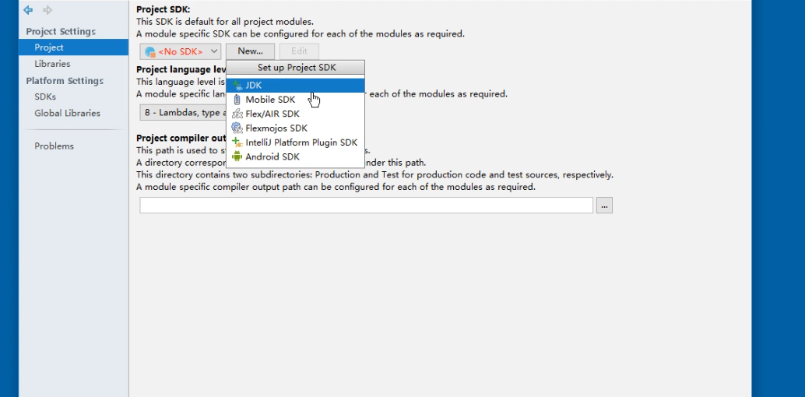

# Idea 使用介绍

## 基础配置

### 配置事项

1.  Idea 配置分为 **项目设置** 和 **全局设置** ，一般使用全局设置（以下为全局设置）。

2.  全局设置一般分为两种

    -   第一种，在 Idea 编辑页面中设置

        

    -   第一次使用 Idea 时，下面为例

3.  初次安装后的配置页面

    -   如下图

        

4.  修改主题、字体和字号大小（字体建议不修改）

    -   如下图（Over开头的第三行选项是修改主题字体、字号大小，不建议修改。如果修改应修改的字体包含中文字体）

        

5.  修改代码的字体、字号大小和行距（行距一般不修改）

    -   如下图（Show only monospced fonts 表示是否显示等宽字体，英文 I 和 W 使用等宽美观，建议使用）

        

6.  修改控制台字体、字号大小（修改颜色为 Console font）

    -   如下图

        

7.  设置编码格式

    -   国际化操作一般使用 `utf-8` 编码，所以将所有编码格式设置为 `utf-8` 

    -   如下图（Transparent 勾选上，解决代码中文注释为 ASICC 码 ）

        

8.  `control`+ 鼠标滚轮缩放字体 （建议使用）

    -   如下图

        

9.  显示行号 + 分割方法（建议使用）

    -   如下图

        

10.  格式化代码，多行空行合并

     -   格式化代码时，多行空行会合并成 2 行，但是 2 行有点多余，所以改成一行，几多行空行格式化以后变成一行

     -   如下图

         

11.  代码提示忽略大小写

     -   Idea 代码提示匹配大小写，修改为 `None` 即可不区分大小写

     -    如下图

         

12.  自动导包

     -   Idea 不会帮助开发者自动导入所需要的包，当复制一段代码时。以下修改可以实现自动导包

     -   如下图（修改三处）

         

13.  文档提示

     -   当鼠标悬停时（有秒数限制），将现实类、方法的文档注释

     -   如下图

         

## 插件

### 添加插件

1.  插件初始化设置页面

    -   如下图

        

2.  安装插件

    -   插件安装有三种

        1.  官方提供
        2.  浏览器下载（第三方）
        3.  本地安装（插件下载在本地）

    -   如下图

        

### 安装 Tomcat 插件

说明：[参考地址](https://blog.csdn.net/zhoukun1314/article/details/88910242)

1.  搜索 Smart Tomcat，安装 Smart Tomcat

    -   如下图

        

## 环境配置

### JDK 环境配置

1.  配置初始页面

    -   如下图

        

2.  配置 JDK 

    -   JDK 配置了环境变量，应该不需要创建（会有提示）

    -   如下图

        

### 创建 JavaSE 项目

1.  以上配置都是全局配置，如 JDK、Mavem、字体等等

    -   快捷方式
        1.  创建主函数 `psvm` 或者 `main`
        2.  输出 `sout` 

2.  创建 JavaSE 项目

    -    初始页面，只选择 Java 即可，其他的下一步 `next`

    -   如果 SDK 需要改变，则改变（上文设置，已经设置完成）

    -   如下图

        

3.  创建完成项目结构

    -   `src` 存放代码
        1.  `com.shen.mode1` 包名
        2.  `Test` 类名

    -   如下图

        

### 配置 JVM 参数大小

1.  默认情况下，Idea 的 JVM 参数偏低。依据电脑的配置不同，可以相应的调高 JVM 参数

2.  好处

    -   Idea 的响应速度会有所提高
    -   [参考地址](https://www.cnblogs.com/hongdada/p/10238758.html)

3.  JVM 配置分为 3 种

    -   代码中设置

        ```java
        System.setProperty
        ```

    -   项目中设置，例如 Web 项目中，在配置 Tomcat 的页面页面中

    -   全局配置（如下，配置文件）

4.  配置初始页面

    -   如下图

        

5.  全局配置， Idea 的 JVM 是一个配置文件

    -   位置 `~/.IdeaIC2019.3/config/idea64.vmoptions`

    -   **根据机器作出调整** （一般调整注释的三个即可）

    -   默认 Idea 的 JVM 配置文件内容

        ```properties
        -Xms128m						# 启动最小内存
        -Xmx750m						# 启动最大内存
        -XX:ReservedCodeCacheSize=240m		# 预留代码缓存大小
        -XX:+UseConcMarkSweepGC
        -XX:SoftRefLRUPolicyMSPerMB=50
        -ea
        -XX:CICompilerCount=2
        -Dsun.io.useCanonPrefixCache=false
        -Djava.net.preferIPv4Stack=true
        -Djdk.http.auth.tunneling.disabledSchemes=""
        -XX:+HeapDumpOnOutOfMemoryError
        -XX:-OmitStackTraceInFastThrow
        -Djdk.attach.allowAttachSelf=true
        -Dkotlinx.coroutines.debug=off
        -Djdk.module.illegalAccess.silent=true
        -Dawt.useSystemAAFontSettings=lcd
        -Dsun.java2d.renderer=sun.java2d.marlin.MarlinRenderingEngine
        -Dsun.tools.attach.tmp.only=true
        ```

## Debug 使用

### 简单使用

1.  打断点，使用 debug 运行项目

2.  快捷键

    -   F7、F8、F9
    -   F7，进入方法体中（自定义方法体）
    -   F8，不进入方法体中
    -   F9，直接跳至第二个断点

3.  **Idea 编辑器 debug 控制台**

    -   上方箭头
        1.  不进入方法体（进入自定义方法体）
        2.  进入方法体
        3.  强行进入方法体（是方法就进入）
        4.  直接跳至第二个断电
        
    -   左侧（debug 下方）
        1.  重新 debug 运行
    2.  跳至第二个断点
    
-   如下图
    
        

## 创建 Web 工程

### 修改 Idea 默认启动开启最近的项目

说明：建议 `artifactId` 时，使用下划线 `_` ，不要使用 `-`

1.  Idea 启动时，会默认打开最近的项目，改变这一特点

    -   **没有特别熟悉 Idea ，所以暂时没有这一需要**

    -   如下图（去掉单选框）

        

### 创建 Web 项目

1.  社区版，不支持 JavaEE（包含 Web 项目），所以一下是，专业版对应的内容

2.  创建 Web 项目，选择 `Servlet` 版本

    -   版本（2.5/3.0），一般使用 2.5

        -   JavaEE5 对应 `Servlet` 2.5 版本
        -   JavaEE6 以上，对应 3.0 以上

    -   如下图

        

3.  Web 项目的目录结构

    -    `WEB-INF/web.xml` 文件
    -   `index.jsp` 开始页面

    -   如下图

        

4.  部署 Web 项目

    -   Web 项目部署，需要使用 Tomcat 服务

        1.  注意自己需要使用哪种 Tomcat 版本

    -   好像得先创建 Web 项目，才可以有这个 Tomcat server 配置

    -   如下图（如果没有 Tomcat server 选项，点击 items more）

        

    -   选择本地的 Tomcat，如下图

        

    -   解决部署哪个项目

        

    -   指定部署的项目

        

### 为 Web 项目中添加第三方依赖

1.  第三方依赖的引入，存放在 `WEB-INF/lib` ，其中 `lib` 手动创建

    -   创建 `lib` 目录，引入第三方 `jar` 包，此时依赖还没有生效

    -   如下图

        

2.  依赖生效

    -   点击 `project structure` 按钮

    -   选择 `java` 标注，如下图

        

    -   将 `lib` 目录加入 `libraries` 中，如下图

        ​	

    -   生效依赖（将 lib 目录，加入依赖中），如下图

        

### 创建 Servlet

1.  Servlet 是处理请求的类，创建 Servlet 的子类需要继承 `HttpServlet` ，此类来自于 `Tomcat` 提供

2.  创建 `Servelt`

    -   创建 `Servlet` 类，如下图

        

    -   命名 `Servlet` 类，如下图

        

    -   对应 `web.xml` 文件，生成次 `Servlet` 配置，如下图

        

    -   生成的 `Servlet` 类代码，如下图

        

    -   `Servlet` 类，继承 `HttpServlet` 由 Tomcat 服务提供，代码报错（找不到对应的类），则需配置 Tomcat 服务环境，如下图

        

    -   web 项目的基础依赖（Tomcat，其他通过 `lib` 引入的第三方依赖），如下图

        

## maven 的配置

### maven 简单使用

1.  Idea 默认使用内置的 maven，所以需要修改为使用本地安装的 maven

2.  maven 的 配置文件（主要是，jdk版本、maven 仓库）

    -   Idea 的 maven 的配置，如下图

        

### 使用 Maven 创建 JavaSE 工程

1.  创建项目 `Create New Project`

2.  选择创建 maven 的JavaSE 骨架

    -   如下图

        

3.  命名 group id 和 artifactid（maven 的唯一表示）

    -   如下图

        

4.  重新显示 maven 的设置，可以根据自己的需求进行修改

    -   如下图

        

5.  创建 maven 项目构建成功

    -   创建 `pom.xml` 项目依赖的 maven 的配置文件
    -   包的结构也会创建完成

    -   如下图

        

6.  maven 菜单展示图

    -   查看项目依赖，社区版没有此功能

    -   如下图

        

### 使用 maven 创建 JavaEE 项目（Web 项目）

1.  创建项目 `Create New Project`

2.  创建 Web 项目对应的骨架

    -   如下图

        

3.  设置 maven 项目的 `group id/artifactId/项目名`

4.  显示 maven 配置等……

5.  创建 Java 目录 和 resources 目录

    -   社区版创建 maven 的 Web 项目没有 `resources 和 java` 目录，需要手动创建

    -   如下图

        

6.  发布 web 项目

    -   运行 web 项目方法

        1.  使用本地 Tomcat 服务，将项目部署到 Tomcat 中
        2.  使用 maven 的插件 plugin 启动项目 `TomcatX:run` 启动项目

    -   方法一

        1.  [参考地址](https://blog.csdn.net/zhoukun1314/article/details/88910242)

        2.  注意端口号（但是我自己试验后，没有 AJP 端口号 ）

        3.  如下图

            

    -   方法二

        1.  [参考地址](https://blog.csdn.net/shaohe18362202126/article/details/79574627)

        2.  在 pom.xml 配置文件中添加插件

            -   配置

                ```xml
                <plugin>
                  <groupId>org.apache.tomcat.maven</groupId>
                  <artifactId>tomcat7-maven-plugin</artifactId>
                  <version>2.2</version>
                  <configuration>
                    <port>8080</port>
                    <path>/</path>
                    <uriEncoding>UTF-8</uriEncoding>
                    <server>tomcat7</server>
                  </configuration>
                </plugin>
                ```

            -   运行命令 `tomcat7:run`

            -   如下图

                

### maven 创建聚合工程

1.  使用 maven 聚合多个工程

    -   **只做版本管理，没有继承关系（依赖继承关系）**

    -   关系如下图

        

    -   **打包方式**

        1.  dao 需要打成 jar 包，因为被 service 所依赖
        2.  service 需要打成 jar 包，因为依赖于 dao 层
        3.  web 需要打成 war 包，因为直接放入 Tomcat 被访问

2.  创建聚合工程的统一版本管理工程  `itheima_mall`

    -   点击 `Create New Project`

    -   如下图

        

3.  创建聚合前后台子模块 `itheima_portal/itheima_back`

    -   项目目录与 `itheima_nall` 同级

    -   如下图

        

    -   选择 maven 骨架 `archtype-site` 骨架
    -   去除模块继承关系，父模块的 `pom.xml` 没有 `<modules><module></module></modules>` ，子模块有父模块的标注

    -   只是版本管理，没有依赖继承关系

    -   如下图

        

4.  创建 dao 层、service 层

    -   选择 maven 框架 `archtype-quickstart` ，打包方式为 jar

    -   继承 `itheima_portal` 

    -   项目目录是 `itheima_portal` 下级目录

    -   service 依赖于 dao，所以 service 需要添加 dao 依赖

        1.  实例

            ```xml
            <dependency>
            	<groupId></groupId>
              <artifactId></artifactId>
              <version></version>
            </dependency>
            ```

5.  创建 web 层

    -   选择 maven 骨架 `archtype-webapp` ，打包为 war
    -   继承 `itheima_portal`
    -   `itheima_portal` 下级目录
    -   同样缺少 `java/resources` 目录，需要手动创建
    -   依赖于 servie 层，需要添加依赖

## 管理代码

### SVN 管理代码

### Git 管理代码

1.  开启版本控制

    -   如下图

        

2.  选择 git 为版本控制工具

    -   **会在项目目录中，创建 `.git` 目录，git 将管理项目版本**

    -   如下图

        

3.  或略文件或文件夹

    -   **社区版没有此功能**

    -   不希望 git 对一些文件进行管理

    -   如下图

        

4.  提交

    -   提交到本地的仓库

    -   如下图

        

5.  提交到本地的仓库

    -   如下图

        

6.  配置远程仓库地址

    -   如下图

        

7.  提交到远程仓库

    -   如下图

        