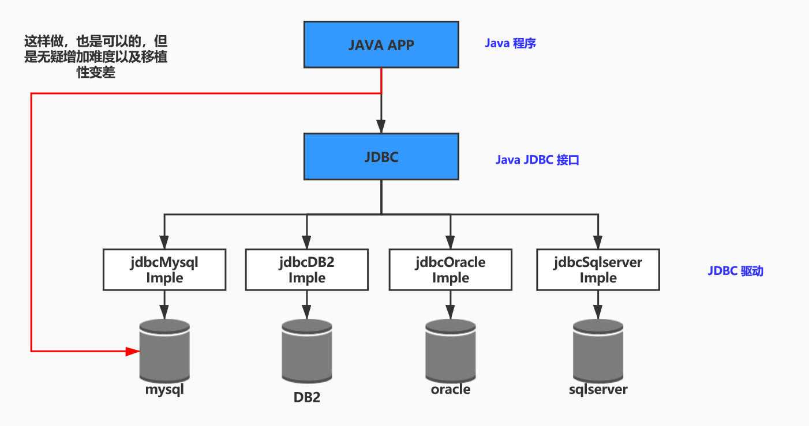
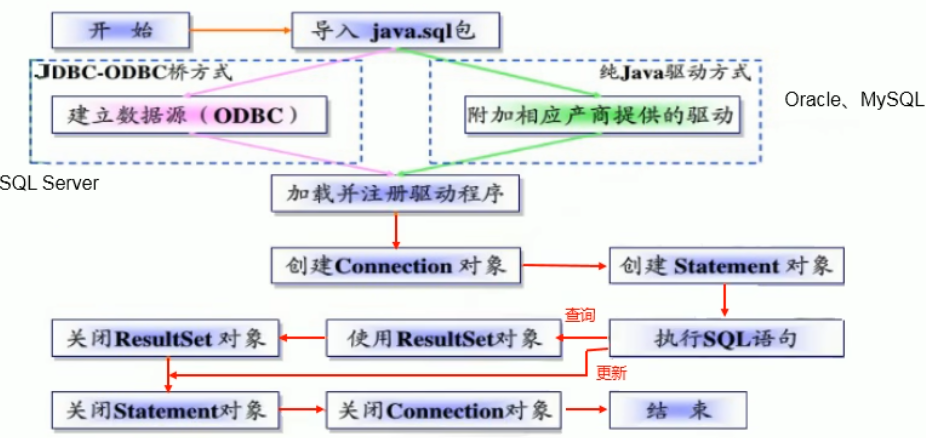
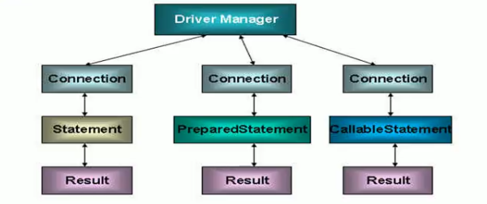
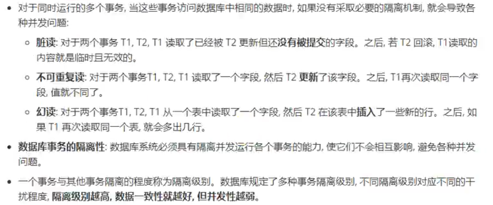
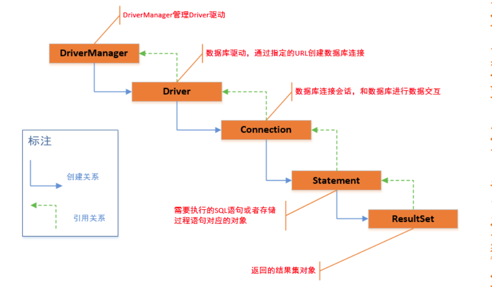
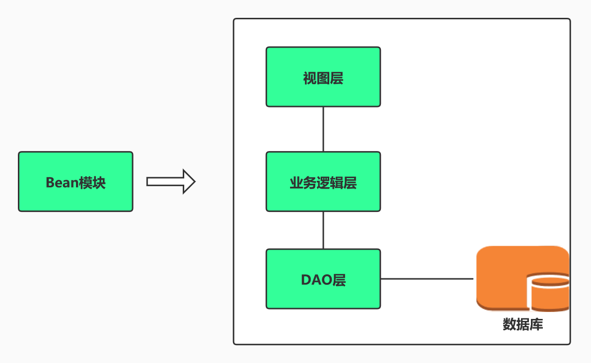

## JDBC 篇

__说明：基于 MySQL 5.7 数据库、JDBC/j8.x 和 JDK1.8__

### JDBC 介绍

1. JDBC（Java DataBase Connectivity）是一个独立于特定数据库的管理系统（DBMS）、通用的 SQL 数据库的存取和操作的公共接口（一组 API），定义用来访问数据库的标准 Java 类库（接口，`java.sql` 和 `javax.sql`）。此类库制定了标准的方法，可以方便访问数据库数据

2. JDBC 为访问不同的数据库，制定了统一访问途径，屏蔽了细节差异。

3. JDBC 目的是为当数据库提供 JDBC 驱动时，Java 可以通过 JDBC 快速访问数据库

4. __JDBC 是 sun 公司开发的一组连接和操作数据库的接口，制定了标准规则。JDBC 驱动则是数据库开发公司根据 JDBC 的标准的实现类__ （这里也就明白为什么要加载驱动了 `Class.forName("com.mysql.cj.jdbc.Driver")`）

5. JDBC 的作用

   - 如图

     
   
6. JDBC 面向接口编成

   -   JDBC 是 sun 公司提供的一套用于数据库操作的接口，java 程序员需要面向这套接口编成即可。不同的数据库厂商，需要针对这套接口提供不同的实现。不同的实现集合，即为不同的数据库驱动。

7. JDBC 程序编写步骤

   -   如下

       

### 如何获取链接

1.   方式一，通过 Driver 获取 Connection

     -   Driver 需要使用 mysql 的实现类来创建 Driver

         ```java
         // 使用mysql驱动
         Driver driver = new com.mysql.cj.jdbc.Driver();
         
         String url = "jdbc:mysql://localhost:3306/test";
         Properties info = new Properties();
         info.setProperty("user", "root");
         info.setProperty("password", "123456");
         // get connection by driver
         Connection connect = driver.connect(url, info);
         ```

2.   方式二，通过反射获取 Connection

     -   需要使用 mysql 实现类 Driver 的全路径

         ```java
         // 反射
         Class<?> aClass = Class.forName("com.mysql.cj.jdbc.Driver");
         Driver driver = (Driver) aClass.newInstance();
         
         String url = "jdbc:mysql://localhost:3306/test";
         Properties info = new Properties();
         info.setProperty("user", "root");
         info.setProperty("password", "123456");
         // get connection by driver
         Connection connect = driver.connect(url, info);
         ```

3.   方式三，通过 DriverManager 获取 Connection

     -   需要使用 mysql 实现类 Driver 的全路径

         ```java
         // 反射获取com.mysql.cj.jdbc.Driver实体类
         Class<?> aClass = Class.forName("com.mysql.cj.jdbc.Driver");
         Driver driver = (Driver) aClass.newInstance();
         // 注册驱动
         DriverManager.registerDriver(driver);
         
         String url = "jdbc:mysql://localhost:3306/test";
         String user = "root";
         String password = "123456";
         Connection connection = DriverManager.getConnection(url, user, password);
         ```

4.   方式四，比方式三更加简洁

     -   使用 mysql 的 Driver 实现类，加载该实现类时，自动注册到DriverManager

         ```java
         String url = "jdbc:mysql://localhost:3306/test";
         String user = "root";
         String password = "123456";
         
         // 当加载Driver类时，自动注册
         Class.forName("com.mysql.cj.jdbc.Driver");
         Connection connection = DriverManager.getConnection(url, user, password);
         ```

     -   依赖于 `com.mysql.cj.jdbc.Driver` 

         ```java
         public class Driver extends NonRegisteringDriver implements java.sql.Driver {
             public Driver() throws SQLException {
             }
         
             // 加载类时自动注册
             static {
                 try {
                     DriverManager.registerDriver(new Driver());
                 } catch (SQLException var1) {
                     throw new RuntimeException("Can't register driver!");
                 }
             }
         }
         ```

5.   方式五，配置文件获取信息

     -   `jdbc.properties` 配置文件

         ```properties
         # jdbc config
         driverClass=com.mysql.cj.jdbc.Driver
         user=root
         password=123456
         url=jdbc:mysql://localhost:3306/test
         ```

     -   实现

         ```java
         ResourceBundle jdbc = ResourceBundle.getBundle("jdbc");
         String driverClass = jdbc.getString("driverClass");
         String url = jdbc.getString("url");
         String user = jdbc.getString("user");
         String password = jdbc.getString("password");
         
         Class.forName(driverClass);
         Connection connection = DriverManager.getConnection(url, user, password);
         System.out.println(connection);
         ```

### 使用 `PrepareStatement` 

#### 访问和操作数据库

1.   什么是数据库链接

     -   数据库链接被用于向数据库服务器发送命令和 SQL 语句，并接受数据库返回的结果，其实数据库链接就是一个 Socket 链接

2.   在 `java.sql` 包中有 3 个接口分别定义对数据库的调用的不同的方式

     -   `Statement` ：用于执行静态 SQL 语句并返回它所生成的结果对象

     -   `PreparedStatement` ：SQL 语句被预编译并存储在次对象中，可以使用此对象多次高效地执行该语句

     -   `CallableStatement` ：用于执行 SQL 存储过程

     -   如图

         
         
         

### Statement 和 PreparedStatement 对比

1.   Statement 问题
     -   存在 SQL 字符串拼接操作（繁琐），代码的可读性较差。因为 SQL 的拼接问题，导致有被 SQL 注入的风险
     -   因为 SQL 字符串拼接，导致无法操作类如字段为 `BLOB` 类型的数据。
     -   `PreparedStatemnt` 是 `Statement` 的子类。
2.   PreparedStatement
     -   `PreparedStatemnt` 是 `Statement` 的子类，所以可以完全的进行替换，可以防止 SQL 注入
     -   有最大性能的提升
         1.   DBServer 会对**预编译** 的语句提供性能优化，因为预编译语句有肯能被重复利用，所以语句在被 DBServer 的编译器编译后的执行代码被缓存下来（语法检查、语义检查、翻译成二进制命令、缓存），那么下次调用时只要是相同的预编译语句就不需要编译，只要将参数直接传入编译过的语句执行代码中就会得到执行。
         2.   Statement 语句，即使是相同的操作，但因为数据不一样，所以整个语句不能匹配，没有缓存语句的意义。
     -   **批量插入数据更高效，因为 `PreparedStatement` 缓存预编译后的语句**

#### 查询操作的流程

1.   编写 SQL ，使用别名（别名等于对应 Java  对象的属性名）
2.   `PreparedStatement` SQL 的预编译
3.   `ExecuteQuery()` 执行 SQL 查询操作
4.   获取结果集 `ResultSet`
5.   获取元数据 `resultSet.getMetaData()`
6.   通过元数据，获取结果集的列数、以及列的别名（没有别名获取列名） `metaData.getColumnLabel()`
7.   通过`resultSet.next()` 获取每行结果
8.   通过每行结果获取每列数据
9.   通过列名加反射，赋值对象

#### 操作BLOB 类型字段

1.   介绍

     -   mysql 中，BLOB 是一个二进制大型对象，是一个可以存储大量数据的容器，它能容纳不同大小的数据

     -   查询 BLOB 类型的数据必须使用 `PreparedStatement` ，因为 BLOB 类型的数据无法使用字符串拼接

     -   四种 BLOB 类型（存储大小不同）

         | 类型       | 大小（单位：字节） |
         | ---------- | ------------------ |
         | TinyBlob   | 最大 255B          |
         | Blob       | 最大 65KB          |
         | MediumBlob | 最大 16MB          |
         | LongBlob   | 最大 4G            |

     -   如果指定了 BLOB 类型，还报 `xxx too large` 

         -   那么在 mysql 的安装目录下 `my.ini` 文件中增加以下配置 `max_allowed_packet=16M`
         -   BLOB（4 种类型都是） 默认最大应该是 1MB
     
     -   **如果存储的文件过大，数据库的性能会下降**
     
2.   使用 Blob (插入、查询)

     -   插入、修改

         ```java
         // 第一种 使用 setBlob() 设置数据
         FileInputStream fis = new FileInputStream("/data/project/idea/jdbc_test/src/test/resources/images/playgril.jpeg");
         
         preparedStatement.setBlob(5, fis);
         
         // 第二种
         FileInputStream fis = new FileInputStream("/data/project/idea/jdbc_test/src/test/resources/images/playgril.jpeg");
         
         preparedStatement.setObject(5, fis);
         ```

     -   查询

         1.   查询主要是用 java 的什么类型去接收数据库中的 Blob 类型，实际存储 Blob 类型就是 java 的字符
              -   可以使用 java 的 byte[] 
              -   或者java 的 Blob 接收数据库中 Blob

#### 批量操作

1.   update 和 delete 本身就具备批量操作的效果，主要的批量操作介绍 insert 批量插入

2.   第一种实例（循环插入数据，耗时较大）

     -   Statement 实现批量插入，拼接字符串循环 2000 次

         ```java
         Statement statement = connection.createStatement();
         for (int i = 0; i < 200; i++) {
             int index = i + 10;
             String sql = "insert into customer(id, name, email) values(" + index + ", 'name" + index + "'," + "'name" + index + "@163.com'" + ")";
             statement.executeUpdate(sql);
         }
         ```

     -   PrepaedStatement 实现批量插入，重复设置值循环 2000 次

         ```java
         String sql = "insert into customer(id, name, email) values(?, ?, ?)";
         PreparedStatement preparedStatement = connection.prepareStatement(sql);
         int sum = 0;
         for (int i = 0; i < 200; i++) {
             int index = i + 10;
             preparedStatement.setObject(1, index);
             preparedStatement.setObject(2, "name" + index);
             preparedStatement.setObject(3, "name" + index + "@163.com");
             preparedStatement.executeUpdate();
         }
         ```

     -   以上两种的区别在于，Statement 重复拼接了 2000 次 SQL，而 PreparedStatemnet 是重复设置值 200 次参数
     
3.   JDBC 的提供的批量插入（`addBatch() 、executeBatch()、clearBatch()`）

     -   注意
         1.   mysql5 的服务器默认关闭批处理，需要一个参数让 mysql 支持批处理 `?rewriteBatchedStatements = true` 写道配置文件 url 后面
         2.   或者将 mysql5 使用的驱动升级到 `mysql-connector-java-5.1.37-bin.jar`
         3.   mysql8 默认是开启批处理的

     -   实例如下

         ```java
         PreparedStatement preparedStatement = connection.prepareStatement(sql);
         int sum = 0;
         for (int i = 0; i < 200; i++) {
             int index = i + 10;
             preparedStatement.setObject(1, index);
         
             // ”攒“sql语句
             preparedStatement.addBatch();
             if (0 == i % 50 || i == 199) {
                 // 执行一批sql
                 int[] counts = preparedStatement.executeBatch();
                 sum += Arrays.stream(counts).sum();
                 // 清空这一批sql
                 preparedStatement.clearBatch();
             }
         }
         System.out.println("the total number of inserts is " + sum);
         ```

### 事物

#### 事物的介绍

1.   介绍
     -   事物：是一组逻辑操作单元，使数据从一种状态变换到另一种状态
     -   事物处理（事物操作）：
         1.   保证所有事物作为 **一个工作单元** ，即使出现故障，都不能改变这种执行方式。当作一个事物种执行多个操作，要么所有事物都被提交（commit），修改会被永久的保存下来；要么数据库操作系统将放弃所有的修改，整个事物回滚（rollback）到最初状态。
         2.   为确保数据库中数据的一致性，数据的操作应当是离散的组成逻辑单元：当全部完成时，数据的一致性可以保持，而当这个单元中的一部分操作失败，整个事物应当全部视为错误，所有从起点以后的操作应全部退回到开始状态
2.   JDBC 事物处理
     -   数据一旦提交，就不可回滚
     -   自动提交
         1.   DDL 操作，都会自动提交（创建表、删除表）
         2.   DML 默认情况下，都会自动提交（`set autocommit = false` 的方式取消 DML 操作的自动提交）
         3.   关闭链接 `connection` 也会自动提交数据 **（需要的操作是，取消事物的自动提交，执行一组操作，然后在关闭链接前，设置 `set autocommit = true` 为自动提交，关闭链接会提交之前所有没有提交的事物）**
     -   JDBC 程序中为了让多个 SQL 语句作为一个事物执行
         1.   取消事物的自动提交 `connection.setAutoCommit(false);`
         2.   在所有的 SQL 都执行成功后，调用 `connection.commit();` 提交事物
         3.   出现异常时，调用 `connection.rollback();` 回滚事物
         4.   若此时 connection 没有被关闭，还可能被重复使用，则需要恢复自动提交状态 `connection.setAutoCommit(true);` 。尤其是在使用数据库连接池技术时，执行 `close()` 方法前，建议恢复自动提交状态
3.   事物的 ACID 属性
     -   原子性、一致性、隔离性、持久性

#### 数据库并发问题

1.    数据库的并发介绍

     -   问题描述

         

2.    隔离级别

      -   数据库提供 4 种 事物隔离级别

          

      -   Oracle 支持 2 种事物隔离级别：***READ COMMIT 和 SERIALIZABLE** ，默认的事物级别是 **READ COMMIT**

      -   Mysql 支持 4 种事物隔离级别，默认的事物隔离级别 **REPAETTABLE READ**

#### 设置数据库的隔离级别

1.   设置数据库隔离级别

     -   mysql 命令行设置数据库的隔离级别
     -   java 的 JDBC 也可以设置数据库的隔离级别
     -   命令行、JDBC 设置的数据库的隔离级别当数据库重启的时候都会重新设置成默认的（`REPAETTABLE READ`）

2.   JDBC 设置数据库的隔离级别

     -   设置的数据库的隔离级别，并不是此次连接的隔离级别（重启数据库恢复默认级别）

     -   获取数据库的隔离级别

         ```java
         conn.setTransactionIsolation();
         ```

     -   设置数据库的隔离级别

         ```java
         conn.setTransactionIsolation();
         ```

     -   隔离级别的常量（`Connection` 中常量）

         ```java
         // 不使用事物
         int TRANSACTION_NONE = 0;
         // 读未提交
         int TRANSACTION_READ_UNCOMMITTED = 1;
         // 读已提交（解决脏读）
         int TRANSACTION_READ_COMMITTED   = 2;
         // 可重复读（解决脏读和不可重复读）
         int TRANSACTION_REPEATABLE_READ  = 4;
         // 串行化（解决脏读、不可重复读和幻读）
         int TRANSACTION_SERIALIZABLE = 8;
         ```

         


### JDBC 增删改查过程

1. 说明

   - JDBC 是一系列接口，统一和规范了应用程序与数据库的连接，执行 SQL 语句，并得到返回结果，声明在 `java.sql/javax.sql` 包中。

   - 具体实现则体现了多态形式。其子类便是 JDBC 的驱动程序，也是运行类。

   - JDBC 主要组成部分

     >   JDBC 包含几大主角：DirverManager、 Driver Connection、 Statement(PreparedStatement) 、ResultSet

     1. 如图
     
        

2. 常用接口、类介绍

   - 管理一组 JDBC 驱动程序的基本服务 类`DrivetManager` 
   - 与特定数据库的连接（会话）的接口 `Connection` ，__相当于 Socket 在网络编程的作用__
   - 数据库数据的增、删、改、查的接口 `Statement/PreparedStatement` ，其中 `PreparedStatement` 解决了 SQL语句注入、字符串拼接、blob 数据问题，__相当于网络编程的流__
   - 数据库的查找返回结果接口 `ResultSet`

3. 使用过程

   - 注册驱动（如果没有此步，编译不会报错，运行时报 `ClassNotFoundException` 异常）
     1. `Class.forName("com.mysql.cj.jdbc.Driver").netStance();` 固定写法
     2. `com.mysql.cj.jdbc.Driver` 为驱动名称
   - 连接数据库
     1. `Connection conn = DriverManager.getConnection(url, user, password);`
     2. 参数说明
        - `String url = "jdbc:mysql://localhost:3306/java";` 
        - `String user = "root";`
        - `String password = "xxx";`
   - 操作数据库
     1. 增删改数据库
        - SQL 语句 `String sql = "insert/update/delete"`
        - 获取 Statement 或子类 PreparedStatement 对象 
          1. `Statement st = conn.createStatement();`
          2. `PreparedStatement pst = conn.prepareStatement(sql);` 解决了一些问题
        - 执行 SQL 语句 __（返回值）__
          1. `int len = st.executeUpdate(sql);` len 为受影响的行数。一般大于 0，表示操作成功。
          2. `int len = pst.executeUpdate();` 同上
     2. 查询数据库
        - 编写 SQL 语句
        - 获取 `Statement` 或子类 `PreparedStatement` 对象
        - 执行 SQL 语句 __（返回值）__
          1. `ResultSet rs = st.executeQuery(sql);`
          2. `ResultSet rs = pst.executeQuery();`
          3. 可根据 `rs` 获取各个字段数值
   - 关闭资源
     1. `rs.close()`
     2. `st.close()/pst.close()`
     3. `conn.close()`

### JDBC 其他操作

#### 获取自增长键

1. 介绍

   - > __`conn.prepareStatement(sql, Statement.RETURN_GENERATED_KEYS);` 当如果 SQL 语句不是一条 INSERT 语句，或者 SQL 语句能够返回自动生成的键（这类语句的列表是特定于供应的），则忽略此参数。__

   - 获取自增长键的使用情况

     1. 商品的订单编号（如果使用的是自增长），`insert` 时需要同时返回订单编号

2. 使用步骤

   - 创建 `PreparedStatement` 对象方法的改变

     1. 使用 `conn.prepareStatement(sql, Statement.RETURN_GENERATED_KEYS);` 方法
     2. 使用 `Statement` 的的常量值 `Statement.RETURN_GENERATED_KEYS`

   - 获取自动增长键

     1. `int len = pst.executeUpdate();` 返回受影响的行数

     2. 获取结果集对象 `ResultSet rs = pst.getGeneratedKeys()` 

     3. 获取自动增长键 

        ```java
        if (rs.next()) {
            rs.getObject(1); // 只能使用列数，不能使用字段名，如 id
        }
        ```

#### 批处理

1. 介绍

   - mysql 默认批处理是关闭的

   - 批处理使用情况
     1. 批量添加、插入修改数据

2. 实现批处理

   - 设置连接参数开启批处理

     1. url 的设置 `String url = "jdbc:mysql://localhost:3306/java?rewriteBatchedStatements=true";`
     2. 指定参数开启批处理 `rewriteBatchedStatements=true`

   - 将执行 SQL 语句，分成两步走

     1. 将给定的 SQL 命令添加到此 Statement 对象的当前命令列表中
        - `pst.addBatch();`
     2. 将一批命令提交给数据库来执行，如果全部命令执行成功，则返回更新计数组成的数组
        - int[] lens = pst.executeBatch()

   - __注意点__

     1. 插入语句 `insert into 表名 values(value1, value2...)` ，__注意是 `values`__

   - 实例

     1. 代码

        ```sql
                for (int i = 0; i < 1000; i++) {
                    pst.setString(1, null);
                    
                    // 将给定的 SQL 命令添加到此 Statement 对象的当前命令列表中
                    pst.addBatch();
                }
        
                // 将一批命令提交给数据库来执行，如果全部命令执行成功，则返回更新计数组成的数组
                int[] lens = pst.executeBatch();
        ```

     2. 速度对比

        ```java
        time=762    
        time=83 // 开启批处理
        ```

#### 处理事务

1. 介绍
   
   - 将几条 SQL 语句，组合成事务，保证同时成功提交或失败回滚
   - __mysql 默认自动提交（执行一条提交一条）__
   
2. 事务的实现

   - 使用方法

     1. `conn.setAutoCommit(false)` 将 mysql 设置为手动提交
     2. 执行成功 `conn.commit()` 提交；执行错误或异常 `conn.rollback()` 回滚
     3. `conn.setAutoCommit(true)` 将 mysql 设置为自动提交
     4. __根据 SQL 执行语句的返回值，判断是否执行成功，一般查找不定义为事务内容（不修改数据）__

   - 实现

     1. 代码片段

        ```java
        // 注册驱动
        Class.forName("com.mysql.cj.jdbc.Driver");
        
        // 连接数据库
        Connection conn = DriverManager.getConnection(url, user, password);
        
        // 设置手动提交
        con.setAutoCommit(false);
        
        // 执行事务中 SQL 语句，根据返回值判断是否执行成功
        
        conn.commit(); // 提交事务
        conn.rollback(); // 回滚事务
        
        // 将 mysql 设置为自动提交（跟连接池有关）
        conn.setAutoCommit(true);
        ```

     2. 代码片段

        ```java
        conn.setAutoCommit(false);
        
        String sql1 = "insert into test values(null, '11', 2)";
        String sql2 = "insert into test values(null, '22', 2)";
        
        PreparedStatement ps1 = conn.prepareStatement(sql1);
        PreparedStatement ps2 = conn.prepareStatement(sql2);
        
        try {
            int len1 = ps1.executeUpdate(); 
            int len2 = ps2.executeUpdate(); 
            if (len1 > 0 && len2 > 0) {			// 判断 SQL 执行是否正常
                conn.commit();
                System.out.println("success");
            } else {
                conn.rollback();				// 执行失败回滚
                System.out.println("fail");
            }
        } catch (Exception e) { 				// 异常回滚
            conn.rollback();
            System.out.println("fail");
        }
        
        // 关闭资源
        ps1.close();
        ps2.close();
        conn.setAutoCommit(true);
        conn.close()
        ```

### 数据库连接池

#### 总体介绍

1. 介绍

   - 数据库连接问题

     > 1. 数据库连接是非常重要的资源对于数据库以及数据库服务器。

     > 2. __对于数据库来说__：每次连接和断开数据库都需要进行 `TCP` 连接（3 次握手，4 次挥手），占用了据库的响应时间，数据库的负载较高。

     > 3. __对于数据库服务器来说__：每次数据库连接都会占用服务器的物理资源（内存占用率较高、网络 IO 较多），导致服务器负载过高。

     > 4. __无法主动有效控制数据库的在线人数__

     > [参考地址](https://blog.csdn.net/CrankZ/article/details/82874158?utm_medium=distribute.pc_relevant.none-task-blog-BlogCommendFromMachineLearnPai2-1.nonecase&depth_1-utm_source=distribute.pc_relevant.none-task-blog-BlogCommendFromMachineLearnPai2-1.nonecase)

     

   - 如何解决此问题？--> 数据库连接池

     > 1. 对于共享资源，有一个著名的设计模式：__资源池(resource pool)。该模式为解决资源频繁分配和释放所造成的问题__

     > 2. __数据库连接池__ 的基本思想就是为数据库连接建立一个“缓冲池”。预先在缓冲池中放入一定数量的连接，当需要建立数据库连接时，只需从连接池中取出数据库连接，使用完毕后再放回去。

     > [参考地址](https://www.cnblogs.com/newpanderking/p/3875749.html)

     

   - __数据库连接池出现目的__

     1. 数据库连接池又称数据源（DataSource）
     2. 资源重用
        - 避免频繁创建、释放连接引起大量性能开销
     3. 更快的反应速度
        - 对于业务请求，直接利用现有可用连接，减少系统响应时间
     4. 新的资源分配
        - 可通过数据库连接池，限制连接数量，避免数据库过载
     5. 统一的连接管理，避免数据库连接泄露
        - 可以设定连接操作最长时间，强制回收数据库连接资源

2. 数据库连接池参数
   - __初始化数量__ ：数据库连接池的初始连接数量
   - __最大连接量__ ：即数据库可承受的最大连接数量
   - __增量__ ：如随着实际连接数量的增加，而增加的数据库连接池的连接量，直到达到最大连接数量
   - __等待时间__（当连接数量达到最大连接数量时）
     1. 让用户无限期等待
     2. 等待 x 时间后，返回异常，告知客户端，连接超时
   
3. 常用数据库连接池

   -   DBCP：tomcat 自带的数据库连接池
   -   C3P0：一个开源组织提供（更新缓慢）
   -   Proxool：是 sourceforge 下的开源组织提供
   -   BoneCP：一个开源组织提供（速度快）
   -   Druid：阿里提供（主流）
   -   HikariCP：主流（性能强）

#### C3P0 数据库连接池

1.   引用地址

     -   [地址](https://www.mchange.com/projects/c3p0/)

     -   [配置说明](https://blog.csdn.net/xb12369/article/details/41517409)

     -   引用maven地址

         ```xml
         <dependency>
             <groupId>com.mchange</groupId>
             <artifactId>c3p0</artifactId>
             <version>0.9.5.5</version>
         </dependency>
         ```

2.   配置文件（简单的 c3p0 配置文件）

     -   默认配置文件 `com.mchange.v2.c3p0.impl.C3P0Defaults`

     -   如下（`c3p0-config.xml`）
     
         ```xml
         <?xml version="1.0" encoding="UTF-8" ?>
         <c3p0-config>
             <named-config name="testApp">
                 <!-- 4个基本信息 -->
                 <property name="driverClass">com.mysql.cj.jdbc.Driver</property>
                 <property name="jdbcUrl">jdbc:mysql://localhost:3306/test</property>
                 <property name="user">root</property>
                 <property name="password">123456</property>
         
                 <!-- 数据库连接池管理信息 -->
                 <!-- 连接池连接不够时，c3p0一次向数据库服务器申请的连接数 -->
                 <property name="acquireIncrement">3</property>
                 <!-- 连接池初始化时的连接数 -->
                 <property name="initialPoolSize">10</property>
                 <!-- 连接池最小连接数 -->
                 <property name="minPoolSize">5</property>
                 <!-- 连接池最大连接数 -->
                 <property name="maxPoolSize">20</property>
                 <!-- 连接的存活时间（当连接大于最小连接数） 秒-->
                 <<property name="maxIdleTime">600</property>
                 <!-- 连接池维护最多的Statement个数（连接的平均 * 每个连接最大使用Statement个数） -->
                 <property name="maxStatements">75</property>
                 <!-- 每个连接最多使用Statement个数 -->
                 <property name="maxStatementsPerConnection">5</property>
             	<!-- 等待连接时间（当连接池连接用光，等待其他连接释放或者创建新的连接时间）毫秒 -->
             	<property name="checkoutTimeout">1000</property>
             </named-config>
         </c3p0-config>
         ```
     
3.   通过 C3P0 连接池获取连接

     -   通过 `Set` 设置连接池的各种参数

         ```java
         ComboPooledDataSource datasource = new ComboPooledDataSource();
         datasource.setDriverClass(driverClass);
         datasource.setJdbcUrl(url);
         datasource.setUser(user);
         datasource.setPassword(password);
         
         // init config
         datasource.setInitialPoolSize(5);
         datasource.setMinPoolSize(3);
         datasource.setMaxPoolSize(10);
         datasource.setMaxIdleTime(600);
         datasource.setCheckoutTimeout(30000);
         
         Connection connection = datasource.getConnection();
         ```

     -   通过配置文件（使用上面的配置文件）

         ```java
         // testApp 是配置文件的标签
         ComboPooledDataSource datasource = new ComboPooledDataSource("testApp");
         Connection connection = datasource.getConnection();
         System.out.println(connection);
         DataSources.destroy(datasource);
         ```

#### DBCP 数据库连接池

1.   引用地址

     -   [官网地址](https://commons.apache.org/proper/commons-dbcp/)

     -   [配置说明](https://blog.csdn.net/zys_1997/article/details/78107783)

     -   引用maven地址

         ```xml
         <dependency>
             <groupId>org.apache.commons</groupId>
             <artifactId>commons-dbcp2</artifactId>
             <version>2.9.0</version>
         </dependency>
         <dependency>
             <groupId>org.apache.commons</groupId>
             <artifactId>commons-pool2</artifactId>
             <version>2.11.1</version>
         </dependency>
         ```

2.   连接技术

     -   通过 `Set` 设置连接池的各种参数

         ```java
         BasicDataSource datasource = new BasicDataSource();
         datasource.setDriverClassName(driverClass);
         datasource.setUrl(url);
         datasource.setUsername(user);
         datasource.setPassword(password);
         
         // init config
         datasource.setInitialSize(10);
         datasource.setMaxTotal(20);
         datasource.setMaxTotal(10);
         datasource.setMinIdle(5);
         datasource.setMaxWaitMillis(3000);
         
         Connection connection = datasource.getConnection();
         ```

     -   通过配置文件（使用上面的配置文件）

         1.   配置文件

              ```properties
              driverClassName=com.mysql.cj.jdbc.Driver
              username=root
              password=123456
              url=jdbc:mysql://localhost:3306/test
              initialSize=10
              maxTotal=20
              maxIdle=10
              minIdle=5
              maxWaitMillis=3000
              ```

         2.   java 代码

              ```java
              InputStream resourceAsStream = Thread.currentThread().getContextClassLoader().getResourceAsStream("dbcp.properties");
              Properties dbcp = new Properties();
              dbcp.load(resourceAsStream);
              BasicDataSource dataSource = BasicDataSourceFactory.createDataSource(dbcp);
              Connection connection = dataSource.getConnection();
              ```

         3.   静态代码块

              ```java
              private static BasicDataSource dataSource;
              
              static {
                  InputStream resourceAsStream = Thread.currentThread().getContextClassLoader().getResourceAsStream("dbcp.properties");
              	Properties dbcp = new Properties();
              	dbcp.load(resourceAsStream);
              	dataSource = BasicDataSourceFactory.createDataSource(dbcp);
              }
              
              // 获取数据库连接
              public static Connection getConnection() {
              	return dataSource.getConnection();
              }
              ```

#### Druid 数据库连接池

1. 下载安装
   - [在线API](https://tool.oschina.net/apidocs/apidoc?api=druid0.26) / [阿里巴巴 GitHub-常见问题说明](https://github.com/alibaba/druid/wiki/%E5%B8%B8%E8%A7%81%E9%97%AE%E9%A2%98) / [下载地址](https://mvnrepository.com/artifact/com.alibaba/druid)
   - Java 架包的导入 `druid-1.1.22.jar`
2. 使用流程
   - 总体流程
     1. 创建数据库连接池对象
        - __接口编程（推荐）__：使用 `javax.sql` 包的 `DataSource` 接口
        - __类编程__ ：使用 `com.alibaba.druid` 包（druid 的 jar 包中的）的 `pool.DruidDataSource` 类
     2. 使用数据库连接池对象获取数据库连接
        
        - `连接池对象.getConnect()` 获取与数据库连接对象
     3. 获取与数据库连接对象后
        
        - 数据库执行 SQL 与 JDBC 操作相同
     4. 配置文件的使用
        - [官方参考地址](https://github.com/alibaba/druid/wiki/DruidDataSource%E9%85%8D%E7%BD%AE%E5%B1%9E%E6%80%A7%E5%88%97%E8%A1%A8) ，说明所有配置参数作用。
        - 简要参数说明
          
          1. 如表
          
             | 参数                                     | 说明                             |
             | ---------------------------------------- | -------------------------------- |
             | url=jdbc:mysql://localhost:3306/java     | 连接数据库的 url                 |
             | username=root                            | 用户名                           |
             | password=123                             | 用户密码                         |
             | driverClassName=com.mysql.cj.jdbc.Driver | jdbc 驱动                        |
             | initialSize=10                           | 初始化时建立物理连接的个数       |
             | maxActive=20                             | 最大连接池数量                   |
             | maxWait=200                              | 获取连接时最大等待时间，单位毫秒 |
          
             
     
   - 创建数据库连接池对象
     1. 类编程
     
        - 代码
     
          ```java
          // 类 DruidDataSource
          DruidDataSource dds = new DruidDataSource();
          dds.setUrl("jdbc:mysql://localhost:3306/java");
          dds.setUsername("root");
          dds.setPassword("123");
          
          dds.getConnection();
          System.out.println(dds);
          
          /**
           * { CreateTime:"2020-06-05 22:46:50", 
           *   ActiveCount:0, 
           *   PoolingCount:0,
           *   CreateCount:0, 
           *   DestroyCount:0, 
           *   CloseCount:0, 
           *   ConnectCount:0, 
           *   Connections:[ ]
           * }
           */
          ```
     
     2. 接口编程 
     
        - 代码
     
          ```java
          Properties properties = new Properties();
          properties.setProperty("url", "jdbc:mysql://localhost:3306/java");
          properties.setProperty("username", "root");
          properties.setProperty("password", "123");
          
          // 接口 DataSource，使用工厂类 DruidDataSourceFactory 创建
          DataSource ds = DruidDataSourceFactory.createDataSource(properties);
          
          System.out.println(ds.getClass());
          System.out.println(ds); // 同上
          
          // 运行时类：class com.alibaba.druid.pool.DruidDataSource
          ```
     
     3. 使用接口编程 + 配置文件（`.properties` 文件）__（较为常用）__
     
        - 配置文件
     
          ```properties
          url=jdbc:mysql://localhost:3306/java
          username=root
          password=123
          driverClassName=com.mysql.cj.jdbc.Driver
          initialSize=10
          maxActive=20
          maxWait=2000
          ```
     
        - 代码
     
          ```java
          Properties properties = new Properties();
          // 加载配置文件
          properties.load(new FileInputStream("./src/JDBCDemo/druid.properties")); 
          
          DataSource ds = DruidDataSourceFactory.createDataSource(properties);
          DruidDataSource dds = (DruidDataSource) ds; // 向下转型
          
          System.out.println(dds.getClass());
          System.out.println(dds.getUrl()); // 验证
          
          // 运行时类
          // class com.alibaba.druid.pool.DruidDataSource
          // 验证
          // jdbc:mysql://localhost:3306/java
          ```
     
     4. __对比__
     
        - 不管是哪一种创建数据库连接池对象， __实际运行时类都是 `DruidDataSource` __ ，而接口 + 配置文件最为常用。
        - 可以通过 `DataSource` 对象方式 `setXXX()` 或者 `getXXX()` 设置或者获取参数值。
        
     5. 通过连接池获取数据库连接对象
     
        __说明：通过数据库连接池获取数据库连接对象__
     
        - 获取连接对象
     
          1. 通过 `DataSource` 对象方法 `getConnection()` 获取连接对象 `Connection`
     
          2. 演示
     
             - 代码片段
     
               ```java
               for (int i = 0; i <= 25; i++) {
                   Connection conn = dds.getConnection(); // 获取连接对象 Connection，初始化连接池
                   // 关闭 Connection 连接，所以池中的连接可以继续使用（最大连接设置为 20 个）
                   conn.close(); 
               }
               
               dds.close(); // 关闭连接池
               
               /**
                * 六月 06, 2020 10:42:07 下午 com.alibaba.druid.pool.DruidDataSource info 信息:
                * {dataSource-1} inited 
                * 六月 06, 2020 10:42:07 下午 com.alibaba.druid.pool.DruidDataSource info 信息: 
                * {dataSource-1} closing ... 
                * 六月 06, 2020 10:42:07 下午 com.alibaba.druid.pool.DruidDataSource info 信息:
                * {dataSource-1} closed
                */
               ```
     
   

### JDBC 工具类

#### JDBC 自定义工具类 （2 种，数据库连接）

1. 介绍工具类作用

   - 封装一些较为固定的代码在工具类中，简化书写方式
     1. 将创建连接池封装为静态属性，赋值方法为静态代码块（静态属性赋值：创建即赋值；静态代码块赋值）
     2. 将获取数据库连接封装成方法
     3. 将关闭数据库连接封装成方法
     4. 将数据库的的增删改查封装成方法
     5. __还可以根据需要，对事务操作的 SQL 语句进行封装等……__

2. JDBC 工具类 1

   - 将 JDBC 的操作封装成对象：获取数据库连接；关闭数据库连接；更新操作（增删改）；

     1. 工具类代码

        ```java
        class JDBCTool1 {
            // 定义 数据库连接池
            private static DataSource ds;
        
            // 使用静态代码块初始化 连接池（使用接口+配置文件）
            static {
                Properties properties = new Properties();
                try {
                    properties.load(new FileInputStream("src/JDBCDemo/druid.properties"));
                    ds = DruidDataSourceFactory.createDataSource(properties);
        
                } catch (FileNotFoundException e) {
                    e.printStackTrace();
                } catch (IOException e) {
                    e.printStackTrace();
                } catch (Exception e) {
                    e.printStackTrace();
                }
            }
        
            public static Connection getConnection() throws SQLException {
                /**
                 * 获取连接 Connection
                 */
                return ds.getConnection();
            }
        
            public static void close(Connection conn) {
                /**
                 * 关闭连接 Connection
                 */
                    try {
                        if (conn != null) {
                            conn.close();
                        }
                    } catch (SQLException e) {
                        throw new RuntimeException();
                    }
            }
        
            public static int update(String sql, Object... args) throws SQLException {
                /**
                 * 执行增删改查
                 */
                Connection conn = getConnection();
        
                PreparedStatement ps = conn.prepareStatement(sql);
        
                if (args != null && args.length > 0) {
                    for (int i = 0; i < args.length; i++) {
                        ps.setObject(i + 1, args[i]);
                    }
                }
        
                int len = ps.executeUpdate();
                ps.close(); // 关闭资源
        
                return len;
            }
        
        }
        ```
        
     2. 使用工具类操作数据库（自动提交）
     
        ```java
        String sql = "insert into test values(null, ?, ?)"; // SQL 语句
        int len = ToolDemo1.update(sql, "zzz", 1); // 调用工具类执行 SQL
        ToolDemo1.close(); // 关闭数据库连接
        System.out.println(len > 0 ? "success" : "fail"); // 执行结果
        ```
     
     3. 数据事务的操作，只能以如下代码完成 __（根据定义的工具类的执行 SQL 方法 `update()` 无法执行事务，因为 `update()` 方法每执行一次，就需要创建新的数据库连接，无法完成事务 [同一数据库连接] 的基本要求）__
     
        ```java
        Connection conn = ToolDemo1.getConnection();
            
        conn.setAutoCommit(false);
        
        String sql1 = "insert into test values(null, '11', 2)";
        String sql2 = "insert into test values(null, '22', 2)";
        
        PreparedStatement ps1 = conn.prepareStatement(sql1);
        PreparedStatement ps2 = conn.prepareStatement(sql2);
        
        try {
            int len1 = ps1.executeUpdate(); // 执行 SQL，无法使用 工具类的 update 方法
            int len2 = ps2.executeUpdate();  // 执行 SQL
            
            if (len1 > 0 && len2 > 0) {
                conn.commit();				// 提交
                System.out.println("success");
            } else {
                conn.rollback();			// 回滚
                System.out.println("fail");
            }
        } catch (Exception e) {
            conn.rollback();				// 回滚
            System.out.println("fail");
        }
        
        // 释放资源
        ps1.close();
        ps2.close();
        conn.setAutoCommit(true);
        ToolDemo1.close(conn);
        ```

3. JDBC 工具类 2 （使用 ThreadLocal 工具类）

   - 介绍 ThreadLocal 工具类（可以去了解以下）

     > 1. 该类提供了线程局部 (thread-local) 变量。这些变量不同于它们的普通对应物，因为访问某个变量（通过其 `get` 或 、`set` 方法）的每个线程都有自己的局部变量，它独立于变量的初始化副本。`ThreadLocal` 实例通常是类中的 private static 字段，它们希望将状态与某一个线程（例如，用户 ID 或事务 ID）相关联。 

     > 2. ThreadLocal 类是一个本地线程副本变量工具类。主要用于将私有线程和该线程存放的副本对象做一个映射，各个线程之间的变量互不干扰，在高并发场景下，可以实现无状态的调用，特别适用于各个线程依赖不同的变量值完成操作的场景

     3. 总的来说：
        - 每一个线程都有一个 Map(key, value) ，通过 ThreadLocal 进行管理。线程局部变量存储在 Map 的 value 中，而 key 存储着 ThreadLocal 的对象 `this` ，保证每一个线程在其生命周期中访问的 value 是同一个。
        - ThreadLocal 一般是类中 `private static` 字段

   - 使用 ThreadLocal 重新封装 `getConnection()` 方法

     1. 工具类部分代码

        ```java
        private static ThreadLocal<Connection> th = new ThreadLocal<Connection>(); // 添加工具类属性
        
        
        // 重新封装 getConnection()，使用 ThreadLocal 工具类
        public static Connection getConnection() throws SQLException {
            /**
             * 获取连接 Connection，使用 ThreadLocal 保证线程中的变量唯一性
             */
            Connection conn = th.get(); // 没有初始化，返回 null
        
            if (conn == null) {
                conn = ds.getConnection();
                th.set(conn);
            }
            return conn;
        }
        ```
        
     2. 使用 ThreadLocal 类，保证同一线程访问的是同一变量（线程局部变量）。使用 `update()` 可以执行事务，因为 ThreadLocal 保证线程局部变量
     
        ```java
        Connection conn = ToolDemo2.getConnection(); // 获取连接
        conn.setAutoCommit(false); // 关闭自动提交
        
        String sql1 = "insert into test values(null, '11', 2)";
        String sql2 = "insert into test values(null, '22', 2)";
        
        try {
            int len1 = ToolDemo2.update(sql1); // 使用封装的 update 执行 SQL 语句
            int len2 = ToolDemo2.update(sql2); 
            if (len1 > 0 && len2 > 0) {
                conn.commit();
                System.out.println("success");
            } else {
                conn.rollback();
                System.out.println("fail");
            }
        } catch (Exception e) {
            conn.rollback();
            System.out.println("fail");
        }
        
        conn.setAutoCommit(true); // 恢复 mysql 自动提交事务设置
        ToolDemo2.close(conn);
        ```

#### 使用反射自定义 JDBC 工具（查询）

1. 对 Java 项目模块介绍

   - 总体介绍

     1. 如图

        

   - 各层模块介绍

     1. 视图层：
        - 面向用户的数据输入输出
     2. 业务逻辑层：
        - 最为复杂的代码结构（基于 DAO 层提供的接口），希望不再进行修改
     3. DAO 层：
        - 完成与数据库的数据交互功能（建立连接、增删改查）
        - __尽量使用 `java.sql` 和 `javax.sql` 的接口，并向上层（业务逻辑层）提供接口__
     4. Bean 模块：
        - 在各层之间完成数据的传输功能
        - 定义了项目中的实体对象类。如数据库中的实体（班级、学生、科目的类）
     
   - __实例__

     1. 在 Bean模块中创建 `Student` 学生类、`Subject` 科目类
        - __无参构造器__ 、其他构造器
        - 属性设置
     2. 在 Dao 中创建 `StudentDao` 学生、`SubjectDAO` 学科 DAO 接口
        - 对数据库存储的 `Student` 实体、`Subject` 实体，进行增删改查等操作（抽象方法）
     3. 实现 Dao 层中的接口
        - 实现 `StudentDAOImpl` 类 、`SubjectDAOImpl` 类（其中会发现大量重复代码）
        - 将重复代码抽象出为 __`BasicDAOImpl` 类__

2. `BasicDAOImpl<T>` 类的作用（抽象类）

   - __作用：将重复代码（数据库的增删改查）封装成一个基础类__
   
   - 当实现 DAO 层的接口时（StudentDAOImpl 类、SubjectDAOImple 类），会有大量重复代码（数据库的增删改查的代码）
   - 将实现 DAO 层的实现类中重复的代码，抽象出一个基础类 BasicDAOImpl
   
3. 实现 `BasicDAOImpl<T>` 类的运用技术

   - 采用 ThreadLocal 线程局部变量，获取数据库连接（保证同一线程的连接不变）

   - 反射的使用

     1. 在数据库 __查询语句__ 中（数据库的关系实体，对应 Java 的类），返回实体的属性，需要 Java 类创建对象接受数据库返回的属性值。
     2. 反射，保证在子类继承 `BasicDAOImpl<T>` 时获取泛型（T 就是子类对象）

   - 如何获取子类对象，保证查出数据，赋值给 Java 对应数据库实体的对象

     1. 问题关键：如何获取 `BasicDAOImpl<T>` 的泛型

     2. 获取泛型后，如何对其对象进行赋值

     3. BasicDAOImpl 类的代码片段（子类继承 BasicDAOImpl 时，会默认调用父类无参构造器，利用无参构造器，获取泛型运行时类）

        ```java
        public abstract class BasicDAOImpl<T> {
            private Class<T> type; 
            
            public BasicDAOImpl() {
                Class<? extends BasicDAOImpl> clazz = this.getClass(); // 此 this 的子类的对象
                Type t = clazz.getGenericSuperclass();
                ParameterizedType pt = (ParameterizedType) t;
                Type[] types = pt.getActualTypeArguments();
                type = (Class) types[0];
            }
        }
        ```

     4. 创建泛型对象

         ```java
        T t = type.newInstance(); // 泛型必须有无参构造器
        ```

     5. 如何根据查询结果集，获取实体属性

         ```java
        ResultSet rs = ps.executeQuery(); // 查询的结果集
        
        //获取关于 ResultSet 对象中列的类型和属性信息的对象
        ResultSetMetaData metaData = rs.getMetaData(); 
        int count = metaData.getColumnCount(); // 实体列数（属性个数）
        
        while (rs.next()) {
            for (int i = 0; i < count; i++) {
                // type 为 Class
                Field field = type.getDeclaredField(metaData.getColumnName(i + 1));
                field.setAccessible(true); // 设置属性可访问
                field.set(t, rs.getObject(i + 1)); // 赋值属性值
            }
        }
        
        return t; // 返回 t 对象
        ```
        

4. 具体实现过程

   - 以 Student 为例

     1. 在 Bean 模块中定义 `Student` 类

        - 依据数据库中定义的实体 Student 属性定义 Student 类

     2. 在 DAO 层中定义 `StudentDAO` 接口

        - 定义与数据库交互的规则，如增删改查操作

     3. 在 DAO 层中定义 `BasicDAOImpl` 抽象类，用于被继承

        - 将 `XXXDAOImpl` 实现类中重复代码封装成基础类
        - 连接数据库：使用连接池以及 `ThreadLocal` 类（线程局部变量）
        - 反射：获取子类运行实例（`Type \ Class...`）

     4. 在 DAO 层中定义 `StudentDAOImpl` 类，继承 `BasicDAOImpl` 抽象类、实现 `StudentDAO` 接口

        - 定义与数据库具体操作规则

        - 代码

          ```java
          public class Student extends BasicDAOImpl<Student> implements StudentDAO{
              
          }
          ```
   
5. __注意事项__

   - 数据库实体属性与 Java 项目中对象属性名称不一致时
     1. 问题： `Field field = type.getDeclaredField(metaData.getColumnName(i + 1));` 异常。因为依据数据库的实体属性无法与 Java 的字段域对应。
     2. 解决问题：在使用 SQL 语句时（查询语句），依据 Java 字段域给数据库实体属性起 __别名__
   - 数据库实体属性可以为 `null` ，Java 项目中的对象属性基本数据类型不可以是 `null`
     1. 将基本数据类型变为包装类
     2. Java 与数据库类型对应关系。[JDBC-8 官方参考地址](https://dev.mysql.com/doc/connector-j/8.0/en/connector-j-reference-type-conversions.html)

6. 实例

   - [百度网盘](https://pan.baidu.com/s/1SV0dq-UP3DMvpvZdiDqFNQ) 提取码：160s 

### Apache-DBUtils

1. 介绍
   
   - commons-dbutils 是 Apache 组织提供的一个开源 JDBC 工具类库，它是对 JDBC 的简单封装，学习成本低，使用 dbutils 能极大简化 JDBC 编码的工作量，同时也不会影响程序的性能
   
2. 重点类介绍
   - 下载 commons-dbutils-xx.jar 包 [下载地址](http://commons.apache.org/proper/commons-dbutils/download_dbutils.cgi) ，添加到项目目录中
   
   - `QueryRunner` 该类封装了 SQL 的执行（线程安全）
     1. 可以实现增、删、改、查和批处理
     
        - __使用自定义的连接池方式（使用下面无参构造器）__
     
        - 查找 `query(Connection conn, String sql, ResultSetHandler<T> rsh, Object... params)` 返回值 `<T> T`
        - 更新 `query(Connection conn, String sql, Object... params)` 返回值 `int`
     
     2. 考虑了事务批处理公用 `Connection`
     
     3. 该类主要作用就是简化 SQL 查询，与 `ResultSetHander` 组合在一起使用可以完成大部分数据库操作，减少代码量
     
     4. `QueryRunner` 类提供了两个构造方法
     
        - `QueryRunner()` ，默认构造器
        - `QueryRunner(DataSource ds)` ，需要一个 `javax.sql.DataSource` 来作为参数构造方法（DataSource 连接池）
     
   - `ResultSetHandler<T>` 接口
   
     1. 该接口用于处理 `java.sql.ResultSet` ，将数据转换为另一种形式。`ResultSetHandler` 接口提供了一种单独的方法 `T handle(ResultSet rs)` 该方法的返回值作为 `QueryRunner` 类的 `query()` 方法的返回值
     2. 该接口的实现类如下
        - __`BeanHandler` ：将结果集中第一行数据封装到对应的 JavaBean 实例中__
        - __`BeanListHandler` ：将结果集中每一行数据封装到对应的 JavaBean 实例中，存入 List 中__
        - __`ScalarHandler` ：查询单个值对象__
        - __`MapHandler<String, Object>` ：将结果集中第一行数据封装到 `Map` 中，`key` 是列名，`value` 是对应值__
        - __`MapListHandler` ：将结果集中第一行数据封装到 `Map` 中，`key` 是列名，`value` 是对应值，存入 List 中__
        - `ColumnListHandler` ：将结果集中某一行数据存入 List
        - `KeyedHandler(name)` ：将结果集中第一行数据封装到 `Map` 中，`key` 是列名，`value` 是对应值，再将这些 `Map` 存入一个 `Map` 中，`key` 为指定 `key`
        - `ArrayHandler` ：将结果集中第一行数据转成对象数组（`Object[]`）
        - `ArrayListHandler` ：将结果集中第一行数据转成对象数组，再存入 List
   
3. 如何使用

   - 在 JDBC 自定义工具中 

     1. Bean 模块
     2. Dao 层
   
        - `StudentDAO` 接口
        - `BasicDAOImpl` 抽象类
        - `StudentDAOImpl` 实现类
   
   - 关闭资源（apache-DBUtils 中的工具类）

     1.   `DbUtils.close();` 抛出异常
     2.   `DbUtils.closeQuietly();` 不抛出异常
   
   - 使用 Apache-DBUtils 只能进一步简化 `BasicDAOImpl` 抽象类代码
   
     1. 创建 `QueryRunner` 类 `private QueryRunner qr = new QueryRunner();`
   
     2. 更新方法修改（简化了大部分代码）
   
        - 增、删、改操作
   
          ```java
          public int update(String sql, Object... args) throws SQLException {
              /**
               * 更新 Student
               */
              return qr.update(getConnection(), sql, args);
          }
          
          public T getBean(String sql, Object... args) throws SQLException, InstantiationException, IllegalAccessException,
                  NoSuchFieldException, SecurityException {
              /**
               * 查询 Student
               */
              return qr.query(getConnection(), sql, new BeanHandler<T>(type), args);
          }
          
          public List<T> getBeanList(String sql, Object... args) throws SQLException, InstantiationException,
                  IllegalAccessException, NoSuchFieldException, SecurityException {
              /**
               * 查询 Student
               */
              return qr.query(getConnection(), sql, new BeanListHandler<T>(type), args);
          }
          ```
   
     3. 添加的方法
   
        - 查找单个字段值（如，总人数）
   
          ```java
          public Object getObject(String sql, Object... args) throws SQLException {
              /**
               * 查询单个字段
               */
              return qr.query(getConnection(), sql, new ScalarHandler<Object>(), args);
          }
          ```
   
        - 查找满足条件的第一行实体（如，id 大于 10 的）
   
          ```java
          public Map<String, Object> getMap(String sql, Object... args) throws SQLException {
              /**
               * 查询满足条件的第一行
               */
              return qr.query(getConnection(), sql, new MapHandler(), args);
          }
          ```
   
        - 查找满足条件的所有实体（如，id 大于 10 的）
   
          ```java
          public List<Map<String, Object>> getMapList(String sql, Object... args) throws SQLException {
              /** 
               * 查询所有符合条件的实体
               */
              return qr.query(getConnection(), sql, new MapListHandler(), args);
          }
          ```
   
     4. 对比 `MapHandler` 与 `MapListHandler` 
   
        1. `MapHandler` 返回值（`handle()` 方法的返回值）是 `Map<String, Object>` 固定不变
           - 将数据库一行数据存入 Map 中 `{id=1, name="张飞"}`
        2. `MapListHandler` 返回值（`handle()` 方法的返回值）是 `List<Map<String, Object>>` 固定不变
           - 将多行数据存入 List 中 { {id=1, name="张飞"}, {id=2, name="关羽"} }


​        