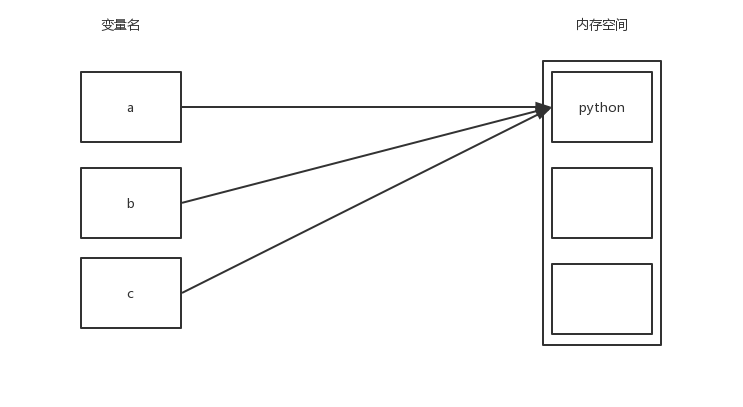
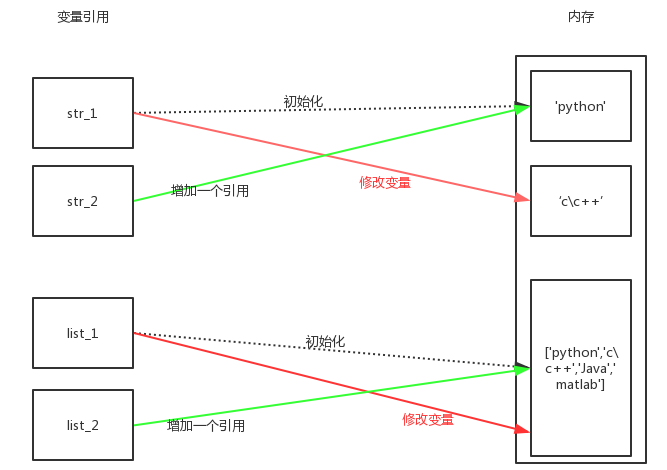

---
 
---

# python基础知识记录

说明：Python官方文档 [参考地址](https://docs.python.org/3.6/tutorial/index.html)

## 进程&线程（浅入浅出）

说明：例子，当你在电脑上运行QQ，就是运行一个进程，再运行一个微信，就是再运行一个进程。当你在QQ中开启了多个聊天窗口时，就是开启了多个线程，所以运行一个软件时相当于运行一个进程，在一个进程中，再开启多个线程。

### 进程（暂时知道）

说明：进程之间数据互不影响，每一个进程都会有一份相同的数据（全局变量，局部变量），实际上有的数据并不是每一个进程，都会进行备份，只有再不得已的情况下每一个进程都有一份相同的数据（节省资源）

| 进程类型      | 所在模块        | 是否等待子进程结束 | 返回值类型 | 通信方式                |
| ------------- | --------------- | ------------------ | ---------- | ----------------------- |
| 函数：fork()  | os              | 不等               | 整型       | multiprocessing.Queue   |
| 对象：Process | multiprocessing | 等                 | 对象       | multiprocessing.Queue   |
| 对象：Pool()  | multiprocessing | 不等               | 对象       | multiprocessing.Manager |

1. `fork()`

   说明：使用简单，但是是基于Linux系统，其win没有fork()函数，一般不太使用

   - 代码演示

     ```python
     import os
     import time
     
     # 当主进程执行到pid = os.fork()时（实际等号两边是两句语句，等号右边，左边，先执行等号右边，再执行左边），# 其执行到os.fork()时，主进程创建一个子进程。这时主进程、子进程要执行的下一步都是要给等号左边pid赋值。有意# 思的是，主进程赋值是大于0的（其实时把子进程的id号赋给pid），子进程赋值时等于零的。
     pid = os.fork()
     
     if 0 == pid:
         print('----1----subprocess pid=%d'%pid)
         time.sleep(1)
         # os.getpid()获得进程的id号，os.getppid()获得该子进程的父进程id号
         print('subprocess id=%d,pprocess id=%d'%(os.getpid(), os.getppid()))
     else:
         print('----2----pprocess pid=%d'%pid)
         time.sleep(2)
         print('pprocess id=%d'%os.getpid())
     
     运行结果
     ----2----pprocess pid=2626
     ----1----subprocess pid=0
     subprocess id=2626,pprocess id=2625
     pprocess id=2625
     ```

2. Process() 对象

   说明：`Process`类用来描述一个进程对象，创建子进程的时候，只需要传入执行函数和函数的参数完成Process创建

   - 函数式

     ```python
     from multiprocessing import Process
     import time
     
     
     def test(num):
         for i in range(num):
             print('hello')
             time.sleep(1)
     
     # 使用Process创建子进程,传入函数，参数
     p = Process(target=test, args=(5,))
     
     if __name__ == '__main__':
         # 使用p.start()启动进程
         p.start()
     
         # 进程别名 Process-N N是从1开始递增的整数(Process-1:第一个子进程)
         print(p.name) 
         # 进程id号
         print(p.pid)  
     
      
         # 等待子进程，执行结束，才能 解堵塞 向下执行
         # p.join([timeout])  等待的最长时间，过时不候，时间一到就往下执行，要是
         # 时间没到，子进程程序执行完毕，就不用使等待时间耗尽，而是直接向下执行
         p.join() 
     
         # p.terminate() 不管任务是否结束，立刻终止
         #  p.is_alive() 判断进程是否还在执行
     
         print('主进程结束')
         
     运行结果
     Process-1
     6556
     hello
     hello
     hello
     hello
     hello
     主进程结束
         
     ```

   - 过程式

     说明：从结果可以看出 Process 创建的进程，主进程会等待子进程执行结束，再结束
     
     ```python
     # 继承Process类
     # 自己定义一个类，要定义run()方法，使用start()调用run()方法
     # 调用run()方法。使用strat(),不用纠结，可以看看Process类的实现
     
     from multiprocessing import Process
     import time
     
     class Myprocess(Process):
         def run(self):
             for i in range(5):
                 print('----1----sub')
                 time.sleep(1)
     
     if __name__ == '__main__':
         
         p = Myprocess()
         # 使用start()调用run()
         p.start()
         
         for i in range(5):
             print('----2----main')
             
     运行结果
     ----2----main
     ----2----main
     ----2----main
     ----2----main
     ----2----main
     ----1----sub
     ----1----sub
     ----1----sub
     ----1----sub
     ----1----sub
     ```

3. Pool() 类，进程池

   说明：Pool()  进程池可以提供指定数量的进程供用户调用，当有新的请求提交到Pool中时，如果进程池没有满，那么就会创建一个新的进程来执行该请求，但如果进程池中的进程已经达到上线规定最大值，该请求就会等待，直到进程中又可使用的进程，才会创建新的进程。[引用地址](https://www.cnblogs.com/kaituorensheng/p/4465768.html)

   - 代码演示
   
     说明：`Pool()` 一定要使用 `.join()`， 因为 `Pool()` 主进程不会等待子进程结束，再结束。
   
     ```python
     # 进程池 pool
     from multiprocessing import Pool
     import time
     import random
     import os
     
     
     def worker(msg):
         print('任务 ：%d'%msg)
         for i in range(random.randint(1, 3)):
             print('pid=%d'%os.getpid())
             time.sleep(1)
         # print('-' * 40)
     # 创建进程池（存放4个进程）
     
     if __name__ == '__main__':
         # 只能在‘main’执行
         pool = Pool(4)
         for i in range(10):
             # 将进程添加到进程中，如进程池满，则需要等待
             pool.apply_async(func=worker, args=(i,)) 
             # 堵塞方式执行，一次执行一个进程（就像对于是单进程）
             # pool.apply(worker, args=(i,))
             
         # 关闭进程池，相当于不能再添加新任务
         pool.close() 
         # .join()是等待子进程执行完毕
         # 主进程堵塞，不会继续执行
         pool.join()
         print('----主进程 结束----')
     ```

### 进程之间通信

说明：进程之间数据不共享，所以出现进程之间通信

| 函数名             | 作用                                                       | 返回值  |
| ------------------ | ---------------------------------------------------------- | ------- |
| Queue.qsize()      | 返回当前队列包含的消息数量                                 | int     |
| Queue.empty()      | 判断队列是否为空                                           | Boolean |
| Queue.full()       | 判断队列是否为满                                           | Boolean |
| Queue.get(）       | 获取队列中的一条消息，然后将其从列队中移除，可传参超时时长 |         |
| Queue.get_nowait() | 相当Queue.get(False),取不到值时触发异常                    |         |
| Queue.put()        | 将一个值添加进数列，可传参超时时                           |         |
| Queue.put_nowait() | 相当于Queue.get(False),当队列满了时报错                    |         |


1. fork() , Process()通信所使用的Queue

   `from multiprocessing import Queue`

   `queue = Queue()`

2. Pool()进程池使用的Queue

   `from multiprocessing import Manager` 

   `queue = Manager().Queue()`

3. __虽然以上导入的模块有些不同，但是函数的调用时一样的__

### 线程

说明：先有进程，然后再有线程，一个进程包含一个或多个线程，线程是进程执行单位（本人是这样理解的），进程执行时，就会创建一个主线程，线程就好比一个指针，程序执行到哪一句，线程就会指向那里。线程中全局变量共享，局部变量私有（个人理解，就好比函数调用数据的使用一样理解）。

1. Thread（）线程 全局变量共享

   说明：thread() 是比较低层，python封装了threading模块

   - 全局变量共享代码演示

     ```python
     # 线程，共享全局变量
     
     import time
     import threading
     
     
     g_num = 100
     
     def work_1():
         global g_num
         for i in range(3):
             g_num += 1
         print('线程 1 的g_num=%d'%g_num)
     
     def work_2():
         global g_num
         g_num += 1
         print('线程 2 的g_g_num=%d'%g_num)
     
     print('全局变量的g_num=%d'%g_num)
     
     t1 = threading.Thread(target=work_1)
     t1.start()
     
     time.sleep(1)
     
     t2 = threading.Thread(target=work_2)
     t2.start()
     
     time.sleep(1)
     print('全局变量的g_num=%d'%g_num)
     
     运行结果
   全局变量的g_num=100
     线程 1 的g_num=103
   线程 2 的g_g_num=104
     全局变量的g_num=104
     ```
2. 线程与主线程执行顺序（主线程等待子线程结束）

   说明：线程的执行顺序（子线程、主线程），执行顺序是按照系统调度算法决定的，固没有什么顺序。主线程执行结束，会等待子线程执行结束，然后结束程序。（`.join` 依然可以使用，堵塞，主进程执行，直到子进程执行结束，主进程，再继续执行）

   - 代码演示

     ```python
     import os
     import time
     import threading
     
     
     # 创建threading.Thread()的类
     class MyThread(threading.Thread):
         def run(self):
             for i in range(3):
                 time.sleep(1)
                 msg = 'I am' + self.name + ' @' + str(i) # self.name保存的是当前线程的名称
                 print(msg)
     
     def test():
         for i in range(3):
     	    # 初始化 3 个子进程
             t = MyThread()
             # 同样会调用run()方法
             t.start()
     
     if __name__ == '__main__':
         test()
         print('主线程执行结束')
         
     运行结果
     主线程执行结束
     I amThread-1 @0
     I amThread-2 @0
     I amThread-3 @0
     I amThread-1 @1
     I amThread-3 @1
     I amThread-2 @1
     I amThread-1 @2
     I amThread-3 @2
     I amThread-2 @2
     ```

3. 线程中全局变量修改问题解析

   说明：线程的全局变量理解和函数的局部变量相同（本人这样认为）

   - 全局变量修改

     ```python
     # 线程，共享全局变量
     # 但是用不好，就容易出错
     
     import time
     import threading
     
     
     g_num = 0
     
     def work_1():
         global g_num
     
         for i in range(1000000):
             g_num += 1
     
         print('线程 1 的g_num=%d'%g_num)
     
     def work_2():
         global g_num
         for i in range(1000000):
             g_num += 1
         print('线程 2 的g_num=%d'%g_num)
     
     print('全局变量的g_num=%d'%g_num)
     
     t1 = threading.Thread(target=work_1)
     t1.start()
     
     # time.sleep(3) # 取消屏蔽，执行结果会不一样
     
     t2 = threading.Thread(target=work_2)
     t2.start()
     
     time.sleep(4)
     print('全局变量g_num=%d'%g_num)
     
     
     """
     这理解一下为什么会出现，不屏蔽睡眠的语句，程序的运行结果和预期的不一样
     
     解释：
         问题出现在 g_num += 1语句上。此语句等价于 g_num = g_num + 1
         实际上此语句，是分两次执行的，第一次执行g_num取值 加 1，第二次执行时 g_num = 1 的赋值
         就此代码，主线程在创建 2 个子线程时（该进程由 3 个线程在执行），进行休眠（4秒），目的等待打印最后的 g_num 值
         执行子线程 1 的 g_num + 1,转向子线程 2 执行 g_num + 1,关键点
         再转向子线程 1 执行 g_num = 1 赋值操作，后转向子线程 2 执行 g_num = 1，如此调度是因为系统调度算法决定的
         以上可以看出，g_num = 1 执行了两次
         所以，这个实际加 2 的语句，就变成了加 1 的效果了
     
     """
     
     运行结果
     全局变量的g_num=0
     线程 1 的g_num=1214385
     线程 2 的g_num=1307210
     全局变量g_num=1307210
     ```

   - 全局变量修改----解决办法 1 

     说明：使用__条件语句、while循环__

     ```python
     import time
     import threading
     
     
     g_num = 0
     flag = 1
     
     def work_1():
         global g_num
         global flag
         if flag == 1:
             for i in range(1000000):
                 g_num += 1
         flag = 0
     
         print('线程 1 的g_num=%d'%g_num)
     
     def work_2():
         global g_num
         # 一直判断的方式：轮询
         while True:
             if flag != 1:
                 for i in range(1000000):
                     g_num += 1
                 break
     
         print('线程 2 的g_num=%d'%g_num)
     
     print('全局变量的g_num=%d'%g_num)
     
     t1 = threading.Thread(target=work_1)
     t1.start()
     
     # time.sleep(3) # 取消屏蔽，执行结果会不一样
     
     t2 = threading.Thread(target=work_2)
       t2.start()
     time.sleep(3)
          print('全局变量g_num=%d'%g_num)
     
     运行结果
     全局变量的g_num=0
     线程 1 的g_num=1000000
     线程 2 的g_num=2000000
     全局变量g_num=2000000
     ```

   - 全局变量被修改----解决办法 2 

     说明：使用互斥锁。所属模块`threading`, 初始化`mutex = threading.Lock()`,默认互斥锁是__堵塞状态__就是没有成功上锁，就继续等待

     ```python
     import time
     import threading
     
     
     g_num = 0
     
     def work_1():
         global g_num
         for i in range(1000000):
             # 互斥锁上锁
             mutex.acquire()
             g_num += 1
             # 互斥锁解锁
             mutex.release()
     
         print('线程 1 的g_num=%d'%g_num)
     
     def work_2():
         global g_num
         # 互斥锁上锁
         for i in range(1000000):
             mutex.acquire()
             g_num += 1
             # 互斥锁解锁
             mutex.release()
         print('线程 2 的g_num=%d'%g_num)
     
     print('全局变量的g_num=%d'%g_num)
     
     # 初始化一把互斥锁
     # 互斥锁默认的情况是开着的
     mutex = threading.Lock()
     
     t1 = threading.Thread(target=work_1)
     t1.start()
     
     t2 = threading.Thread(target=work_2)
     t2.start()
     
     time.sleep(2)
       print(g_num)
     
     """
     加互斥锁的原则：加互斥锁的语句越少越好
     """
     运行结果
     全局变量的g_num=0
     线程 2 的g_num=1930814
     线程 1 的g_num=2000000
     2000000
     ```

4. 死锁

   说明：死锁，就是线程相互等待对方释放资源（就是你不释放，我我执行不了，我不是释放，你执行不了）

   - 死锁代码演示

     ```python
     from threading import Thread
     import threading
     import time
     
     
     class Task_1(Thread):
         def run(self):
             # 将互斥锁 1 上锁
             if lock_1.acquire():
                 print(self.name + '----TasK-1-up----')
                 time.sleep(1)
                 # 将互斥锁 2 上锁
                 if lock_2.acquire():
                     print(self.name + '----Task-1-down')
                     lock_2.release()
     
             lock_1.release()
                    
     
     class Task_2(Thread):
         def run(self):
             # 将互斥锁 2 上锁
             if lock_2.acquire():
                 print(self.name + '----TasK-2-up----')
                 time.sleep(1)
                 # 将互斥锁 1 上锁
                 if lock_1.acquire():
                     print(self.name + '----Task-2-down')
                     lock_1.release()
     
             lock_2.release()
                   
     
     if __name__ == '__main__':
         # 初始化 2 个互斥锁
         lock_1 = threading.Lock()
         lock_2 = threading.Lock()
     
     
         # 初始化 2 个线程
         t_1 = Task_1()
         t_2 = Task_2()
     	
         # 启动进程
         t_1.start()
         t_2.start()
       
     # 线程卡死。相互等待
         
     运行结果
     Thread-1----TasK-1-up----
     Thread-2----TasK-2-up----
     ```

5. 线程执行顺序（同步、异步）

   - 同步应用

     说明：使用互斥锁，相互上锁，相互解锁，以达到同步__(按照一定顺序执行各个线程)__

     ```python
     # 互斥锁初始化时，默认是没有上锁的
     # Lock.acquire(blocking: bool, timeout: float) -> bool 上锁
     # if lock_1.acquire(): 如果上锁成功返回 True，否则返回 false
     # timeout 为堵塞时间，如果超过堵塞时间，也会返回 False
     from threading import Thread
     import threading
     import time
     
     
     class Task_1(Thread):
         def run(self):
             while True:
                 # 将互斥锁 1 上锁
                 if lock_1.acquire():
                     print('----TasK-1----')
                     time.sleep(0.5)
                     # 将互斥锁 2 解锁
                     lock_2.release()
     
     class Task_2(Thread):
         def run(self):
             while True:
                 # 将互斥锁 2 上锁
                 if lock_2.acquire():
                     print('----TasK-2----')
                     time.sleep(0.5)
                     # 将互斥锁 3 解锁
                     lock_3.release()
     
     class Task_3(Thread):
         def run(self):
             while True:
                 # 将互斥锁 3 上锁
                 if lock_3.acquire():
                     print('----TasK-3----')
                     time.sleep(0.5)
                     # 将互斥锁 1 解锁
                     lock_1.release()
     
     
     if __name__ == '__main__':
         # 创建 3 个互斥锁
         lock_1 = threading.Lock()
         lock_2 = threading.Lock()
         lock_3 = threading.Lock()
     
         # 将互斥锁 2、3 上锁
         lock_2.acquire()
         lock_3.acquire()
     
         # 创建 3 个线程
         t_1 = Task_1()
         t_2 = Task_2()
         t_3 = Task_3()
     
         t_1.start()
         t_2.start()
         t_3.start()
         
     运行结果
     ----TasK-1----
     ----TasK-2----
     ----TasK-3----
     ----TasK-1----
     ----TasK-2----
     ----TasK-3----
     ......
     
     ```

   - 异步（进程解释、进程实现）

     说明：多个线程没有执行顺序，没有顺序，没有时间限制规定线程执行时间

     解释：使用进程池，创建进程，参数 callback 为回调，作用：当子进程执行结束，无论主进程在做什么，都需要切换回，执行 callback（符合异步特性），子进程返回的参数，传递给主进程。

     ```python
     import os
     import time
     from multiprocessing import Pool
     
     
     def test_1():
         print('----进程池中的进程----pid=%d,ppid=%d'%(os.getpid(), os.getppid()))
         for i in range(3):
             print('----%d----'%i)
             time.sleep(1)
         return 'hello python'
     
     def test_2(args):
         print('----callback func--pid=%d'%os.getpid())
         print('----callback func--args=%s'%args)
     
     if __name__ =='__main__':
         # 初始化进程池
         pool = Pool()
         
         # 参数 callback （回调）
         # 当子进程执行结束，主进程执行 callback（并子进程参数，传递给 主进程）
         pool.apply_async(func=test_1, callback=test_2)
     
         pool.close()
     	
         # 主进程休眠 3 秒
         time.sleep(3)
         while True:
             print('----主进程--pid=%d'%os.getpid())
             time.sleep(1)
             
     运行结果
     ----进程池中的进程----pid=8896,ppid=1028
     ----0----
     ----1----
     ----2----
     ----主进程--pid=1028
     ----callback func--pid=1028
     ----callback func--args=hello python
     ----主进程--pid=1028
     ----主进程--pid=1028
     ......
     ```

6. 保存 线程所产生的私有数据以供其访问

   说明：使用字典保存线程所产生的私有数据

   - 当 字典、列表（可变类型）为全局变量时，在函数（局部）中对其进行修改时，不用进行`global` 声明，但前提是，使用 字典、列表对象提供的方法进行__修改__

     说明：此解释再 7 中（列表作为参数传递给线程）

     ```python
     import threading
     
     
     global_dict = {}
     print(id(global_dict))
     
     def std_thread(name):
         std = name
         # 把std放到全局变量global_dict中
         global_dict[threading.current_thread().name] = std
         print(id(global_dict))
         task_1()
     
     def task_1():
         std = global_dict[threading.current_thread().name]
         print('线程 ' + threading.current_thread().name, ' ' + std)
         print(id(global_dict))
     
     if __name__ == '__main__':
         # 初始化 2 个线程
         t_1 = threading.Thread(target=std_thread, args=('aaaaa',), name='Thread-A')
         t_2 = threading.Thread(target=std_thread, args=('bbbbb',), name='Thread-B')
     
         t_1.start()
         t_2.start()
         
     运行结果
     2585017674128
     2585017674128
     线程 Thread-A  aaaaa
     2585017674128
     2585017674128
     线程 Thread-B  bbbbb
     2585017674128
     ```

   - 使用`ThreadLock` 所在模块`threading` 使用形式`threading.local()`初始化一个全局变量

     ```python
     import threading
     
     
     # 创建全局threadLocal对象
     local_name = threading.local()
     
     def std_thread(name):
         # 初始化threading.local对象一个属性
         # 虽然多个线程都有对threading.loacl对象初始化相同属性
         # 但是它可以自己进行区分
         local_name.class_name = name
         task_1()
         # task_2()
     
     def task_1():
         print('线程 ' + threading.current_thread().name, ' ' + local_name.class_name)
     
     if __name__ == '__main__':
         # 初始化 2 个线程
         t_1 = threading.Thread(target=std_thread, args=('aaaaa',), name='Thread-A')
         t_2 = threading.Thread(target=std_thread, args=('bbbbb',), name='Thread-B')
     
         t_1.start()
         t_2.start()
         
     运行结果
     线程 Thread-A  aaaaa
     线程 Thread-B  bbbbb
     ```

7. 参数列表作为实参传递给线程的一系列问题

   说明：可变类型、不可变类型，作为实参传递给函数时，都是引用赋值（都是传地址）。但可变变量可在原址进行修改，不可变类型，则需另开辟内存空间存储内容，函数执行结束，局部变量内存被回收。

   - 代码演示

     ```python
     # 线程，共享全局变量传递实参
     
     import time
     import threading
     
     
     g_num = [1, 2, 3]
     g = 100
     
     def work_1(g_num, g):
         g_num.append(4)
         print('线程 1 的参数g地址',id(g))
         g += 1
         print('线程 1 的g_num=', g_num)
         print('线程 1 的g_num地址=', id(g_num))
         print('线程 1 的g=', g)
         print('线程 1 的g地址=', id(g))
     
     def work_2(g_num, g):
         print('线程 1 的参数g地址',id(g))
         
         print('线程 2 的g_num=', g_num)
         print('线程 2 的g_num地址=', id(g_num))
         print('线程 2 的g=', g)
         print('线程 2 的g地址=', id(g))
     
     
     if __name__ == '__main__':
     
         print('全局变量的g_num=', g_num)
         print('全局变量的g=', g)
         print('全局的g_num地址=', id(g_num))
         print('全局的g地址=', id(g), end='\n\n')
     
         t1 = threading.Thread(target=work_1, args=(g_num, g))
         t1.start()
     
         time.sleep(1)
     
         t2 = threading.Thread(target=work_2, args=(g_num, g))
         t2.start()
     
         time.sleep(1)
         print('全局变量的g_num=', g_num)
         print('全局变量的g=', g)
         
     运行结果
     全局变量的g_num= [1, 2, 3]
     全局变量的g= 100
     全局的g_num地址= 2787255753544
     全局的g地址= 1708030064
     
     线程 1 的参数g地址 1708030064
     线程 1 的g_num= [1, 2, 3, 4]
     线程 1 的g_num地址= 2787255753544
     线程 1 的g= 101
     线程 1 的g地址= 1708030096
     线程 2 的参数g地址 1708030064
     线程 2 的g_num= [1, 2, 3, 4]
     线程 2 的g_num地址= 2787255753544
     线程 2 的g= 100
     线程 2 的g地址= 1708030064
     全局变量的g_num= [1, 2, 3, 4]
     全局变量的g= 100
     ```

8. python线程的GIL

   说明：据了解python的多线程实际上是假的 [参考地址](http://cenalulu.github.io/python/gil-in-python/)

## Python的变量存储机制、参数传递

说明：__对于python一切变量皆对象__,变量本身存储的是变量的内存地址，而不是变量本身的值（__引用语句__）

### 语言中的引用语句、值语句的解释

1. 引用语句

   变量保存的是对象值的引用，称之为引用语句。这样方式，变量所需的存储空间大小一致，因为变量只保存引用地址。

2. 值语句

   变量的值保存在变量的存储空间中，称之为值语句（c语言）。这种方式，每一个变量的内存空间就要根据变量的数据类型、实际大小而定，无法固定（使用数据需要先声明类型再使用的原因）

### python变量存储特性

1. 初始化两个变量（注两个变量值相同），再初始化一个变量，该变量值为前两个变量的的赋值

   ```python
   >>> a = 'python'
   >>> b = 'python'
   >>> c = a
   # id() 可以获取变量的地址
   >>> id(a)
   1594014580952
   >>> id(b)
   1594014580952
   >>> id(c)
   1594014580952
   ```

   

   说明：a, b, c地址相同，说明它们指向的是同一块内存地址。在python中不管你创建了多少变量，只要相同，都会指向同一块内存。如图



### python 的可变类型、不可变类型

| 可变类型 | 不可变类型 |
| -------- | ---------- |
| 列表     | 数字       |
| 字典     | 字符串     |
| 集合     | 元组       |

1. 可变类型就是可以在原来的基础上修改，不可变类型是不能在原来的基础上修改，只能重新创建，改变引用地址，原来的对象内存被回收。

   ```python
   # 不可变类型
   >>> str_1 = 'python'
   # 可变类型
   >>> list_1 = ['python', 'c\c++', 'Java', 'matlab']
   # 地址
   >>> id(str_1)
   1594014580952
   >>> id(list_1)
   1594015181064
   # 改变变量的值
   >>> str_1 = 'c\c++'
   >>> list_1.append('html5\css')
   # 地址
   >>> id(str_1)
   1594015040992 # 不可变类型地址改变
   >>> id(list_1)
   1594015181064 # 可变类型地址不变
   ```

   

   如图解释
   
   

​	可以看出，不可变类型，是重新开辟空间创建创建对象，而可变数据类型，是在原来基础上修改数据的，但是它们都    	是__引用语句__ 

### 形参与实参

1. 不可变类型

   ```python
   # 不可变类型测试
   
   # 定义 2 个不可变数据类型
   var_1 = 100
   str_1 = 'python'
   
   def test(str_1, var_1):
       # 打印形参地址
       print('**形参不可变类型地址str_1 ', id(str_1), '**')
       print('**形参不可变类型地址var_1 ', id(var_1), '   **')
   
       # 将str_2执行python
       str_2 = str_1
       var_2 = var_1
       # 打印地址
       print('*' * 43)
       print('**赋值不可变类型地址str_2 ', id(str_2), '**')
       print('**赋值不可变类型地址var_2 ', id(var_2), '   **')
   
   
       # 修改变量值
       str_1 = 'c\c++'
       var_1 = 200
       # 打印地址
       print('*' * 43)
       print('**修改不可变类型地址str_1 ', id(str_1), '**')
       print('**修改不可变类型地址var_1 ', id(var_1), '   **')
       print('*' * 43)
   
   if __name__ == '__main__':
       print('*' * 43)
       print('**实参不可变类型地址str_1 ', id(str_1), '**')
       print('**实参不可变类型地址var_1 ', id(var_1), '   **')
       print('*' * 43)
   
       test(str_1, var_1)
       
   
   运行结果
   *******************************************
   **实参不可变类型地址str_1  2884660008416 **
   **实参不可变类型地址var_1  1827960944    **
   *******************************************
   **形参不可变类型地址str_1  2884660008416 **
   **形参不可变类型地址var_1  1827960944    **
   *******************************************
   **赋值不可变类型地址str_2  2884660008416 **
   **赋值不可变类型地址var_2  1827960944    **
   *******************************************
   **修改不可变类型地址str_1  2884661713920 **
   **修改不可变类型地址var_1  1827964144    **
   *******************************************
   ```

   说明：python的不可变类型使用引用传递，即传递的是地址，但由于不可变类型，不能被修改，所以重新开辟空间初始化新的对象值。参数的传递是，将变量值增加一个引用，可变类型在源地址进行修改，不可变类型改变引用地址。

2. 可变类型

   ```python
   # 可变类型测试
   
   # 定义 1 个可变数据类型
   list_1 = ['python', 'c\c++']
   
   def test(list_1):
       # 打印形参地址
       print('**形参不可变类型地址list_1 ', id(list_1), '**')
   
       # 将list_2执行python
       list_2 = list_1
       # 打印地址
       print('*' * 44)
       print('**赋值不可变类型地址list_2 ', id(list_2), '**')
   
   
       # 修改变量值
       list_1.append('Java')
       # 打印地址
       print('*' * 44)
       print('**修改不可变类型地址list_1 ', id(list_1), '**')
       print('*' * 44)
   
   if __name__ == '__main__':
       print('*' * 44)
       print('**实参不可变类型地址list_1 ', id(list_1), '**')
       print('*' * 44)
   
       test(list_1)
       
   运行结果
   ********************************************
   **实参不可变类型地址list_1  2563275014472 **
   ********************************************
   **形参不可变类型地址list_1  2563275014472 **
   ********************************************
   **赋值不可变类型地址list_2  2563275014472 **
   ********************************************
   **修改不可变类型地址list_1  2563275014472 **
   ********************************************
   ```

   说明;python的可变类型使用引用传递，可变类型可以在原来的基础上修改，所以地址始终没有改变

### 函数参数（不定长参数）

1. 元组、字典作为不定长参数传递

   说明：带有默认值参数的一定放在不带默认值参数的后面，不定长参数一定放在最后面

   ```python
   def test(a, b, c=10, *args, **kwargs):
       # 打印参数值
       print(a)
       print(b)
       print(c)
   
       print(args)
   
       print(kwargs)
   
       sum = a + b + c
       # sum()函数可以方便求和，还有min()、max()
       # sum += sum(args)
       for i in range(len(args)):
           sum += args[i]
   
       print('a, b, c, 元组args的和为 ', sum)
   
   # 实参前三个分别给了a、b、c
   # 12、13、14当作不定长实参赋给形参*args（元组）
   # name='tom'、age=13当作字典赋值给形参**kwargs
   test(10, 11, 10, 12, 13, 14, name='tom', age=13)
   
   运行结果
   10
   11
   10
   (12, 13, 14)
   {'name': 'tom', 'age': '13'}
   a, b, c, 元组args的和为  70
   ```

2. 元组、字典拆包

   - 拆包

     ```python
     def test(a, b, *args, **kwargs):
         print(a)
         print(b)
         print(args)
         print(kwargs)
     
     # 正常赋值
     A = (1, 2, 3)
     B = {'name':'tom', 'age':17}
     
     test(10, 12, A, B)
     print('*' * 39)
     
     # 拆包
     # 将元组A，拆分为 1 2 3
     # 将字典B，拆分为name='tom' age=17
     # 在对形参赋值
     test(10, 12, *A, **B)
     
     运行结果
     10
     12
     ((1, 2, 3), {'name': 'tom', 'age': 17})
     {}
     ***************************************
     10
     12
     (1, 2, 3)
     {'name': 'tom', 'age': 17}
     ```

     

   - 使用匿名函数拆包

     ```python
     # 拆包
     def test_1(a, b):
         print(a)
         print(b)
     
     def main():
         # 使用匿名函数
         # 这里的参数 *args 是拆包的语义
     
         return lambda args: test_1(*args)
     
     # 拆包原则
     # 传入一个元组，将元组拆分为 1、2 分别赋值给形参 a b
     main()((1, 2))
     ```

## Python 类的应用

说明：

## Python 元类

说明：

## Python 垃圾回收机制

说明：

## Python 内建属性及内建方法认识

说明：

### 内建属性认识

### 内建方法认识

### getattribute() 和 getattr() 辨析

## Python 描述器

说明：


