# 计算机组成原理

## 计算机系统

### 计算机系统概述

1. 概述
   - 计算机系统的层次结构，计算机硬件的系统组成（五大部件的构成）、计算机软件的分类，以及计算机的基本工作过程
   - 计算机性能的评价指标和相关参数
   
2. 计算机结构
   - 计算机系统
     1. 硬件
        - 组成计算机的各种设备实体，是物质基础
     2. 软件
        - 泛指各种程序和文件
     3. 计算机的基本功能主要包括 __数据加工、数据保存、数据传送和操作控制__
     
   - 五大功能部件
     1. 运算器、控制器（技术发展，将其整合到 __CPU__）
     2. 存储器（高速缓存、主存储器、虚拟存储器）
     3. 输入设备、输出设备
     4. 这些设备和部件通过 __总线 和 接口__ 链接在一起，形成一台完整的计算机
     
   - 如图
   
     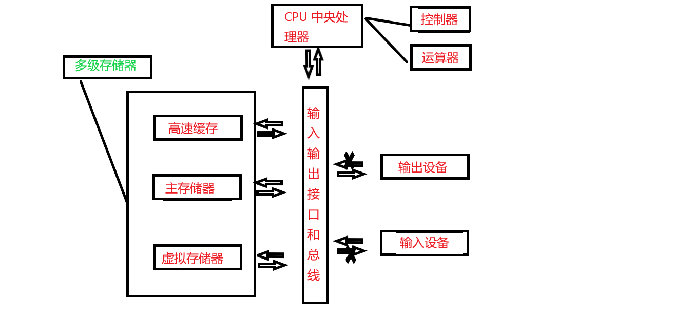
   

#### 运算器介绍

1. 运算器
   - 进行加、减、乘、除等算术，逻辑运算

   - 计算机中通常采用二进制数

   - 如图结构

     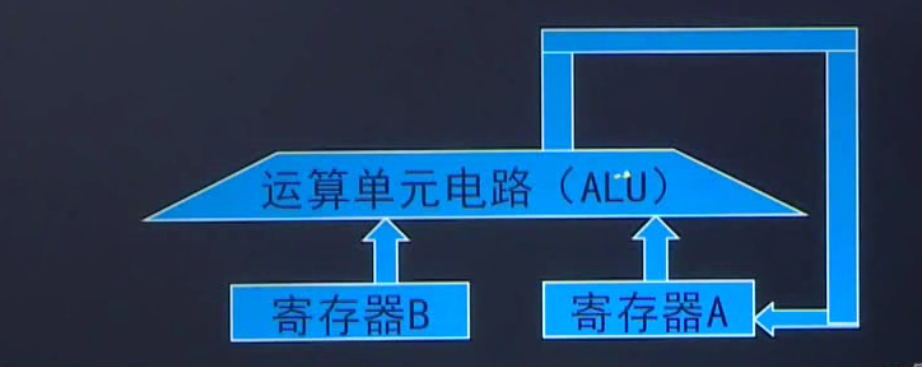

   - 计算机位数越多，计算机的精度越高，但是位数越多，所用电子器件也越多。目前计算机的运算器长度一般为 ~~8 位、16 位、32 位、~~64 位
     1. 64 位数运算器一次可以等于 32 位 两次计算（一次算高32 位，另一次算低 32 位）
     2. 位数越高，可以对小数更精确

#### 存储器介绍

1. __存储器介绍__
   - 保存或“记忆”解题的 __程序（指令）和数据__
   - 在运算前把参加运算的数据和解题步骤通过输入输出设备送到存储器中保存起来
   - 无论是指令，还是数据。存储器存储都是 0 或 1 表示的二进制代码
   - 目前采用半导体器件作为存储器，一个半导体触发器可以记忆一个二进制代码，一个数假定用 16 位的二进制代码表示，那么就需要 16 个触发器来保存这些代码
   - 存储元
     1. 保存一个二进制代码的触发器。称为一个存储元
     2. 一个 8 位二进制数 `0000 0101` 是由 8 个触发器（存储元）组成
   - 存储单元
     1. 若干存储元构成一个存储单元
     2. 一般是由 8 个触发器组成，8 个二进制数表示一个存储单元，称为 1 个字节
   - 地址
     1. 存储器是由许多存储单元组成。每个存储单元的编号，称为地址
   - 存储容量
     1. 存储器所有存储单元的总数
     2. 通常用 KB、MB、GB、TB 表示，如 64KB 。存储容量越大，表示计算机记忆存储信息就越多
     3. B 表示字节，K 表示 2 的10次方，M 表示 10 的 20次方，G 为 30， T 为 40
     4. 如 64 KB 表示 $64\times2^{10}\times8$  个二进制位（存储元、触发器）
   - 外存储器
     1. 计算机又配备的存储容量更大的磁盘存储器、光盘存储器。
     2. 相对而言，半导体存储器称为 __内存储器__，磁盘存储、光盘存储器等称之为 __外存储器__
   - 计算机存储器
     1. __由高速缓冲存储器、主存储器、虚拟存储器，所组成的多级存储系统，是计算机中用于存储程序和数据的部件__
     2. 之所以会有多级存储器，是由于现实问题决定的，存储器要满足以下条件，但没有一种存储其同时满足以下条件，所以使用多级组合
        - 存储块
        - 存储容量大
        - 价格便宜

#### 控制器介绍

1. 控制器和运算器
   - 控制器是计算机中 __发号施令的部件__，向计算机各个功能部件提供每一时刻协同运行所需要的控制信号：他控制计算机的所有部件有条不紊地进行工作

   - 控制器的任务是从内存中取出解题步骤加以分析，然后执行某种操作
     1. 正确分析与执行每一条指令
        - `取指令-->分析指令-->执行指令`
        - 取指周期：取指令 + 分析指令
        - 执行周期：执行指令
        - __取指周期、执行周期，可以用来区分从存储器中读取的是数据还是指令__
     2. 保证指令按规定的序列自动连续地执行
     3. 对各个异常情况和请求及时响应和处理
     
   - 控制器的基本任务

     1. 计算机进行计算时，指令必须是按照一定的顺序一条接一条地进行

     2. 控制器的基本任务，就是按照计算程序所拍的指令序列，先从存储器取出一条指令放到控制器中，对该指令的操作码由译码器进行分析判别，然后根据指令性质，执行这条指令，进行相应的操作

     3. 接着从存储器取出第二条指令，在执行第二条指令。依次类推

     4. 通常把取指令的一段时间叫做 __取指周期__ ，而把执行指令的一段时间叫做 __执行周期__

     5. 因此，控制器反复交替地处在取指周期与执行周期中。每取出一条指令，控制器中的指令计数器就加 1，从而为下一条指令做好准备，这也就是指令为什么在存储器中 __顺序存放__ 的原因

     6. 流程图

        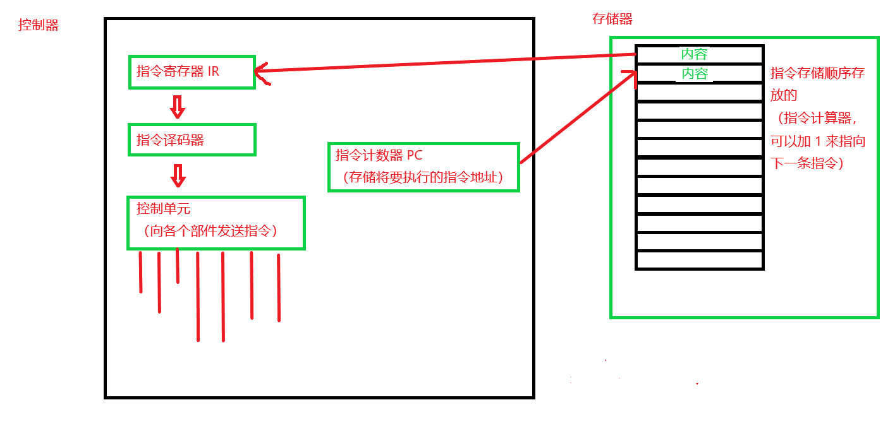

   - 指令计数器（PC）

     1. PC 可以保证控制性顺序执行存储器的指令
     2. PC 可以自增，来指向下一条将要执行的指令
     3. 程序跳转，实际上就是给 PC 重新赋值
     4. __指令在存储器是是按照执行顺序连续存放的，所以保证了 PC 自增 1，指向的是下一条将要执行的指令__

   - __计算程序过程__
     1. 运算器只能完成加、减、乘、除四则运算及其他一些辅助操作。对于比较复杂的算题，计算机在运算前必须化成 __多步骤简单的加、减、乘、除__ 等基本操作来做
     
     2. 每一个基本操作就叫做一条指令，而解算某一问题的一串指令序列，叫做该问题的计算程序，简称为程序
     
     3. 例如：在求解 $y=ax+b-c$ 的例子中解题步骤的每一步，只能完成一种基本操作，就是一条指令，而整个解题步骤就是一个简单的计算程序
     
     4. 运算流程图
     
        - 理解图（使用算盘算数）
     
          | 行数               | 解题步骤和数据     | 说明                                    |
          | :----------------- | ------------------ | --------------------------------------- |
          | 1                  | 取数（9）          | （9）表示第 9 行的数据 a                |
          | 2                  | 乘法（12）         | 完成 a* x ，结果在算盘上                |
          | 3                  | 加法（10）         | 完成 a*x+b，结果在算盘上                |
          | 4                  | 减法（11）         | 完成 y=a*x+b-c，结果在算盘上            |
          | 5                  | 存数 y（13）       | 把算盘上的值记到 y 上，就是存储到 13 行 |
          | 6                  | 输出               | 把算盘的值输出给人看                    |
          | 7                  | 停止               | 运算完毕                                |
          | 地址（以下表地址） | 存储单元存储的数据 |                                         |
          | 9                  | a                  | 数据                                    |
          | 10                 | b                  | 数据                                    |
          | 11                 | c                  | 数据                                    |
          | 12                 | x                  | 数据                                    |
          | 13                 | y                  | 数据                                    |
     
     5. 存储器结构
     
        - 存储器结构图
     
          | 地址 | 二进制，代码区(存储指令)      |
          | ---- | ----------------------------- |
          | 1    | 101    1001                   |
          | 2    | 011    1100                   |
          | 3    | 001    1010                   |
          | 4    | 010    1011                   |
          | 5    | 110    1101                   |
          | 6    | 111     xxxx                  |
          | 7    | 000    xxxx                   |
          | 8    | __二进制，数据区 (存储数据)__ |
          | 9    | a                             |
          | 10   | b                             |
          | 11   | c                             |
          | 12   | x                             |
          | 13   | y                             |
     
        - 指令形似
     
          1. 指令的内容由两部分组成，即操作的性质和操作的地址。前者称为操作码，后者称为地址码
     
             | 操作码 | 地址码 |
             | ------ | ------ |
             | 101    | 1001   |
     
          2. 操作码
     
             - 指出指令所进行的操作，如加、减、乘、除、取数和存储数据等等
     
          3. 地址码
     
             - 表示参见运算的数据应从存储器的那个单元取，运算的结果应存储到哪个单元中。
     
        - 指令操作码定义
     
          1. 指令的操作码是二进制数据，地址码也是二进制数据，那么整个存储器内容全部变成了二进制的代码或数据
     
          2. 如表
     
             | 指令 | 操作码 |
             | ---- | ------ |
             | 加法 | 001    |
             | 减法 | 010    |
             | 乘法 | 011    |
             | 除法 | 100    |
             | 取数 | 101    |
             | 存数 | 110    |
             | 打印 | 111    |
             | 停机 | 000    |
     
     6. 存储程序
     
        - 将指令存放在存储器中存储程序
        - 存储器任何位置既可以存数据也可以存指令，__但是指令和数据分开存__
        - 控制器依靠存储的程序来控制全机协调的完成计算任务叫做程序控制
        - 存储程序并按地址执行，就是 __冯*诺依曼计算机__ 设计思路

2. 适配器与输入输出设备

   - 输入设备
     1. 把人们所熟悉的某种信息形式变换为机器内部所能接受和识别的二进制信息形式
   - 输出设备
     1. 把计算机处理的结果变换为人或其他机器所能接受和识别的信息形式
   - 计算机的输入输出设备通常称之为 __外围设备__
   - 由于种类复杂且速度各异，因而它们不是直接同高速工作的主机相连，而是通过 __适配器__ 部件与主机相连
     1. 例：显示器要与主机相连，就的使用 __显卡__ 这种适配器

3. 冯诺依曼思想的基本要点

   - 采用二进制形式表示数据和指令
   - 由输入输出设备、运算器、存储器和控制器五大部件组成
   - 采用存储程序方式，存储程序方式是冯诺依曼思想核心
   - 指令和数据以同等地位存储与存储器中，可以按地址寻访，程序和数据统一存储
   - 指令是由操作码和地址码组成
   - 以运算器为中心

#### 软件介绍

1. 软件

   - 目的程序
     1. 机器语言编写的程序（二进制），但使用繁琐，不具有可读性
     2. 与机器硬件有关
   - 汇编语言
     1. 约定一些符号，来代替各种指令（二进制指令），符号和机器指令一一对应
     2. 借助汇编程序，计算机可以自定的将汇编源程序翻译成机器语言（目的程序）
     3. 与机器硬件有关
   - 高级语言（源程序）
     1. 表现形式接近于数学语言，直观通用
     2. 机器无法识别源程序，需要要有 __解释器__，将源程序翻译成机器语言
     3. 与机器硬件无关
   - 执行过程
     1. 高级语言 --》 编译 --》汇编语言 --》汇编 --》机器语言

#### 计算机性能指标

1. 计算机性能指标

   - 机器字长
     1. 指处理机运算器中一次能够完成二进制书运算的位数
   - 吞吐量
     1. 一台计算机在某一时间间隔内能处理的信息量，单位是字节/秒（B/S）
   - 相应时间
     1. 表征输入有效到系统相应之间的时间度量（$10^{-6}S$ 微妙、$10^{-9}S$ 纳秒）
   - 利用率
     1. 在给定时间间隔内，系统被实际使用的时间所占比例（一般使用百分比表示）
   - 总线宽度
     1. 一般指 CPU 中运算器与存储器之间进行互连的内部总线二进制位数
   - 存储其容量
   - 存储器带宽
     1. 存储器的速度指标，单位时间内从存储器读出的二进制数信息量，一般用字节数表示
   - 主频/始终周期
     1. CPU 的工作节拍受注视中控制，主时钟不断产生固定频率的时钟，主时钟的频率（f）叫 CPU 的主频（单位是 MHz、兆赫兹）
     2. 主频的倒数称为 CPU 时钟周期（T），即 $T=1/f$ (单位是微秒、内秒)
   - CPU 执行时间
     1. 表示 CPU 执行一段时间程序所占用的 CPU 时间，
     2. $CPU执行时间=CPU时钟周期数\times CPU时钟周期长$ (时钟周期长为主频倒数)
   - CPI 
     1. 表示每条指令周期数，即执行一条指令所需平均时钟周期数
     2. $CPI=\frac{执行某段程序所需的 CPU 时钟周期数}{该程序包含的指令条数} $
   - MIPS
     1. 表示每秒百万条指令数，即 MIPS= 1，表示计算机 1 秒执行 1 百万条指令
     2. $MIPS=\frac{指令条数}{程序执行时间\times10^6}$
   - MFLOPS
     1. 表示每秒百万次浮点操作次数
     2. $MFLOPS=\frac{程序中浮点操作次数}{程序执行时间\times10^6}$
     3. MFLOPS 是基于操作的而非指令的，（一条浮点操作，可以包含多条指令），不是体现机器整体的性能
     4. TFLOPS 表示每秒万亿次浮点操作次数（超级计算机）

### 运算器

__说明：主要介绍运算器是怎样表示数据的、怎样计算的、怎样使用电路表示的__

#### 定点数介绍

1. 介绍主要内容

   - 定点数的表示、溢出概念和判别方法、浮点数的表示

2. 定点数表示

   - 介绍

     1. 定点数表示：约定机器中所有数据的小数点位置固定不变。由于约定的固定位置，小数点就不再使用“.”来表示
     2. 通常将放到数值位 __最后面或者是最前面__，这样表示的数据是 __纯整数或纯小数__

   - 无符号数的表示‘

     1.  用全部的二进制代码表示数字，没有符号位
     2. 8 位二进制无符号数范围（全部默认为整数）
        - `00000000~1111111` 0~2 的 8 次方（0~255）共 256 个数

   - 有符号数的表示方法

     1. 定点数 $x=x_0x_1x_2x_3...x_n$ 在定点机器中表示如下（$x_0$ 表示符号位，0 表示正号，1 表示负号）

     2. 如图

        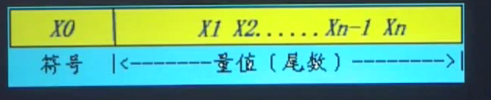

     3. 有符号的纯小数的表示（如图）

        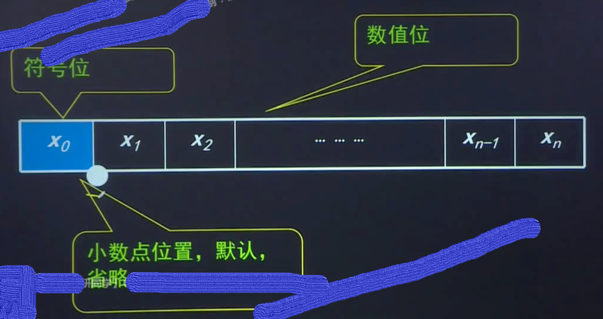

     4. 有符号的纯整数表示（如图）

        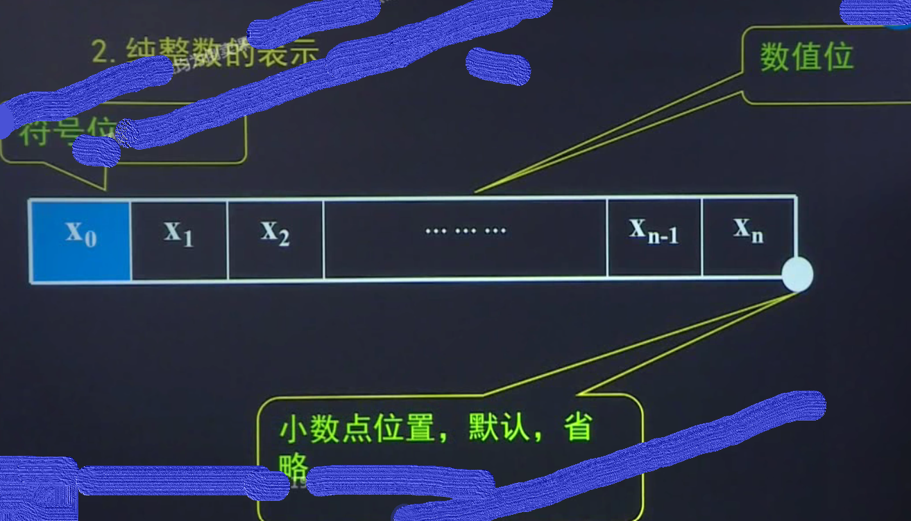

#### 补码、移码、原码、校正码介绍

1. 补码的概念

   - 计算机中存在补码，是因为有一个周期数
     1. 如：时钟当在 7 点是回拨到 4 点，可以回拨 3 个小时，也可以向前 9 个小时，都可以回到 4 点
     2. $-3=+9(mod 12)$ 负数 3，正数 9 等价，因为模是 12
     3. 即一个减法，可以等价于一个加法
   - 补码的定义
     1. $[X]_补=M+X$ （Mod M）模为 M
     2. 正数的补码
        - 当 X>=0 时，M+X大于M，把 M 丢掉，所以 $[X]_补=X$，__即整数补码等于其本身__
     3. 负数的补码
        - 当 X<0 时，$[X]_补=M+X=M-[X]$，__所以负数的补码等于模与该数绝对值只差__
   - 0 的补码唯一

2. 移码表示法

   - 补码表示很难直接判断其真值大小
   - 用 1 表示 正数，0 表示负数

3. 原码与补码

   __说明：8 位有符号数表示__

   - 原码可以表示 255 个数，因为有正 0、负 0
   - 补码可以表示 256 个数，因为 0 表示唯一
   - __-1 的补码和 -0 的原码表示形式相同__
   - $-2^n$ __的补码与 -0 的原码表示形式相同__

4. 校验码

   - 介绍
     1. 元件故障、噪声干扰等各项因素常常导致计算机在处理信息过程中发生错误。为防止错误，可将信号采用专门的逻辑线路进行编码以检测错误，甚至可以校正错误。通常的方法是，在每个字上添加一些校验位，用来确定字出现的错误位置。
   - 奇偶校验码
     1. 组成奇偶校验的基本方法：在 N 位有效信息位上增加一个二进制校验位，构成一个 N+1 位奇偶校验码
     2. 奇校验：使用 N+1 位的奇偶校验码中 1 的个数为奇数个
     3. 偶校验：使用 N+1 位的奇偶校验码中 1 的个数为偶数个
     4. 只能发现错误，不知道错误在哪，无法修改
   - 海明校验
     1. 可以最大可能指出错误信息在哪，从而进行纠正
   - CRC 码
     1. 可以最大可能指出错误信息在哪，从而进行纠正

#### 定点数运算

1. 定点数的运算

   - 补码加法
     1. 两个补码相加就是和的补码
     2. 符号位也参加运算
   - 补码减法
     1. 减法，就是加上负数的补码，转换成和
     2. 符号位也参加运算
   - 溢出检测
     1. 两个同号数相加结构异号，则溢出
     2. 双符号为法：00 表示正数，11 表示负数，出现 01 或者 10 表示溢出
     3. 符号位和最高位同时有无进位，则无溢出，不同则溢出
   - 乘法运算
     1. 很复杂
     2. 符号位单独处理
   - 除法运算
     1. 符号位单独处理

#### 浮点数运算

1. 浮点数运算

   - 表示浮点数

     1. 使用科学计数法 $N=R^e\times M$ ，M 是尾数（纯小数），e 是比例因子指数（整数），R 在计算机默认为 2（不存）

     2. 如图

        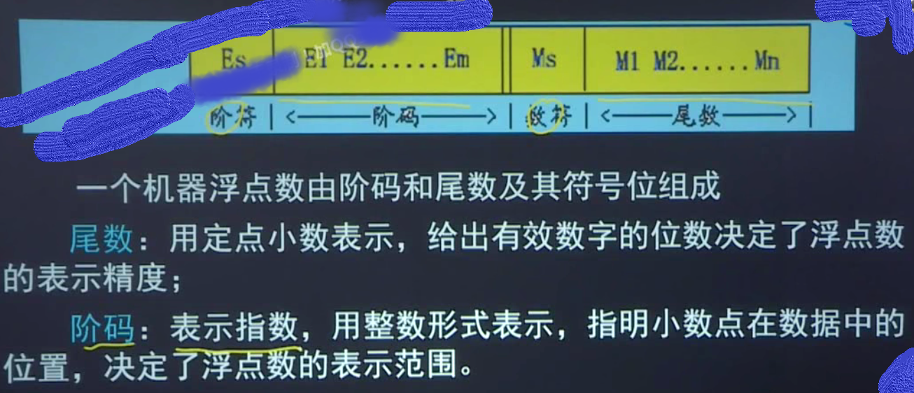

     3. E= e+127（单精度）

   - 浮点数加减法

     1. 将浮点数的指数一样，指数相加减（尾数右移，减小误差，小的阶码移动）

   - 溢出

     1. 阶码为真溢出
     2. 尾数溢出（可以左移啊！）

### 存储器

#### 存储器介绍

1. 内容介绍

   - 存储器分类和各种存储器的基本工作原理，包括 __SRAM、DRAM、ROM__ ，掌握主存储器与 CPU 的链接和数据交换，双口 RAM 和多模块存储器
   - Cache （缓存）种程序访问的局部性原理、Cache 的基本工作原理（命中率）、Cache 和主存之间的映射方式、替换算法、Cache 写策略
   - 虚拟存储器中的基本概念及种类，包括页式、段式和段页式虚拟存储器、TLB（块表）等，碎片处理

#### 分类

1. 存储器分类

   - 存储器功能

     1. 用来存放程序和数据（二进制代码形式存放)
     2. 构成存储器的介质，目前主要采用半导体（电）和磁性材料（磁）
     3. 存储器中最小的存储单位就是一个双稳态半导体电路、一个 CMOS 晶状体管或磁性材料的存储元，可以存储一个二进制位（0，1），即 1 个 bit

   - 存储元

     1. 若干存储元组成一个存储单元（8 个 bit，即一个字节），许多存储单元组成一个存储器（几 K 字节、MGTPEZY）

   - 字存储单元（32）

     1. 介绍就是机器字节长度，CPU 一次可以访问的多少个 bit，如 32 位机，一次可以访问 32 个 bit 4 个字节（4 个存储单元，32 个 存储元），即存放一个机器字的存储单元，相应的地址称为字地址

     2. 一个机器字可以包含数个字节

        - 如图

          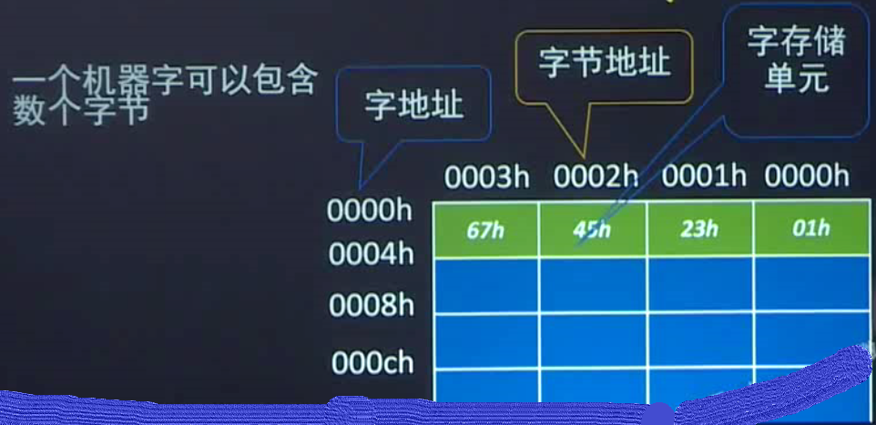

        - 字地址（32 位 bit，机器位 32 位），字节地址（8 位 bit）

        - 4 个字节地址的首字节地址作为字地址（字地址为 4 的倍数，如 64 位机，字地址位 8 的倍数 ）

        - 应该是连续读取

   - 分类方式

     1. 按存储介质分类
        - 半导体存储器
        - 磁表面存储器
     2. 按存储方式
        - 随机存储器
          1. 任何存储单元的内容都能被随机存取，且存取时间和存储单元的物理时间无关（存储器）
        - 顺序存储器
          1. 只能按某种顺序来存取，存取时间和存储单元的物理位置有关（磁带）
     3. 按存储的可保存性
        - 非永久记忆的存储器
          1. 断电即消失（主存）
        - 永久记忆存储器
          1. 光盘
     4. 按存储的读写功能
        - 只读存储器（ROM）,半导体存储器
        - 随机读写入存储器（RAM），半导体存储器
     5. __按计算机系统中作用__
        - __主存储器、辅助存储器、高速缓冲存储器、控制存储器__

#### 层次化结构

1. 存储器的层次化结构

   - 为解决对存储器要求容量大、速度快、成本低三者之间的矛盾，目前通常采用多级存储体系结构，__即高速缓冲存储器、主存储器、外存储器__

     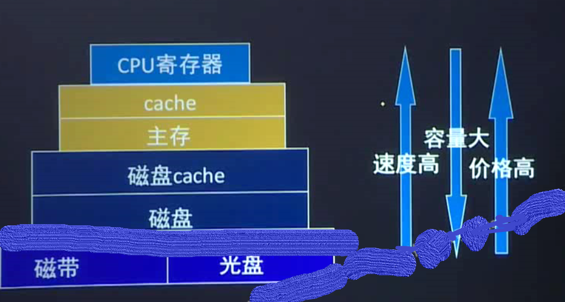

   - Cache 缓冲区：因为存储器读写速度不同，所以需要 Cache 来做一下缓冲

   - 主存储器的技术指标

     | 指标     | 含义                                   | 表现               | 单位               |
     | -------- | -------------------------------------- | ------------------ | ------------------ |
     | 存储容量 | 在存储器中可以容纳的存储单元总数       | 存储空间大小       | 字节、字节数       |
     | 存取时间 | 从启动到完成一次存储器操作所经历的时间 | 主存的速度         | n s                |
     | 存储带宽 | 单位时间里存储器所存取得信息量         | 传输速率、技术指标 | 数据位/秒，字节/秒 |
     | 存储周期 | 连续启动两次得操作所需间隔最小时间     | 贮存得速度         | n s                |

   - 基本存储元

     1. 基本组成元是组成存储器得基础和核心，它用来存储一个二进制信息 0 或 1

   - 基本存储元组成

     1. 它由两个 MOS 反相器交叉耦合而成得触发器，一个存储元存储一位二进制代码，这种电路有两种稳定状态 1 或 0，并且 A，B 两点得电路总是相反的，因此它可以表示一位二进制的 1 或 0

   - CPU 访问内存示图解

     1. 如图

        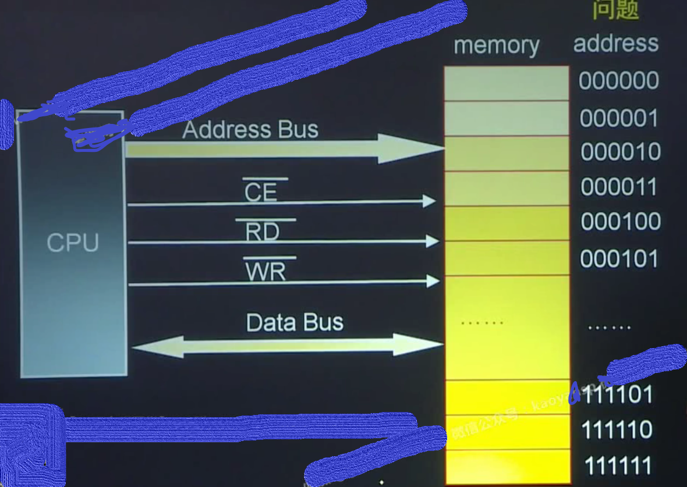

     2. 总线

        - 地址总线
          1. Address Bus：传输地址的线路
        - 控制总线
          1. 传输控制信号（低电平有效）
        - 数据总线
          1. 传输数据的线路
        

#### SRAM 静态存储元

1. 存储元电路示意图

   - 双译码

     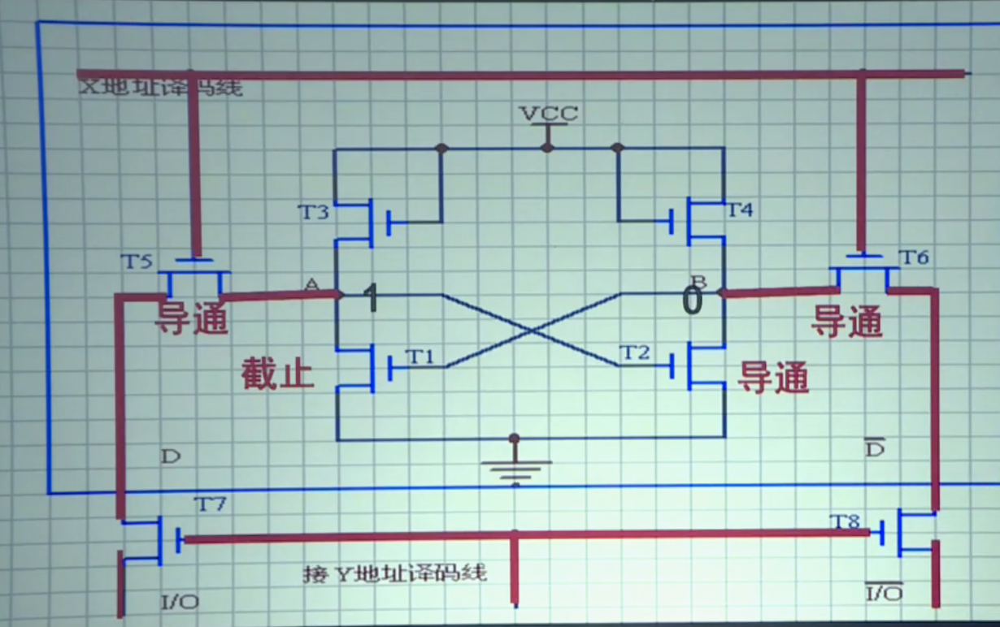

   - CPU 访问双译码示意图（磁存储器为一个长方体，3D结构）

     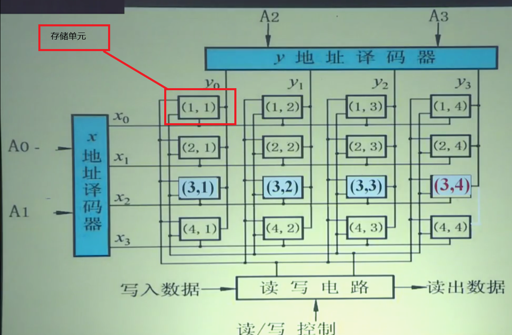

   - 共有 16 个存储单元，$2^4=16$ 需要 4 位地址，访问存储器

     1. 双译码，节省译码线（横向 * 纵向 = 存储单元）译码线 = 横向 + 纵向，横向译码线=纵向译码线
     2. 单译码，译码线 = 存储单元

   - 双译码矩阵存储示

     1. 如图

        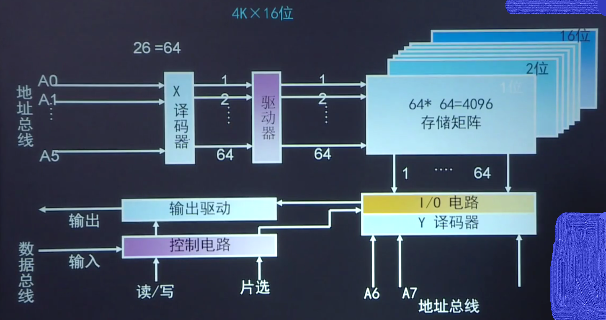

     2. 双译码需要 64 + 64 = 128 个译码线

     3. 单译码需要 4096 个译码线

#### 读写操作

1. 存储器的读写控制

   - 存储器的存取仅仅与存储器的地址有关，但是，实际上还与其他控制信号有关。

     1. 如表（以下控制信号，为低电平有效）

        | /CS  | /WD  | /RD  | 操作   |
        | ---- | ---- | ---- | ------ |
        | 0    | 1    | 0    | 读操作 |
        | 0    | 0    | 1    | 写操作 |
        | 1    | x    | x    | 误操作 |

#### DRAM 动态存储元

1. DRAM 存储元

   - 介绍
     1. 为动态存储元
     2. 相对于静态存储元，不需要持续供电，但是相对于静态来说，读取速度，慢